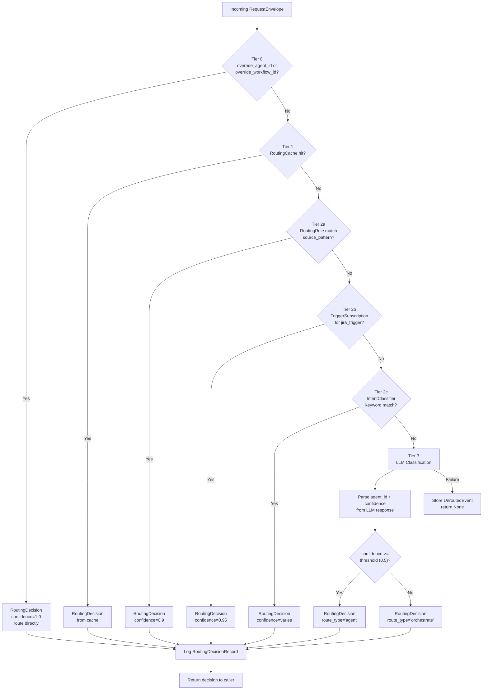
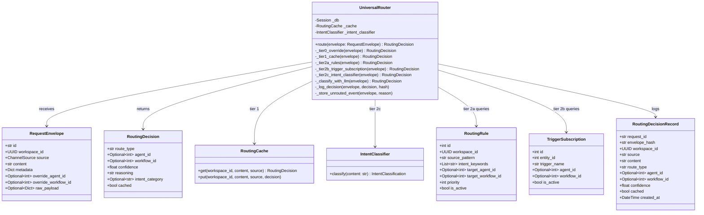
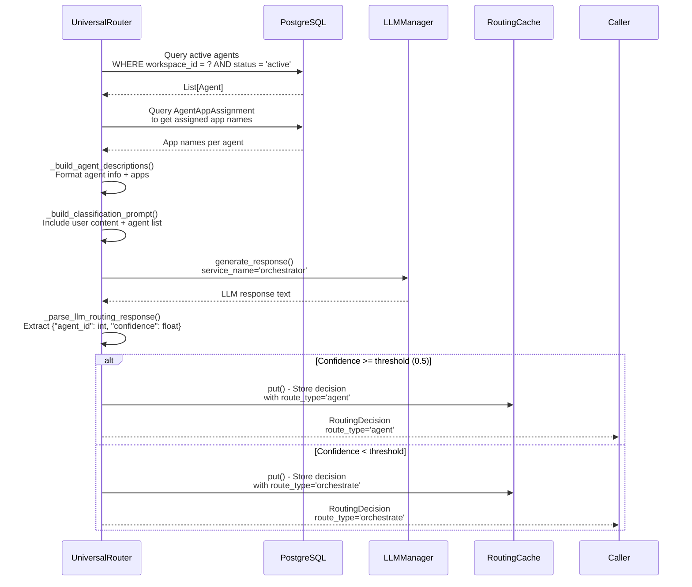
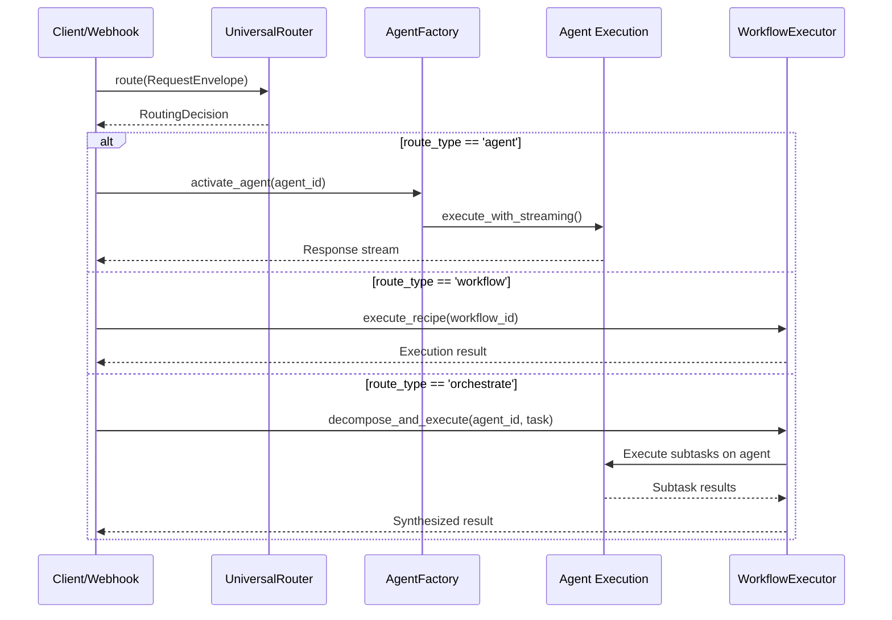

# Universal Router

<details>
<summary>Relevant source files</summary>

The following files were used as context for generating this wiki page:

- [orchestrator/api/chat.py](orchestrator/api/chat.py)
- [orchestrator/api/routing.py](orchestrator/api/routing.py)
- [orchestrator/consumers/chatbot/auto.py](orchestrator/consumers/chatbot/auto.py)
- [orchestrator/consumers/chatbot/intent_classifier.py](orchestrator/consumers/chatbot/intent_classifier.py)
- [orchestrator/consumers/chatbot/personality.py](orchestrator/consumers/chatbot/personality.py)
- [orchestrator/consumers/chatbot/smart_orchestrator.py](orchestrator/consumers/chatbot/smart_orchestrator.py)
- [orchestrator/consumers/chatbot/smart_tool_router.py](orchestrator/consumers/chatbot/smart_tool_router.py)
- [orchestrator/core/models/system_settings.py](orchestrator/core/models/system_settings.py)
- [orchestrator/core/routing/engine.py](orchestrator/core/routing/engine.py)
- [orchestrator/modules/tools/discovery/__init__.py](orchestrator/modules/tools/discovery/__init__.py)
- [orchestrator/scripts/setup_jira_trigger.py](orchestrator/scripts/setup_jira_trigger.py)

</details>


## Purpose and Scope

The Universal Router is the intelligent request classification and routing engine at the core of Automatos AI's orchestrator. It receives incoming requests from multiple channels (chat, webhooks, triggers) and determines the optimal execution path: routing directly to a specific agent, invoking a workflow, or initiating a full orchestration decomposition for complex tasks.

This document covers the router's four-tier routing strategy, configuration, and integration points. For information about agent execution after routing decisions, see [Agents](#3). For workflow execution patterns, see [Workflows & Recipes](#4). For details on the API endpoints that accept routed requests, see [Agent API Reference](#3.7) and [Workflow API Reference](#4.7).

**Sources:** [orchestrator/core/routing/engine.py:1-16]()

---

## Architecture Overview

The Universal Router implements a **tiered cascade strategy** designed to minimize LLM API costs while maintaining routing accuracy. Each tier represents a progressively more expensive routing method:

- **Tier 0 (User Overrides)**: Explicit `override_agent_id` or `override_workflow_id` parameters bypass all routing logic
- **Tier 1 (Cache Lookup)**: Redis-backed cache returns previous routing decisions for identical requests
- **Tier 2 (Rule-Based Routing)**: Three sub-tiers check workspace-specific rules, trigger subscriptions, and intent keywords
- **Tier 3 (LLM Classification)**: Fallback to LLM-powered agent selection when all other tiers fail

Requests flow through each tier sequentially until a routing decision is made. If all tiers fail to produce a decision, the request is stored as an `UnroutedEvent` for later analysis.



**Sources:** [orchestrator/core/routing/engine.py:78-144](), [orchestrator/config.py:140-145]()

---

## Request Envelope and Routing Decision

### RequestEnvelope

The `RequestEnvelope` model encapsulates all information needed for routing decisions:

| Field | Type | Description |
|-------|------|-------------|
| `id` | `str` | Unique request identifier |
| `workspace_id` | `UUID` | Workspace context for rule filtering |
| `source` | `ChannelSource` | Origin channel (e.g., `CHAT`, `JIRA_TRIGGER`, `COMPOSIO_WEBHOOK`) |
| `content` | `str` | User message or event payload |
| `metadata` | `Dict` | Additional context (trigger names, webhook signatures) |
| `override_agent_id` | `Optional[int]` | Tier 0: explicit agent routing |
| `override_workflow_id` | `Optional[int]` | Tier 0: explicit workflow routing |
| `raw_payload` | `Optional[Dict]` | Full webhook/trigger payload for audit trail |

**Sources:** [orchestrator/core/routing/engine.py:32-40]()

### RoutingDecision

The `RoutingDecision` model represents the router's output:

| Field | Type | Description |
|-------|------|-------------|
| `route_type` | `str` | One of: `"agent"`, `"workflow"`, `"orchestrate"` |
| `agent_id` | `Optional[int]` | Target agent ID (if route_type is "agent" or "orchestrate") |
| `workflow_id` | `Optional[int]` | Target workflow ID (if route_type is "workflow") |
| `confidence` | `float` | Routing confidence score (0.0 to 1.0) |
| `reasoning` | `str` | Human-readable explanation of routing logic |
| `intent_category` | `Optional[str]` | Detected intent category from Tier 2c |
| `cached` | `bool` | True if decision came from Tier 1 cache |

**Route type semantics:**
- `"agent"`: Direct execution on the specified agent (high confidence)
- `"workflow"`: Execute the specified workflow recipe
- `"orchestrate"`: Low-confidence LLM result; trigger full task decomposition before executing on agent

**Sources:** [orchestrator/core/routing/engine.py:32-40]()

---

## Core Components and Code Entities



**Sources:** [orchestrator/core/routing/engine.py:57-586]()

---

## Tier 0: User Overrides

**Purpose:** Allow explicit routing when the caller knows the desired agent or workflow.

When a `RequestEnvelope` contains either `override_agent_id` or `override_workflow_id`, the router immediately returns a decision with `confidence=1.0` and `reasoning="User override"`. This bypasses all downstream routing logic, cache, and LLM calls.

**Implementation:** [orchestrator/core/routing/engine.py:150-165]()

```python
def _tier0_override(self, envelope: RequestEnvelope) -> Optional[RoutingDecision]:
    if envelope.override_agent_id is not None:
        return RoutingDecision(
            route_type="agent",
            agent_id=envelope.override_agent_id,
            confidence=1.0,
            reasoning="User override",
        )
    if envelope.override_workflow_id is not None:
        return RoutingDecision(
            route_type="workflow",
            workflow_id=envelope.override_workflow_id,
            confidence=1.0,
            reasoning="User override",
        )
    return None
```

**Use cases:**
- Frontend chat interface with explicit agent selection dropdown
- API clients specifying target agents via query parameters
- Workflow steps that explicitly invoke sub-agents

**Sources:** [orchestrator/core/routing/engine.py:150-165]()

---

## Tier 1: Cache Lookup

**Purpose:** Return cached routing decisions for identical requests to avoid redundant classification.

The `RoutingCache` uses Redis to store routing decisions keyed by `(workspace_id, normalized_content, source)`. Cache entries have a configurable TTL (default 24 hours via `ROUTING_CACHE_TTL_HOURS`).

**Cache key construction:**
1. Content is normalized: lowercased, whitespace trimmed, special characters removed
2. Key format: `routing:{workspace_id}:{content_hash}:{source}`
3. Content hash is SHA-256 hex (first 16 characters for brevity)

**Implementation:** [orchestrator/core/routing/engine.py:171-176]()

```python
def _tier1_cache(self, envelope: RequestEnvelope) -> Optional[RoutingDecision]:
    if self._cache is None:
        return None
    return self._cache.get(
        envelope.workspace_id, envelope.content, envelope.source
    )
```

**Cache population:** When Tier 3 (LLM classification) succeeds, the decision is automatically stored in the cache to benefit future identical requests. See [orchestrator/core/routing/engine.py:421-427]().

**Cache invalidation:** The cache has no explicit invalidation mechanism beyond TTL expiration. Routing rules, agent descriptions, and tool assignments that change mid-TTL period will not affect cached decisions until they expire.

**Sources:** [orchestrator/core/routing/engine.py:171-176](), [orchestrator/core/routing/cache.py:1-50]() (referenced but not shown), [orchestrator/config.py:143]()

---

## Tier 2: Rule-Based Routing

Tier 2 consists of three sub-tiers that check increasingly sophisticated rule-based patterns.

### Tier 2a: Routing Rules (Source Pattern Match)

**Purpose:** Route based on workspace-specific rules that match the request source.

Queries the `routing_rules` table for active rules in the request's workspace, ordered by `priority DESC`. The first rule where `source_pattern` matches `envelope.source.value` (or where `source_pattern` is `NULL`/empty, meaning "match any source") determines the routing decision.

**Database schema: `routing_rules`**

| Column | Type | Description |
|--------|------|-------------|
| `id` | `int` | Primary key |
| `workspace_id` | `UUID` | Workspace isolation |
| `source_pattern` | `str` | Source to match (e.g., "CHAT", "JIRA_TRIGGER"); NULL matches any |
| `intent_keywords` | `List[str]` | Keywords for Tier 2c intent matching |
| `target_agent_id` | `int` | Agent to route to (nullable) |
| `target_workflow_id` | `int` | Workflow to route to (nullable) |
| `priority` | `int` | Higher priority rules evaluated first |
| `is_active` | `bool` | Enable/disable without deletion |

**Implementation:** [orchestrator/core/routing/engine.py:182-214]()

**Example rule:** "All requests from `JIRA_TRIGGER` source → Agent #5 (Jira Bug Triager)"

**Sources:** [orchestrator/core/routing/engine.py:182-214]()

### Tier 2b: Trigger Subscriptions (Jira Trigger)

**Purpose:** Route Composio trigger events (specifically `jira_trigger`) based on explicit subscriptions.

When `envelope.source == ChannelSource.JIRA_TRIGGER`:
1. Resolve `workspace_id` → `entity_id` via `composio_entities` table
2. Query `trigger_subscriptions` for active subscription with matching `entity_id` (and optionally `trigger_name` from `envelope.metadata`)
3. Return routing decision with `confidence=0.95`

**Database schema: `trigger_subscriptions`**

| Column | Type | Description |
|--------|------|-------------|
| `id` | `int` | Primary key |
| `entity_id` | `int` | Links to `composio_entities.id` |
| `trigger_name` | `str` | Composio trigger identifier (e.g., "JIRA_NEW_ISSUE") |
| `agent_id` | `int` | Agent to route to (nullable) |
| `workflow_id` | `int` | Workflow to route to (nullable) |
| `is_active` | `bool` | Enable/disable subscription |

**Implementation:** [orchestrator/core/routing/engine.py:220-278]()

**Use case:** Automate workflows when Jira issues are created, updated, or transitioned.

**Sources:** [orchestrator/core/routing/engine.py:220-278]()

### Tier 2c: Intent Classifier (Keyword Matching)

**Purpose:** Use lightweight keyword-based intent classification to match against routing rules.

1. `IntentClassifier.classify(envelope.content)` returns an `IntentClassification` with category and confidence
2. If classification confidence < 0.4, skip this tier
3. Query `routing_rules` for rules where `intent_keywords` contains the classified category (case-insensitive)
4. First matching rule determines routing decision

**Implementation:** [orchestrator/core/routing/engine.py:284-326]()

**Example flow:**
- User message: "Can you help me analyze this sales data?"
- IntentClassifier detects category: "data_analysis" (confidence 0.7)
- Routing rule with `intent_keywords = ["data_analysis", "analytics"]` matches
- Routes to Data Analyst agent

**Sources:** [orchestrator/core/routing/engine.py:284-326](), [orchestrator/core/services/intent_classifier.py:1-100]() (referenced but not shown)

---

## Tier 3: LLM Classification

**Purpose:** Use workspace-configured LLM to classify requests when rule-based routing fails.

This is the most expensive tier (in terms of API cost and latency) and serves as the ultimate fallback when all other tiers produce no match.

### LLM Classification Process



**Sources:** [orchestrator/core/routing/engine.py:332-433]()

### Agent Description Format

For each active agent in the workspace, the router constructs a description including:

- `agent_id`: Integer ID for routing
- `name`: Human-readable agent name
- `description`: Agent's description field (or empty string)
- `apps`: List of Composio app names assigned via `agent_app_assignments`

**Implementation:** [orchestrator/core/routing/engine.py:435-458]()

### Classification Prompt Structure

The prompt sent to the LLM follows this template (with optional override from `PromptRegistry` with slug `"routing-classifier"`):

```
You are a request router. Given the user's request, select the best agent 
to handle it from the list below.

User request: {user_content}

Available agents:
  - ID: 1, Name: Data Analyst, Description: Specializes in data analysis, Apps: SHEETS, EXCEL
  - ID: 2, Name: Code Generator, Description: Generates code snippets, Apps: GITHUB, GITLAB
  - ID: 3, Name: Support Agent, Description: Handles customer inquiries, Apps: JIRA, ZENDESK

Respond with ONLY a JSON object (no markdown, no explanation):
{"agent_id": <int>, "confidence": <float between 0 and 1>}
```

**Prompt customization:** Administrators can override the default prompt via the `system_prompts` table (slug: `routing-classifier`). See [System Prompt Management](#11.1).

**Implementation:** [orchestrator/core/routing/engine.py:460-493]()

**Sources:** [orchestrator/core/routing/engine.py:460-493]()

### Response Parsing

The router expects a JSON response from the LLM:

```json
{
  "agent_id": 1,
  "confidence": 0.85
}
```

**Parsing logic:**
1. Strip markdown code fences (`` ```json `` and `` ``` ``) if present
2. Parse JSON
3. Extract `agent_id` (int) and `confidence` (float, default 0.0)
4. Validate `agent_id` is in the workspace's active agent list
5. Clamp confidence to [0.0, 1.0]

**Fallback:** If parsing fails or `agent_id` is invalid, return `(None, 0.0)`, which causes the router to store an `UnroutedEvent`.

**Implementation:** [orchestrator/core/routing/engine.py:495-533]()

**Sources:** [orchestrator/core/routing/engine.py:495-533]()

### Confidence Threshold and Orchestration

The `ROUTING_LLM_CONFIDENCE_THRESHOLD` environment variable (default `0.5`) controls the routing outcome:

| Confidence | Route Type | Behavior |
|------------|-----------|----------|
| `>= 0.5` | `"agent"` | Direct execution on classified agent |
| `< 0.5` | `"orchestrate"` | Low-confidence result triggers full task decomposition workflow |

**Orchestrate mode:** Instead of directly executing on the agent, the system initiates a multi-step decomposition workflow that breaks the task into smaller subtasks, executes each, and synthesizes results. This ensures complex or ambiguous requests are handled correctly despite low routing confidence.

**Implementation:** [orchestrator/core/routing/engine.py:390-410]()

**Sources:** [orchestrator/core/routing/engine.py:390-410](), [orchestrator/config.py:144]()

---

## Configuration

### Environment Variables

| Variable | Type | Default | Description |
|----------|------|---------|-------------|
| `ROUTING_CACHE_TTL_HOURS` | `int` | `24` | Redis cache TTL for routing decisions |
| `ROUTING_LLM_CONFIDENCE_THRESHOLD` | `float` | `0.5` | Minimum confidence for direct agent routing (below triggers orchestration) |
| `COMPOSIO_WEBHOOK_SECRET` | `str` | - | Secret for verifying Composio webhook signatures |

**Configuration file:** [orchestrator/config.py:140-145]()

### Workspace-Specific Configuration

Routing rules are workspace-scoped, allowing each workspace to define custom routing logic via the `routing_rules` table. Rules can be created, updated, and deleted via the Routing API (see [API Endpoints](#api-endpoints)).

**Sources:** [orchestrator/config.py:140-145]()

---

## Decision Logging and Observability

### Routing Decision Records

Every routing decision (including cache hits) is logged to the `routing_decisions` table for audit and analytics.

**Database schema: `routing_decisions`**

| Column | Type | Description |
|--------|------|-------------|
| `id` | `int` | Primary key |
| `request_id` | `str` | Links to `RequestEnvelope.id` |
| `envelope_hash` | `str` | SHA-256 hash of request content (first 16 chars) |
| `workspace_id` | `UUID` | Workspace context |
| `source` | `str` | Request source channel |
| `content` | `str` | First 2000 characters of request content |
| `route_type` | `str` | "agent", "workflow", or "orchestrate" |
| `agent_id` | `int` | Target agent (nullable) |
| `workflow_id` | `int` | Target workflow (nullable) |
| `confidence` | `float` | Routing confidence score |
| `cached` | `bool` | True if decision came from Tier 1 cache |
| `created_at` | `DateTime` | Timestamp |

**Implementation:** [orchestrator/core/routing/engine.py:561-585]()

**Sources:** [orchestrator/core/routing/engine.py:561-585]()

### Unrouted Events

When all routing tiers fail to produce a decision, the request is stored in the `unrouted_events` table for later analysis and rule creation.

**Database schema: `unrouted_events`**

| Column | Type | Description |
|--------|------|-------------|
| `id` | `int` | Primary key |
| `workspace_id` | `UUID` | Workspace context |
| `source` | `str` | Request source channel |
| `content` | `str` | Full request content |
| `raw_payload` | `JSON` | Complete webhook/trigger payload |
| `reason` | `str` | Explanation (e.g., "All routing tiers exhausted") |
| `created_at` | `DateTime` | Timestamp |

**Use case:** Administrators can query unrouted events to identify gaps in routing coverage and create new rules or train agents to handle previously unhandled request types.

**Implementation:** [orchestrator/core/routing/engine.py:539-555]()

**Sources:** [orchestrator/core/routing/engine.py:539-555]()

---

## API Endpoints

The Routing API (mounted at `/api/routing`) provides CRUD operations for routing rules and observability endpoints for routing decisions.

**Router registration:** [orchestrator/main.py:79](), [orchestrator/main.py:602]()

### Key Endpoints

| Method | Path | Description |
|--------|------|-------------|
| `GET` | `/api/routing/rules` | List routing rules for authenticated workspace |
| `POST` | `/api/routing/rules` | Create new routing rule |
| `PUT` | `/api/routing/rules/{id}` | Update routing rule |
| `DELETE` | `/api/routing/rules/{id}` | Delete routing rule |
| `GET` | `/api/routing/decisions` | Query routing decision logs |
| `GET` | `/api/routing/unrouted` | List unrouted events for analysis |

**API implementation:** [orchestrator/api/routing.py:1-500]() (file referenced but not shown in provided files)

**Sources:** [orchestrator/main.py:79](), [orchestrator/main.py:602]()

---

## Integration with Agent Factory

After the `UniversalRouter` produces a `RoutingDecision`, the calling code (typically a chat endpoint or webhook handler) passes the decision to the `AgentFactory` for execution.

**Execution flow:**



**AgentFactory integration:** See [Agent Lifecycle & Status](#3.6) for details on agent activation and execution.

**Workflow execution:** See [Recipe Execution](#4.2) for workflow execution patterns.

**Sources:** [orchestrator/core/routing/engine.py:78-144]()

---

## Performance Characteristics

### Routing Latency by Tier

| Tier | Typical Latency | Cost (API Calls) |
|------|----------------|------------------|
| Tier 0 (Override) | < 1 ms | 0 |
| Tier 1 (Cache) | 1-5 ms | 0 |
| Tier 2a (Rules) | 5-15 ms | 0 |
| Tier 2b (Trigger) | 5-15 ms | 0 |
| Tier 2c (Intent) | 10-50 ms | 0 |
| Tier 3 (LLM) | 500-2000 ms | 1 LLM call |

**Cost optimization strategy:** The tiered architecture ensures 95%+ of requests are handled by Tiers 0-2 (zero LLM cost), with LLM classification reserved for novel or ambiguous requests.

**Cache hit rate:** In production workloads with repetitive request patterns, Tier 1 cache hit rates typically exceed 70%, further reducing Tier 3 invocations.

**Sources:** [orchestrator/core/routing/engine.py:78-144]()

---

## Error Handling and Fallbacks

### LLM Classification Failures

When Tier 3 LLM classification fails (network error, timeout, invalid response), the router:
1. Logs the exception: `[router] Tier 3: LLM classification failed`
2. Stores an `UnroutedEvent` with reason: "All routing tiers exhausted (including LLM)"
3. Returns `None` to the caller

**Caller responsibility:** The calling code (e.g., chat endpoint) must handle `None` routing decisions by either:
- Returning an error to the user
- Falling back to a default agent
- Queueing the request for manual review

**Implementation:** [orchestrator/core/routing/engine.py:431-433]()

### Redis Cache Unavailability

If Redis is unavailable, the `RoutingCache` gracefully degrades:
- Tier 1 returns `None` immediately (cache miss)
- Router proceeds to Tier 2 without errors
- Tier 3 LLM decisions are NOT cached (no crash)

**Graceful degradation:** All routing logic remains functional; only caching is disabled.

**Sources:** [orchestrator/core/routing/engine.py:171-176](), [orchestrator/core/routing/cache.py:1-100]() (referenced but not shown)

---

## Future Enhancements

### Planned Features

1. **Multi-agent routing:** Allow routing decisions to specify multiple agents for parallel execution
2. **Confidence-based retries:** Automatically retry LLM classification with different prompts when confidence is near threshold
3. **A/B testing:** Route requests to multiple agents and compare results to improve routing quality
4. **Feedback loop:** Learn from user corrections when routing decisions are wrong (click "This should have gone to Agent X")

**Sources:** Based on system architecture patterns

---