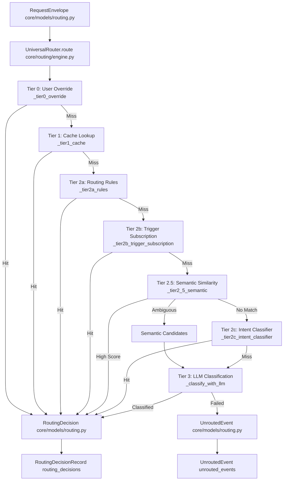
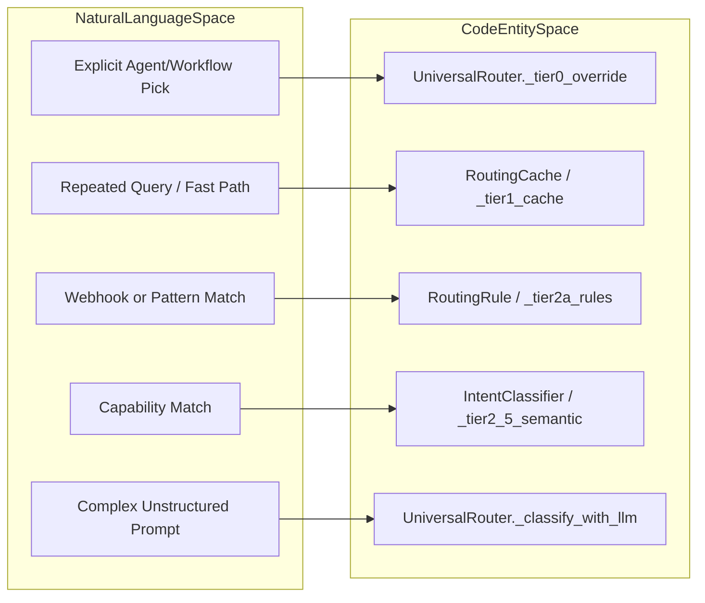

# Universal Router

Relevant source files

The following files were used as context for generating this wiki page:

- [orchestrator/api/chat.py](orchestrator/api/chat.py)
- [orchestrator/api/routing.py](orchestrator/api/routing.py)
- [orchestrator/consumers/chatbot/auto.py](orchestrator/consumers/chatbot/auto.py)
- [orchestrator/consumers/chatbot/service.py](orchestrator/consumers/chatbot/service.py)
- [orchestrator/core/llm/manager.py](orchestrator/core/llm/manager.py)
- [orchestrator/core/routing/engine.py](orchestrator/core/routing/engine.py)
- [orchestrator/modules/agents/factory/agent_factory.py](orchestrator/modules/agents/factory/agent_factory.py)
- [orchestrator/modules/tools/discovery/platform_actions.py](orchestrator/modules/tools/discovery/platform_actions.py)
- [orchestrator/modules/tools/discovery/platform_executor.py](orchestrator/modules/tools/discovery/platform_executor.py)
- [orchestrator/scripts/setup_jira_trigger.py](orchestrator/scripts/setup_jira_trigger.py)
- [orchestrator/services/heartbeat_service.py](orchestrator/services/heartbeat_service.py)
- [orchestrator/services/page_context.py](orchestrator/services/page_context.py)
- [orchestrator/tests/test_prd221_page_context.py](orchestrator/tests/test_prd221_page_context.py)
- [orchestrator/tests/test_prd221_page_prior_tools.py](orchestrator/tests/test_prd221_page_prior_tools.py)

The Universal Router is Automatos AI's intelligent message routing system that determines which agent or workflow should handle an incoming request. It implements a tiered routing strategy that progressively escalates from fast, deterministic rules to semantic similarity and LLM-based classification, ensuring optimal routing accuracy while minimizing latency and cost.

For information about complexity assessment (which precedes routing), see [Complexity Assessment (AutoBrain)](#9.2). For context assembly after routing, see [Context Service](#4).

---

## Routing Architecture

The Universal Router operates on a normalized input (`RequestEnvelope`) and produces a routing decision (`RoutingDecision`) by evaluating the request through a series of tiers until a match is found. For details, see [Routing Architecture](#10.1).

### High-Level Flow

**Sources:** [orchestrator/core/routing/engine.py:79-163](), [orchestrator/core/models/routing.py:35-42]()

---

### Natural Language to Code Entity Mapping

To bridge natural language routing intent and underlying system implementations, the router maps conversational entry points directly to concrete engine execution methods and data models:

**Sources:** [orchestrator/core/routing/engine.py:95-158](), [orchestrator/core/routing/cache.py:43]()

---

## Tier 0: User Overrides

When the user explicitly selects an agent or workflow, routing bypasses all other tiers. This is handled by `_tier0_override` in the routing engine. In the Chat API, if `agentId` is provided in the `ChatRequest`, it sets the `override_agent_id` in the envelope.

**Confidence:** Always 1.0 (user decision is authoritative). For details, see [Tier 0: User Overrides](#10.2).

**Sources:** [orchestrator/core/routing/engine.py:169-184](), [orchestrator/api/chat.py:60-71]()

---

## Tier 1: Cache Lookup

The `RoutingCache` stores recent routing decisions in Redis, keyed by workspace, content hash, and source. For details, see [Tier 1: Cache Lookup](#10.3).

**Sources:** [orchestrator/core/routing/cache.py:43](), [orchestrator/core/routing/engine.py:103-107]()

---

## Tier 2: Rule-Based Routing

Workspace admins can define routing rules in the `routing_rules` table. This tier includes source pattern matching, trigger subscriptions, and intent keyword classification. For details, see [Tier 2: Rule-Based Routing](#10.4).

**Sources:** [orchestrator/core/routing/engine.py:109-122](), [orchestrator/api/routing.py:41-104]()

---

## Tier 2.5: Semantic Similarity

This tier uses agent embeddings to find the best match via cosine similarity against agent capabilities, descriptions, and skills. For details, see [Tier 2.5: Semantic Similarity](#10.5).

**Sources:** [orchestrator/core/routing/engine.py:123-136](), [orchestrator/core/models/composio_cache.py:33]()

---

## Tier 3: LLM Classification

When all previous tiers fail, the router uses an LLM to classify the request using the `ROUTER` context mode and semantic hints. For details, see [Tier 3: LLM Classification](#10.6).

**Sources:** [orchestrator/core/routing/engine.py:148-158]()

---

## Routing Corrections & Learning

Users can correct routing decisions via API endpoints. This updates records and automatically adjusts cache entries after repeated corrections. For details, see [Routing Corrections & Learning](#10.7).

**Sources:** [orchestrator/api/routing.py:82-85](), [orchestrator/core/routing/cache.py:112-152]()

---

## Child Pages

For deep dives into specific components, refer to the following child pages:

- [Routing Architecture](#10.1) — RequestEnvelope, RoutingDecision, routing_decisions table, ingestors, decision logging
- [Tier 0: User Overrides](#10.2) — Explicit agent_id or workflow_id from UI, confidence=1.0, skips all other tiers
- [Tier 1: Cache Lookup](#10.3) — RoutingCache with normalized content hash, workspace-scoped fast lookups, cache stats endpoints
- [Tier 2: Rule-Based Routing](#10.4) — Routing rules with source_pattern, TriggerSubscription for webhooks, intent keywords, harness routing rules
- [Tier 2.5: Semantic Similarity](#10.5) — Cosine similarity on agent embeddings, DIRECT_ROUTE threshold, candidate shortlisting, agent re-indexing
- [Tier 3: LLM Classification](#10.6) — LLM with all agents + semantic hints, agent selection or orchestrate mode
- [Routing Corrections & Learning](#10.7) — User corrections, cache auto-update after repeated corrections, continuous improvement loop

---