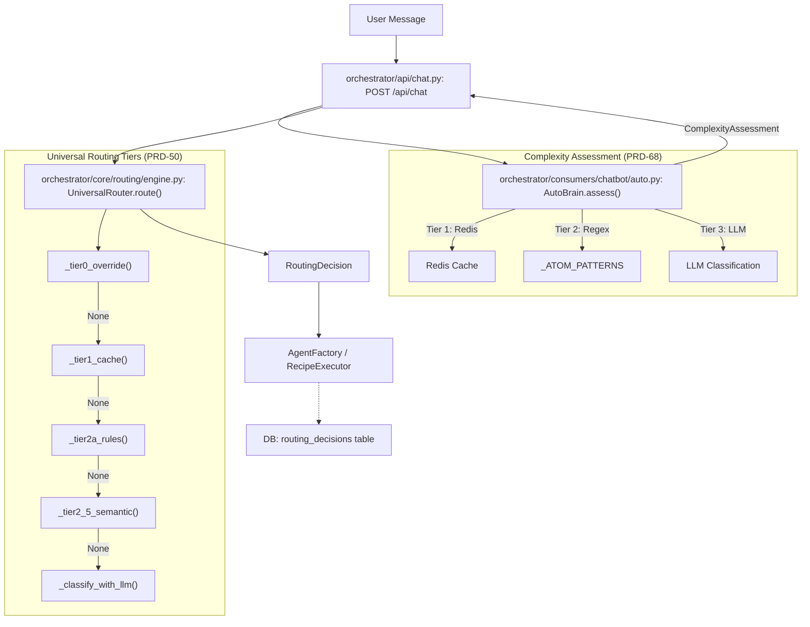
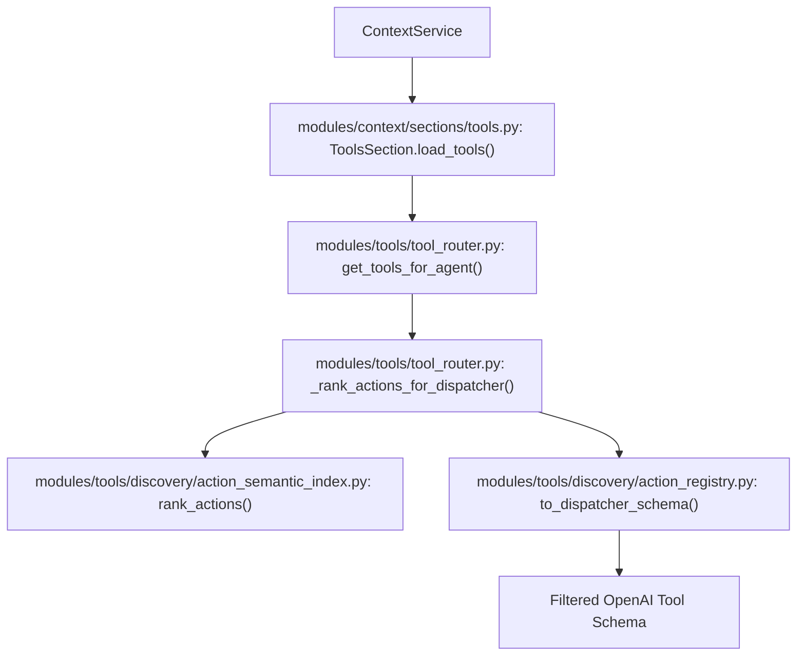

# Routing Architecture

<details>
<summary>Relevant source files</summary>

The following files were used as context for generating this wiki page:

- [orchestrator/api/routing.py](orchestrator/api/routing.py)
- [orchestrator/core/routing/engine.py](orchestrator/core/routing/engine.py)
- [orchestrator/modules/context/sections/tools.py](orchestrator/modules/context/sections/tools.py)
- [orchestrator/modules/tools/discovery/action_registry.py](orchestrator/modules/tools/discovery/action_registry.py)
- [orchestrator/modules/tools/discovery/handlers_search.py](orchestrator/modules/tools/discovery/handlers_search.py)
- [orchestrator/modules/tools/tool_router.py](orchestrator/modules/tools/tool_router.py)
- [orchestrator/scripts/setup_jira_trigger.py](orchestrator/scripts/setup_jira_trigger.py)
- [orchestrator/tests/test_action_registry_filtered.py](orchestrator/tests/test_action_registry_filtered.py)
- [orchestrator/tests/test_tool_router_semantic.py](orchestrator/tests/test_tool_router_semantic.py)

</details>


## Purpose and Scope

The **Universal Router** is a core orchestration component responsible for resolving a `RequestEnvelope` into a `RoutingDecision`. It implements a 7-tier cascading strategy designed to minimize latency and LLM costs while maximizing routing accuracy. By utilizing aggressive caching, heuristic patterns, and semantic similarity, the system ensures that high-volume requests are routed without requiring an expensive LLM call.

This architecture supports multi-tenant isolation through workspace-scoping and provides a continuous learning loop via user corrections and complexity assessment via the **Auto Brain**.

Sources: [orchestrator/core/routing/engine.py:1-16](), [orchestrator/core/models/routing.py:35-42]()

---

## Architecture Overview

The routing engine processes incoming messages through a series of tiers. If a tier successfully resolves the request with sufficient confidence, the process terminates and returns the decision.

### Routing Strategy Tiers

| Tier | Method | Latency | Cost | Logic |
|------|--------|---------|------|-------|
| **Tier 0** | User Overrides | <1ms | $0 | Explicit `override_agent_id` or `override_workflow_id` provided in `RequestEnvelope`. [orchestrator/core/routing/engine.py:169-182]() |
| **Tier 1** | Cache Lookup | 1-5ms | $0 | `RoutingCache` hit using normalized content hash via `_normalize_content`. [orchestrator/core/routing/engine.py:102-108](), [orchestrator/core/routing/cache.py:43-44]() |
| **Tier 2a** | Routing Rules | 5-20ms | $0 | Pattern matching against the `routing_rules` table using `source_pattern`. [orchestrator/core/routing/engine.py:109-115]() |
| **Tier 2b** | Trigger Subscriptions | 10-30ms | $0 | Mapping `TriggerSubscription` (e.g., `jira_trigger`) to specific agents. [orchestrator/core/routing/engine.py:116-122]() |
| **Tier 2.5** | Semantic Similarity | 20-50ms | $0 | Cosine similarity on agent embeddings (PRD-64). [orchestrator/core/routing/engine.py:123-136]() |
| **Tier 2c** | Intent Keywords | 5-15ms | $0 | `IntentClassifier` keyword matching against routing rules. [orchestrator/core/routing/engine.py:138-147]() |
| **Tier 3** | LLM Classification | 1-3s | ~$0.01 | Fallback to LLM for complex reasoning and agent selection. [orchestrator/core/routing/engine.py:148-159]() |

Sources: [orchestrator/core/routing/engine.py:1-16](), [orchestrator/core/routing/engine.py:79-163]()

---

## Core Data Entities

The routing system bridges "Natural Language Space" (user messages) to "Code Entity Space" (agents and workflows) using the following structures:

### Routing Data Model
```mermaid
classDiagram
    class RequestEnvelope {
        +UUID id
        +UUID workspace_id
        +str content
        +ChannelSource source
        +dict metadata
        +int override_agent_id
        +int override_workflow_id
    }
    class RoutingDecision {
        +str route_type
        +int agent_id
        +int workflow_id
        +float confidence
        +str reasoning
    }
    class RoutingRule {
        +int id
        +UUID workspace_id
        +str source_pattern
        +list intent_keywords
        +int target_agent_id
        +int target_workflow_id
        +int priority
    }
    class RoutingDecisionRecord {
        +UUID request_id
        +str envelope_hash
        +str route_type
        +bool was_corrected
        +int corrected_agent_id
    }

    RequestEnvelope --> "UniversalRouter" : "input"
    "UniversalRouter" --> RoutingDecision : "output"
    "UniversalRouter" ..> RoutingRule : "queries"
    "UniversalRouter" ..> RoutingDecisionRecord : "logs"
```

Sources: [orchestrator/core/models/routing.py:1-60](), [orchestrator/core/routing/engine.py:35-42]()

---

## Routing Data Flow

The following diagram illustrates how a message moves from the API layer through the `UniversalRouter` and `AutoBrain` to reach a specific `Agent` or `Workflow`.

### Message Routing Pipeline


Sources: [orchestrator/api/chat.py:63-100](), [orchestrator/core/routing/engine.py:79-163](), [orchestrator/core/models/routing.py:65-95]()

---

## Tier Detail: Semantic & Heuristic Routing

### Tier 2.5: Semantic Similarity (PRD-64)
This tier uses vector embeddings to find the most relevant agent based on their description and capabilities. It performs cosine similarity comparisons against the user query.

- **Direct Route**: If similarity score exceeds a high threshold, it routes immediately to the agent. [orchestrator/core/routing/engine.py:129-136]()
- **LLM Hints**: If similarity is lower but relevant candidates exist, the top candidates are passed to Tier 3 as `semantic_candidates` to constrain the LLM's search space. [orchestrator/core/routing/engine.py:149-159]()

Sources: [orchestrator/core/routing/engine.py:123-136]()

### Auto Brain Complexity (PRD-68)
Before the `UniversalRouter` is invoked, `AutoBrain` assesses the "Complexity Scale" (Atom → Organism).
- **ATOM**: Simple greetings or identity questions handled via `_ATOM_PATTERNS`.
- **Platform Keywords**: `AutoBrain` uses `_PLATFORM_KEYWORDS` to detect intents like `platform_list_agents` or `platform_get_llm_usage`. These are then handled by the `ActionRegistry` which defines available platform operations. [orchestrator/modules/tools/discovery/action_registry.py:28-42]()

Sources: [orchestrator/modules/tools/discovery/action_registry.py:55-61](), [orchestrator/modules/tools/tool_router.py:129-138]()

---

## Tool Discovery and Semantic Narrowing

The routing architecture extends beyond message routing into **Tool Routing**. When an agent is selected, the system must decide which tools to provide in the LLM context.

### Semantic Tool Narrowing (PRD-138)
To avoid overwhelming the LLM with hundreds of platform actions, the `ToolsSection` and `ActionRegistry` implement semantic narrowing.

- **Dispatcher Schema**: The `platform_execute` tool acts as a single entry point for platform actions. [orchestrator/modules/tools/discovery/action_registry.py:136-141]()
- **Action Enum Trimming**: If `SEMANTIC_TOOL_ROUTING` is enabled, the `ActionSemanticIndex` ranks all platform actions against the user query. [orchestrator/modules/tools/tool_router.py:124-154]()
- **Context Injection**: The `ToolsSection` calls `_rank_actions_for_dispatcher` to narrow the `action.enum` in the OpenAI function schema to the top-K most relevant actions. [orchestrator/modules/context/sections/tools.py:112-142]()

### Tool Loading Flow


Sources: [orchestrator/modules/context/sections/tools.py:61-99](), [orchestrator/modules/tools/tool_router.py:157-165](), [orchestrator/modules/tools/discovery/action_registry.py:159-180]()

---

## Decision Logging and Learning

Every routing decision is logged to the database via `_log_decision` which creates a `RoutingDecisionRecord`. This data powers the system's learning loop.

### Routing Decision Record
| Column | Description |
|--------|-------------|
| `request_id` | Unique ID of the `RequestEnvelope`. [orchestrator/core/models/routing.py:69]() |
| `envelope_hash` | SHA-256 hash of normalized content for cache matching. [orchestrator/core/models/routing.py:70]() |
| `confidence` | The confidence score (0.0 - 1.0) of the winning tier. [orchestrator/core/models/routing.py:75]() |
| `route_type` | Whether it routed to an `agent` or `workflow`. [orchestrator/core/models/routing.py:72]() |

Sources: [orchestrator/core/models/routing.py:65-95](), [orchestrator/core/routing/engine.py:52-55]()

### The Learning Loop
When a user corrects a routing decision via the API, the ground truth is stored.
- **API Correction**: `POST /api/routing/corrections` records the `correct_agent_id`. [orchestrator/api/routing.py:81-84]()
- **Cache Update**: Future requests with the same `envelope_hash` will prioritize the corrected agent in Tier 1 (Cache Lookup). [orchestrator/core/routing/engine.py:102-108]()
- **Correction Persistence**: Corrections are tracked to improve the `RoutingCache` effectiveness over time.

Sources: [orchestrator/core/routing/engine.py:161-163](), [orchestrator/api/routing.py:246-270]()

---

## Configuration and Thresholds

The routing engine behavior is tuned via global configuration:
- `ROUTING_LLM_CONFIDENCE_THRESHOLD`: The minimum confidence required for a Tier 3 (LLM) decision to be accepted. [orchestrator/core/routing/engine.py:47]()
- **Trigger Management**: `TriggerSubscription` allows external events (like webhooks) to be routed based on the event source. [orchestrator/core/models/composio.py:22-25]()
- **Jira Integration**: Scripts like `setup_jira_trigger.py` register specific triggers (e.g., `JIRA_NEW_ISSUE_TRIGGER`) to be routed to chosen agents or workflows. [orchestrator/scripts/setup_jira_trigger.py:123-136]()

Sources: [orchestrator/core/routing/engine.py:47-49](), [orchestrator/scripts/setup_jira_trigger.py:141-152]()

---