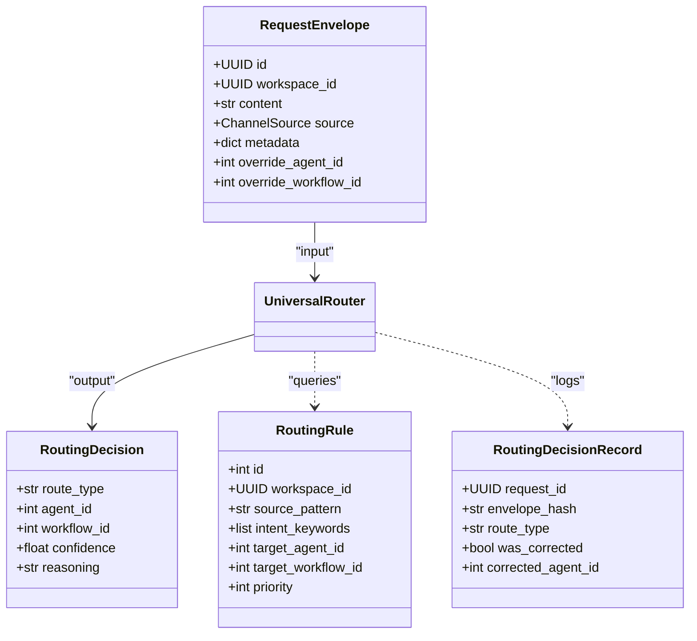
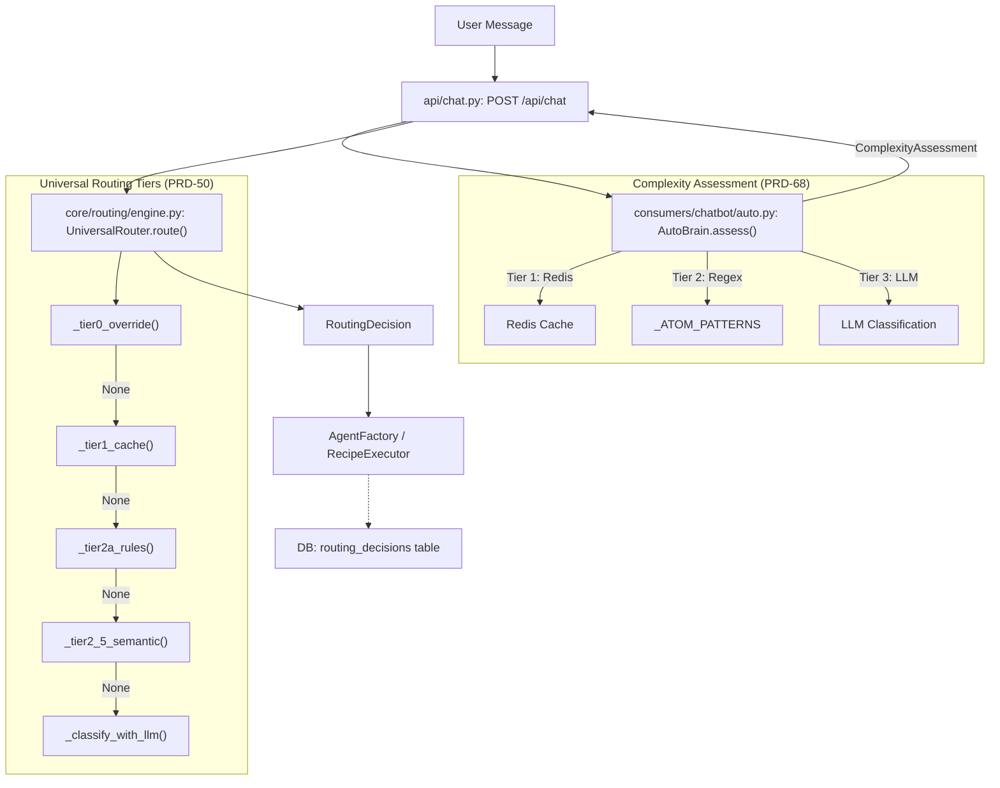

# Routing Architecture

Relevant source files

The following files were used as context for generating this wiki page:

- [docs/PRDS/53-WEBHOOK-TRIGGER-SYSTEM-PRD.md](docs/PRDS/53-WEBHOOK-TRIGGER-SYSTEM-PRD.md)
- [docs/reviews/COMPOSIO-TOOL-REGRESSION-REVIEW.md](docs/reviews/COMPOSIO-TOOL-REGRESSION-REVIEW.md)
- [frontend/components/settings/SettingsPanel.tsx](frontend/components/settings/SettingsPanel.tsx)
- [frontend/components/settings/SystemLLMSettingsTab.tsx](frontend/components/settings/SystemLLMSettingsTab.tsx)
- [frontend/components/settings/SystemSettingsTab.tsx](frontend/components/settings/SystemSettingsTab.tsx)
- [frontend/components/settings/WebhooksSettingsTab.tsx](frontend/components/settings/WebhooksSettingsTab.tsx)
- [frontend/components/workspace-provider.tsx](frontend/components/workspace-provider.tsx)
- [orchestrator/alembic/versions/20260213_add_workspace_webhook_key.py](orchestrator/alembic/versions/20260213_add_workspace_webhook_key.py)
- [orchestrator/api/chat.py](orchestrator/api/chat.py)
- [orchestrator/api/chat_voice.py](orchestrator/api/chat_voice.py)
- [orchestrator/api/webhooks.py](orchestrator/api/webhooks.py)
- [orchestrator/api/workspaces.py](orchestrator/api/workspaces.py)
- [orchestrator/consumers/chatbot/auto.py](orchestrator/consumers/chatbot/auto.py)
- [orchestrator/consumers/chatbot/intent_classifier.py](orchestrator/consumers/chatbot/intent_classifier.py)
- [orchestrator/consumers/chatbot/personality.py](orchestrator/consumers/chatbot/personality.py)
- [orchestrator/consumers/chatbot/service.py](orchestrator/consumers/chatbot/service.py)
- [orchestrator/consumers/chatbot/smart_tool_router.py](orchestrator/consumers/chatbot/smart_tool_router.py)
- [orchestrator/core/llm/manager.py](orchestrator/core/llm/manager.py)
- [orchestrator/core/models/routing.py](orchestrator/core/models/routing.py)
- [orchestrator/core/routing/engine.py](orchestrator/core/routing/engine.py)
- [orchestrator/core/routing/ingestors/webhook.py](orchestrator/core/routing/ingestors/webhook.py)
- [orchestrator/modules/orchestrator/service.py](orchestrator/modules/orchestrator/service.py)
- [orchestrator/modules/tools/discovery/actions_analytics_enhanced.py](orchestrator/modules/tools/discovery/actions_analytics_enhanced.py)
- [orchestrator/modules/tools/discovery/actions_harness.py](orchestrator/modules/tools/discovery/actions_harness.py)
- [orchestrator/modules/tools/discovery/handlers_analytics_enhanced.py](orchestrator/modules/tools/discovery/handlers_analytics_enhanced.py)
- [orchestrator/modules/tools/discovery/handlers_harness.py](orchestrator/modules/tools/discovery/handlers_harness.py)
- [orchestrator/modules/tools/discovery/handlers_missions.py](orchestrator/modules/tools/discovery/handlers_missions.py)
- [orchestrator/modules/tools/discovery/handlers_search.py](orchestrator/modules/tools/discovery/handlers_search.py)
- [orchestrator/modules/tools/discovery/platform_actions.py](orchestrator/modules/tools/discovery/platform_actions.py)
- [orchestrator/modules/tools/discovery/platform_executor.py](orchestrator/modules/tools/discovery/platform_executor.py)
- [orchestrator/modules/tools/tool_router.py](orchestrator/modules/tools/tool_router.py)
- [orchestrator/scripts/seed_blog_playbook.py](orchestrator/scripts/seed_blog_playbook.py)
- [orchestrator/services/harness_service.py](orchestrator/services/harness_service.py)

## Purpose and Scope

The **Universal Router** is a core orchestration component responsible for resolving a `RequestEnvelope` into a `RoutingDecision`. It implements a 7-tier cascading strategy designed to minimize latency and LLM costs while maximizing routing accuracy. By utilizing aggressive caching, heuristic patterns, and semantic similarity, the system ensures that high-volume requests are routed without requiring an expensive LLM call.

This architecture supports multi-tenant isolation through workspace-scoping and provides a continuous learning loop via user corrections and complexity assessment via the **Auto Brain**.

Sources: [orchestrator/core/routing/engine.py:1-16](), [orchestrator/consumers/chatbot/auto.py:1-22]()

---

## Architecture Overview

The routing engine processes incoming messages through a series of tiers. If a tier successfully resolves the request with sufficient confidence, the process terminates and returns the decision.

### Routing Strategy Tiers

| Tier | Method | Latency | Cost | Logic |
|------|--------|---------|------|-------|
| **Tier 0** | User Overrides | <1ms | $0 | Explicit `agent_id` or `workflow_id` provided in `RequestEnvelope`. [orchestrator/core/routing/engine.py:169-182]() |
| **Tier 1** | Cache Lookup | 1-5ms | $0 | `RoutingCache` hit using normalized content hash. [orchestrator/core/routing/engine.py:103-108]() |
| **Tier 2a** | Routing Rules | 5-20ms | $0 | Pattern matching against the `routing_rules` table. [orchestrator/core/routing/engine.py:110-115]() |
| **Tier 2b** | Trigger Subscriptions | 10-30ms | $0 | Mapping `TriggerSubscription` (e.g., Jira) to specific agents. [orchestrator/core/routing/engine.py:117-122]() |
| **Tier 2.5** | Semantic Similarity | 20-50ms | $0 | Cosine similarity on agent embeddings (PRD-64). [orchestrator/core/routing/engine.py:123-136]() |
| **Tier 2c** | Intent Keywords | 5-15ms | $0 | `IntentClassifier` keyword matching against routing rules. [orchestrator/core/routing/engine.py:138-147]() |
| **Tier 3** | LLM Classification | 1-3s | ~$0.01 | Fallback to LLM for complex reasoning and agent selection. [orchestrator/core/routing/engine.py:149-159]() |

Sources: [orchestrator/core/routing/engine.py:1-16](), [orchestrator/core/routing/engine.py:79-163]()

---

## Core Data Entities

The routing system bridges "Natural Language Space" (user messages) to "Code Entity Space" (agents and workflows) using the following structures:

### Routing Data Model

Sources: [orchestrator/core/models/routing.py:1-42](), [orchestrator/core/routing/engine.py:35-42]()

---

## Routing Data Flow

The following diagram illustrates how a message moves from the API layer through the `UniversalRouter` and `AutoBrain` to reach a specific `Agent` or `Workflow`.

### Message Routing Pipeline

Sources: [orchestrator/api/chat.py:63-180](), [orchestrator/core/routing/engine.py:79-163](), [orchestrator/consumers/chatbot/auto.py:5-22]()

---

## Tier Detail: Semantic & Heuristic Routing

### Tier 2.5: Semantic Similarity (PRD-64)
This tier uses vector embeddings to find the most relevant agent based on their description and capabilities. It performs cosine similarity comparisons against the user query.

- **Direct Route**: If similarity score exceeds a high threshold (e.g., 0.85), it routes immediately to the agent. [orchestrator/core/routing/engine.py:129-136]()
- **LLM Hints**: If similarity is lower but relevant candidates exist, the top candidates are passed to Tier 3 as `semantic_candidates` to constrain the LLM's search space. [orchestrator/core/routing/engine.py:149-159]()

Sources: [orchestrator/core/routing/engine.py:123-136]()

### Auto Brain Complexity (PRD-68)
Before the `UniversalRouter` is invoked, `AutoBrain` assesses the "Complexity Scale" (Atom → Organism).
- **ATOM**: Simple greetings or factual chitchat handled by `_ATOM_PATTERNS`. [orchestrator/consumers/chatbot/auto.py:44-48](), [orchestrator/consumers/chatbot/auto.py:92-114]()
- **Platform Keywords**: `AutoBrain` uses `_PLATFORM_KEYWORDS` to detect intents like `platform_list_agents` or `platform_get_llm_usage` to trigger direct platform actions via the `PlatformActionExecutor`. [orchestrator/consumers/chatbot/auto.py:116-181](), [orchestrator/modules/tools/discovery/platform_executor.py:164-210]()

Sources: [orchestrator/consumers/chatbot/auto.py:5-22](), [orchestrator/modules/tools/discovery/platform_executor.py:164-210]()

---

## Decision Logging and Learning

Every routing decision is logged to the `routing_decisions` table via `RoutingDecisionRecord`. This data powers the system's learning loop and allows admins to audit routing performance.

### Routing Decision Record
| Column | Description |
|--------|-------------|
| `request_id` | Unique ID of the `RequestEnvelope`. |
| `envelope_hash` | SHA-256 hash of normalized content for cache matching. |
| `confidence` | The confidence score (0.0 - 1.0) of the winning tier. |
| `was_corrected` | Boolean indicating if a user manually changed the routed agent. |
| `corrected_agent_id` | The ID of the agent the user selected as the "correct" one. |

Sources: [orchestrator/core/models/routing.py:35-42](), [orchestrator/core/routing/engine.py:99-157]()

### The Learning Loop
When a user corrects a routing decision via the UI, the system records the `corrected_agent_id`.
- **Correction Storage**: Corrections mark a decision as corrected and store the ground truth. [orchestrator/core/models/routing.py:35-42]()
- **Cache Update**: Future requests with the same `envelope_hash` (computed from normalized content) will prioritize the corrected agent in Tier 1 (Cache Lookup). [orchestrator/core/routing/engine.py:52-55](), [orchestrator/core/routing/engine.py:103-108]()

Sources: [orchestrator/core/routing/engine.py:52-163]()

---

## Configuration and Thresholds

The routing engine behavior is tuned via global configuration:
- `ROUTING_LLM_CONFIDENCE_THRESHOLD`: The minimum confidence required for a Tier 3 (LLM) decision to be accepted. [orchestrator/core/routing/engine.py:47]()
- **Trigger Management**: `TriggerSubscription` allows external events (like `jira_trigger`) to be mapped to specific agents, processed in Tier 2b. [orchestrator/core/models/composio.py:32](), [orchestrator/core/routing/engine.py:117-122]()

Sources: [orchestrator/core/routing/engine.py:47-49](), [orchestrator/core/models/composio.py:32]()

---