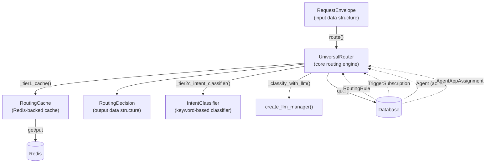
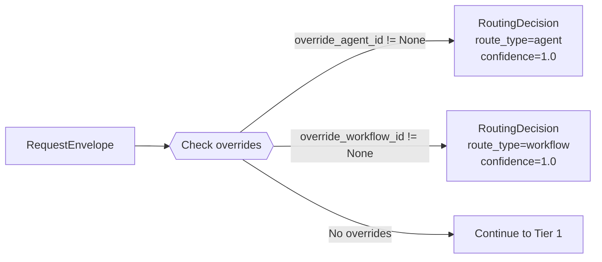
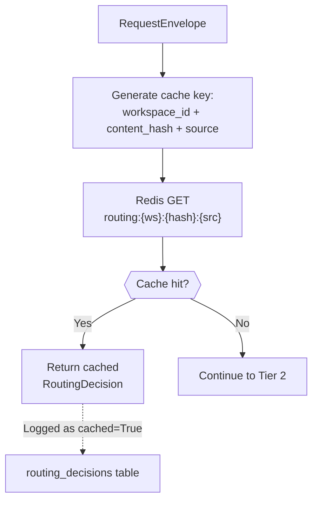
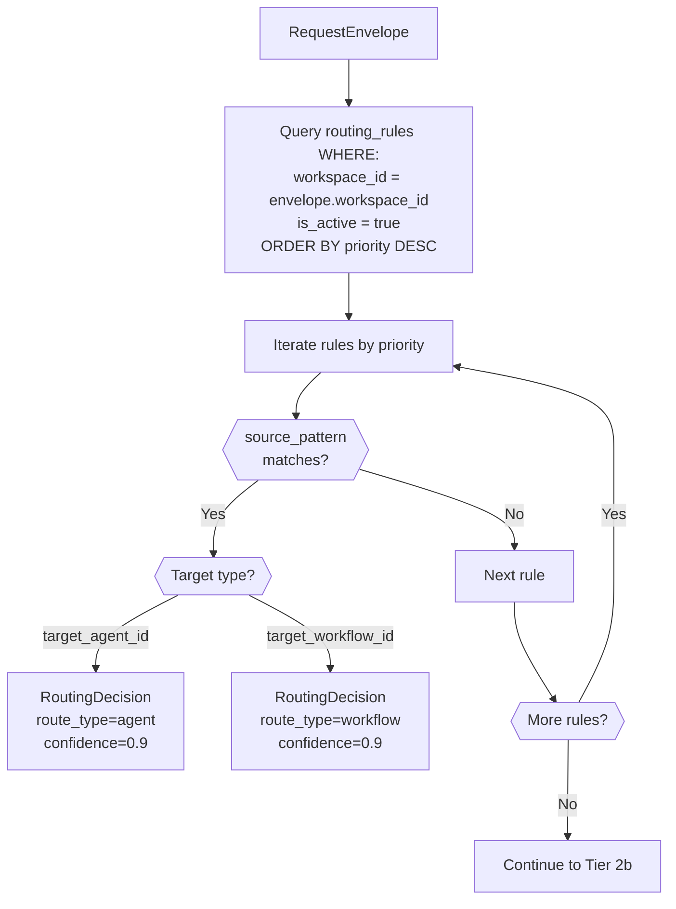
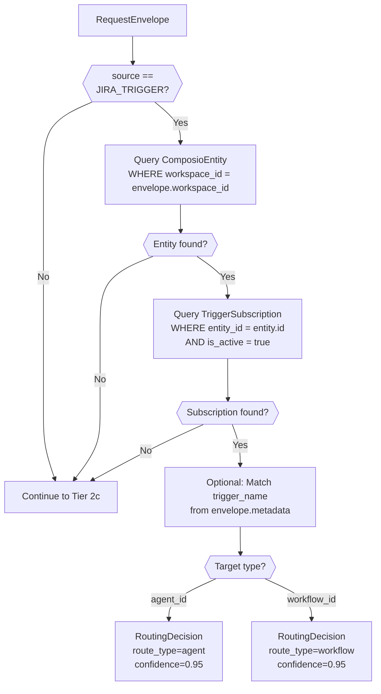
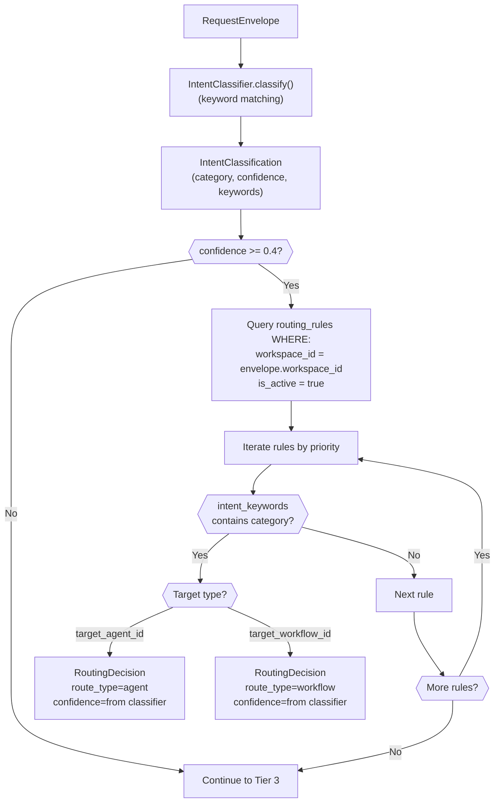
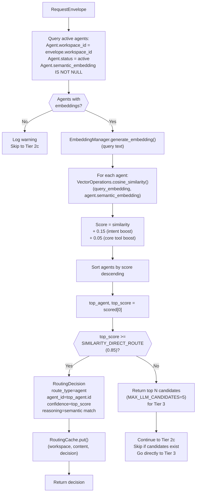
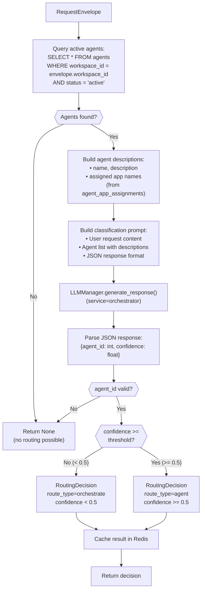
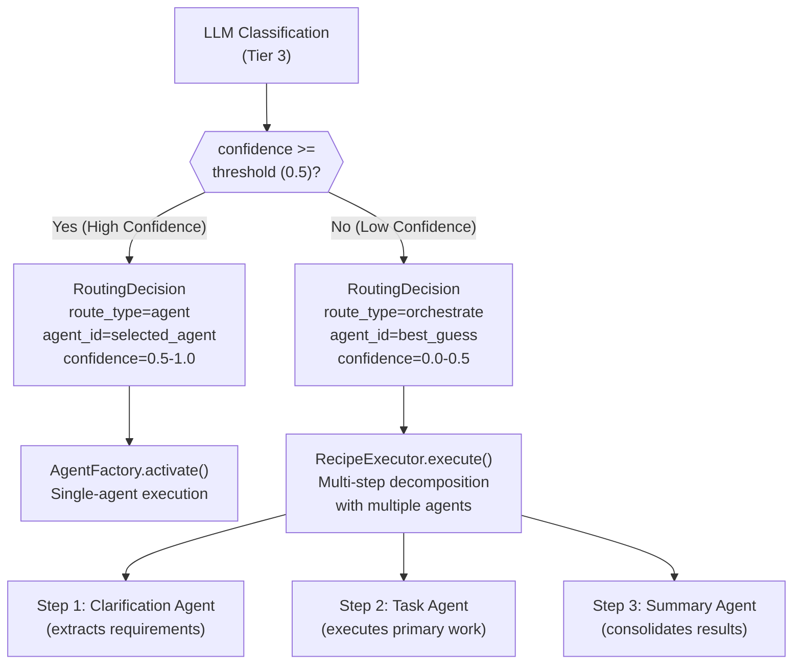
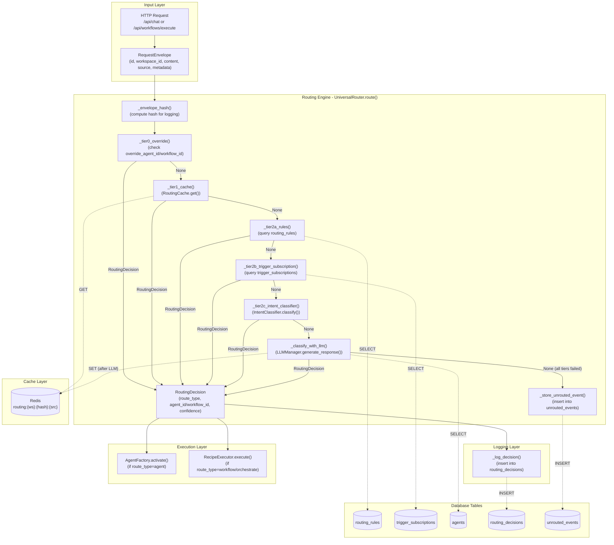

# Routing Architecture

<details>
<summary>Relevant source files</summary>

The following files were used as context for generating this wiki page:

- [orchestrator/api/chat.py](orchestrator/api/chat.py)
- [orchestrator/api/routing.py](orchestrator/api/routing.py)
- [orchestrator/consumers/chatbot/auto.py](orchestrator/consumers/chatbot/auto.py)
- [orchestrator/consumers/chatbot/intent_classifier.py](orchestrator/consumers/chatbot/intent_classifier.py)
- [orchestrator/consumers/chatbot/personality.py](orchestrator/consumers/chatbot/personality.py)
- [orchestrator/consumers/chatbot/smart_orchestrator.py](orchestrator/consumers/chatbot/smart_orchestrator.py)
- [orchestrator/consumers/chatbot/smart_tool_router.py](orchestrator/consumers/chatbot/smart_tool_router.py)
- [orchestrator/core/models/system_settings.py](orchestrator/core/models/system_settings.py)
- [orchestrator/core/routing/engine.py](orchestrator/core/routing/engine.py)
- [orchestrator/modules/tools/discovery/__init__.py](orchestrator/modules/tools/discovery/__init__.py)
- [orchestrator/scripts/setup_jira_trigger.py](orchestrator/scripts/setup_jira_trigger.py)

</details>


## Purpose and Scope

This document describes the **Universal Router** system that intelligently routes incoming requests to appropriate agents or workflows within the Automatos AI platform. The router implements a four-tier cascading strategy to minimize latency and LLM costs while maximizing routing accuracy.

For information about agent execution after routing, see [Agent Lifecycle & Status](#3.6). For workflow execution, see [Recipe Execution](#4.2). For the chat interface that uses routing, see [Streaming Chat Service](#8.1).

---

## Architecture Overview

The Universal Router (`UniversalRouter`) is a core orchestration component that resolves a `RequestEnvelope` into a `RoutingDecision` using a six-tier cascading strategy. Each tier attempts to route the request using progressively more expensive but more flexible methods.

**Design Philosophy:**
- **Performance optimization**: Minimize LLM calls through aggressive caching and pre-filtering
- **Cost optimization**: 95%+ of requests never reach the LLM tier
- **Latency optimization**: Redis cache provides <1ms lookups, semantic similarity <20ms
- **Accuracy**: Semantic matching + LLM fallback ensures high-quality routing
- **Transparency**: Every decision is logged with reasoning and confidence

**Routing Tiers:**
| Tier | Method | Latency | Cost | Confidence |
|------|--------|---------|------|------------|
| **Tier 0** | User overrides | <1ms | Zero | 1.0 |
| **Tier 1** | Cache lookup | 1-5ms | Zero | Varies |
| **Tier 2a** | Routing rules (source pattern) | 5-20ms | Zero | 0.9 |
| **Tier 2b** | Trigger subscriptions | 10-30ms | Zero | 0.95 |
| **Tier 2.5** | Semantic similarity (agent embeddings) | 10-50ms | Zero | 0.0-1.0 |
| **Tier 2c** | Intent keyword matching | 5-15ms | Zero | 0.4-0.8 |
| **Tier 3** | LLM classification | 500ms-3s | API cost | 0.0-1.0 |

**Tier 2.5 Semantic Routing (PRD-64):**
The semantic tier uses pre-computed agent embeddings to find the best match via cosine similarity. High-confidence matches (≥0.85) route directly; ambiguous results are passed as candidate hints to Tier 3, dramatically reducing the search space for the LLM.

**Confidence-Based Orchestration:**
When LLM confidence is below the threshold (`ROUTING_LLM_CONFIDENCE_THRESHOLD`, default 0.5), the router returns `route_type="orchestrate"` instead of direct agent routing, triggering full workflow decomposition for complex requests.

Sources: [orchestrator/core/routing/engine.py:1-50](), [orchestrator/core/routing/engine.py:358-447]()

---

## Core Components

The routing system consists of several key classes and data structures:



**RequestEnvelope** (`core.models.routing.RequestEnvelope`):
- Input structure containing request content, source channel, workspace context
- Fields: `id`, `workspace_id`, `content`, `source`, `metadata`, `override_agent_id`, `override_workflow_id`
- Immutable after creation

**RoutingDecision** (`core.models.routing.RoutingDecision`):
- Output structure containing routing target and confidence
- Fields: `route_type` (agent/workflow/orchestrate), `agent_id`, `workflow_id`, `confidence`, `reasoning`, `cached`, `intent_category`
- `route_type="orchestrate"` signals low confidence → full decomposition needed

**UniversalRouter** (`core.routing.engine.UniversalRouter`):
- Main routing engine class
- Constructor: `__init__(db: Session, cache: Optional[RoutingCache])`
- Primary method: `async route(envelope: RequestEnvelope) -> Optional[RoutingDecision]`
- Tier methods: `_tier0_override()`, `_tier1_cache()`, `_tier2a_rules()`, `_tier2b_trigger_subscription()`, `_tier2_5_semantic()`, `_tier2c_intent_classifier()`, `_classify_with_llm()`

**RoutingCache** (`core.routing.cache.RoutingCache`):
- Redis-backed cache for routing decisions
- Cache key format: `routing:{workspace_id}:{content_hash}:{source}`
- TTL configured via `ROUTING_CACHE_TTL_HOURS` (default 24 hours)
- Supports correction tracking: `record_correction()` for user feedback

**IntentClassifier** (`core.services.intent_classifier.IntentClassifier`):
- Keyword-based intent classification without LLM
- Returns `IntentClassification(category, confidence, matched_keywords)`
- Used by Tier 2c for lightweight classification

**SemanticIndexer** (`core.routing.semantic_indexer`):
- Generates and stores agent embeddings in `Agent.semantic_embedding` column
- Functions: `embed_workspace_agents()`, `find_similar_agents()`
- Thresholds: `SIMILARITY_DIRECT_ROUTE=0.85`, `MAX_LLM_CANDIDATES=5`

Sources: [orchestrator/core/routing/engine.py:16-73](), [orchestrator/core/models/routing.py](), [orchestrator/core/routing/semantic_indexer.py]()

---

## Tier 0: User Overrides

The first and fastest tier checks for explicit routing instructions from the user. This allows callers to bypass automatic routing when they know exactly which agent or workflow should handle the request.

**Implementation:**



**Method:** `_tier0_override(envelope: RequestEnvelope) -> Optional[RoutingDecision]`

**Logic:**
1. Check `envelope.override_agent_id`
   - If set: return `RoutingDecision(route_type="agent", agent_id=..., confidence=1.0, reasoning="User override")`
2. Check `envelope.override_workflow_id`
   - If set: return `RoutingDecision(route_type="workflow", workflow_id=..., confidence=1.0, reasoning="User override")`
3. If neither set: return `None` (proceed to Tier 1)

**Use Cases:**
- API callers that specify target agent explicitly
- UI components with agent selection dropdowns
- Debugging and testing specific agents
- Forced routing in workflow steps

**Characteristics:**
- **Latency**: <1ms (simple attribute checks)
- **Confidence**: Always 1.0 (explicit user intent)
- **Cost**: Zero (no external calls)

Sources: [orchestrator/core/routing/engine.py:148-165]()

---

## Tier 1: Cache Lookup

When no override is specified, the router checks the `RoutingCache` for a previously computed decision. This dramatically reduces latency and LLM costs for repeated requests.



**Method:** `_tier1_cache(envelope: RequestEnvelope) -> Optional[RoutingDecision]`

**Cache Key Format:**
```
routing:{workspace_id}:{content_hash}:{source_value}
```

**Content Normalization:**
The router normalizes content before hashing to improve cache hit rates:
- Lowercasing
- Whitespace compression
- Special character removal

Implemented in `_normalize_content()` (referenced by `RoutingCache`)

**TTL Configuration:**
Cache entries expire after `ROUTING_CACHE_TTL_HOURS` (default: 24 hours). This balances:
- **Freshness**: Agent capabilities may change
- **Hit rate**: Most queries repeat within 24h
- **Memory**: Prevents unbounded Redis growth

**Population:**
Cache is populated in **Tier 3** after successful LLM classification. Even low-confidence results are cached to avoid repeated LLM calls for the same request.

**Characteristics:**
- **Latency**: 1-5ms (Redis roundtrip)
- **Hit rate**: Varies by workload (typically 60-80% for stable workspaces)
- **Cost**: Zero after initial classification

Sources: [orchestrator/core/routing/engine.py:168-177](), [orchestrator/core/routing/cache.py](), [orchestrator/config.py:143]()

---

## Tier 2: Rule-Based Routing

Tier 2 consists of four sub-tiers that check database tables, perform semantic similarity matching, and use lightweight classification without calling LLMs. This provides fast, deterministic routing for configured patterns.

### Tier 2a: Routing Rules

The `routing_rules` table allows administrators to configure explicit routing patterns based on source channel and workspace.



**Method:** `_tier2a_rules(envelope: RequestEnvelope) -> Optional[RoutingDecision]`

**Database Schema:**
```sql
CREATE TABLE routing_rules (
    id SERIAL PRIMARY KEY,
    workspace_id UUID NOT NULL,
    source_pattern VARCHAR,  -- NULL means "match any source"
    target_agent_id INT REFERENCES agents(id),
    target_workflow_id UUID REFERENCES workflow_recipes(id),
    priority INT DEFAULT 0,
    is_active BOOLEAN DEFAULT TRUE,
    intent_keywords TEXT[]  -- Used by Tier 2c
);
```

**Matching Logic:**
1. If `rule.source_pattern` is NULL or empty → matches any source
2. Else: exact match against `envelope.source.value` (e.g., "jira_trigger", "web_form", "slack")

**Priority:**
Rules are evaluated in descending priority order. First match wins. This allows broad catch-all rules (low priority) with specific overrides (high priority).

**Characteristics:**
- **Latency**: 5-20ms (database query)
- **Confidence**: 0.9 (high confidence in configured rules)
- **Flexibility**: Admin-configurable without code changes

Sources: [orchestrator/core/routing/engine.py:178-214](), [orchestrator/core/models/routing.py]()

---

### Tier 2b: Trigger Subscriptions

For requests originating from **Composio triggers** (e.g., Jira webhooks), the router checks the `trigger_subscriptions` table for predefined agent/workflow assignments.



**Method:** `_tier2b_trigger_subscription(envelope: RequestEnvelope) -> Optional[RoutingDecision]`

**Database Flow:**
1. Resolve `workspace_id` → `ComposioEntity` (Composio's per-workspace entity ID)
2. Query `TriggerSubscription` for that entity
3. Optionally match `trigger_name` from `envelope.metadata` for specific trigger routing

**Use Case:**
When a Jira issue is created/updated, Composio webhook delivers it to Automatos. The trigger subscription maps it to a specific triage agent or bug workflow.

**Characteristics:**
- **Latency**: 10-30ms (two database queries)
- **Confidence**: 0.95 (explicit configuration)
- **Source-specific**: Only applies to `ChannelSource.JIRA_TRIGGER`

Sources: [orchestrator/core/routing/engine.py:216-278](), [orchestrator/core/models/composio.py]()

---

### Tier 2c: Intent Classification

The `IntentClassifier` performs keyword-based intent detection and matches the detected intent against `routing_rules.intent_keywords` for fast classification without LLMs.



**Method:** `_tier2c_intent_classifier(envelope: RequestEnvelope) -> Optional[RoutingDecision]`

**IntentClassifier Algorithm:**
The classifier scans request content for predefined keyword patterns:
- "bug", "error", "crash" → category="bug_report"
- "feature", "enhancement", "improvement" → category="feature_request"
- "question", "how do I", "help" → category="support_question"
- Confidence based on keyword count and strength

**Routing Rule Integration:**
Admin configures `routing_rules` with `intent_keywords` array:
```json
{
  "intent_keywords": ["bug_report", "incident"],
  "target_agent_id": 123  // Bug Triage Agent
}
```

When IntentClassifier returns `category="bug_report"`, this rule matches and routes to the Bug Triage Agent.

**Characteristics:**
- **Latency**: 5-15ms (regex matching + DB query)
- **Confidence**: Variable (from IntentClassifier, typically 0.5-0.8)
- **Cost**: Zero (no LLM)
- **Accuracy**: Good for common patterns, misses nuance

Sources: [orchestrator/core/routing/engine.py:311-354](), [orchestrator/core/services/intent_classifier.py]()

---

## Tier 2.5: Semantic Similarity Routing

Tier 2.5 uses pre-computed agent embeddings to find the best match via cosine similarity. This tier runs **before** Tier 2c (intent keywords) because semantic matching understands agent capabilities, while keyword matching is coarse and can be hijacked by overly broad rules.



**Method:** `async _tier2_5_semantic(envelope: RequestEnvelope) -> tuple[Optional[RoutingDecision], list]`

**Algorithm:**

### 1. Query Agents with Embeddings
```python
agents = db.query(Agent).filter(
    Agent.workspace_id == envelope.workspace_id,
    Agent.status == "active",
    Agent.semantic_embedding.isnot(None)
).all()
```

If no agents have embeddings, the system logs a warning with diagnostic counts (total agents vs embedded agents) and returns `(None, [])`.

### 2. Generate Query Embedding
```python
from core.llm.embedding_manager import get_embedding_manager

embedding_manager = get_embedding_manager()
query_embedding = await embedding_manager.generate_embedding(envelope.content)
```

### 3. Calculate Similarity Scores
For each agent, compute cosine similarity and apply boosts:
```python
from core.math.vector_operations import VectorOperations

score = VectorOperations.cosine_similarity(query_embedding, agent.semantic_embedding)

# Intent boost: suggested by IntentClassifier
if agent.name in intent_result.suggested_tools:
    score += 0.15

# Core tool boost: agents with widely-used capabilities
if agent.id in CORE_AGENT_IDS:
    score += 0.05
```

### 4. Evaluate Top Match
The highest-scoring agent is compared against `SIMILARITY_DIRECT_ROUTE` threshold (default: 0.85):

**High Confidence (≥0.85):**
- Route directly to the top agent
- Cache the decision for future Tier 1 hits
- Return `(decision, [])`

**Low Confidence (<0.85):**
- Return top N candidates (default: 5) as hints for Tier 3
- The LLM will see a narrowed list, improving accuracy and reducing cost
- Return `(None, candidates)`

### 5. Tier Integration
The router uses the candidates to optimize Tier 3:
```python
decision, semantic_candidates = await self._tier2_5_semantic(envelope)

if decision is not None:
    # Direct match - return immediately
    return decision

# Skip Tier 2c if we have semantic candidates (they're better hints than keywords)
if not semantic_candidates:
    decision = self._tier2c_intent_classifier(envelope)
    if decision is not None:
        return decision

# Pass semantic candidates to Tier 3 (LLM) for final decision
decision = await self._classify_with_llm(envelope, semantic_candidates)
```

**Characteristics:**
- **Latency**: 10-50ms (embedding generation + vector operations)
- **Confidence**: 0.0-1.0 (from cosine similarity)
- **Cost**: Zero (uses cached embeddings)
- **Accuracy**: High for agents with detailed descriptions

**Embedding Generation:**
Agent embeddings are generated/updated by the semantic indexer:
- Triggered on agent create/update
- Admin endpoint: `POST /api/routing/semantic/reindex`
- Text hash stored to detect changes: `Agent.semantic_text_hash`

**Embedding Source Text:**
```python
text = f"{agent.name}\n{agent.description}\n"
if agent.system_prompt:
    text += f"{agent.system_prompt[:500]}\n"
# App assignments included for tool-based routing
text += "Capabilities: " + ", ".join(app_names)
```

Sources: [orchestrator/core/routing/engine.py:358-447](), [orchestrator/core/routing/semantic_indexer.py](), [orchestrator/core/math/vector_operations.py]()

---

## Tier 2c: Intent Classification
</old_str>

<new_str>
Sources: [orchestrator/core/routing/engine.py:311-354](), [orchestrator/core/services/intent_classifier.py]()

---

## Tier 2.5: Semantic Similarity Routing

Tier 2.5 uses pre-computed agent embeddings to find the best match via cosine similarity. This tier runs **before** Tier 2c (intent keywords) because semantic matching understands agent capabilities, while keyword matching is coarse and can be hijacked by overly broad rules.


**Method:** `async _tier2_5_semantic(envelope: RequestEnvelope) -> tuple[Optional[RoutingDecision], list]`

**Algorithm:**

### 1. Query Agents with Embeddings
```python
agents = db.query(Agent).filter(
    Agent.workspace_id == envelope.workspace_id,
    Agent.status == "active",
    Agent.semantic_embedding.isnot(None)
).all()
```

If no agents have embeddings, the system logs a warning with diagnostic counts (total agents vs embedded agents) and returns `(None, [])`.

### 2. Generate Query Embedding
```python
from core.llm.embedding_manager import get_embedding_manager

embedding_manager = get_embedding_manager()
query_embedding = await embedding_manager.generate_embedding(envelope.content)
```

### 3. Calculate Similarity Scores
For each agent, compute cosine similarity and apply boosts:
```python
from core.math.vector_operations import VectorOperations

score = VectorOperations.cosine_similarity(query_embedding, agent.semantic_embedding)

# Intent boost: suggested by IntentClassifier
if agent.name in intent_result.suggested_tools:
    score += 0.15

# Core tool boost: agents with widely-used capabilities
if agent.id in CORE_AGENT_IDS:
    score += 0.05
```

### 4. Evaluate Top Match
The highest-scoring agent is compared against `SIMILARITY_DIRECT_ROUTE` threshold (default: 0.85):

**High Confidence (≥0.85):**
- Route directly to the top agent
- Cache the decision for future Tier 1 hits
- Return `(decision, [])`

**Low Confidence (<0.85):**
- Return top N candidates (default: 5) as hints for Tier 3
- The LLM will see a narrowed list, improving accuracy and reducing cost
- Return `(None, candidates)`

### 5. Tier Integration
The router uses the candidates to optimize Tier 3:
```python
decision, semantic_candidates = await self._tier2_5_semantic(envelope)

if decision is not None:
    # Direct match - return immediately
    return decision

# Skip Tier 2c if we have semantic candidates (they're better hints than keywords)
if not semantic_candidates:
    decision = self._tier2c_intent_classifier(envelope)
    if decision is not None:
        return decision

# Pass semantic candidates to Tier 3 (LLM) for final decision
decision = await self._classify_with_llm(envelope, semantic_candidates)
```

**Characteristics:**
- **Latency**: 10-50ms (embedding generation + vector operations)
- **Confidence**: 0.0-1.0 (from cosine similarity)
- **Cost**: Zero (uses cached embeddings)
- **Accuracy**: High for agents with detailed descriptions

**Embedding Generation:**
Agent embeddings are generated/updated by the semantic indexer:
- Triggered on agent create/update
- Admin endpoint: `POST /api/routing/semantic/reindex`
- Text hash stored to detect changes: `Agent.semantic_text_hash`

**Embedding Source Text:**
```python
text = f"{agent.name}\n{agent.description}\n"
if agent.system_prompt:
    text += f"{agent.system_prompt[:500]}\n"
# App assignments included for tool-based routing
text += "Capabilities: " + ", ".join(app_names)
```

Sources: [orchestrator/core/routing/engine.py:358-447](), [orchestrator/core/routing/semantic_indexer.py](), [orchestrator/core/math/vector_operations.py]()

---

## Tier 2c: Intent Classification

When all rule-based tiers fail to route the request, the router falls back to LLM-based classification. This tier uses the workspace's configured LLM to analyze the request and select the best agent based on agent descriptions and assigned tools.



**Method:** `async _classify_with_llm(envelope: RequestEnvelope) -> Optional[RoutingDecision]`

**Step-by-Step Process:**

### 1. Agent Query
Fetch all active agents in the workspace:
```python
agents = db.query(Agent).filter(
    Agent.workspace_id == envelope.workspace_id,
    Agent.status == "active"
).all()
```

### 2. Build Agent Descriptions
For each agent, construct a description including:
- `agent_id` (used in LLM response)
- `name` and `description`
- `apps` (from `agent_app_assignments` table) — crucial for tool-based routing

Example output:
```python
[
    {
        "agent_id": 42,
        "name": "Bug Triage Agent",
        "description": "Analyzes bug reports and assigns priority/severity",
        "apps": ["JIRA", "SLACK", "GITHUB"]
    },
    {
        "agent_id": 87,
        "name": "Code Review Assistant",
        "description": "Reviews pull requests for best practices",
        "apps": ["GITHUB", "LINEAR"]
    }
]
```

**Method:** `_build_agent_descriptions(agents: List[Agent]) -> List[Dict]`

### 3. Build LLM Prompt
The router constructs a classification prompt optimized for semantic candidates:

```
You are a request router for an AI platform. The user's message has already 
been screened — it is NOT a greeting, platform query, or trivial message. 
It needs a specialized agent.

User request: {envelope.content}

Available agents:
  - ID: 42, Name: Bug Triage Agent, Description: Analyzes bug reports and assigns priority/severity, Apps: [JIRA, SLACK, GITHUB]
  - ID: 87, Name: Code Review Assistant, Description: Reviews pull requests for best practices, Apps: [GITHUB, LINEAR]

Semantic analysis suggests: 'Bug Triage Agent' (ID 42), 'Incident Response' (ID 23). 
Consider these first, but use your judgment based on the full agent list.

Rules:
- Match the request to the agent whose description, tools, tags, or apps are most relevant.
- Prefer a specialized agent. Only pick "Auto" (ID 0) if genuinely NO specialized agent fits.
- High confidence (0.8-1.0) when description/tools clearly match.
- Medium confidence (0.5-0.8) when it's a reasonable but imperfect fit.

Respond with ONLY a JSON object (no markdown, no explanation):
{"agent_id": <int>, "confidence": <float 0-1>}
```

**Semantic Hints:**
When Tier 2.5 provides candidate agents, they are injected into the prompt as hints:
```python
if semantic_candidates:
    names = [f"'{c.name}' (ID {c.id})" for c in semantic_candidates[:3]]
    semantic_hint = (
        f"\nSemantic analysis suggests: {', '.join(names)}. "
        "Consider these first, but use your judgment based on the full agent list.\n"
    )
```

This dramatically improves LLM accuracy by pre-filtering the search space.

**Prompt Registry Integration:**
The prompt can be customized by admins via `PromptRegistry` (see page 11.1):
```python
try:
    from core.services.prompt_registry import prompt_registry
    custom = prompt_registry.get_raw("routing-classifier")
    if custom:
        return custom.format_map({
            "message": content,
            "available_routes": agents_block
        })
except Exception:
    # Fallback to hardcoded prompt
    pass
```

**Method:** `_build_classification_prompt(content: str, agent_descriptions: List[Dict], semantic_candidates: Optional[List]) -> str`

### 4. Call LLM
Use the workspace's configured LLM provider:
```python
llm_manager = create_llm_manager(service_name="orchestrator")
messages = [{"role": "user", "content": prompt}]
response = await llm_manager.generate_response(messages)
```

The LLM model is determined by system settings (see [LLM Manager](#13.4)).

### 5. Parse Response
Extract `agent_id` and `confidence` from JSON response:
```python
# Strip markdown code fences if present
text = response.content.strip()
if text.startswith("```"):
    text = text.split("\n", 1)[-1] if "\n" in text else text[3:]
if text.endswith("```"):
    text = text[:-3]

parsed = json.loads(text.strip())
agent_id = int(parsed["agent_id"])
confidence = float(parsed.get("confidence", 0.0))
```

Validates that `agent_id` is in the workspace's active agent list.

**Method:** `_parse_llm_routing_response(response_text: str, agents: List[Agent]) -> tuple[Optional[int], float]`

### 6. Confidence Threshold Check
Compare confidence against `ROUTING_LLM_CONFIDENCE_THRESHOLD` (default: 0.5):

- **High Confidence (≥ 0.5):**
  - Return `RoutingDecision(route_type="agent", agent_id=..., confidence=...)`
  - Direct routing to the selected agent

- **Low Confidence (< 0.5):**
  - Return `RoutingDecision(route_type="orchestrate", agent_id=..., confidence=...)`
  - Triggers full workflow decomposition (see [Confidence-Based Orchestration](#confidence-based-orchestration))

### 7. Cache Result
Both high and low confidence results are cached to avoid repeated LLM calls:
```python
if self._cache is not None:
    self._cache.put(
        envelope.workspace_id,
        envelope.content,
        envelope.source,
        decision
    )
```

**Characteristics:**
- **Latency**: 500ms - 3s (depends on LLM provider and model)
- **Confidence**: Variable (0.0 - 1.0)
- **Cost**: LLM API call (~500-2000 tokens)
- **Accuracy**: High, especially when agent descriptions are detailed

Sources: [orchestrator/core/routing/engine.py:328-433](), [orchestrator/config.py:144]()

---

## Confidence-Based Orchestration

The router's confidence threshold (`ROUTING_LLM_CONFIDENCE_THRESHOLD`) determines whether a request should be routed directly to an agent or decomposed into a full orchestrated workflow.



**Rationale:**
When the LLM is uncertain about which agent to route to (e.g., ambiguous request, multiple possible agents), forcing direct routing may lead to poor outcomes. Instead, the system triggers a multi-agent workflow that:
1. Clarifies the request with the user
2. Decomposes it into subtasks
3. Routes each subtask to specialized agents
4. Consolidates the results

**Configuration:**
Set `ROUTING_LLM_CONFIDENCE_THRESHOLD` in environment variables:
```bash
# Default: 0.5 (50% confidence required for direct routing)
ROUTING_LLM_CONFIDENCE_THRESHOLD=0.5

# Conservative (more orchestration): 0.7
ROUTING_LLM_CONFIDENCE_THRESHOLD=0.7

# Aggressive (less orchestration): 0.3
ROUTING_LLM_CONFIDENCE_THRESHOLD=0.3
```

**Downstream Handling:**
The caller (e.g., `StreamingChatService`, `RecipeExecutor`) checks `decision.route_type`:
```python
decision = await router.route(envelope)

if decision.route_type == "agent":
    # Direct agent execution
    agent = AgentFactory.activate(decision.agent_id)
    response = await agent.process(envelope.content)
    
elif decision.route_type == "orchestrate":
    # Full workflow decomposition
    workflow = create_orchestration_workflow(decision.agent_id)
    response = await workflow.execute(envelope.content)
    
elif decision.route_type == "workflow":
    # Execute predefined workflow
    workflow = RecipeExecutor.load(decision.workflow_id)
    response = await workflow.execute(envelope.content)
```

**Metrics:**
Track orchestration rate in analytics:
- % of requests routed directly
- % of requests orchestrated
- Average confidence by source channel

Sources: [orchestrator/core/routing/engine.py:386-410](), [orchestrator/config.py:144]()

---

## Request Flow

This diagram shows the complete routing flow from request ingestion to decision logging, mapping each step to specific code entities.



**Request Headers:**
The router extracts workspace context from request headers:
- `X-Workspace-ID`: Workspace UUID
- `Authorization`: Clerk JWT or API key

Handled by `get_request_context_hybrid` dependency (see [Authentication Flow](#12.1)).

**Response Headers:**
The router injects routing metadata into response headers for debugging:
- `X-Routing-Agent-ID`: Selected agent ID
- `X-Routing-Confidence`: Confidence score (0.0-1.0)
- `X-Routing-Type`: "agent", "workflow", or "orchestrate"
- `X-Routing-Reasoning`: Human-readable routing explanation
- `X-Routing-Request-ID`: Request envelope ID

Exposed via CORS configuration in [orchestrator/main.py:444]().

Sources: [orchestrator/core/routing/engine.py:78-144](), [orchestrator/main.py:444]()

---

## Decision Logging and Analytics

Every routing decision is persisted to the `routing_decisions` table for analytics, debugging, and optimization.

### Database Schema

```sql
CREATE TABLE routing_decisions (
    id SERIAL PRIMARY KEY,
    request_id UUID NOT NULL,              -- RequestEnvelope.id
    envelope_hash VARCHAR(16),             -- _envelope_hash() result
    workspace_id UUID NOT NULL,
    source VARCHAR(50),                    -- ChannelSource.value
    content TEXT,                          -- Truncated to 2000 chars
    route_type VARCHAR(20),                -- agent/workflow/orchestrate
    agent_id INT REFERENCES agents(id),
    workflow_id UUID REFERENCES workflow_recipes(id),
    confidence FLOAT,
    cached BOOLEAN DEFAULT FALSE,
    created_at TIMESTAMP DEFAULT NOW()
);

CREATE INDEX idx_routing_decisions_workspace ON routing_decisions(workspace_id);
CREATE INDEX idx_routing_decisions_created ON routing_decisions(created_at);
```

### Unrouted Events

When all routing tiers fail, the request is stored in `unrouted_events` for later analysis:

```sql
CREATE TABLE unrouted_events (
    id SERIAL PRIMARY KEY,
    workspace_id UUID NOT NULL,
    source VARCHAR(50),
    content TEXT,
    raw_payload JSONB,
    reason TEXT,                           -- Failure reason
    created_at TIMESTAMP DEFAULT NOW()
);
```

Admin dashboards can query this table to identify:
- Common request patterns that fail to route
- Gaps in agent coverage
- Misconfigured routing rules

### Analytics Queries

**Routing effectiveness:**
```sql
SELECT 
    source,
    COUNT(*) as total_requests,
    COUNT(CASE WHEN route_type = 'agent' THEN 1 END) as direct_routes,
    COUNT(CASE WHEN route_type = 'orchestrate' THEN 1 END) as orchestrated,
    AVG(confidence) as avg_confidence,
    COUNT(CASE WHEN cached = TRUE THEN 1 END) as cache_hits
FROM routing_decisions
WHERE workspace_id = :workspace_id
    AND created_at > NOW() - INTERVAL '7 days'
GROUP BY source;
```

**Cache hit rate:**
```sql
SELECT 
    DATE_TRUNC('day', created_at) as date,
    COUNT(*) as total,
    COUNT(CASE WHEN cached = TRUE THEN 1 END) as cached,
    ROUND(100.0 * COUNT(CASE WHEN cached = TRUE THEN 1 END) / COUNT(*), 2) as hit_rate
FROM routing_decisions
WHERE workspace_id = :workspace_id
GROUP BY date
ORDER BY date DESC;
```

**Agent routing distribution:**
```sql
SELECT 
    a.name,
    COUNT(*) as route_count,
    AVG(rd.confidence) as avg_confidence
FROM routing_decisions rd
JOIN agents a ON a.id = rd.agent_id
WHERE rd.workspace_id = :workspace_id
    AND rd.created_at > NOW() - INTERVAL '30 days'
GROUP BY a.name
ORDER BY route_count DESC;
```

Sources: [orchestrator/core/routing/engine.py:536-585](), [orchestrator/core/models/routing.py]()

---

## Configuration

The routing system is configured via environment variables and system settings.

### Environment Variables

| Variable | Default | Description |
|----------|---------|-------------|
| `ROUTING_CACHE_TTL_HOURS` | `24` | Cache entry TTL in hours. Balances freshness vs hit rate. |
| `ROUTING_LLM_CONFIDENCE_THRESHOLD` | `0.5` | Minimum confidence for direct routing. Lower = more orchestration. |
| `COMPOSIO_WEBHOOK_SECRET` | *(required)* | Secret for validating Composio trigger webhooks. |

**Example `.env` configuration:**
```bash
# Routing Configuration
ROUTING_CACHE_TTL_HOURS=24
ROUTING_LLM_CONFIDENCE_THRESHOLD=0.5
COMPOSIO_WEBHOOK_SECRET=your_secret_here
```

### System Settings

The LLM used for Tier 3 classification is configured via system settings (see [LLM Manager](#13.4)):
- Provider: `system_settings.orchestrator_llm.provider` (e.g., "openai", "anthropic")
- Model: `system_settings.orchestrator_llm.model` (e.g., "gpt-4-turbo-preview")

**Example:**
```sql
INSERT INTO system_settings (category, key, value, description)
VALUES 
    ('orchestrator_llm', 'provider', 'openai', 'LLM provider for routing'),
    ('orchestrator_llm', 'model', 'gpt-4-turbo-preview', 'LLM model for routing');
```

### Redis Configuration

Routing cache requires Redis (optional but recommended):
```bash
REDIS_HOST=localhost
REDIS_PORT=6379
REDIS_PASSWORD=your_password
```

If Redis is unavailable:
- Tier 1 (cache) is skipped
- All requests fall through to Tier 2/3
- Performance degrades but system remains functional

### Workspace-Level Overrides

Workspaces cannot currently override global routing configuration. All routing parameters are platform-wide.

**Future Enhancement:**
Add `workspace_settings` table to allow per-workspace:
- Custom confidence thresholds
- Preferred LLM models for routing
- Cache TTL overrides

Sources: [orchestrator/config.py:140-149](), [orchestrator/.env.example:37-41]()

---

## Summary

The Universal Router provides intelligent, cost-effective request routing through a four-tier cascading strategy:

1. **Tier 0 (User Overrides)**: <1ms, confidence 1.0, zero cost
2. **Tier 1 (Cache)**: 1-5ms, varies, zero cost after initial classification
3. **Tier 2 (Rules/Triggers/Intent)**: 5-30ms, confidence 0.4-0.95, zero cost
4. **Tier 3 (LLM)**: 500ms-3s, confidence 0.0-1.0, LLM API cost

**Key Benefits:**
- **Cost Optimization**: 60-80% cache hit rate eliminates LLM costs
- **Latency Optimization**: Most requests routed in <10ms
- **Accuracy**: LLM fallback ensures all requests can be routed
- **Transparency**: Every decision logged with reasoning

**Related Systems:**
- [Agent Lifecycle & Status](#3.6) - Agent execution after routing
- [Recipe Execution](#4.2) - Workflow execution for orchestrated requests
- [Streaming Chat Service](#8.1) - Chat interface that uses routing
- [LLM Manager](#13.4) - LLM configuration for Tier 3

Sources: [orchestrator/core/routing/engine.py:1-586](), [orchestrator/main.py:79]()

---