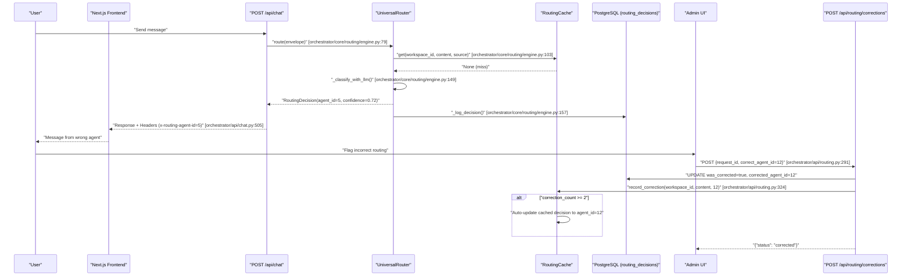
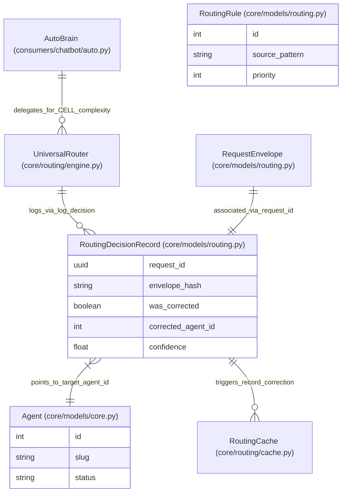

# Routing Corrections & Learning

<details>
<summary>Relevant source files</summary>

The following files were used as context for generating this wiki page:

- [docs/PRDS/58-PROMPT-MANAGEMENT-FUTUREAGI-INTEGRATION.md](docs/PRDS/58-PROMPT-MANAGEMENT-FUTUREAGI-INTEGRATION.md)
- [docs/PRDS/59-WORKFLOW-ENGINE-V2-NEURAL-SWARM-BRIDGE.md](docs/PRDS/59-WORKFLOW-ENGINE-V2-NEURAL-SWARM-BRIDGE.md)
- [docs/PRDS/60-RAG-V3-TOP10-COMPETITIVE-UPGRADE.md](docs/PRDS/60-RAG-V3-TOP10-COMPETITIVE-UPGRADE.md)
- [docs/PRDS/61-NL2SQL-V2-COMPETITIVE-UPGRADE.md](docs/PRDS/61-NL2SQL-V2-COMPETITIVE-UPGRADE.md)
- [docs/PRDS/62-CODEGRAPH-V2-COMPETITIVE-UPGRADE.md](docs/PRDS/62-CODEGRAPH-V2-COMPETITIVE-UPGRADE.md)
- [docs/reviews/COMPOSIO-TOOL-REGRESSION-REVIEW.md](docs/reviews/COMPOSIO-TOOL-REGRESSION-REVIEW.md)
- [frontend/app/tools/callback/page.tsx](frontend/app/tools/callback/page.tsx)
- [frontend/components/composio/app-connection-button.tsx](frontend/components/composio/app-connection-button.tsx)
- [frontend/components/tools/composio-apps-section.tsx](frontend/components/tools/composio-apps-section.tsx)
- [frontend/components/tools/tool-config-modal.tsx](frontend/components/tools/tool-config-modal.tsx)
- [orchestrator/api/chat.py](orchestrator/api/chat.py)
- [orchestrator/api/chat_voice.py](orchestrator/api/chat_voice.py)
- [orchestrator/api/composio.py](orchestrator/api/composio.py)
- [orchestrator/api/routing.py](orchestrator/api/routing.py)
- [orchestrator/consumers/chatbot/auto.py](orchestrator/consumers/chatbot/auto.py)
- [orchestrator/consumers/chatbot/intent_classifier.py](orchestrator/consumers/chatbot/intent_classifier.py)
- [orchestrator/consumers/chatbot/personality.py](orchestrator/consumers/chatbot/personality.py)
- [orchestrator/consumers/chatbot/service.py](orchestrator/consumers/chatbot/service.py)
- [orchestrator/consumers/chatbot/smart_tool_router.py](orchestrator/consumers/chatbot/smart_tool_router.py)
- [orchestrator/core/composio/entity_manager.py](orchestrator/core/composio/entity_manager.py)
- [orchestrator/core/llm/manager.py](orchestrator/core/llm/manager.py)
- [orchestrator/core/routing/engine.py](orchestrator/core/routing/engine.py)
- [orchestrator/modules/orchestrator/service.py](orchestrator/modules/orchestrator/service.py)
- [orchestrator/modules/tools/discovery/actions_analytics_enhanced.py](orchestrator/modules/tools/discovery/actions_analytics_enhanced.py)
- [orchestrator/modules/tools/discovery/handlers_analytics_enhanced.py](orchestrator/modules/tools/discovery/handlers_analytics_enhanced.py)
- [orchestrator/modules/tools/discovery/handlers_search.py](orchestrator/modules/tools/discovery/handlers_search.py)
- [orchestrator/modules/tools/discovery/platform_actions.py](orchestrator/modules/tools/discovery/platform_actions.py)
- [orchestrator/modules/tools/discovery/platform_executor.py](orchestrator/modules/tools/discovery/platform_executor.py)
- [orchestrator/modules/tools/tool_router.py](orchestrator/modules/tools/tool_router.py)
- [orchestrator/scripts/setup_jira_trigger.py](orchestrator/scripts/setup_jira_trigger.py)

</details>


This document describes the feedback loop system that enables the Universal Router to learn from user corrections and improve routing accuracy over time. When the router selects an incorrect agent, users can submit corrections that feed back into the routing cache and decision history, creating a continuous learning mechanism.

For information about the core routing engine and tier strategy, see **10.1 Routing Architecture**. For cache lookup implementation details, see **10.3 Tier 1: Cache Lookup**.

**Sources**: [orchestrator/core/routing/engine.py:1-163](), [orchestrator/api/routing.py:1-343]()

---

## System Overview

The routing corrections system provides three key capabilities:

1.  **Decision Tracking**: Every routing decision is logged to the `routing_decisions` table (represented by the `RoutingDecisionRecord` model) with full context, including request content, source, selected agent, confidence, and reasoning [orchestrator/core/routing/engine.py:857-881]().
2.  **User Corrections**: Admins can flag incorrect routing decisions and specify the correct agent via the `POST /api/routing/corrections` endpoint [orchestrator/api/routing.py:291-343]().
3.  **Cache Learning**: Corrections automatically update the `RoutingCache` after 2+ repeated corrections for the same content pattern, allowing the system to "self-heal" without manual rule intervention [orchestrator/api/routing.py:320-331]().

This creates a feedback loop where routing accuracy improves dynamically based on real-world usage.

**Sources**: [orchestrator/api/routing.py:291-343](), [orchestrator/core/routing/engine.py:56-162]()

---

## Correction Workflow

### High-Level Flow

The following diagram illustrates the lifecycle of a message from initial routing to user correction and subsequent cache update.

**Diagram: Correction Feedback Loop**



**Sources**: [orchestrator/api/routing.py:290-343](), [orchestrator/core/routing/engine.py:77-161](), [orchestrator/api/chat.py:500-510]()

---

## Decision Tracking

### RoutingDecisionRecord Schema

Every routing decision is persisted to the database via the `_log_decision` method in `UniversalRouter`. The `RoutingDecisionRecord` model (defined in `core/models/routing.py`) tracks the following key attributes:

| Column | Type | Purpose |
| :--- | :--- | :--- |
| `request_id` | UUID | Unique identifier linking to the `RequestEnvelope` [orchestrator/core/models/routing.py:34]() |
| `envelope_hash` | String | SHA256 hash of normalized content used for cache keys [orchestrator/core/routing/engine.py:52-55]() |
| `route_type` | String | Type of target: "agent", "workflow", or "orchestrate" [orchestrator/core/routing/engine.py:867]() |
| `agent_id` | Integer | Selected `Agent.id` (nullable if workflow) [orchestrator/core/routing/engine.py:868]() |
| `confidence` | Float | Router confidence score (0.0-1.0) [orchestrator/core/routing/engine.py:870]() |
| `was_corrected` | Boolean | Flag set to True after a user correction [orchestrator/api/routing.py:313]() |
| `corrected_agent_id` | Integer | The `Agent.id` specified by the user as correct [orchestrator/api/routing.py:314]() |

**Sources**: [orchestrator/core/models/routing.py:34-79](), [orchestrator/core/routing/engine.py:857-881]()

---

### Decision Logging Implementation

The `UniversalRouter` class logs every decision via `_log_decision` [orchestrator/core/routing/engine.py:857](). This function captures the `RequestEnvelope` and the resulting `RoutingDecision` before committing them to the database. This data is primarily used by the `list_decisions` endpoint [orchestrator/api/routing.py:110-156]() to populate the Admin UI for review.

**Sources**: [orchestrator/core/routing/engine.py:857-881](), [orchestrator/api/routing.py:110-156]()

---

## Correction Submission API

### POST /api/routing/corrections

Records a user correction for a specific routing decision. This endpoint is defined in `orchestrator/api/routing.py` and follows this logic:

1.  **Lookup**: It fetches the original decision using the `request_id` [orchestrator/api/routing.py:302-306]().
2.  **Update DB**: It updates the `RoutingDecisionRecord` to reflect the correction [orchestrator/api/routing.py:313-315]().
3.  **Update Cache**: It invokes `RoutingCache.record_correction` to increment the internal correction counter for that specific content hash [orchestrator/api/routing.py:324-329]().

**Sources**: [orchestrator/api/routing.py:291-343]()

---

## Cache Learning Mechanism

The `RoutingCache` (accessed via `get_routing_cache()`) implements a learning mechanism based on correction frequency:

1.  **Content Normalization**: Content is lowercased and whitespace is collapsed via `_normalize_content` to ensure consistent hashing [orchestrator/core/routing/cache.py:43]().
2.  **Auto-Update Threshold**: When `record_correction` is called, it increments a counter in Redis. If the counter for a specific content/agent pair reaches a threshold (typically 2), the cache entry for that content is updated to the corrected agent [orchestrator/api/routing.py:320-331]().
3.  **Immediate Effect**: Subsequent requests with the same content hash will hit Tier 1 (Cache) and return the corrected agent immediately, bypassing LLM classification [orchestrator/core/routing/engine.py:103]().

**Sources**: [orchestrator/core/routing/cache.py:1-200](), [orchestrator/api/routing.py:320-331]()

---

## Unrouted Events

When all tiers (Rules, Semantic, and LLM) fail to route a request, the system stores an `UnroutedEvent` [orchestrator/core/models/routing.py:81]().

```python
# [orchestrator/core/routing/engine.py:161-162]
logger.info("[router] No route found for request %s — storing unrouted event", env_hash)
self._store_unrouted_event(envelope, reason="All routing tiers exhausted (including LLM)")
```

The `_store_unrouted_event` method persists the raw content and metadata to PostgreSQL, allowing administrators to identify gaps in the routing logic or missing agent capabilities [orchestrator/core/routing/engine.py:883-900]().

**Sources**: [orchestrator/core/routing/engine.py:161-162](), [orchestrator/core/routing/engine.py:883-900]()

---

## Integration with AutoBrain

The `AutoBrain` complexity assessor (defined in `consumers/chatbot/auto.py`) acts as a pre-filter for the router.

-   **ATOM Complexity**: Simple greetings matched via `_ATOM_PATTERNS` bypass the router entirely and receive direct responses [orchestrator/consumers/chatbot/auto.py:91-113]().
-   **PLATFORM Actions**: Keywords identified in `_PLATFORM_KEYWORDS` (e.g., "list my agents") trigger the `PlatformActionExecutor` directly [orchestrator/consumers/chatbot/auto.py:115-181]().
-   **Routing Integration**: For `MOLECULE` complexity and above, the `UniversalRouter` is invoked to select the best agent for the task [orchestrator/consumers/chatbot/auto.py:59-82]().

**Sources**: [orchestrator/consumers/chatbot/auto.py:1-181](), [orchestrator/modules/tools/discovery/platform_executor.py:164-210]()

---

## Database Schema Relationships

The following diagram bridges the Natural Language concepts to the Code Entity space by associating system names with specific code identifiers.

**Diagram: Routing & Learning Entities**



**Sources**: [orchestrator/core/routing/engine.py:58](), [orchestrator/core/models/routing.py:34-79](), [orchestrator/api/chat.py:48-53](), [orchestrator/consumers/chatbot/auto.py:59]()

---