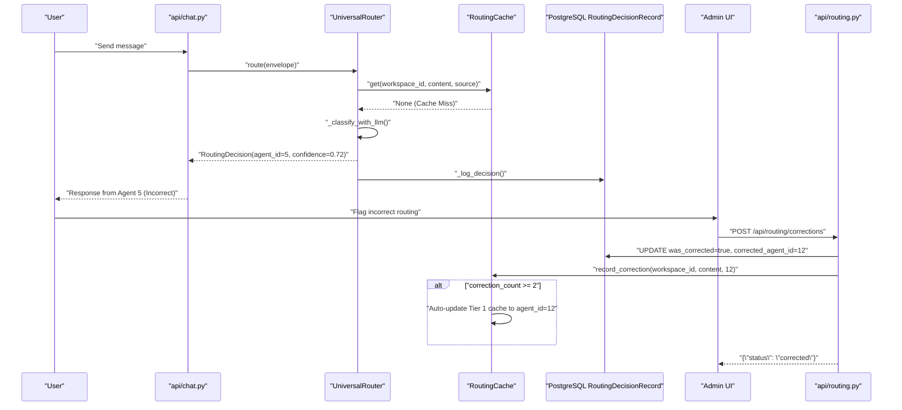
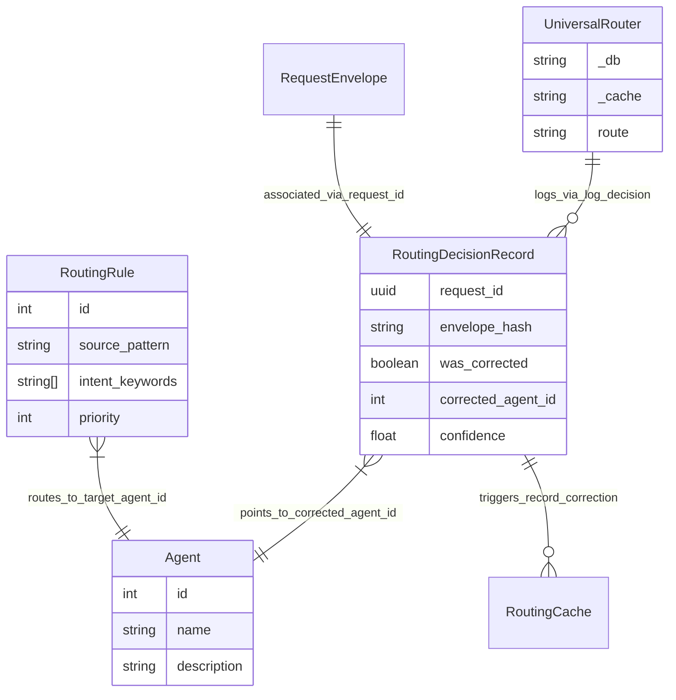

# Routing Corrections & Learning

<details>
<summary>Relevant source files</summary>

The following files were used as context for generating this wiki page:

- [orchestrator/api/chat.py](orchestrator/api/chat.py)
- [orchestrator/api/routing.py](orchestrator/api/routing.py)
- [orchestrator/consumers/chatbot/auto.py](orchestrator/consumers/chatbot/auto.py)
- [orchestrator/consumers/chatbot/service.py](orchestrator/consumers/chatbot/service.py)
- [orchestrator/core/llm/manager.py](orchestrator/core/llm/manager.py)
- [orchestrator/core/routing/engine.py](orchestrator/core/routing/engine.py)
- [orchestrator/modules/agents/factory/agent_factory.py](orchestrator/modules/agents/factory/agent_factory.py)
- [orchestrator/modules/tools/discovery/platform_actions.py](orchestrator/modules/tools/discovery/platform_actions.py)
- [orchestrator/modules/tools/discovery/platform_executor.py](orchestrator/modules/tools/discovery/platform_executor.py)
- [orchestrator/scripts/setup_jira_trigger.py](orchestrator/scripts/setup_jira_trigger.py)
- [orchestrator/services/heartbeat_service.py](orchestrator/services/heartbeat_service.py)
- [orchestrator/services/page_context.py](orchestrator/services/page_context.py)
- [orchestrator/tests/test_prd221_page_context.py](orchestrator/tests/test_prd221_page_context.py)
- [orchestrator/tests/test_prd221_page_prior_tools.py](orchestrator/tests/test_prd221_page_prior_tools.py)

</details>


This page covers the feedback loop system that enables the `UniversalRouter` to learn from user corrections and improve routing accuracy over time [orchestrator/core/routing/engine.py:1-16](). When the router selects an incorrect agent or workflow, users can submit corrections that update the routing cache and decision history, creating a continuous self-healing mechanism [orchestrator/api/routing.py:1-7]().

Sources: [orchestrator/core/routing/engine.py:1-16]() | [orchestrator/api/routing.py:1-7]()

---

## System Overview

The routing corrections system operates across three core architectural pillars:

1. **Decision Tracking**: Every routing evaluation is persisted via `UniversalRouter._log_decision()` to the `routing_decisions` table using the `RoutingDecisionRecord` model [orchestrator/core/routing/engine.py:85-107]().
2. **User Corrections**: Administrative interfaces invoke `POST /api/routing/corrections` via the `CorrectionRequest` schema to flag misroutes and provide target identifiers [orchestrator/api/routing.py:82-86]() [orchestrator/api/routing.py:291-343]().
3. **Cache Auto-Update**: Repeated corrections invoke `RoutingCache.record_correction()` to modify Tier 1 cache entries, allowing the system to bypass expensive downstream classification on identical subsequent inputs [orchestrator/core/routing/cache.py:1-45]() [orchestrator/api/routing.py:320-331]().

Sources: [orchestrator/core/routing/engine.py:58-107]() | [orchestrator/api/routing.py:82-343]()

---

## Correction Workflow

### High-Level Flow

The following sequence diagram traces an end-to-end request from client invocation through router classification, administrative correction, and cache re-indexing.

**Diagram: Correction Feedback Loop**



Sources: [orchestrator/api/routing.py:291-343]() | [orchestrator/core/routing/engine.py:79-163]()

---

## Decision Tracking

### RoutingDecisionRecord Schema

Every decision emitted by `UniversalRouter` is captured in the database via `RoutingDecisionRecord`. The table schema tracks request metadata, routing source, and correction state:

| Column | Type | Purpose |
| :--- | :--- | :--- |
| `request_id` | UUID | Unique identifier linking to the `RequestEnvelope` [orchestrator/core/models/routing.py:34-40]() |
| `envelope_hash` | String | SHA256 hash of normalized content used for cache keys [orchestrator/core/routing/engine.py:52-55]() |
| `route_type` | String | Target category: "agent", "workflow", or "orchestrate" [orchestrator/core/routing/engine.py:857-870]() |
| `agent_id` | Integer | Selected `Agent.id` target (nullable if workflow) [orchestrator/core/routing/engine.py:868]() |
| `confidence` | Float | Router confidence score (0.0 to 1.0) [orchestrator/core/routing/engine.py:870]() |
| `was_corrected` | Boolean | Flag set to `True` upon user correction [orchestrator/api/routing.py:313]() |
| `corrected_agent_id` | Integer | The target `Agent.id` specified by the administrator [orchestrator/api/routing.py:314]() |

Sources: [orchestrator/core/models/routing.py:34-79]() | [orchestrator/core/routing/engine.py:857-881]()

### Decision Logging Implementation

The `UniversalRouter` class logs routing executions via `_log_decision` [orchestrator/core/routing/engine.py:857](). This helper method commits the decision payload to the database. These records are queried by `list_decisions` in `orchestrator/api/routing.py` to populate administrative views [orchestrator/api/routing.py:110-156]().

Sources: [orchestrator/core/routing/engine.py:857-881]() | [orchestrator/api/routing.py:110-156]()

---

## Correction Submission API

### POST /api/routing/corrections

Corrections are submitted through `POST /api/routing/corrections`, which executes the following procedural steps:

1. **Lookup**: Retrieves the target `RoutingDecisionRecord` using the `request_id` supplied in the `CorrectionRequest` payload [orchestrator/api/routing.py:302-306]().
2. **Persistence Update**: Updates the record status, setting `was_corrected=True` and populating `corrected_agent_id` [orchestrator/api/routing.py:313-315]().
3. **Cache Synchronization**: Invokes `RoutingCache.record_correction()` to track frequency counts for the content hash [orchestrator/api/routing.py:324-329]().

Sources: [orchestrator/api/routing.py:81-86]() | [orchestrator/api/routing.py:291-343]()

---

## Cache Learning Mechanism

The `RoutingCache` layer manages reinforcement learning via threshold-based counter adjustments:

1. **Normalization**: Content strings are normalized via `_normalize_content()` (stripping punctuation and lowercasing) to ensure stable hashing [orchestrator/core/routing/cache.py:43]().
2. **Threshold Trigger**: When `record_correction` registers repeated updates for an envelope hash, once the frequency meets the auto-update threshold, the cache overwrites the target mapping [orchestrator/api/routing.py:320-331]().
3. **Bypass Downstream Tiers**: Subsequent messages yielding the same content hash trigger a Tier 1 cache hit in `UniversalRouter.route()`, instantly returning the corrected agent and bypassing semantic similarity and Tier 3 LLM classification [orchestrator/core/routing/engine.py:102-107]().

Sources: [orchestrator/core/routing/cache.py:43]() | [orchestrator/api/routing.py:320-331]() | [orchestrator/core/routing/engine.py:102-107]()

---

## Unrouted Events

When all routing tiers (Rules, Semantic Search, and LLM Fallback) fail to resolve an incoming payload, the router captures an `UnroutedEvent` [orchestrator/core/models/routing.py:81]() [orchestrator/core/routing/engine.py:161-163]().

```python
# [orchestrator/core/routing/engine.py:161-163]
logger.info("[router] No route found for request %s — storing unrouted event", env_hash)
self._store_unrouted_event(envelope, reason="All routing tiers exhausted (including LLM)")
```

Unrouted events are persisted to PostgreSQL to assist platform operators in identifying coverage gaps and missing routing rules or agent capabilities [orchestrator/core/routing/engine.py:883-900]().

Sources: [orchestrator/core/routing/engine.py:161-163]() | [orchestrator/core/routing/engine.py:883-900]()

---

## Database Schema & Code Architecture

The following entity-relationship diagram maps high-level routing concepts to underlying SQLAlchemy models and repository classes.

**Diagram: Routing & Learning Code Entities**



Sources: [orchestrator/core/routing/engine.py:58-85]() | [orchestrator/core/models/routing.py:34-79]() | [orchestrator/core/models/core.py:27-45]() | [orchestrator/api/routing.py:162-185]()

---