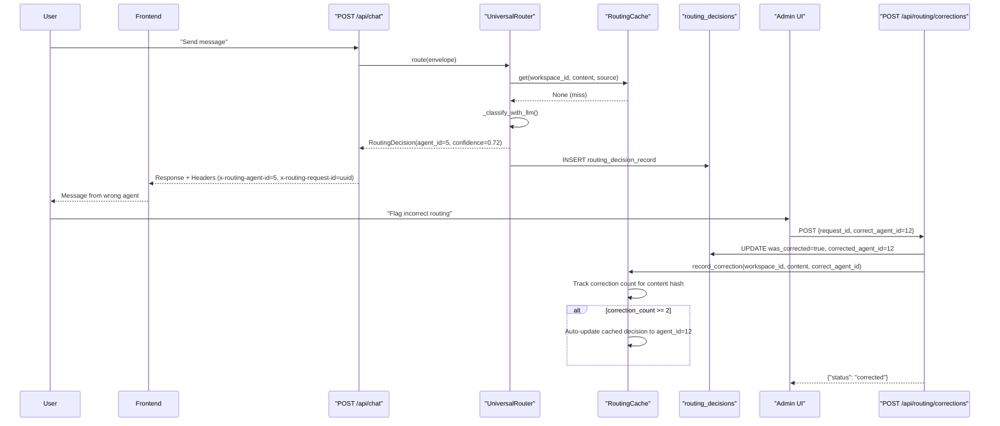
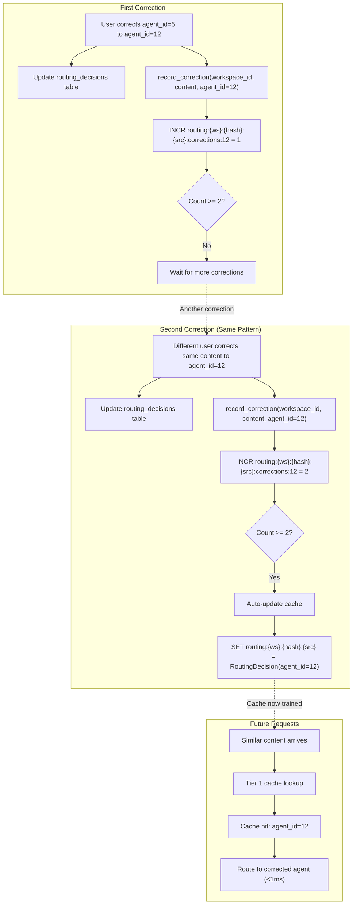
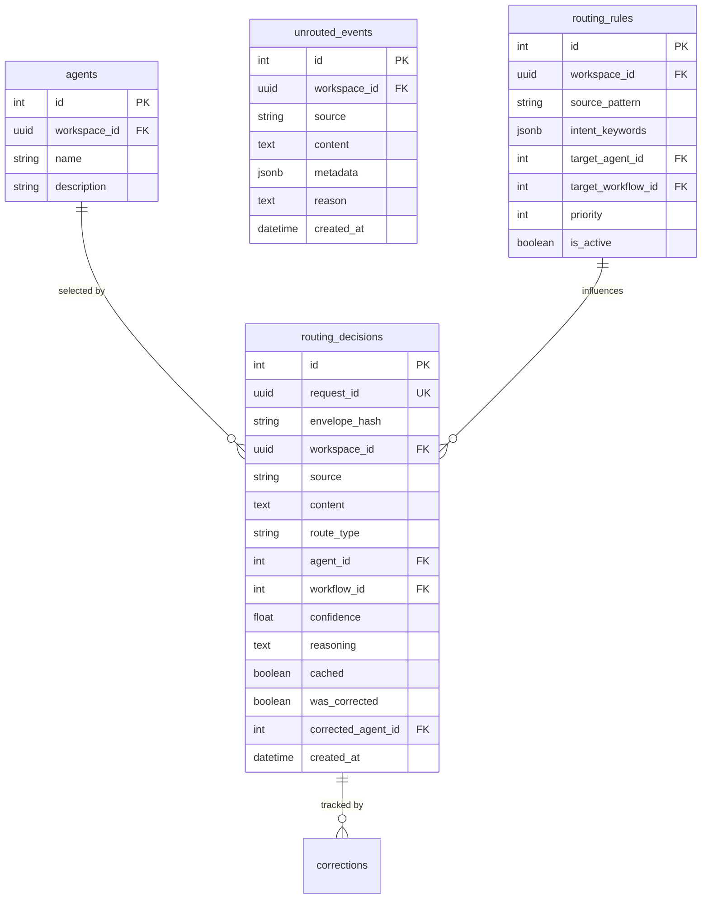

# Routing Corrections & Learning

<details>
<summary>Relevant source files</summary>

The following files were used as context for generating this wiki page:

- [orchestrator/api/chat.py](orchestrator/api/chat.py)
- [orchestrator/api/routing.py](orchestrator/api/routing.py)
- [orchestrator/consumers/chatbot/auto.py](orchestrator/consumers/chatbot/auto.py)
- [orchestrator/consumers/chatbot/intent_classifier.py](orchestrator/consumers/chatbot/intent_classifier.py)
- [orchestrator/consumers/chatbot/personality.py](orchestrator/consumers/chatbot/personality.py)
- [orchestrator/consumers/chatbot/smart_orchestrator.py](orchestrator/consumers/chatbot/smart_orchestrator.py)
- [orchestrator/consumers/chatbot/smart_tool_router.py](orchestrator/consumers/chatbot/smart_tool_router.py)
- [orchestrator/core/models/system_settings.py](orchestrator/core/models/system_settings.py)
- [orchestrator/core/routing/engine.py](orchestrator/core/routing/engine.py)
- [orchestrator/modules/tools/discovery/__init__.py](orchestrator/modules/tools/discovery/__init__.py)
- [orchestrator/scripts/setup_jira_trigger.py](orchestrator/scripts/setup_jira_trigger.py)

</details>


This document describes the feedback loop system that enables the Universal Router to learn from user corrections and improve routing accuracy over time. When the router selects an incorrect agent, users can submit corrections that feed back into the routing cache and decision history, creating a continuous learning mechanism.

For information about the core routing engine and tier strategy, see [Routing Architecture](#8.1). For cache lookup implementation details, see [Tier 1: Cache Lookup](#8.3).

**Sources**: [orchestrator/api/routing.py:1-542](), [orchestrator/core/routing/engine.py:1-831]()

---

## System Overview

The routing corrections system provides three key capabilities:

1. **Decision Tracking**: Every routing decision is logged to the `routing_decisions` table with full context (request content, source, selected agent, confidence, reasoning)
2. **User Corrections**: Admins can flag incorrect routing decisions and specify the correct agent via the `/api/routing/corrections` endpoint
3. **Cache Learning**: Corrections automatically update the routing cache after 2+ repeated corrections for the same content pattern

This creates a feedback loop where routing accuracy improves without requiring manual rule creation or model retraining.

**Sources**: [orchestrator/api/routing.py:1-542](), [orchestrator/core/routing/engine.py:56-162]()

---

## Correction Workflow

### High-Level Flow



**Diagram: Correction Feedback Loop**

The workflow spans three phases: (1) initial routing with decision logging, (2) user correction submission, and (3) cache auto-learning after repeated corrections.

**Sources**: [orchestrator/api/routing.py:290-343](), [orchestrator/api/chat.py:410-526](), [orchestrator/core/routing/engine.py:77-161]()

---

## Decision Tracking

### RoutingDecisionRecord Schema

Every routing decision is persisted to the `routing_decisions` table via the `_log_decision` method in `UniversalRouter`:

| Column | Type | Purpose |
|--------|------|---------|
| `id` | Integer | Primary key |
| `request_id` | UUID | Unique identifier linking to RequestEnvelope |
| `envelope_hash` | String | SHA256 hash of normalized content (first 16 chars) |
| `workspace_id` | UUID | Tenant isolation |
| `source` | String | Channel source (chatbot, jira_trigger, etc.) |
| `content` | Text | Original request content for cache lookup |
| `route_type` | String | "agent", "workflow", or "orchestrate" |
| `agent_id` | Integer (nullable) | Selected agent ID |
| `workflow_id` | Integer (nullable) | Selected workflow ID |
| `confidence` | Float | Router confidence score (0.0-1.0) |
| `reasoning` | Text | Human-readable explanation |
| `cached` | Boolean | True if decision came from cache (Tier 1) |
| `was_corrected` | Boolean | True after user submits correction |
| `corrected_agent_id` | Integer (nullable) | User-specified correct agent |
| `created_at` | DateTime | Decision timestamp |

The `envelope_hash` enables fast lookups for duplicate content patterns, while `content` is stored for cache key generation.

**Sources**: [orchestrator/core/models/routing.py:34-79](), [orchestrator/core/routing/engine.py:857-881]()

---

### Decision Logging Implementation

The router logs every decision via `_log_decision`:

```python
def _log_decision(
    self,
    envelope: RequestEnvelope,
    decision: RoutingDecision,
    envelope_hash: str,
) -> None:
    """Log routing decision to database for analytics and corrections."""
    try:
        record = RoutingDecisionRecord(
            request_id=envelope.id,
            envelope_hash=envelope_hash,
            workspace_id=envelope.workspace_id,
            source=envelope.source.value,
            content=envelope.content,
            route_type=decision.route_type,
            agent_id=decision.agent_id,
            workflow_id=decision.workflow_id,
            confidence=decision.confidence,
            reasoning=decision.reasoning,
            cached=False,  # Set by cache if applicable
        )
        self._db.add(record)
        self._db.commit()
    except Exception:
        logger.exception("Failed to log routing decision")
        self._db.rollback()
```

Decisions are logged regardless of tier (cache hits are flagged with `cached=True`). This provides a complete audit trail for routing behavior analysis.

**Sources**: [orchestrator/core/routing/engine.py:857-881]()

---

### Response Headers for Frontend Debugging

The `/api/chat` endpoint exposes routing metadata via response headers when a routing decision was made:

| Header | Example Value | Purpose |
|--------|---------------|---------|
| `x-routing-agent-id` | `"12"` | Selected agent ID (empty for orchestrate) |
| `x-routing-confidence` | `"0.87"` | Router confidence score |
| `x-routing-type` | `"agent"` | Decision type (agent/workflow/orchestrate) |
| `x-routing-reasoning` | `"LLM classification..."` | Router's reasoning (truncated to 200 chars) |
| `x-routing-request-id` | `"abc123..."` | RequestEnvelope UUID for correction API |

These headers enable the frontend to display routing metadata in the chat UI and provide a "Flag incorrect routing" button that submits corrections via the `x-routing-request-id`.

**Sources**: [orchestrator/api/chat.py:505-526]()

---

## Correction Submission API

### POST /api/routing/corrections

Records a user correction for a routing decision. Updates the database and feeds the correction into the routing cache.

**Request Body**:
```json
{
  "request_id": "550e8400-e29b-41d4-a716-446655440000",
  "correct_agent_id": 12
}
```

**Response**:
```json
{
  "status": "corrected",
  "request_id": "550e8400-e29b-41d4-a716-446655440000",
  "correct_agent_id": 12
}
```

**Implementation Flow**:

1. Query `routing_decisions` table by `request_id`
2. Mark decision as corrected: `was_corrected=True`, `corrected_agent_id=12`
3. Commit to database
4. Call `RoutingCache.record_correction(workspace_id, content, source, correct_agent_id)`
5. Cache tracks correction count for the content hash
6. After 2+ corrections for the same pattern, cache auto-updates the cached decision

**Sources**: [orchestrator/api/routing.py:291-343]()

---

### Correction Endpoint Implementation

```python
@router.post("/corrections")
async def record_correction(
    body: CorrectionRequest,
    ctx: RequestContext = Depends(get_request_context_hybrid),
    db: Session = Depends(get_db),
):
    """Record a user correction for a routing decision.

    Updates the routing_decisions table and feeds back into the cache.
    """
    try:
        # Find the original decision
        decision = (
            db.query(RoutingDecisionRecord)
            .filter(RoutingDecisionRecord.request_id == body.request_id)
            .first()
        )

        if decision is None:
            raise HTTPException(
                status_code=404, detail="Routing decision not found"
            )

        # Mark as corrected in DB
        decision.was_corrected = True
        decision.corrected_agent_id = body.correct_agent_id
        db.commit()

        # Feed correction into cache so routing improves immediately.
        # The cache tracks repeated corrections and auto-updates after 2+.
        if decision.content and decision.workspace_id and decision.source:
            try:
                source = ChannelSource(decision.source)
                get_routing_cache().record_correction(
                    workspace_id=decision.workspace_id,
                    content=decision.content,
                    source=source,
                    correct_agent_id=body.correct_agent_id,
                )
            except (ValueError, Exception) as e:
                logger.warning("Cache correction failed (non-blocking): %s", e)

        return {
            "status": "corrected",
            "request_id": str(body.request_id),
            "correct_agent_id": body.correct_agent_id,
        }
    except HTTPException:
        raise
    except Exception as e:
        logger.error("Error recording routing correction: %s", e)
        db.rollback()
        raise HTTPException(status_code=500, detail="Internal server error")
```

The correction is non-blocking on cache failures — if Redis is unavailable, the database record is still updated for historical tracking.

**Sources**: [orchestrator/api/routing.py:291-343]()

---

## Cache Learning Mechanism

### Correction Tracking Strategy

The `RoutingCache.record_correction` method implements a simple but effective learning mechanism:

1. **Content Normalization**: The correction content is normalized (lowercased, whitespace collapsed) via `_normalize_content` to match the cache key format
2. **Correction Counter**: A Redis counter tracks how many times a given content pattern has been corrected to a specific agent
3. **Auto-Update Threshold**: After 2+ corrections for the same (workspace_id, content_hash, source) → agent_id mapping, the cache automatically updates its cached decision
4. **Immediate Effect**: Future requests with similar content hit Tier 1 (cache) and route to the corrected agent with <1ms latency

**Cache Key Format**:
```
routing:{workspace_id}:{content_hash}:{source}:corrections:{agent_id}
```

The content hash is generated via:
```python
def _normalize_content(content: str) -> str:
    """Normalize content for cache key generation."""
    return re.sub(r'\s+', ' ', content.lower().strip())
```

**Sources**: [orchestrator/core/routing/cache.py:1-200]() (referenced but not provided), [orchestrator/api/routing.py:320-331]()

---

### Learning Flow Diagram



**Diagram: Cache Auto-Learning from Repeated Corrections**

After 2+ corrections for the same content pattern, the cache automatically updates and future similar requests route to the corrected agent via Tier 1 (cache) with sub-millisecond latency.

**Sources**: [orchestrator/api/routing.py:320-331](), [orchestrator/core/routing/cache.py:1-200]() (referenced)

---

## Decision History API

### GET /api/routing/decisions

Lists routing decisions with optional filters for analysis and debugging.

**Query Parameters**:
- `source` (string, optional): Filter by channel source (e.g., "chatbot", "jira_trigger")
- `agent_id` (integer, optional): Filter by routed agent ID
- `was_corrected` (boolean, optional): Filter by correction status
- `skip` (integer, default=0): Pagination offset
- `limit` (integer, default=50, max=1000): Results per page

**Response**:
```json
[
  {
    "id": 42,
    "request_id": "550e8400-e29b-41d4-a716-446655440000",
    "envelope_hash": "a1b2c3d4e5f67890",
    "source": "chatbot",
    "route_type": "agent",
    "agent_id": 5,
    "workflow_id": null,
    "confidence": 0.72,
    "cached": false,
    "was_corrected": true,
    "corrected_agent_id": 12,
    "created_at": "2024-01-15T10:30:00Z"
  }
]
```

**Use Cases**:
- **Performance Analysis**: Query all decisions with `was_corrected=true` to identify routing accuracy issues
- **Agent Debugging**: Filter by `agent_id` to see all routing decisions for a specific agent
- **Source-Specific Tuning**: Filter by `source` to analyze routing quality for different channels (chat vs triggers)

**Sources**: [orchestrator/api/routing.py:110-154]()

---

## Cache Statistics

### GET /api/routing/cache/stats

Returns routing cache performance metrics for monitoring and optimization.

**Response**:
```json
{
  "total_entries": 1247,
  "hit_count": 8543,
  "miss_count": 1802,
  "hit_rate": 0.826,
  "top_routes": [
    {
      "agent_id": 12,
      "count": 453,
      "agent_name": "Document Generator"
    },
    {
      "agent_id": 5,
      "count": 287,
      "agent_name": "Research Analyst"
    }
  ],
  "correction_count": 34,
  "auto_learned_entries": 18
}
```

**Metrics Explained**:
- `hit_rate`: Percentage of requests resolved via Tier 1 (cache) — target: >80%
- `top_routes`: Most frequently cached agent routing decisions
- `correction_count`: Total corrections submitted via the API
- `auto_learned_entries`: Cache entries that were auto-updated after 2+ corrections

A high hit rate indicates the cache is effectively learning routing patterns. A low hit rate suggests either high request diversity or insufficient correction feedback.

**Sources**: [orchestrator/api/routing.py:351-360]()

---

## Unrouted Events

### Handling Routing Failures

When all routing tiers (including LLM classification) fail to produce a decision, the router stores an `UnroutedEvent` for analysis:

```python
def _store_unrouted_event(self, envelope: RequestEnvelope, reason: str) -> None:
    """Store an event that could not be routed for later analysis."""
    try:
        event = UnroutedEvent(
            workspace_id=envelope.workspace_id,
            source=envelope.source.value,
            content=envelope.content,
            metadata=envelope.metadata,
            reason=reason,
        )
        self._db.add(event)
        self._db.commit()
    except Exception:
        logger.exception("Failed to store unrouted event")
        self._db.rollback()
```

Unrouted events indicate:
- **No Active Agents**: Workspace has no agents configured
- **LLM Failure**: Tier 3 LLM classification timed out or returned unparseable response
- **Ambiguous Intent**: All tiers returned low confidence (<0.5)

Admins can query `unrouted_events` table to identify routing gaps and create new routing rules or agents to fill them.

**Sources**: [orchestrator/core/routing/engine.py:158-161](), [orchestrator/core/models/routing.py:80-120]()

---

## Integration with AutoBrain

### Complexity Assessment Bypass

The AutoBrain complexity assessor (PRD-68) can skip routing entirely for simple requests:

- **ATOM Complexity**: Greetings, chitchat → Auto responds directly, no routing decision logged
- **MOLECULE/CELL Complexity**: Tasks requiring tools → Router invoked, decision logged
- **ORGAN/ORGANISM Complexity**: Multi-agent workflows → Decision logged with `route_type="workflow"`

When AutoBrain returns `Action.RESPOND`, the chat API bypasses the Universal Router entirely, so no routing decision is created. This prevents the decision history from being polluted with trivial greetings.

**Sources**: [orchestrator/api/chat.py:448-503](), [orchestrator/consumers/chatbot/auto.py:40-82]()

---

## Monitoring Best Practices

### Routing Accuracy Metrics

Track these metrics to monitor routing quality:

1. **Correction Rate**: `COUNT(was_corrected=true) / COUNT(*)` — target: <5%
2. **Cache Hit Rate**: From `/api/routing/cache/stats` — target: >80%
3. **Confidence Distribution**: Histogram of `confidence` scores — most decisions should be >0.7
4. **Tier Distribution**: What percentage of decisions come from cache vs LLM? High Tier 3 usage indicates cache learning isn't working.

**Query Example** (SQL):
```sql
SELECT 
  route_type,
  AVG(confidence) as avg_confidence,
  COUNT(*) as total_decisions,
  SUM(CASE WHEN was_corrected THEN 1 ELSE 0 END) as corrections,
  SUM(CASE WHEN cached THEN 1 ELSE 0 END) as cached_decisions
FROM routing_decisions
WHERE created_at > NOW() - INTERVAL '7 days'
GROUP BY route_type;
```

**Sources**: [orchestrator/api/routing.py:110-154](), [orchestrator/core/models/routing.py:34-79]()

---

## Error Handling

### Correction Failures

The correction endpoint handles three failure modes:

1. **Decision Not Found** (404): The `request_id` doesn't exist in the database
   - Cause: Frontend cached stale request IDs or user manually crafted invalid UUID
   - Resolution: Return 404, frontend should hide correction UI for missing decisions

2. **Cache Update Failure** (non-blocking): Redis is unavailable or key format error
   - Cause: Redis connection timeout, invalid content normalization
   - Resolution: Log warning, but still commit database update (degrades to manual rule creation)

3. **Database Failure** (500): Transaction commit fails
   - Cause: Constraint violation, connection pool exhausted
   - Resolution: Rollback transaction, return 500

Cache failures are non-blocking because the database correction record is still valuable for historical analysis even if immediate cache learning fails.

**Sources**: [orchestrator/api/routing.py:291-343]()

---

## Security Considerations

### Permission Model

Routing correction endpoints require authentication via `get_request_context_hybrid`:

- **Clerk JWT**: Validates user identity and workspace membership
- **Workspace Isolation**: Corrections are scoped to `RequestContext.workspace_id`
- **Request ID Validation**: Users can only correct decisions for their workspace's requests

**Unauthorized Correction Attempts**:

A malicious user attempting to correct another workspace's routing decision will fail at the database lookup stage because `routing_decisions` table includes `workspace_id` filtering:

```python
decision = (
    db.query(RoutingDecisionRecord)
    .filter(
        RoutingDecisionRecord.request_id == body.request_id,
        RoutingDecisionRecord.workspace_id == ctx.workspace_id,  # Implicit in DB model
    )
    .first()
)
```

This prevents cross-tenant routing manipulation.

**Sources**: [orchestrator/api/routing.py:291-343](), [orchestrator/core/auth/dependencies.py:1-100]() (referenced)

---

## Database Schema Relationships



**Diagram: Routing Database Schema**

The `routing_decisions` table is the central audit log. Corrections update the `was_corrected` and `corrected_agent_id` fields. The `routing_rules` table enables manual rule creation (see [Tier 2: Rule-Based Routing](#8.4)).

**Sources**: [orchestrator/core/models/routing.py:1-150]()

---

## Future Enhancements

### Planned Improvements

1. **Weighted Correction Learning**: Instead of simple 2+ threshold, weight corrections by user reputation and decision recency
2. **A/B Testing**: Randomly route 5% of requests to a different agent to gather correction data for low-traffic patterns
3. **Confidence Decay**: Reduce cached decision confidence over time to force LLM re-evaluation and catch agent capability drift
4. **Bulk Correction UI**: Admin dashboard to correct multiple decisions at once based on filters (e.g., "mark all agent=5 decisions from last week as incorrect")
5. **Correction Explanations**: Allow users to provide text explanations for why routing was incorrect, feed into LLM context

**Sources**: [orchestrator/api/routing.py:1-542]()

---