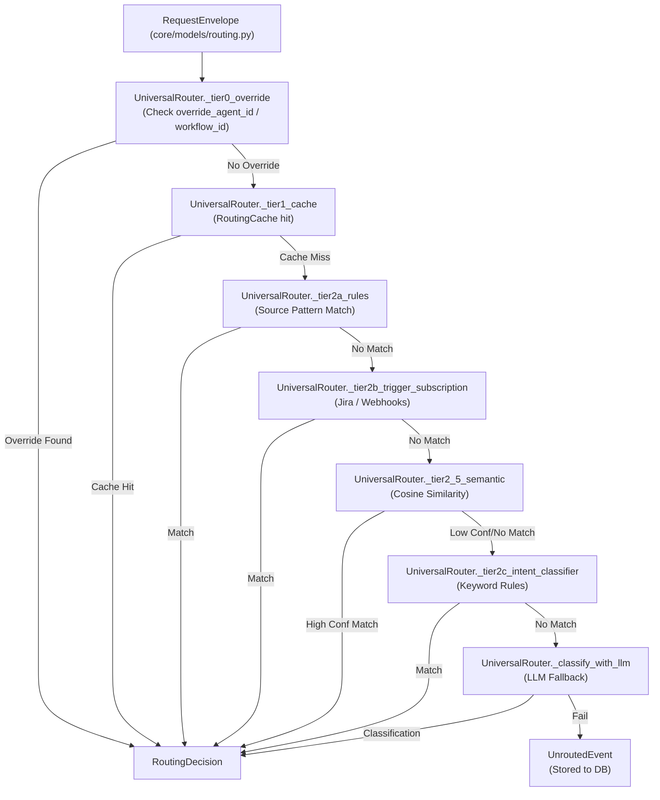
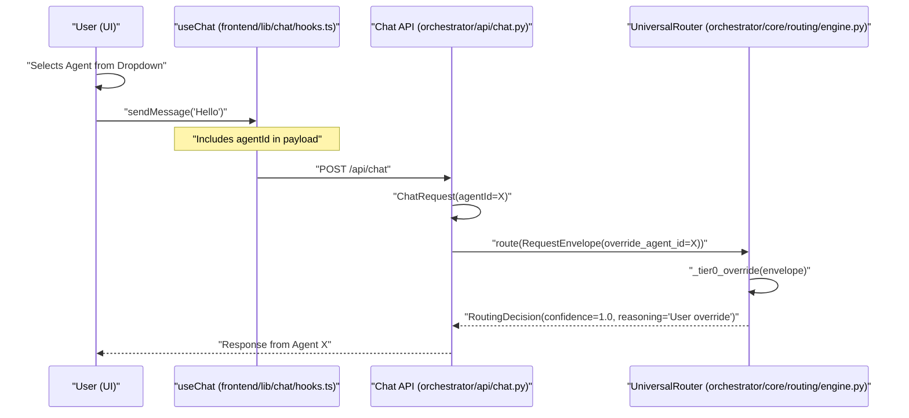
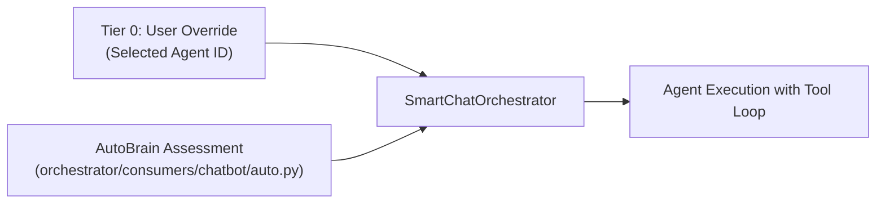

# Tier 0: User Overrides

<details>
<summary>Relevant source files</summary>

The following files were used as context for generating this wiki page:

- [orchestrator/api/chat.py](orchestrator/api/chat.py)
- [orchestrator/api/routing.py](orchestrator/api/routing.py)
- [orchestrator/consumers/chatbot/auto.py](orchestrator/consumers/chatbot/auto.py)
- [orchestrator/consumers/chatbot/service.py](orchestrator/consumers/chatbot/service.py)
- [orchestrator/core/llm/manager.py](orchestrator/core/llm/manager.py)
- [orchestrator/core/routing/engine.py](orchestrator/core/routing/engine.py)
- [orchestrator/modules/agents/factory/agent_factory.py](orchestrator/modules/agents/factory/agent_factory.py)
- [orchestrator/modules/tools/discovery/platform_actions.py](orchestrator/modules/tools/discovery/platform_actions.py)
- [orchestrator/modules/tools/discovery/platform_executor.py](orchestrator/modules/tools/discovery/platform_executor.py)
- [orchestrator/scripts/setup_jira_trigger.py](orchestrator/scripts/setup_jira_trigger.py)
- [orchestrator/services/heartbeat_service.py](orchestrator/services/heartbeat_service.py)
- [orchestrator/services/page_context.py](orchestrator/services/page_context.py)
- [orchestrator/tests/test_prd221_page_context.py](orchestrator/tests/test_prd221_page_context.py)
- [orchestrator/tests/test_prd221_page_prior_tools.py](orchestrator/tests/test_prd221_page_prior_tools.py)

</details>


## Purpose and Scope

Tier 0 is the highest-priority evaluation tier within the **Universal Router**, designed to handle explicit user overrides where a specific agent or workflow ID is directly provided by the client interface or API request. When an override is present, Tier 0 short-circuits the entire routing evaluation chain, bypassing cache lookups, routing rules, semantic similarity matching, intent classification, and fallback LLM steps. It immediately returns a `RoutingDecision` targeting the specified resource with a confidence score of `1.0`.

This mechanism guarantees that intentional user selections—such as picking a specific agent from the UI dropdown or triggering a specific workflow run—are honored deterministically without interference from autonomous heuristic or model-based routing logic.

Sources: [orchestrator/core/routing/engine.py:7-16](), [orchestrator/core/routing/engine.py:58-74](), [orchestrator/core/routing/engine.py:95-101]()

---

## Routing Priority Hierarchy

The `UniversalRouter` evaluates incoming requests through a tiered strategy. Tier 0 sits at the very top of this hierarchy within the `UniversalRouter.route()` execution path.

### Logic Flow Diagram



Sources: [orchestrator/core/routing/engine.py:79-163]()

---

## Core Implementation

### RequestEnvelope and Overrides
The routing input is encapsulated within a `RequestEnvelope` data model, which defines the parameters available to all routing tiers. Overrides are supplied via `override_agent_id` or `override_workflow_id`.

| Field | Type | Description |
|-------|------|-------------|
| `override_agent_id` | `Optional[int]` | Explicit database identifier of the target `Agent`. |
| `override_workflow_id` | `Optional[int]` | Explicit database identifier of the target workflow/recipe. |

Sources: [orchestrator/core/routing/engine.py:169-184](), [orchestrator/core/models/routing.py:35-42]()

### The `_tier0_override` Function
The method `_tier0_override` inspects the `RequestEnvelope`. If either override property is populated, it constructs and returns a `RoutingDecision` instance setting `confidence=1.0`.

```python
def _tier0_override(self, envelope: RequestEnvelope) -> Optional[RoutingDecision]:
    if envelope.override_agent_id is not None:
        return RoutingDecision(
            route_type="agent",
            agent_id=envelope.override_agent_id,
            confidence=1.0,
            reasoning="User override",
        )
    if envelope.override_workflow_id is not None:
        return RoutingDecision(
            route_type="workflow",
            workflow_id=envelope.override_workflow_id,
            confidence=1.0,
            reasoning="User override",
        )
    return None
```

Sources: [orchestrator/core/routing/engine.py:169-184]()

---

## Data Flow: From UI to Routing Decision

This sequence diagram bridges the Natural Language and UI Interaction Space to the backend Code Entity Space during a manual override execution.



Sources: [orchestrator/core/routing/engine.py:95-101](), [orchestrator/core/routing/engine.py:170-184](), [orchestrator/api/chat.py:55-66]()

---

## Use Cases and Triggers

### 1. Manual Agent Selection
In the chat interface, when an end-user explicitly picks an agent from the model or agent selector component, the `agentId` field is included in the incoming `ChatRequest`. The endpoint handler in `orchestrator/api/chat.py` maps this parameter directly to `override_agent_id` within the constructed `RequestEnvelope`.

### 2. Workflow Playbook Triggers
When a user initiates execution via a dedicated "Run" or "Execute" button on a workflow or recipe view, the client supplies the `workflow_id`, which maps to `override_workflow_id`. This forces execution of the exact requested recipe without invoking semantic or LLM-based routing logic.

### 3. Default Workspace Agent Fallback
If no explicit agent override is passed in the payload, the chat service resolves a default agent for the current workspace using `get_default_agent_id()`, typically pointing to the workspace's designated `Auto` system agent instance (e.g., `auto-{workspace_id}`).

Sources: [orchestrator/core/routing/engine.py:170-184](), [orchestrator/api/chat.py:55-71](), [orchestrator/api/chat.py:134-173]()

---

## Observability and Logging

Every routing decision made by Tier 0 is logged into the `routing_decisions` table via the `_log_decision` helper method inside `UniversalRouter`. This ensures full traceability between manual user overrides and automated routing actions.

| Field | Tier 0 Value | Code Reference |
|-------|--------------|----------------|
| `route_type` | `"agent"` or `"workflow"` | [orchestrator/core/routing/engine.py:172-179]() |
| `confidence` | `1.0` | [orchestrator/core/routing/engine.py:174-181]() |
| `reasoning` | `"User override"` | [orchestrator/core/routing/engine.py:175-182]() |
| `cached` | `False` | [orchestrator/core/routing/engine.py:102-107]() |

Recorded routing decisions can be inspected programmatically via the administrative endpoint `GET /api/routing/decisions`.

Sources: [orchestrator/core/routing/engine.py:169-184](), [orchestrator/api/routing.py:111-155]()

---

## Complexity Assessment Integration

Even when a Tier 0 user override dictates the routing target, the underlying session orchestrator may still invoke the `AutoBrain` progressive complexity assessor to evaluate task depth (e.g., distinguishing between `ATOM` and `ORGANISM` tiers). This assessment determines whether memory injection and specific tool hints are needed for the selected agent execution loop.



Sources: [orchestrator/consumers/chatbot/auto.py:47-89](), [orchestrator/api/chat.py:19-24]()

---