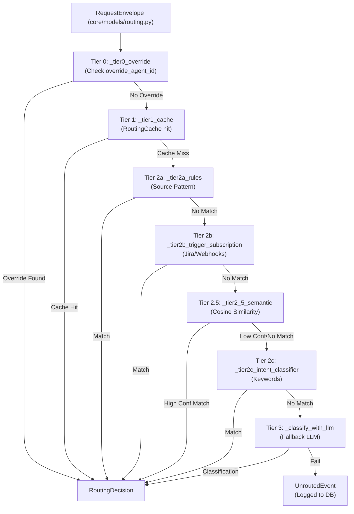
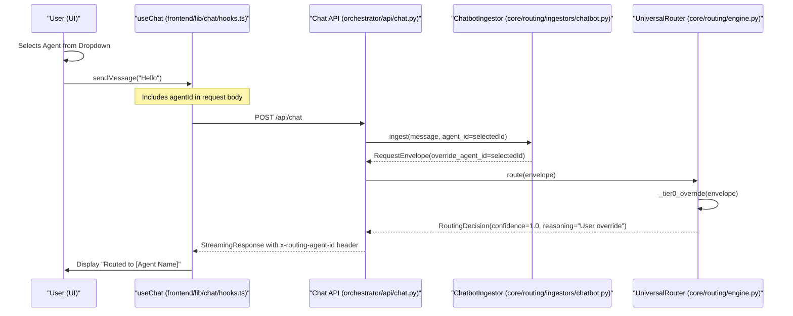
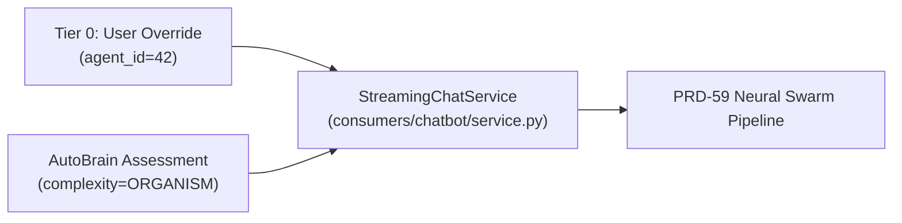

# Tier 0: User Overrides

<details>
<summary>Relevant source files</summary>

The following files were used as context for generating this wiki page:

- [docs/reviews/COMPOSIO-TOOL-REGRESSION-REVIEW.md](docs/reviews/COMPOSIO-TOOL-REGRESSION-REVIEW.md)
- [orchestrator/api/chat.py](orchestrator/api/chat.py)
- [orchestrator/api/chat_voice.py](orchestrator/api/chat_voice.py)
- [orchestrator/consumers/chatbot/auto.py](orchestrator/consumers/chatbot/auto.py)
- [orchestrator/consumers/chatbot/intent_classifier.py](orchestrator/consumers/chatbot/intent_classifier.py)
- [orchestrator/consumers/chatbot/personality.py](orchestrator/consumers/chatbot/personality.py)
- [orchestrator/consumers/chatbot/service.py](orchestrator/consumers/chatbot/service.py)
- [orchestrator/consumers/chatbot/smart_tool_router.py](orchestrator/consumers/chatbot/smart_tool_router.py)
- [orchestrator/core/llm/manager.py](orchestrator/core/llm/manager.py)
- [orchestrator/core/routing/engine.py](orchestrator/core/routing/engine.py)
- [orchestrator/modules/orchestrator/service.py](orchestrator/modules/orchestrator/service.py)
- [orchestrator/modules/tools/discovery/actions_analytics_enhanced.py](orchestrator/modules/tools/discovery/actions_analytics_enhanced.py)
- [orchestrator/modules/tools/discovery/handlers_analytics_enhanced.py](orchestrator/modules/tools/discovery/handlers_analytics_enhanced.py)
- [orchestrator/modules/tools/discovery/handlers_search.py](orchestrator/modules/tools/discovery/handlers_search.py)
- [orchestrator/modules/tools/discovery/platform_actions.py](orchestrator/modules/tools/discovery/platform_actions.py)
- [orchestrator/modules/tools/discovery/platform_executor.py](orchestrator/modules/tools/discovery/platform_executor.py)
- [orchestrator/modules/tools/tool_router.py](orchestrator/modules/tools/tool_router.py)

</details>


## Purpose and Scope

Tier 0 is the highest-priority routing mechanism in the **Universal Router**, allowing explicit specification of which agent or workflow should handle a request. When an override is provided (typically via the UI or a specific API parameter), the router bypasses all intelligent routing logic—including cache lookups, rule matching, semantic similarity, and LLM classification—and immediately routes to the specified target with a confidence of 1.0.

This tier ensures that user intent (e.g., selecting a specific agent from a dropdown or clicking a "Run Workflow" button) is respected without interference from the autonomous routing logic or complexity assessment.

**Sources**: [orchestrator/core/routing/engine.py:1-16](), [orchestrator/core/routing/engine.py:58-74](), [orchestrator/core/routing/engine.py:95-101]()

---

## Routing Priority Hierarchy

The `UniversalRouter` evaluates routing decisions in a strict 7-tier hierarchy. Tier 0 is the first check performed in the `route()` method and short-circuits the entire chain.

### Logic Flow Diagram
This diagram shows how `UniversalRouter.route` processes the `RequestEnvelope` and hits the Tier 0 override check first.



**Sources**: [orchestrator/core/routing/engine.py:79-163]()

---

## Core Implementation

### RequestEnvelope and Overrides
The routing process begins when an external consumer constructs a `RequestEnvelope`. This object contains the optional fields `override_agent_id` and `override_workflow_id`. These fields are populated during the ingestion phase (e.g., via `ChatbotIngestor`).

| Field | Type | Description |
|-------|------|-------------|
| `override_agent_id` | `Optional[int]` | Explicit ID of the agent to handle the request. |
| `override_workflow_id` | `Optional[int]` | Explicit ID of the workflow/recipe to trigger. |

**Sources**: [orchestrator/core/routing/engine.py:170-184](), [orchestrator/core/routing/engine.py:35-42](), [orchestrator/core/routing/ingestors/chatbot.py:1-30]()

### The `_tier0_override` Function
The implementation is a lightweight check within the `UniversalRouter` class. It returns a `RoutingDecision` immediately if either override is present, setting `confidence` to `1.0`.

```python
def _tier0_override(self, envelope: RequestEnvelope) -> Optional[RoutingDecision]:
    if envelope.override_agent_id is not None:
        return RoutingDecision(
            route_type="agent",
            agent_id=envelope.override_agent_id,
            confidence=1.0,
            reasoning="User override",
        )
    if envelope.override_workflow_id is not None:
        return RoutingDecision(
            route_type="workflow",
            workflow_id=envelope.override_workflow_id,
            confidence=1.0,
            reasoning="User override",
        )
    return None
```

**Sources**: [orchestrator/core/routing/engine.py:169-184]()

---

## Data Flow: From UI to Routing Decision

This diagram bridges the "Natural Language Space" (User interaction) to the "Code Entity Space" (API and Router).



**Sources**: [orchestrator/core/routing/engine.py:95-101](), [orchestrator/core/routing/engine.py:170-184](), [orchestrator/api/chat.py:63-120]()

---

## Use Cases and Triggers

### 1. Manual Agent Selection
In the chat interface, if a user specifically selects an agent from the model/agent picker, the `agentId` is passed in the request body. The `ChatbotIngestor` maps this to `override_agent_id` in the `RequestEnvelope`.

### 2. Workflow Bridge
When a message is identified as requiring an `ORGAN` or `ORGANISM` complexity level, the system may trigger a `_stream_workflow_bridge`. If the user manually triggers a specific workflow ID, Tier 0 ensures that the `WorkflowExecution` is tied to the correct `Workflow` model.

### 3. Voice Chat Overrides
In the `voice_chat` endpoint (`POST /api/chat/voice`), an `agent_id` can be provided as a form parameter. If present, the `_collect_streaming_response` logic respects this `effective_agent_id`, bypassing the `AutoBrain` assessment for routing purposes.

**Sources**: [orchestrator/core/routing/engine.py:170-184](), [orchestrator/api/chat.py:70-140](), [orchestrator/api/chat_voice.py:150-180]()

---

## Observability and Logging

Every Tier 0 decision is logged to the `routing_decisions` table via the `_log_decision` helper. This allows admins to audit how often users are manually overriding the autonomous routing logic through the `RoutingDecisionRecord` model.

| Field | Tier 0 Value | Code Reference |
|-------|--------------|----------------|
| `route_type` | `"agent"` or `"workflow"` | [orchestrator/core/routing/engine.py:172-179]() |
| `confidence` | `1.0` | [orchestrator/core/routing/engine.py:174-181]() |
| `reasoning` | `"User override"` | [orchestrator/core/routing/engine.py:175-182]() |

**Sources**: [orchestrator/core/routing/engine.py:95-101](), [orchestrator/core/models/routing.py:35-45]()

---

## Comparison with Complexity Assessment (AutoBrain)

While Tier 0 overrides the *routing* (which agent/workflow is picked), the system still performs a complexity assessment via `AutoBrain` (PRD-68) if the override is not present or if the orchestrator needs to decide on the execution mode (e.g., `ATOM` vs `ORGANISM`). 

In `api/chat_voice.py`, if an `agent_id` is provided, `AutoBrain` is bypassed for the selection of the `effective_agent_id`, but the `complexity_assessment` may still be used to determine if certain tool loops or memory strategies are required.



**Sources**: [orchestrator/consumers/chatbot/auto.py:1-22](), [orchestrator/core/routing/engine.py:169-184](), [orchestrator/api/chat_voice.py:76-121]()

---