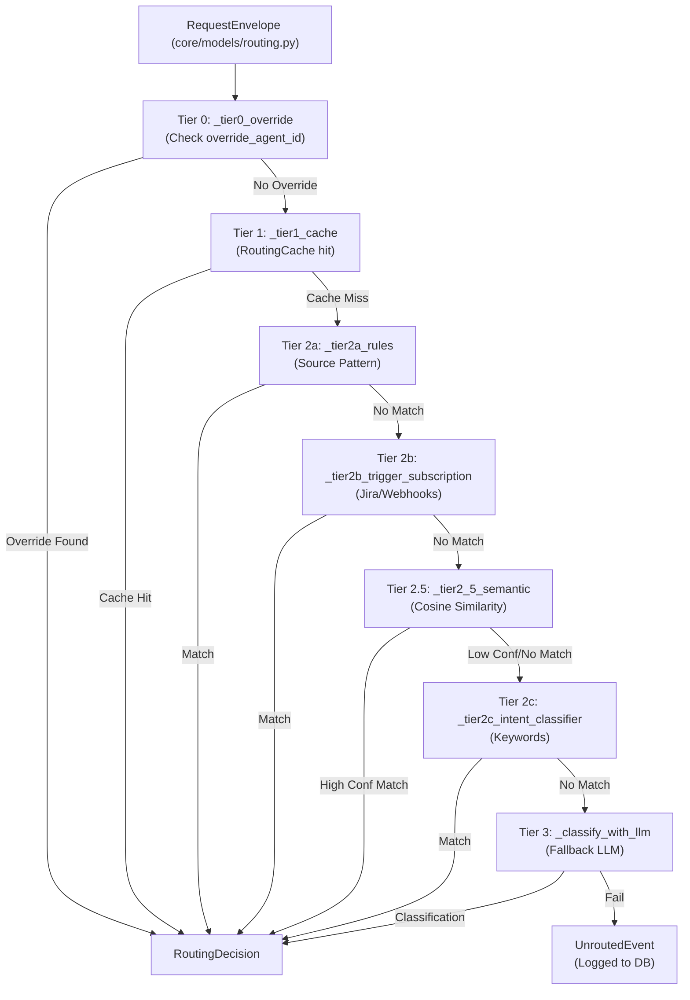
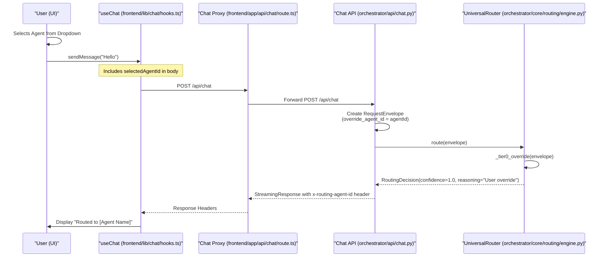
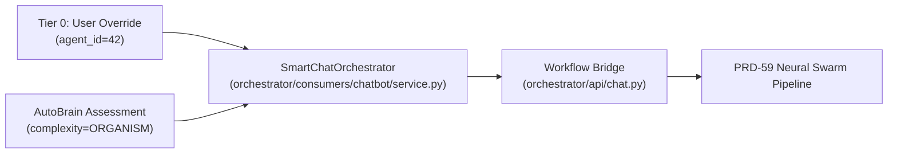

# Tier 0: User Overrides

<details>
<summary>Relevant source files</summary>

The following files were used as context for generating this wiki page:

- [orchestrator/api/routing.py](orchestrator/api/routing.py)
- [orchestrator/core/routing/engine.py](orchestrator/core/routing/engine.py)
- [orchestrator/modules/context/sections/tools.py](orchestrator/modules/context/sections/tools.py)
- [orchestrator/modules/tools/discovery/action_registry.py](orchestrator/modules/tools/discovery/action_registry.py)
- [orchestrator/modules/tools/discovery/handlers_search.py](orchestrator/modules/tools/discovery/handlers_search.py)
- [orchestrator/modules/tools/tool_router.py](orchestrator/modules/tools/tool_router.py)
- [orchestrator/scripts/setup_jira_trigger.py](orchestrator/scripts/setup_jira_trigger.py)
- [orchestrator/tests/test_action_registry_filtered.py](orchestrator/tests/test_action_registry_filtered.py)
- [orchestrator/tests/test_tool_router_semantic.py](orchestrator/tests/test_tool_router_semantic.py)

</details>


## Purpose and Scope

Tier 0 is the highest-priority routing mechanism in the **Universal Router**, allowing explicit specification of which agent or workflow should handle a request. When an override is provided (typically via the UI or a specific API parameter), the router bypasses all intelligent routing logic—including cache lookups, rule matching, and LLM classification—and immediately routes to the specified target with a confidence of 1.0.

This tier ensures that user intent (e.g., selecting a specific agent from a dropdown or clicking a "Run Workflow" button) is respected without interference from the autonomous routing logic or complexity assessment.

**Sources**: [orchestrator/core/routing/engine.py:1-16](), [orchestrator/core/routing/engine.py:58-74](), [orchestrator/core/routing/engine.py:95-101]()

---

## Routing Priority Hierarchy

The `UniversalRouter` evaluates routing decisions in a strict 7-tier hierarchy. Tier 0 is the first check performed in the `route()` method and short-circuits the entire chain.

### Logic Flow Diagram
This diagram shows how `UniversalRouter.route` processes the `RequestEnvelope` and hits the Tier 0 override check first.



**Sources**: [orchestrator/core/routing/engine.py:79-163]()

---

## Core Implementation

### RequestEnvelope and Overrides
The routing process begins when an external consumer constructs a `RequestEnvelope`. This object contains the optional fields `override_agent_id` and `override_workflow_id`.

| Field | Type | Description |
|-------|------|-------------|
| `override_agent_id` | `Optional[int]` | Explicit ID of the agent to handle the request. |
| `override_workflow_id` | `Optional[int]` | Explicit ID of the workflow/recipe to trigger. |

**Sources**: [orchestrator/core/routing/engine.py:170-184](), [orchestrator/core/models/routing.py:1-50]()

### The `_tier0_override` Function
The implementation is a lightweight check within the `UniversalRouter` class defined in `core/routing/engine.py`. It returns a `RoutingDecision` immediately if either override is present, setting `confidence` to `1.0`.

```python
def _tier0_override(self, envelope: RequestEnvelope) -> Optional[RoutingDecision]:
    if envelope.override_agent_id is not None:
        return RoutingDecision(
            route_type="agent",
            agent_id=envelope.override_agent_id,
            confidence=1.0,
            reasoning="User override",
        )
    if envelope.override_workflow_id is not None:
        return RoutingDecision(
            route_type="workflow",
            workflow_id=envelope.override_workflow_id,
            confidence=1.0,
            reasoning="User override",
        )
    return None
```

**Sources**: [orchestrator/core/routing/engine.py:169-184]()

---

## Data Flow: From UI to Routing Decision

This diagram bridges the "Natural Language Space" (User interaction) to the "Code Entity Space" (API and Router).



**Sources**: [orchestrator/core/routing/engine.py:95-101](), [orchestrator/core/routing/engine.py:170-184](), [orchestrator/api/chat.py:1-25]()

---

## Use Cases and Triggers

### 1. Manual Agent Selection
In the chat interface, if a user specifically selects an agent from the model/agent picker, the `agentId` is passed in the request body. The API layer in `orchestrator/api/chat.py` maps this to `override_agent_id` in the `RequestEnvelope`.

### 2. Workflow Buttons
When a user clicks a "Run" button on a specific Recipe page or via a Marketplace install, the `override_workflow_id` is populated to ensure the correct sequence executes, bypassing the `IntentClassifier` and keyword matching.

### 3. System Agent Routing
Certain system-level messages (like those involving `AutoBrain` assessment or platform-level maintenance) may bypass standard routing to ensure stability. For example, specific internal triggers might force a route to a maintenance agent or the `auto-cto` agent.

**Sources**: [orchestrator/core/routing/engine.py:170-184](), [orchestrator/api/chat.py:38-60]()

---

## Observability and Logging

Every Tier 0 decision is logged to the `routing_decisions` table via the `_log_decision` helper in `UniversalRouter`. This allows admins to audit how often users are manually overriding the autonomous routing logic.

| Field | Tier 0 Value | Code Reference |
|-------|--------------|----------------|
| `route_type` | `"agent"` or `"workflow"` | [orchestrator/core/routing/engine.py:172-179]() |
| `confidence` | `1.0` | [orchestrator/core/routing/engine.py:174-181]() |
| `reasoning` | `"User override"` | [orchestrator/core/routing/engine.py:175-182]() |
| `cached` | `False` | [orchestrator/core/routing/engine.py:102-107]() |

The `RoutingDecisionRecord` model stores these logs, which can be retrieved via the `GET /api/routing/decisions` endpoint.

**Sources**: [orchestrator/core/routing/engine.py:169-184](), [orchestrator/core/models/routing.py:35-42](), [orchestrator/api/routing.py:110-155]()

---

## Comparison with Complexity Assessment (AutoBrain)

While Tier 0 overrides the *routing* (which agent/workflow is picked), the system still performs a complexity assessment via `AutoBrain` (PRD-68). Even if a user overrides the agent, `AutoBrain` may determine if the task is an `ATOM` (simple chitchat) or an `ORGANISM` (complex workflow). If the complexity is high (`ORGAN` or `ORGANISM`), the system may bridge the chat message to the workflow engine via `_stream_workflow_bridge` in `api/chat.py`.



**Sources**: [orchestrator/core/routing/engine.py:169-184](), [orchestrator/api/chat.py:70-88]()

---