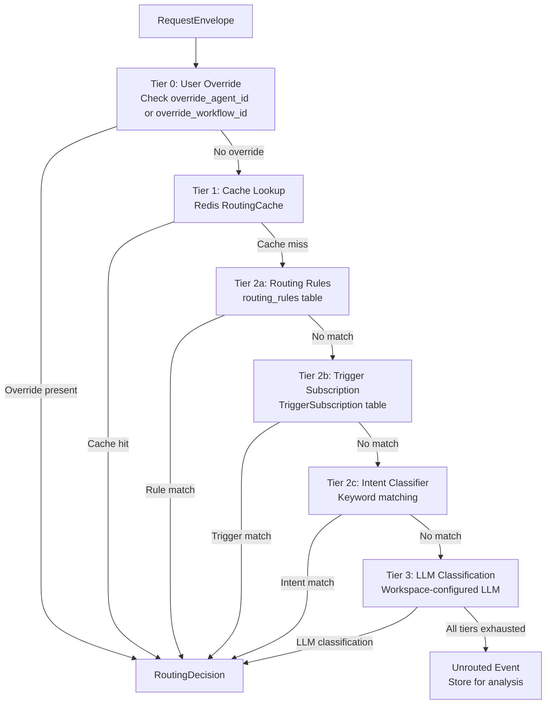
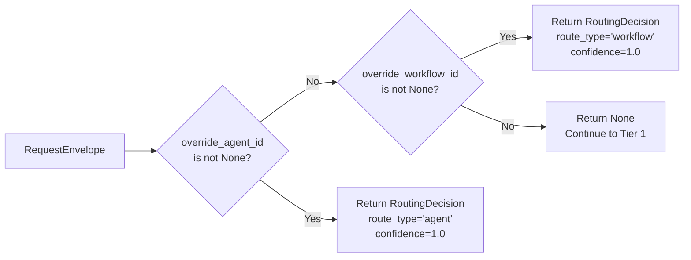
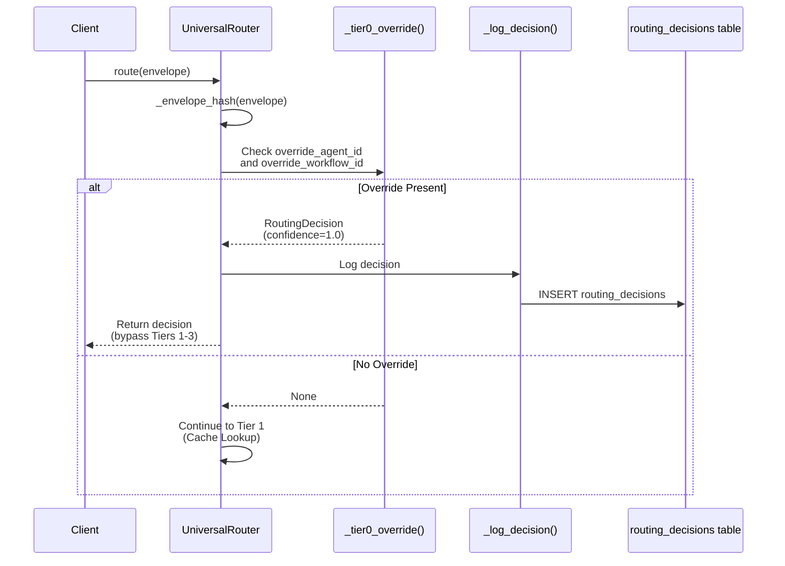
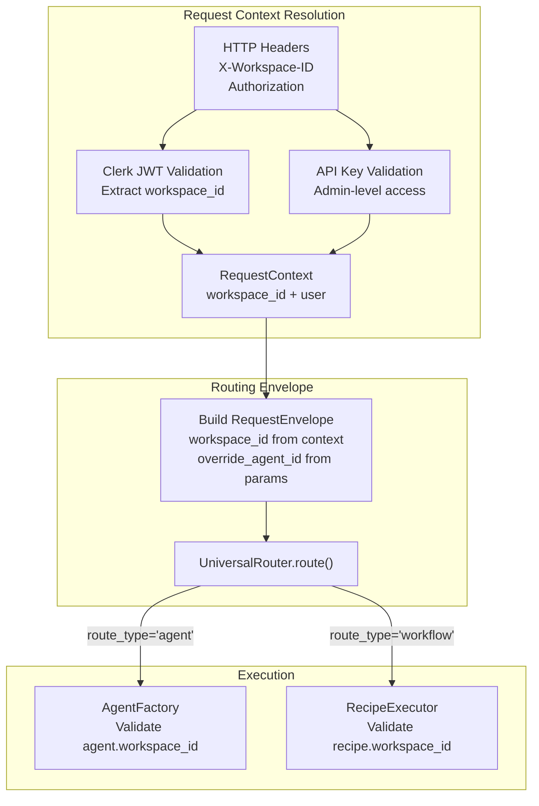
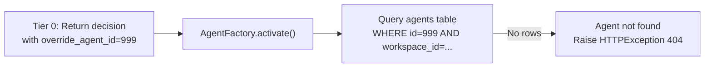

# Tier 0: User Overrides

<details>
<summary>Relevant source files</summary>

The following files were used as context for generating this wiki page:

- [orchestrator/api/chat.py](orchestrator/api/chat.py)
- [orchestrator/api/routing.py](orchestrator/api/routing.py)
- [orchestrator/consumers/chatbot/auto.py](orchestrator/consumers/chatbot/auto.py)
- [orchestrator/consumers/chatbot/intent_classifier.py](orchestrator/consumers/chatbot/intent_classifier.py)
- [orchestrator/consumers/chatbot/personality.py](orchestrator/consumers/chatbot/personality.py)
- [orchestrator/consumers/chatbot/smart_orchestrator.py](orchestrator/consumers/chatbot/smart_orchestrator.py)
- [orchestrator/consumers/chatbot/smart_tool_router.py](orchestrator/consumers/chatbot/smart_tool_router.py)
- [orchestrator/core/models/system_settings.py](orchestrator/core/models/system_settings.py)
- [orchestrator/core/routing/engine.py](orchestrator/core/routing/engine.py)
- [orchestrator/modules/tools/discovery/__init__.py](orchestrator/modules/tools/discovery/__init__.py)
- [orchestrator/scripts/setup_jira_trigger.py](orchestrator/scripts/setup_jira_trigger.py)

</details>


## Purpose and Scope

Tier 0 is the highest-priority routing mechanism in the Universal Router, allowing explicit specification of which agent or workflow should handle a request. When an override is provided, the router bypasses all intelligent routing logic (cache lookup, rule matching, and LLM classification) and immediately routes to the specified target with 100% confidence.

This page documents the override mechanism, its parameters, and integration points. For the broader routing system architecture, see [Routing Architecture](#9.1). For rule-based routing (Tier 2), see [Tier 2: Rule-Based Routing](#9.4).

**Sources**: [orchestrator/core/routing/engine.py:1-586](), [orchestrator/config.py:1-304]()

---

## Routing Priority Hierarchy

The Universal Router evaluates routing decisions in strict priority order. Tier 0 is checked first and short-circuits all subsequent tiers when present:



**Sources**: [orchestrator/core/routing/engine.py:78-144]()

---

## Core Implementation

### RequestEnvelope Structure

The routing engine receives a `RequestEnvelope` containing the request payload and optional override parameters:

| Field | Type | Required | Description |
|-------|------|----------|-------------|
| `id` | UUID | Yes | Unique request identifier |
| `workspace_id` | UUID | Yes | Workspace context for multi-tenancy |
| `content` | str | Yes | Request content (user message, event payload, etc.) |
| `source` | ChannelSource | Yes | Origin channel (chat, jira_trigger, slack, etc.) |
| `override_agent_id` | int | Optional | **Explicit agent ID to route to** |
| `override_workflow_id` | int | Optional | **Explicit workflow/recipe ID to route to** |
| `metadata` | dict | Optional | Additional context (trigger_name, etc.) |
| `raw_payload` | dict | Optional | Original webhook/event payload |

**Sources**: [orchestrator/core/routing/engine.py:17-41]()

---

### Tier 0 Logic

The `_tier0_override()` method performs a simple null check on the override parameters and returns an immediate routing decision if either is present:



Implementation at [orchestrator/core/routing/engine.py:150-165]():

```python
def _tier0_override(self, envelope: RequestEnvelope) -> Optional[RoutingDecision]:
    if envelope.override_agent_id is not None:
        return RoutingDecision(
            route_type="agent",
            agent_id=envelope.override_agent_id,
            confidence=1.0,
            reasoning="User override",
        )
    if envelope.override_workflow_id is not None:
        return RoutingDecision(
            route_type="workflow",
            workflow_id=envelope.override_workflow_id,
            confidence=1.0,
            reasoning="User override",
        )
    return None
```

**Key characteristics:**
- **Mutually exclusive**: Only one override parameter is checked (agent takes priority)
- **Confidence**: Always 1.0 (maximum confidence, no uncertainty)
- **Reasoning**: Simple "User override" string for observability
- **No validation**: Does not verify that the agent/workflow ID exists or is active

**Sources**: [orchestrator/core/routing/engine.py:150-165]()

---

### RoutingDecision Output

When Tier 0 activates, it returns a `RoutingDecision` object with the following structure:

| Field | Type | Value for Tier 0 | Description |
|-------|------|------------------|-------------|
| `route_type` | str | "agent" or "workflow" | Type of target to route to |
| `agent_id` | int | User-provided ID | Agent ID (if route_type="agent") |
| `workflow_id` | int | User-provided ID | Workflow/recipe ID (if route_type="workflow") |
| `confidence` | float | 1.0 | Always maximum confidence |
| `reasoning` | str | "User override" | Static explanation string |
| `intent_category` | str | None | Not applicable for Tier 0 |
| `cached` | bool | False | Never cached (bypass cache) |

The decision is logged to the `routing_decisions` table for observability via the `_log_decision()` method at [orchestrator/core/routing/engine.py:561-585]().

**Sources**: [orchestrator/core/routing/engine.py:150-165](), [orchestrator/core/routing/engine.py:561-585]()

---

## Integration Points

### Main Router Invocation

The `route()` method checks Tier 0 first, before any other routing logic:



**Sources**: [orchestrator/core/routing/engine.py:78-99](), [orchestrator/core/routing/engine.py:561-585]()

---

### Workspace Isolation

Override parameters respect workspace boundaries through the `RequestEnvelope.workspace_id` field. The router does not perform cross-workspace validation at Tier 0, but downstream execution enforces workspace isolation:



This ensures that even with explicit overrides, agents and workflows are only accessible within their assigned workspace.

**Sources**: [orchestrator/core/auth/hybrid.py]() (referenced), [frontend/lib/api-client.ts:854-862]()

---

## Use Cases

### 1. Direct Agent Invocation

**Scenario**: User selects a specific agent from a dropdown in the chat interface.

**Implementation**:
```python
envelope = RequestEnvelope(
    workspace_id=user_workspace_id,
    content="Analyze this sales data",
    source=ChannelSource.CHAT,
    override_agent_id=42  # User-selected agent
)
decision = await router.route(envelope)
# decision.agent_id == 42, confidence == 1.0
```

This bypasses intelligent agent selection and routes directly to the chosen agent.

---

### 2. Workflow Execution from UI

**Scenario**: User clicks "Run Workflow" button on the workflow detail page.

**Implementation**:
```python
envelope = RequestEnvelope(
    workspace_id=workspace_id,
    content=f"Execute workflow: {workflow_name}",
    source=ChannelSource.CHAT,
    override_workflow_id=123  # Workflow ID from button context
)
decision = await router.route(envelope)
# decision.workflow_id == 123, route_type == "workflow"
```

The override ensures the specific workflow runs, even if rules or LLM classification would route elsewhere.

---

### 3. Testing and Debugging

**Scenario**: Developer testing a new agent before adding routing rules.

**Implementation**:
```bash
curl -X POST http://localhost:8000/api/orchestrator/route \
  -H "X-Workspace-ID: $WORKSPACE_ID" \
  -H "Authorization: Bearer $TOKEN" \
  -d '{
    "content": "Test message for new agent",
    "source": "chat",
    "override_agent_id": 999
  }'
```

Forces routing to agent 999 regardless of its description, tags, or readiness for production routing.

---

### 4. Emergency Routing Override

**Scenario**: LLM-based routing is misconfiguring requests; administrator manually routes traffic to a fallback agent.

**Implementation**:
- Set override in routing API call
- Confidence = 1.0 ensures no orchestration fallback (see Tier 3 confidence threshold)
- Bypasses broken routing rules or stale cache entries

---

## Configuration

No configuration variables control Tier 0 behavior. The mechanism is always active and cannot be disabled. However, related configuration affects the broader routing system:

| Variable | Default | Description | Relevance to Tier 0 |
|----------|---------|-------------|---------------------|
| `ROUTING_LLM_CONFIDENCE_THRESHOLD` | 0.5 | Min confidence for direct routing (Tier 3) | N/A - Tier 0 always returns 1.0 |
| `ROUTING_CACHE_TTL_HOURS` | 24 | Cache entry lifetime (Tier 1) | N/A - Tier 0 bypasses cache |

**Sources**: [orchestrator/config.py:141-144]()

---

## Observability

### Logging

When Tier 0 activates, the router logs at INFO level:

```
[router] Tier 0 hit (override): User override
```

This appears at [orchestrator/core/routing/engine.py:97]() in the `route()` method.

---

### Decision Record

Every Tier 0 decision is persisted to the `routing_decisions` table via `_log_decision()`:

| Column | Value for Tier 0 |
|--------|------------------|
| `request_id` | envelope.id |
| `envelope_hash` | SHA256 hash of content + source |
| `workspace_id` | envelope.workspace_id |
| `source` | envelope.source.value |
| `content` | envelope.content (truncated to 2000 chars) |
| `route_type` | "agent" or "workflow" |
| `agent_id` | override_agent_id (if route_type="agent") |
| `workflow_id` | override_workflow_id (if route_type="workflow") |
| `confidence` | 1.0 |
| `cached` | False |
| `created_at` | Current timestamp |

This enables analytics on override usage patterns and debugging of explicit routing paths.

**Sources**: [orchestrator/core/routing/engine.py:561-585]()

---

### Response Headers

The routing decision is exposed to clients via HTTP response headers (configured in [orchestrator/main.py:444]()):

```
X-Routing-Type: agent
X-Routing-Agent-ID: 42
X-Routing-Confidence: 1.0
X-Routing-Reasoning: User override
X-Routing-Request-ID: abc123def456
```

Frontend clients can inspect these headers to verify that the override was respected.

**Sources**: [orchestrator/main.py:444]()

---

## Comparison with Other Tiers

| Aspect | Tier 0: Override | Tier 1: Cache | Tier 2: Rules | Tier 3: LLM |
|--------|------------------|---------------|---------------|-------------|
| **Priority** | Highest (checked first) | 2nd | 3rd-5th (multiple sub-tiers) | Lowest (fallback) |
| **Confidence** | Always 1.0 | Inherited from original decision | 0.9-0.95 | Variable (0.0-1.0) |
| **Latency** | ~0ms (null check) | ~1-5ms (Redis GET) | ~10-50ms (DB query) | ~500-2000ms (LLM API call) |
| **Cost** | None | Redis storage cost | Database query cost | LLM API cost |
| **Input** | `override_agent_id` or `override_workflow_id` | Request content hash | Routing rules, trigger subscriptions, keywords | Agent descriptions, app assignments |
| **Validation** | None (trusts caller) | None (returns cached decision) | DB constraints (active rules only) | LLM parsing + agent ID validation |
| **Use Case** | Explicit user choice, testing | Frequent repeated requests | Pattern-based automation | Complex ambiguous requests |

**Sources**: [orchestrator/core/routing/engine.py:78-433]()

---

## Error Handling

### Invalid Override IDs

Tier 0 does **not validate** that the provided agent or workflow ID exists or is active. Validation occurs downstream:



This design keeps Tier 0 lightweight (no database queries) and defers validation to execution time.

**Sources**: [orchestrator/core/routing/engine.py:150-165]()

---

### Workspace Mismatch

If the override references an agent/workflow from a different workspace, the execution layer will raise a 403 Forbidden error:

```python
# In AgentFactory or RecipeExecutor
agent = db.query(Agent).filter(Agent.id == decision.agent_id).first()
if agent.workspace_id != ctx.workspace_id:
    raise HTTPException(status_code=403, detail="Access denied: workspace mismatch")
```

This enforces multi-tenant isolation even when explicit overrides bypass routing logic.

**Sources**: [orchestrator/api/agent_plugins.py:84-89]()

---

### Both Overrides Provided

If both `override_agent_id` and `override_workflow_id` are non-null, the agent override takes priority (checked first in the conditional at [orchestrator/core/routing/engine.py:151]()):

```python
if envelope.override_agent_id is not None:
    return RoutingDecision(route_type="agent", ...)
if envelope.override_workflow_id is not None:
    return RoutingDecision(route_type="workflow", ...)
```

**Best practice**: Clients should only set one override parameter per request to avoid ambiguity.

**Sources**: [orchestrator/core/routing/engine.py:150-165]()

---

## API Integration

### Chat API Example

The chat streaming API (see [Chat Interface](#8)) accepts override parameters via the request body:

```json
POST /api/chat/stream
{
  "message": "Analyze this data",
  "agent_id": 42,
  "workspace_id": "abc-123-def-456"
}
```

The backend constructs a `RequestEnvelope` with `override_agent_id=42`, triggering Tier 0 routing.

---

### Orchestrator API Example

The universal orchestrator API exposes explicit routing via query parameters or request body:

```bash
POST /api/orchestrator/route
X-Workspace-ID: abc-123-def-456
Content-Type: application/json

{
  "content": "Process this task",
  "source": "chat",
  "override_agent_id": 42
}
```

Response includes routing decision headers confirming the override was applied.

**Sources**: [orchestrator/main.py:444]() (response headers configuration)

---

## Testing Strategies

### Unit Testing Tier 0

Test the `_tier0_override()` method in isolation:

```python
def test_tier0_agent_override():
    router = UniversalRouter(db, cache=None)
    envelope = RequestEnvelope(
        workspace_id=UUID("..."),
        content="test message",
        source=ChannelSource.CHAT,
        override_agent_id=42
    )
    decision = router._tier0_override(envelope)
    
    assert decision is not None
    assert decision.route_type == "agent"
    assert decision.agent_id == 42
    assert decision.confidence == 1.0
    assert decision.reasoning == "User override"
```

---

### Integration Testing

Test end-to-end routing with overrides:

```python
async def test_route_with_agent_override():
    envelope = RequestEnvelope(
        workspace_id=test_workspace_id,
        content="test message",
        source=ChannelSource.CHAT,
        override_agent_id=test_agent_id
    )
    decision = await router.route(envelope)
    
    # Verify Tier 0 was used
    assert decision.agent_id == test_agent_id
    assert decision.confidence == 1.0
    
    # Verify decision was logged
    record = db.query(RoutingDecisionRecord).filter_by(
        request_id=envelope.id
    ).first()
    assert record.agent_id == test_agent_id
    assert record.cached is False
```

**Sources**: [orchestrator/core/routing/engine.py:78-144]()

---

## Best Practices

### When to Use Tier 0

✅ **Recommended**:
- Direct agent selection from UI (user-initiated)
- Workflow execution buttons (explicit workflow invocation)
- Testing/debugging new agents before adding routing rules
- Emergency manual routing (bypass broken LLM classification)

❌ **Not Recommended**:
- Automated systems (use Tier 2 routing rules instead)
- High-volume programmatic routing (adds no intelligence, defeats caching)
- Production traffic where intelligent routing would work (wastes routing capabilities)

---

### Override Validation

Always validate override parameters at the API boundary before constructing the `RequestEnvelope`:

```python
# Example: Chat API endpoint
if request.agent_id is not None:
    # Verify agent exists and belongs to workspace
    agent = db.query(Agent).filter(
        Agent.id == request.agent_id,
        Agent.workspace_id == ctx.workspace_id
    ).first()
    if not agent:
        raise HTTPException(404, "Agent not found")
    
    # Safe to use override
    envelope.override_agent_id = request.agent_id
```

This prevents 404 errors during execution and improves error messaging.

---

### Monitoring Override Usage

Track override usage to detect anti-patterns:

```sql
-- Percentage of requests using Tier 0 overrides
SELECT 
  COUNT(CASE WHEN confidence = 1.0 AND reasoning = 'User override' THEN 1 END) * 100.0 / COUNT(*) AS override_pct
FROM routing_decisions
WHERE created_at >= NOW() - INTERVAL '7 days';
```

High override percentages (>50%) may indicate:
- Insufficient routing rules (Tier 2)
- Poor LLM classification performance (Tier 3)
- Over-reliance on manual agent selection

**Sources**: [orchestrator/core/routing/engine.py:561-585]()

---

## Related Systems

- **[Routing Architecture](#9.1)**: Overview of the four-tier routing system
- **[Tier 1: Cache Lookup](#9.3)**: Redis-backed routing cache (bypassed by Tier 0)
- **[Tier 2: Rule-Based Routing](#9.4)**: Pattern matching and trigger subscriptions (bypassed by Tier 0)
- **[Tier 3: LLM Classification](#9.5)**: Intelligent agent selection (bypassed by Tier 0)
- **[Agent Lifecycle & Status](#3.6)**: Agent validation during execution
- **[Workflow Execution](#4.2)**: Recipe execution pipeline (uses Tier 0 decisions)

**Sources**: [orchestrator/core/routing/engine.py:1-586]()

---