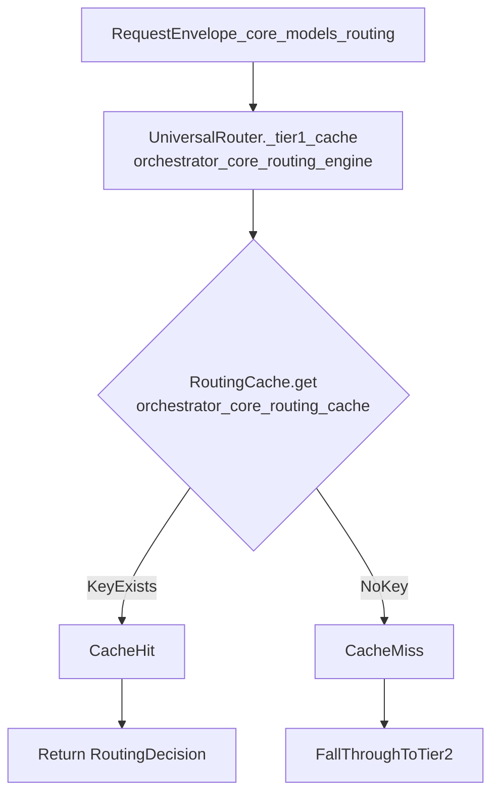
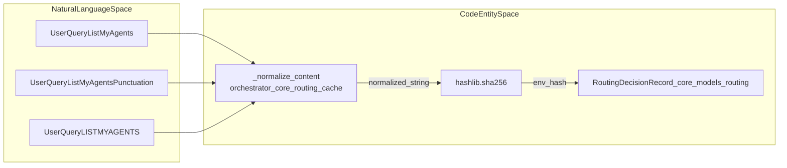
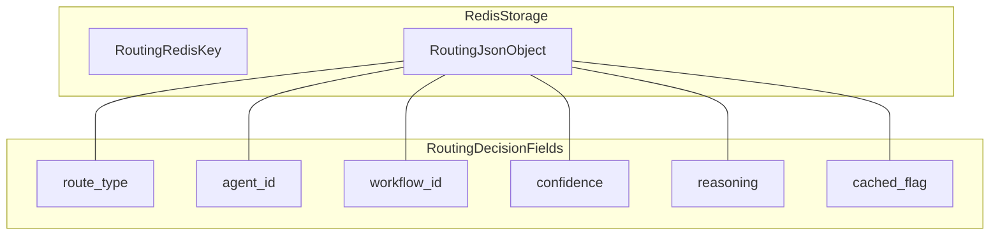
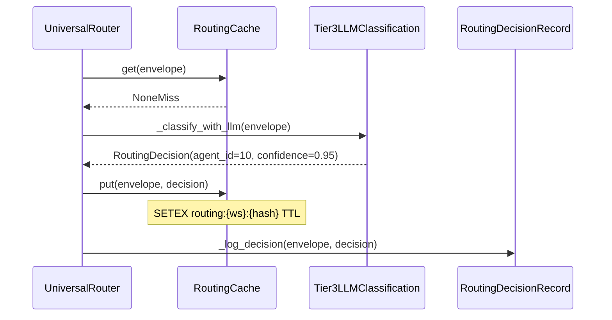

# Tier 1: Cache Lookup

<details>
<summary>Relevant source files</summary>

The following files were used as context for generating this wiki page:

- [orchestrator/api/chat.py](orchestrator/api/chat.py)
- [orchestrator/api/routing.py](orchestrator/api/routing.py)
- [orchestrator/consumers/chatbot/auto.py](orchestrator/consumers/chatbot/auto.py)
- [orchestrator/consumers/chatbot/service.py](orchestrator/consumers/chatbot/service.py)
- [orchestrator/core/llm/manager.py](orchestrator/core/llm/manager.py)
- [orchestrator/core/routing/engine.py](orchestrator/core/routing/engine.py)
- [orchestrator/modules/agents/factory/agent_factory.py](orchestrator/modules/agents/factory/agent_factory.py)
- [orchestrator/modules/tools/discovery/platform_actions.py](orchestrator/modules/tools/discovery/platform_actions.py)
- [orchestrator/modules/tools/discovery/platform_executor.py](orchestrator/modules/tools/discovery/platform_executor.py)
- [orchestrator/scripts/setup_jira_trigger.py](orchestrator/scripts/setup_jira_trigger.py)
- [orchestrator/services/heartbeat_service.py](orchestrator/services/heartbeat_service.py)
- [orchestrator/services/page_context.py](orchestrator/services/page_context.py)
- [orchestrator/tests/test_prd221_page_context.py](orchestrator/tests/test_prd221_page_context.py)
- [orchestrator/tests/test_prd221_page_prior_tools.py](orchestrator/tests/test_prd221_page_prior_tools.py)

</details>


## Purpose and Scope

Tier 1: Cache Lookup is the second tier in the Universal Router's decision-making pipeline, executing immediately after **Tier 0: User Overrides** [orchestrator/core/routing/engine.py:95-101](). When a request has no explicit override, the router checks a Redis-backed routing cache to see if an identical request has been routed recently. This tier provides sub-5ms routing decisions for repeated requests, dramatically reducing LLM API costs and latency compared to **Tier 3: LLM Classification** [orchestrator/core/routing/engine.py:149-158]().

The cache stores complete `RoutingDecision` objects keyed by workspace, normalized content hash, and source [orchestrator/core/routing/cache.py:43](). Cache hits return immediately with high confidence; cache misses fall through to **Tier 2: Rule-Based Routing** or **Tier 3: LLM Classification**, which then populate the cache for future requests [orchestrator/core/routing/engine.py:103-158]().

The `AutoBrain` complexity assessor also utilizes a similar 3-tier strategy, where Tier 1 is a Redis cache lookup to determine if a query's complexity has already been assessed [orchestrator/consumers/chatbot/auto.py:14-18]().

Sources: [orchestrator/core/routing/engine.py:95-108](), [orchestrator/core/routing/cache.py:43](), [orchestrator/core/routing/engine.py:149-158](), [orchestrator/consumers/chatbot/auto.py:14-18]()

---

## Cache Lookup Flow

The `UniversalRouter` calls `_tier1_cache` as the first automated step in its `route` method [orchestrator/core/routing/engine.py:103-108]().

### Routing Decision Logic
Title: UniversalRouter Tier 1 Decision Flow

Sources: [orchestrator/core/routing/engine.py:103-108](), [orchestrator/core/routing/cache.py:43]()

The implementation in `UniversalRouter` is a thin wrapper around the `RoutingCache` service [orchestrator/core/routing/engine.py:70-73]():

```python
def _tier1_cache(self, envelope: RequestEnvelope) -> Optional[RoutingDecision]:
    if self._cache is None:
        return None
    return self._cache.get(
        envelope.workspace_id, envelope.content, envelope.source
    )
```
Sources: [orchestrator/core/routing/engine.py:70-73](), [orchestrator/core/routing/engine.py:103-108]()

---

## Cache Key Generation & Normalization

To ensure high hit rates, the content is normalized before hashing. This prevents minor variations (whitespace, casing, punctuation) from causing cache misses. The system uses a `_normalize_query` utility in the chatbot service to strip non-word characters and collapse whitespace [orchestrator/consumers/chatbot/service.py:76-82]().

### Content to Hash Mapping
Title: Natural Language Normalization to RoutingDecisionRecord

Sources: [orchestrator/core/routing/cache.py:43](), [orchestrator/core/routing/engine.py:52-55](), [orchestrator/consumers/chatbot/service.py:76-82]()

The `_normalize_content` function [orchestrator/core/routing/cache.py:43]() processes the string, while `_envelope_hash` in the engine creates the unique identifier used for logging and deduplication [orchestrator/core/routing/engine.py:52-55]().

| Component | Logic | File Reference |
|-----------|-------|----------------|
| **Normalization** | Strips whitespace, lowercases, removes specific punctuation | [orchestrator/core/routing/cache.py:43]() |
| **Hashing** | `sha256(normalized_content + "\|" + source.value)` | [orchestrator/core/routing/engine.py:52-55]() |
| **Workspace Scope** | Redis keys are prefixed with `routing:{workspace_id}:` | [orchestrator/core/routing/cache.py:43]() |

Sources: [orchestrator/core/routing/cache.py:43](), [orchestrator/core/routing/engine.py:52-55]()

---

## RoutingCache Implementation

The `RoutingCache` class manages the lifecycle of routing data in Redis. It is used by the `UniversalRouter` [orchestrator/core/routing/engine.py:70-73]() and is initialized as part of the routing stack.

### Data Structure & TTL
Cached decisions are stored as JSON strings in Redis.

Title: Redis Storage Schema for RoutingCache

Sources: [orchestrator/core/routing/cache.py:43](), [orchestrator/core/models/routing.py:35-40]()

---

## Cache Population & Learning Loop

The cache is populated after a successful routing decision is made by lower tiers, particularly after LLM classification.

### Sequence: Learning from LLM
Title: Cache Population Sequence

Sources: [orchestrator/core/routing/engine.py:149-158]()

### Population Scenarios
1.  **High Confidence Hits:** When the LLM returns a confidence above the `ROUTING_LLM_CONFIDENCE_THRESHOLD` [orchestrator/core/routing/engine.py:47](), the result is cached to avoid future API costs.
2.  **Auto-Brain Integration:** AutoBrain receives every message and performs a Tier 1 Redis cache lookup (<5ms) to determine task complexity (ATOM to ORGANISM) before delegating to tools or agents [orchestrator/consumers/chatbot/auto.py:14-18]().

Sources: [orchestrator/core/routing/engine.py:47](), [orchestrator/consumers/chatbot/auto.py:14-18]()

---

## Configuration

The behavior of Tier 1 is governed by several environment variables defined in the system configuration.

| Variable | Default | Purpose |
|----------|---------|---------|
| `ROUTING_LLM_CONFIDENCE_THRESHOLD` | 0.5 (via config) | Minimum confidence required to cache an LLM decision |
| `REDIS_URL` | (Standard Env) | Connection string for the cache backend |

Sources: [orchestrator/core/routing/engine.py:47](), [orchestrator/config.py]()

---

## Monitoring & Corrective Actions

Routing decisions, including whether they were served from the cache, are persisted in the `RoutingDecisionRecord` table [orchestrator/core/models/routing.py:35-42]().

*   **Decision Logging**: The `_log_decision` method in `UniversalRouter` records the outcome of every routing attempt, including the tier that matched and whether the result was retrieved from cache [orchestrator/core/routing/engine.py:99-106]().
*   **Correction API**: The `/api/routing/decisions` endpoint allows admins to inspect recent decisions and see which were served from cache via the `cached` boolean field [orchestrator/api/routing.py:111-155]().
*   **Learning Loop**: When a user corrects a routing decision via the `CorrectionRequest` schema [orchestrator/api/routing.py:82-85](), the system can update the cache to reflect the manual override for future similar queries.

Sources: [orchestrator/core/models/routing.py:35-42](), [orchestrator/core/routing/engine.py:99-106](), [orchestrator/api/routing.py:82-155]()

---