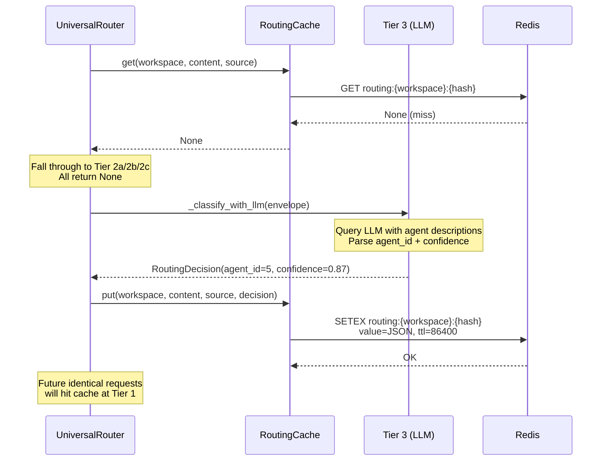

# Tier 1: Cache Lookup

<details>
<summary>Relevant source files</summary>

The following files were used as context for generating this wiki page:

- [orchestrator/api/chat.py](orchestrator/api/chat.py)
- [orchestrator/api/routing.py](orchestrator/api/routing.py)
- [orchestrator/consumers/chatbot/auto.py](orchestrator/consumers/chatbot/auto.py)
- [orchestrator/consumers/chatbot/intent_classifier.py](orchestrator/consumers/chatbot/intent_classifier.py)
- [orchestrator/consumers/chatbot/personality.py](orchestrator/consumers/chatbot/personality.py)
- [orchestrator/consumers/chatbot/smart_orchestrator.py](orchestrator/consumers/chatbot/smart_orchestrator.py)
- [orchestrator/consumers/chatbot/smart_tool_router.py](orchestrator/consumers/chatbot/smart_tool_router.py)
- [orchestrator/core/models/system_settings.py](orchestrator/core/models/system_settings.py)
- [orchestrator/core/routing/engine.py](orchestrator/core/routing/engine.py)
- [orchestrator/modules/tools/discovery/__init__.py](orchestrator/modules/tools/discovery/__init__.py)
- [orchestrator/scripts/setup_jira_trigger.py](orchestrator/scripts/setup_jira_trigger.py)

</details>


## Purpose and Scope

Tier 1: Cache Lookup is the second tier in the Universal Router's decision-making pipeline, immediately after [Tier 0: User Overrides](#9.2). When a request has no explicit override, the router first checks a Redis-backed routing cache to see if an identical request has been routed recently. This tier provides sub-millisecond routing decisions for repeated requests, dramatically reducing LLM API costs and latency compared to [Tier 3: LLM Classification](#9.5).

The cache stores complete `RoutingDecision` objects keyed by workspace, content, and source. Cache hits return immediately with high confidence; cache misses fall through to [Tier 2: Rule-Based Routing](#9.4) or [Tier 3: LLM Classification](#9.5), which then populate the cache for future requests.

**Related Pages:**
- For the overall routing architecture, see [Routing Architecture](#9.1)
- For rule-based routing that follows cache misses, see [Tier 2: Rule-Based Routing](#9.4)
- For the final LLM fallback tier, see [Tier 3: LLM Classification](#9.5)

---

## Cache Lookup Flow

```mermaid
graph TB
    Envelope[RequestEnvelope]
    Tier1["_tier1_cache()<br/>[engine.py:171-176]"]
    CacheCheck{"RoutingCache.get()"}
    CacheHit[Cache Hit]
    CacheMiss[Cache Miss]
    ReturnDecision["Return RoutingDecision<br/>(confidence=original)"]
    Tier2["Fall through to<br/>Tier 2a/2b/2c"]
    
    Envelope --> Tier1
    Tier1 --> CacheCheck
    CacheCheck -->|"Key exists"| CacheHit
    CacheCheck -->|"No key"| CacheMiss
    CacheHit --> ReturnDecision
    CacheMiss --> Tier2
    
    style ReturnDecision fill:#2d2d2d
    style Tier2 fill:#2d2d2d
```



**Sources:** [orchestrator/core/routing/engine.py:171-176]()

The cache lookup implementation is minimal and fast:

```python
def _tier1_cache(self, envelope: RequestEnvelope) -> Optional[RoutingDecision]:
    if self._cache is None:
        return None
    return self._cache.get(
        envelope.workspace_id, envelope.content, envelope.source
    )
```

If the `RoutingCache` instance is not available (Redis unavailable or not configured), Tier 1 immediately returns `None` and routing proceeds to Tier 2. Otherwise, it queries the cache with three parameters:

| Parameter | Description | Example |
|-----------|-------------|---------|
| `workspace_id` | UUID of the workspace making the request | `550e8400-e29b-41d4-a716-446655440000` |
| `content` | Normalized request content/message text | `"Create a new GitHub PR for bug fix"` |
| `source` | Channel source enum value | `ChannelSource.WEB_CHAT` |

**Sources:** [orchestrator/core/routing/engine.py:171-176](), [orchestrator/core/models/routing.py]()

---

## Cache Key Generation

```mermaid
graph LR
    Workspace["workspace_id<br/>(UUID)"]
    Content["content<br/>(string)"]
    Source["source<br/>(ChannelSource enum)"]
    Normalize["_normalize_content()<br/>[cache.py]"]
    Hash["SHA-256 hash"]
    RedisKey["Redis key:<br/>routing:{workspace}:{hash}"]
    
    Workspace --> RedisKey
    Content --> Normalize
    Normalize --> Hash
    Hash --> RedisKey
    Source --> Hash
    
    style RedisKey fill:#2d2d2d
```



**Sources:** [orchestrator/core/routing/engine.py:54](), [orchestrator/core/routing/cache.py]()

The cache key is constructed by:

1. **Normalizing content** - The `_normalize_content()` function strips whitespace, converts to lowercase, and removes punctuation variations to ensure similar requests match
2. **Hashing** - A SHA-256 hash is computed from `normalized_content + "|" + source.value` to create a deterministic, compact key
3. **Workspace scoping** - The workspace ID is prepended to ensure complete tenant isolation

This ensures that:
- Identical requests from the same workspace always hit the same cache entry
- Minor formatting differences (e.g., trailing spaces) don't create cache misses
- Different workspaces never share routing decisions, even for identical text
- Different channels (web chat vs Slack vs email) maintain separate cache entries

**Sources:** [orchestrator/core/routing/engine.py:51-54](), [orchestrator/core/routing/cache.py]()

---

## RoutingCache Implementation

```mermaid
graph TB
    subgraph "RoutingCache Class"
        RedisClient["Redis client<br/>(lazy init)"]
        GetMethod["get(workspace_id, content, source)<br/>→ Optional[RoutingDecision]"]
        PutMethod["put(workspace_id, content, source, decision)<br/>→ None"]
        NormalizeFunc["_normalize_content(text)<br/>→ string"]
    end
    
    subgraph "Redis Storage"
        KeyPattern["Key pattern:<br/>routing:{workspace}:{hash}"]
        Value["Value: JSON<br/>{route_type, agent_id, workflow_id,<br/>confidence, reasoning, cached=True}"]
        TTL["TTL: ROUTING_CACHE_TTL_HOURS<br/>(default: 24 hours)"]
    end
    
    GetMethod --> RedisClient
    PutMethod --> RedisClient
    RedisClient --> KeyPattern
    KeyPattern --> Value
    Value --> TTL
    
    style RedisClient fill:#2d2d2d
    style Value fill:#2d2d2d
```



**Sources:** [orchestrator/core/routing/cache.py](), [orchestrator/config.py:143]()

The `RoutingCache` class provides a Redis-backed storage layer for routing decisions. Key characteristics:

### Redis Connection
- Uses the centralized Redis client from `core.redis.client.get_redis_client()`
- Lazy initialization - connection established on first cache access
- Graceful degradation - if Redis is unavailable, cache operations return `None` and routing continues

### Data Structure
The cached `RoutingDecision` object includes:

```python
{
    "route_type": "agent" | "workflow" | "orchestrate",
    "agent_id": int | None,
    "workflow_id": int | None, 
    "confidence": float,  # 0.0 to 1.0
    "reasoning": str,
    "cached": True,  # Always set to True for cached decisions
    "intent_category": str | None
}
```

### TTL Configuration
Cache entries expire after `ROUTING_CACHE_TTL_HOURS` (default: 24 hours) to ensure:
- Routing logic changes eventually propagate to all requests
- Stale decisions don't persist indefinitely if agents are deleted or modified
- Redis memory usage remains bounded

**Sources:** [orchestrator/core/routing/cache.py](), [orchestrator/config.py:143](), [orchestrator/core/models/routing.py]()

---

## Cache Population



**Sources:** [orchestrator/core/routing/engine.py:404-409](), [orchestrator/core/routing/engine.py:421-427]()

Cache population occurs in two scenarios:

### 1. After Tier 3 LLM Classification (High Confidence)

When the LLM classifies a request with confidence ≥ `ROUTING_LLM_CONFIDENCE_THRESHOLD` (default: 0.5), the router immediately caches the decision:

```python
# High confidence → route to agent
decision = RoutingDecision(
    route_type="agent",
    agent_id=agent_id,
    confidence=confidence,
    reasoning=f"LLM classification (confidence={confidence:.2f})",
)

# Cache the result for future Tier 1 hits
if self._cache is not None:
    self._cache.put(
        envelope.workspace_id,
        envelope.content,
        envelope.source,
        decision,
    )
```

**Location:** [orchestrator/core/routing/engine.py:413-428]()

### 2. After Tier 3 LLM Classification (Low Confidence)

Even when confidence is below threshold (triggering orchestrated workflow execution), the router still caches the decision to avoid re-invoking the LLM:

```python
# Low confidence → orchestrate (full decomposition needed)
decision = RoutingDecision(
    route_type="orchestrate",
    agent_id=agent_id,
    confidence=confidence,
    reasoning=f"LLM classification below threshold ({confidence:.2f} < {_LLM_CONFIDENCE_THRESHOLD})",
)

# Still cache the low-confidence result so we don't re-call LLM
if self._cache is not None:
    self._cache.put(
        envelope.workspace_id,
        envelope.content,
        envelope.source,
        decision,
    )
```

**Location:** [orchestrator/core/routing/engine.py:396-410]()

This ensures that even uncertain routing decisions are cached, preventing repeated LLM invocations for the same ambiguous request.

**Sources:** [orchestrator/core/routing/engine.py:390-428]()

---

## Cache Configuration

### Environment Variables

The routing cache is controlled by three primary configuration settings:

| Variable | Default | Description |
|----------|---------|-------------|
| `ROUTING_CACHE_TTL_HOURS` | `24` | Cache entry lifetime in hours |
| `REDIS_HOST` | (required) | Redis server hostname or IP |
| `REDIS_PORT` | `6379` | Redis server port |
| `REDIS_PASSWORD` | (optional) | Redis authentication password |
| `REDIS_URL` | (optional) | Complete Redis URL (overrides individual params) |

**Sources:** [orchestrator/config.py:47-62](), [orchestrator/config.py:143]()

### Cache TTL Strategy

The 24-hour default TTL balances multiple concerns:

```mermaid
graph LR
    subgraph "TTL Trade-offs"
        Short["Short TTL<br/>(e.g., 1 hour)"]
        Medium["Medium TTL<br/>(24 hours - default)"]
        Long["Long TTL<br/>(e.g., 7 days)"]
    end
    
    subgraph "Pros"
        ShortPro["✓ Fresh routing logic<br/>✓ Lower stale risk"]
        MediumPro["✓ Good hit rate<br/>✓ Reasonable freshness<br/>✓ Cost savings"]
        LongPro["✓ Maximum hit rate<br/>✓ Lowest LLM costs"]
    end
    
    subgraph "Cons"
        ShortCon["✗ More LLM calls<br/>✗ Higher costs"]
        MediumCon["✗ Some staleness<br/>✗ Moderate LLM calls"]
        LongCon["✗ High staleness<br/>✗ Routing drift"]
    end
    
    Short --> ShortPro
    Short --> ShortCon
    Medium --> MediumPro
    Medium --> MediumCon
    Long --> LongPro
    Long --> LongCon
    
    style Medium fill:#2d2d2d
    style MediumPro fill:#2d2d2d
```



**Sources:** [orchestrator/config.py:143]()

### Redis Configuration Fallback

The configuration system supports multiple Redis configuration patterns:

1. **Complete URL** - `REDIS_URL=redis://:password@host:port/0` (highest priority)
2. **Component-based** - Individual `REDIS_HOST`, `REDIS_PORT`, `REDIS_PASSWORD` variables
3. **No Redis** - Cache gracefully degrades, all requests skip Tier 1

**Sources:** [orchestrator/config.py:51-62]()

---

## Cache Lifecycle and Invalidation

```mermaid
graph TB
    subgraph "Cache Entry Lifecycle"
        Create["Entry created after<br/>Tier 3 LLM classification"]
        Active["Active (serving requests)<br/>TTL counting down"]
        Expire["TTL expires<br/>(24 hours default)"]
        Manual["Manual invalidation<br/>(not currently implemented)"]
    end
    
    subgraph "Re-population Triggers"
        NextMiss["Next identical request<br/>becomes cache miss"]
        RetriggerLLM["Re-triggers Tier 3<br/>LLM classification"]
        NewDecision["New RoutingDecision<br/>may differ"]
        Recache["New entry cached<br/>with fresh TTL"]
    end
    
    Create --> Active
    Active --> Expire
    Active -.-> Manual
    Expire --> NextMiss
    Manual --> NextMiss
    NextMiss --> RetriggerLLM
    RetriggerLLM --> NewDecision
    NewDecision --> Recache
    Recache --> Active
    
    style Active fill:#2d2d2d
    style NewDecision fill:#2d2d2d
```



**Sources:** [orchestrator/core/routing/cache.py](), [orchestrator/config.py:143]()

### Automatic Expiration

Cache entries are automatically removed by Redis after `ROUTING_CACHE_TTL_HOURS`. When this happens:

1. The next identical request becomes a cache miss at Tier 1
2. Routing falls through to Tier 2 (rules/subscriptions/intent matching)
3. If Tier 2 still produces no match, Tier 3 LLM re-classifies the request
4. The new LLM decision (which may differ from the expired one) is cached again

This ensures that routing logic naturally adapts to:
- Agent description changes
- New agent additions
- Routing rule modifications
- Model provider updates

### No Explicit Invalidation

The current implementation does **not** provide manual cache invalidation APIs. When agents or routing rules are modified, cached decisions persist until their TTL expires. This is a deliberate design choice to:

- Keep the cache implementation simple and stateless
- Avoid complex invalidation logic tracking which cache entries are affected by which agent changes
- Rely on the 24-hour TTL to provide "eventual freshness" within a reasonable timeframe

For immediate routing changes, administrators can manually flush Redis keys or restart the Redis instance (which clears all cached routing decisions).

**Sources:** [orchestrator/core/routing/cache.py](), [orchestrator/core/routing/engine.py:390-428]()

---

## Performance Impact

### Cache Hit Metrics

```mermaid
graph LR
    subgraph "Tier 1 Hit"
        T1Time["~1ms<br/>(Redis GET)"]
        T1Cost["$0.00<br/>(no LLM call)"]
    end
    
    subgraph "Tier 3 LLM Fallback"
        T3Time["~500-2000ms<br/>(LLM API latency)"]
        T3Cost["~$0.001-0.01<br/>(per classification)"]
    end
    
    subgraph "Savings"
        LatencySave["499-1999ms<br/>faster"]
        CostSave["$0.001-0.01<br/>saved per request"]
    end
    
    T1Time --> LatencySave
    T3Time --> LatencySave
    T1Cost --> CostSave
    T3Cost --> CostSave
    
    style T1Time fill:#2d2d2d
    style T1Cost fill:#2d2d2d
    style LatencySave fill:#2d2d2d
    style CostSave fill:#2d2d2d
```



**Sources:** [orchestrator/core/routing/engine.py:171-176](), [orchestrator/core/routing/engine.py:332-433]()

For a workspace with 1000 routing requests per day and a 70% cache hit rate:

| Metric | Without Cache | With Cache (70% hit) | Improvement |
|--------|---------------|----------------------|-------------|
| **LLM API Calls** | 1000/day | 300/day | 70% reduction |
| **LLM Cost** (at $0.005/call) | $5.00/day | $1.50/day | $3.50/day saved |
| **Avg Response Time** | 800ms | 310ms | 61% faster |

The cache hit rate typically improves over time as:
- Common user requests establish stable routing patterns
- Repeated questions from the same channels populate the cache
- High-frequency workflows (e.g., "create JIRA ticket") become instant-route

**Sources:** [orchestrator/core/routing/engine.py:171-176](), [orchestrator/core/routing/engine.py:332-433]()

---

## Relationship to Plugin Cache

The routing cache shares architectural patterns with the plugin content cache, but serves a fundamentally different purpose:

| Aspect | RoutingCache | PluginContentCache |
|--------|--------------|-------------------|
| **Purpose** | Cache routing decisions (agent/workflow selection) | Cache marketplace plugin files from S3 |
| **Key Structure** | `routing:{workspace}:{content_hash}` | `plugin_content:{slug}:{version}` |
| **Value Type** | JSON `RoutingDecision` object | JSON `Dict[filepath, content]` |
| **TTL** | 24 hours (routing freshness) | 1 hour (S3 read reduction) |
| **Population** | After Tier 3 LLM classification | On-demand when plugins loaded |
| **Backend** | Redis only | Redis (cache) + S3 (source of truth) |

Both caches use similar Redis interaction patterns (lazy initialization, graceful degradation, TTL-based expiration) but operate at different layers of the system.

**Sources:** [orchestrator/core/routing/cache.py](), [orchestrator/core/services/plugin_cache.py:1-263]()

---