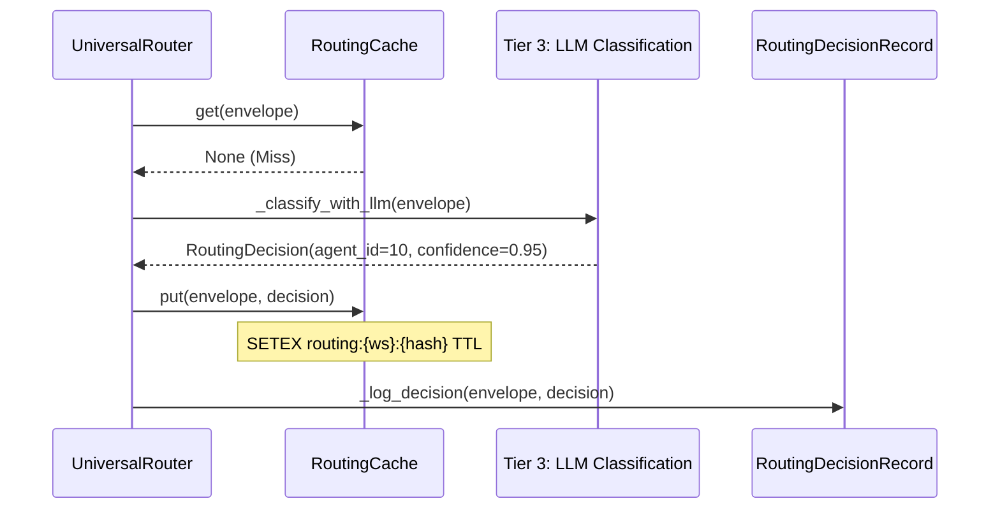

# Tier 1: Cache Lookup

<details>
<summary>Relevant source files</summary>

The following files were used as context for generating this wiki page:

- [docs/reviews/COMPOSIO-TOOL-REGRESSION-REVIEW.md](docs/reviews/COMPOSIO-TOOL-REGRESSION-REVIEW.md)
- [orchestrator/api/chat.py](orchestrator/api/chat.py)
- [orchestrator/api/chat_voice.py](orchestrator/api/chat_voice.py)
- [orchestrator/consumers/chatbot/auto.py](orchestrator/consumers/chatbot/auto.py)
- [orchestrator/consumers/chatbot/intent_classifier.py](orchestrator/consumers/chatbot/intent_classifier.py)
- [orchestrator/consumers/chatbot/personality.py](orchestrator/consumers/chatbot/personality.py)
- [orchestrator/consumers/chatbot/service.py](orchestrator/consumers/chatbot/service.py)
- [orchestrator/consumers/chatbot/smart_tool_router.py](orchestrator/consumers/chatbot/smart_tool_router.py)
- [orchestrator/core/llm/manager.py](orchestrator/core/llm/manager.py)
- [orchestrator/core/routing/engine.py](orchestrator/core/routing/engine.py)
- [orchestrator/modules/orchestrator/service.py](orchestrator/modules/orchestrator/service.py)
- [orchestrator/modules/tools/discovery/actions_analytics_enhanced.py](orchestrator/modules/tools/discovery/actions_analytics_enhanced.py)
- [orchestrator/modules/tools/discovery/handlers_analytics_enhanced.py](orchestrator/modules/tools/discovery/handlers_analytics_enhanced.py)
- [orchestrator/modules/tools/discovery/handlers_search.py](orchestrator/modules/tools/discovery/handlers_search.py)
- [orchestrator/modules/tools/discovery/platform_actions.py](orchestrator/modules/tools/discovery/platform_actions.py)
- [orchestrator/modules/tools/discovery/platform_executor.py](orchestrator/modules/tools/discovery/platform_executor.py)
- [orchestrator/modules/tools/tool_router.py](orchestrator/modules/tools/tool_router.py)

</details>


## Purpose and Scope

Tier 1: Cache Lookup is the second tier in the Universal Router's decision-making pipeline, executing immediately after **Tier 0: User Overrides** [core/routing/engine.py:96-101](). When a request has no explicit override, the router checks a Redis-backed routing cache to see if an identical request has been routed recently. This tier provides sub-5ms routing decisions for repeated requests, dramatically reducing LLM API costs and latency compared to **Tier 3: LLM Classification** [consumers/chatbot/auto.py:14-17]().

The cache stores complete `RoutingDecision` objects keyed by workspace, normalized content hash, and source [core/routing/cache.py:43](). Cache hits return immediately with high confidence; cache misses fall through to **Tier 2: Rule-Based Routing** or **Tier 3: LLM Classification**, which then populate the cache for future requests [core/routing/engine.py:103-158]().

Sources: [core/routing/engine.py:103-108](), [consumers/chatbot/auto.py:14-17](), [core/routing/cache.py:43]()

---

## Cache Lookup Flow

The `UniversalRouter` [core/routing/engine.py:58-74]() calls `_tier1_cache` as the first automated step in its `route` method [core/routing/engine.py:103-108]().

### Routing Decision Logic
Title: "UniversalRouter Tier 1 Decision Flow"
```mermaid
graph TB
    [Envelope] --> [Tier1]
    [Tier1] --> [CacheCheck]
    [CacheCheck] -- "Key exists" --> [CacheHit]
    [CacheCheck] -- "No key" --> [CacheMiss]
    [CacheHit] --> [ReturnDecision]
    [CacheMiss] --> [Tier2]

    [Envelope]["RequestEnvelope [core/models/routing.py]"]
    [Tier1]["UniversalRouter._tier1_cache() [core/routing/engine.py:103]"]
    [CacheCheck]{"RoutingCache.get() [core/routing/cache.py]"}
    [CacheHit]["Cache Hit"]
    [CacheMiss]["Cache Miss"]
    [ReturnDecision]["Return RoutingDecision (confidence=original)"]
    [Tier2]["Fall through to Tier 2a/2b/2.5/2c"]
```
Sources: [core/routing/engine.py:103-108](), [core/routing/cache.py:43]()

The implementation in `UniversalRouter` is a thin wrapper around the `RoutingCache` service [core/routing/engine.py:70-73]():

```python
def _tier1_cache(self, envelope: RequestEnvelope) -> Optional[RoutingDecision]:
    if self._cache is None:
        return None
    return self._cache.get(
        envelope.workspace_id, envelope.content, envelope.source
    )
```
Sources: [core/routing/engine.py:103-108]()

---

## Cache Key Generation & Normalization

To ensure high hit rates, the content is normalized before hashing. This prevents minor variations (whitespace, casing, punctuation) from causing cache misses.

### Content to Hash Mapping
Title: "Natural Language Normalization to RoutingDecisionRecord"
```mermaid
graph LR
    subgraph "Natural Language Space"
        [Input1]
        [Input2]
        [Input3]
    end

    subgraph "Code Entity Space"
        [Normalize]
        [Hash]
        [Decision]
    end

    [Input1] --> [Normalize]
    [Input2] --> [Normalize]
    [Input3] --> [Normalize]
    [Normalize] -- "list my agents" --> [Hash]
    [Hash] -- "env_hash" --> [Decision]

    [Input1]["'List my agents'"]
    [Input2]["'list my agents. '"]
    [Input3]["'LIST MY AGENTS'"]
    [Normalize]["_normalize_content() [core/routing/cache.py]"]
    [Hash]["hashlib.sha256()"]
    [Decision]["RoutingDecisionRecord [core/models/routing.py]"]
```
Sources: [core/routing/cache.py:43](), [core/routing/engine.py:52-55]()

The `_normalize_content` function [core/routing/cache.py:43]() processes the string, while `_envelope_hash` in the engine creates the unique identifier used for logging and deduplication [core/routing/engine.py:52-55]().

| Component | Logic | File Reference |
|-----------|-------|----------------|
| **Normalization** | Strips whitespace, lowercases, removes specific punctuation | [core/routing/cache.py:43]() |
| **Hashing** | `sha256(normalized_content + "\|" + source.value)` | [core/routing/engine.py:54-55]() |
| **Workspace Scope** | Redis keys are prefixed with `routing:{workspace_id}:` | [core/routing/cache.py:43]() |

---

## RoutingCache Implementation

The `RoutingCache` class manages the lifecycle of routing data in Redis. It is used by the `UniversalRouter` [core/routing/engine.py:70-73]().

### Data Structure & TTL
Cached decisions are stored as JSON strings in Redis.

Title: "Redis Storage Schema for RoutingCache"
```mermaid
graph TB
    subgraph "Redis Storage [core/routing/cache.py]"
        [Key]
        [Value]
    end
    
    subgraph "RoutingDecision Fields [core/models/routing.py]"
        [RT]
        [AID]
        [WID]
        [CONF]
        [REAS]
        [C_FLAG]
    end
    
    [Value] --- [RT]
    [Value] --- [AID]
    [Value] --- [WID]
    [Value] --- [CONF]
    [Value] --- [REAS]
    [Value] --- [C_FLAG]

    [Key]["routing:{workspace_id}:{hash}"]
    [Value]["JSON Object"]
    [RT]["route_type: 'agent' | 'workflow'"]
    [AID]["agent_id: int"]
    [WID]["workflow_id: int"]
    [CONF]["confidence: float"]
    [REAS]["reasoning: str"]
    [C_FLAG]["cached: True"]
```
Sources: [core/routing/cache.py:43](), [core/models/routing.py:35-42]()

---

## Cache Population & Learning Loop

The cache is populated after a successful routing decision is made by lower tiers, particularly after LLM classification.

### Sequence: Learning from LLM
Title: "Cache Population Sequence"

Sources: [core/routing/engine.py:149-158](), [core/routing/engine.py:99-100]()

### Population Scenarios
1.  **High Confidence Hits:** When the LLM returns a confidence above the `ROUTING_LLM_CONFIDENCE_THRESHOLD` [core/routing/engine.py:47](), the result is cached to avoid future API costs.
2.  **Auto-Brain Integration:** The `AutoBrain` progressive complexity assessor [consumers/chatbot/auto.py:19]() also utilizes a Tier 1 Redis cache lookup (<5ms, free) to determine task complexity (ATOM, MOLECULE, etc.) before any heavy processing occurs [consumers/chatbot/auto.py:14-17]().

---

## Configuration

The behavior of Tier 1 is governed by several environment variables defined in the system configuration.

| Variable | Default | Purpose |
|----------|---------|---------|
| `ROUTING_LLM_CONFIDENCE_THRESHOLD` | 0.5 (via config) | Minimum confidence required to cache an LLM decision |
| `REDIS_URL` | (Standard Env) | Connection string for the cache backend |

Sources: [core/routing/engine.py:47](), [consumers/chatbot/auto.py:15-17]()

## API & Monitoring

Routing decisions, including whether they were served from the cache, are persisted in the `RoutingDecisionRecord` table [core/models/routing.py:39]().

*   **Logging**: The router explicitly logs Tier 1 hits including the `agent_id` [core/routing/engine.py:105]().
*   **Decision Persistence**: Every routed envelope triggers `_log_decision` [core/routing/engine.py:106](), ensuring the audit trail tracks cache performance.

Sources: [core/routing/engine.py:103-108](), [core/models/routing.py:39]()

---