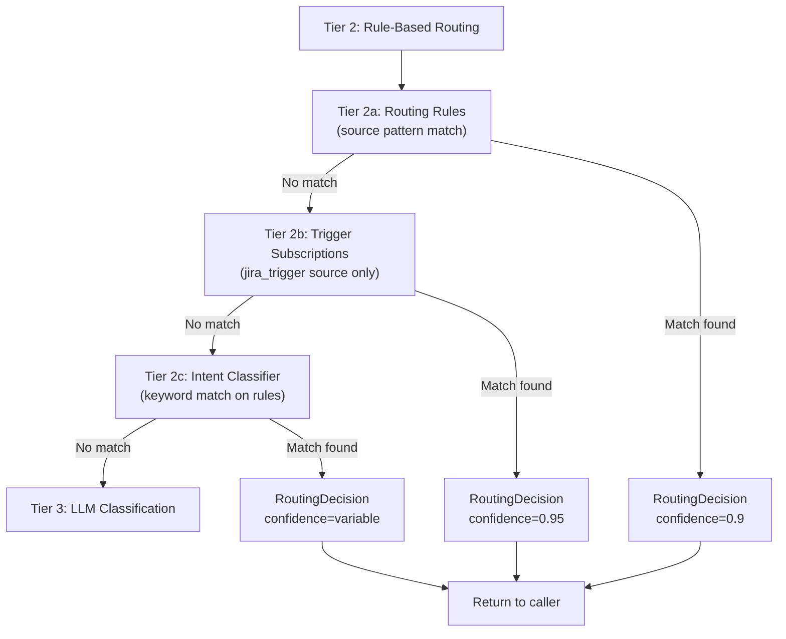
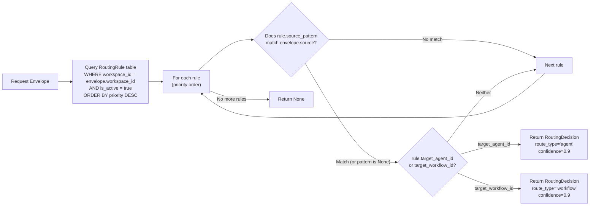
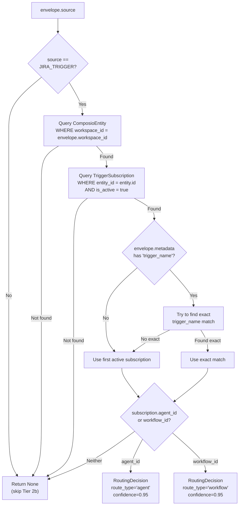
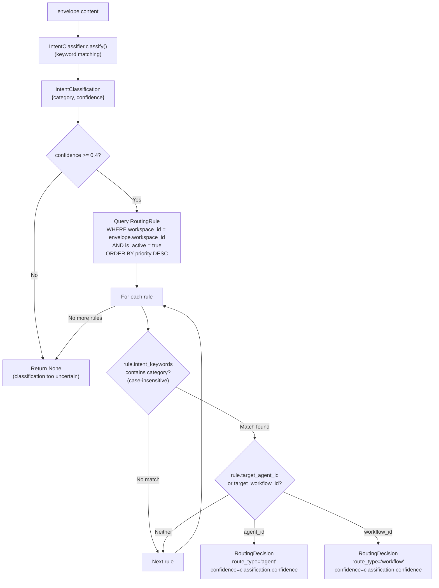
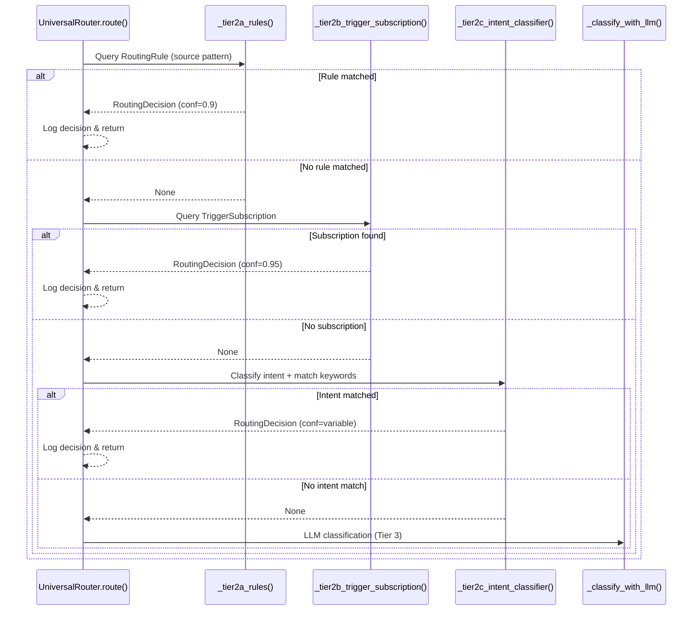

# Tier 2: Rule-Based Routing

<details>
<summary>Relevant source files</summary>

The following files were used as context for generating this wiki page:

- [orchestrator/api/chat.py](orchestrator/api/chat.py)
- [orchestrator/api/routing.py](orchestrator/api/routing.py)
- [orchestrator/consumers/chatbot/auto.py](orchestrator/consumers/chatbot/auto.py)
- [orchestrator/consumers/chatbot/intent_classifier.py](orchestrator/consumers/chatbot/intent_classifier.py)
- [orchestrator/consumers/chatbot/personality.py](orchestrator/consumers/chatbot/personality.py)
- [orchestrator/consumers/chatbot/smart_orchestrator.py](orchestrator/consumers/chatbot/smart_orchestrator.py)
- [orchestrator/consumers/chatbot/smart_tool_router.py](orchestrator/consumers/chatbot/smart_tool_router.py)
- [orchestrator/core/models/system_settings.py](orchestrator/core/models/system_settings.py)
- [orchestrator/core/routing/engine.py](orchestrator/core/routing/engine.py)
- [orchestrator/modules/tools/discovery/__init__.py](orchestrator/modules/tools/discovery/__init__.py)
- [orchestrator/scripts/setup_jira_trigger.py](orchestrator/scripts/setup_jira_trigger.py)

</details>


## Purpose and Scope

Tier 2 implements deterministic, rule-based routing for the Universal Router. It executes after Tier 0 (user overrides, see [#9.2](#9.2)) and Tier 1 (cache lookup, see [#9.3](#9.3)) fail to produce a routing decision. Tier 2 consists of three sequential sub-strategies that match incoming requests against workspace-configured routing rules, trigger subscriptions, and intent patterns. For LLM-based classification when all rules fail, see [Tier 3: LLM Classification](#9.5).

Tier 2 provides workspace administrators with explicit control over routing behavior through:
- **Tier 2a**: Source pattern matching against `RoutingRule` table entries
- **Tier 2b**: Jira trigger subscriptions via `TriggerSubscription` table (Composio integration)
- **Tier 2c**: Keyword-based intent classification with fallback to rules

All three sub-tiers query database tables filtered by `workspace_id` to enforce multi-tenancy isolation.

---

## Tier 2 Architecture Overview



**Sources**: [orchestrator/core/routing/engine.py:78-144]()

---

## Tier 2a: Routing Rules (Source Pattern Matching)

### Overview

Tier 2a queries the `RoutingRule` table to find explicit routing rules configured by workspace administrators. Rules are matched based on the request's source channel and can route to either agents or workflows.

### Matching Logic



**Sources**: [orchestrator/core/routing/engine.py:182-214]()

### Implementation Details

The `_tier2a_rules` method executes the following query pattern:

1. **Query RoutingRule table** filtered by `workspace_id` and `is_active = True`
2. **Order by priority** (descending) to ensure higher-priority rules are evaluated first
3. **Iterate through rules** and check `source_pattern` match:
   - If `rule.source_pattern` is `None` or empty, the rule matches **any source**
   - Otherwise, `rule.source_pattern` must exactly match `envelope.source.value`
4. **Return first match** with `confidence=0.9` and reasoning that includes rule ID

**Sources**: [orchestrator/core/routing/engine.py:182-214]()

### RoutingRule Table Schema

| Field | Type | Description |
|-------|------|-------------|
| `id` | int | Primary key |
| `workspace_id` | UUID | Workspace isolation |
| `is_active` | bool | Enable/disable rule without deletion |
| `priority` | int | Higher values evaluated first |
| `source_pattern` | str (optional) | Channel source to match (e.g., `"slack"`, `"email"`). `None` = match all |
| `target_agent_id` | int (optional) | Route to this agent if matched |
| `target_workflow_id` | int (optional) | Route to this workflow if matched |
| `intent_keywords` | list[str] | Keywords for Tier 2c intent matching |

**Sources**: [orchestrator/core/routing/engine.py:183-214](), [orchestrator/core/models/routing.py]()

### Example Routing Rule Configurations

```python
# Rule 1: Route all Slack messages to agent #5
RoutingRule(
    workspace_id=workspace_uuid,
    source_pattern="slack",
    target_agent_id=5,
    priority=100,
    is_active=True
)

# Rule 2: Route all Jira webhooks to workflow #3
RoutingRule(
    workspace_id=workspace_uuid,
    source_pattern="jira_trigger",
    target_workflow_id=3,
    priority=90,
    is_active=True
)

# Rule 3: Default fallback (no source_pattern = match any)
RoutingRule(
    workspace_id=workspace_uuid,
    source_pattern=None,  # Matches any source
    target_agent_id=1,
    priority=10,
    is_active=True
)
```

**Sources**: [orchestrator/core/routing/engine.py:182-214]()

---

## Tier 2b: Trigger Subscriptions (Jira Integration)

### Overview

Tier 2b handles routing for requests originating from Composio trigger subscriptions, specifically Jira webhooks. This tier only executes when `envelope.source == ChannelSource.JIRA_TRIGGER`.

### Resolution Flow



**Sources**: [orchestrator/core/routing/engine.py:220-278]()

### Implementation Details

The `_tier2b_trigger_subscription` method implements a two-step resolution:

**Step 1: Resolve Workspace → Entity**
- Query `ComposioEntity` table to find the entity associated with the workspace
- Each workspace has a unique Composio entity for OAuth connections and trigger subscriptions

**Step 2: Find Active Trigger Subscription**
- Query `TriggerSubscription` table filtered by `entity_id` and `is_active = True`
- If `envelope.metadata["trigger_name"]` is present, attempt to find an exact match
- Falls back to the first active subscription if no exact match

**Step 3: Return Routing Decision**
- Uses `subscription.agent_id` or `subscription.workflow_id` as the target
- Returns `confidence=0.95` (higher than Tier 2a rules)
- Reasoning includes subscription ID and trigger name

**Sources**: [orchestrator/core/routing/engine.py:220-278]()

### TriggerSubscription Table Schema

| Field | Type | Description |
|-------|------|-------------|
| `id` | int | Primary key |
| `entity_id` | int | Foreign key to `ComposioEntity` |
| `trigger_name` | str | Composio trigger identifier (e.g., `"JIRA_NEW_ISSUE_CREATED"`) |
| `agent_id` | int (optional) | Route to this agent |
| `workflow_id` | int (optional) | Route to this workflow |
| `is_active` | bool | Enable/disable subscription |

**Sources**: [orchestrator/core/routing/engine.py:236-278](), [orchestrator/core/models/composio.py]()

---

## Tier 2c: Intent Classification

### Overview

Tier 2c uses keyword-based intent classification as a fallback when explicit source pattern matching fails. The `IntentClassifier` analyzes the request content to determine its intent category, then matches that category against routing rules configured with `intent_keywords`.

### Intent Classification Flow



**Sources**: [orchestrator/core/routing/engine.py:284-326]()

### Implementation Details

**Step 1: Intent Classification**
- `IntentClassifier.classify(envelope.content)` returns `{category: str, confidence: float}`
- If `confidence < 0.4`, classification is considered too uncertain and `None` is returned

**Step 2: Match Against Rule Keywords**
- Queries the same `RoutingRule` table as Tier 2a
- For each rule, checks if `rule.intent_keywords` contains the classified category (case-insensitive match)
- Returns the first matching rule with the classification's confidence (not hardcoded 0.9)

**Step 3: Reasoning**
- Reasoning string includes the intent category and matched rule ID
- Example: `"Intent 'bug_report' matched rule #42 keywords"`

**Sources**: [orchestrator/core/routing/engine.py:284-326]()

### IntentClassifier Integration

The `IntentClassifier` performs lightweight, non-LLM intent detection using keyword matching and pattern recognition. It is initialized once per `UniversalRouter` instance:

```python
self._intent_classifier = IntentClassifier()
```

Classification returns:
- `category`: String identifier (e.g., `"bug_report"`, `"feature_request"`, `"support"`)
- `confidence`: Float between 0 and 1

**Sources**: [orchestrator/core/routing/engine.py:72](), [orchestrator/core/services/intent_classifier.py]()

### Example Intent Keyword Configuration

```python
# Routing rule for bug reports
RoutingRule(
    workspace_id=workspace_uuid,
    intent_keywords=["bug_report", "error", "crash", "issue"],
    target_workflow_id=7,  # Bug triage workflow
    priority=80,
    is_active=True
)

# Routing rule for feature requests
RoutingRule(
    workspace_id=workspace_uuid,
    intent_keywords=["feature_request", "enhancement", "suggestion"],
    target_agent_id=12,  # Product feedback agent
    priority=80,
    is_active=True
)
```

**Sources**: [orchestrator/core/routing/engine.py:284-326]()

---

## Tier 2 Confidence Levels

Each Tier 2 sub-strategy returns a different confidence level to reflect the strength of the match:

| Tier | Confidence | Reasoning |
|------|-----------|-----------|
| **Tier 2a** | `0.9` | Explicit source pattern match — high confidence but allows for LLM override if needed |
| **Tier 2b** | `0.95` | Trigger subscription is the most explicit form of routing configuration — highest rule-based confidence |
| **Tier 2c** | Variable | Uses `IntentClassifier` confidence (minimum `0.4`), reflecting uncertainty in keyword-based classification |

These confidence values affect whether the router proceeds to Tier 3 LLM classification or terminates early. See [Tier 3: LLM Classification](#9.5) for threshold-based orchestration logic.

**Sources**: [orchestrator/core/routing/engine.py:204-276](), [orchestrator/core/routing/engine.py:314-324]()

---

## Execution Order and Fallthrough



**Sources**: [orchestrator/core/routing/engine.py:108-128]()

---

## Decision Logging

All successful Tier 2 routing decisions are logged to the `RoutingDecisionRecord` table for analytics and debugging:

```python
def _log_decision(
    self,
    envelope: RequestEnvelope,
    decision: RoutingDecision,
    env_hash: str,
) -> None:
    """Persist the routing decision to the routing_decisions table."""
    record = RoutingDecisionRecord(
        request_id=envelope.id,
        envelope_hash=env_hash,
        workspace_id=envelope.workspace_id,
        source=envelope.source.value,
        content=envelope.content[:2000],  # Truncated for storage
        route_type=decision.route_type,
        agent_id=decision.agent_id,
        workflow_id=decision.workflow_id,
        confidence=decision.confidence,
        cached=decision.cached,
    )
    self._db.add(record)
    self._db.commit()
```

This enables:
- **Analytics**: Track which rules are used most frequently
- **Debugging**: Understand why specific routing decisions were made
- **Auditing**: Compliance and security review of routing behavior

**Sources**: [orchestrator/core/routing/engine.py:561-586]()

---

## Managing Routing Rules

### Creating Routing Rules

Routing rules are created via the Routing API (see `/api/routing` endpoints):

```python
# POST /api/routing/rules
{
  "workspace_id": "uuid-here",
  "source_pattern": "slack",
  "target_agent_id": 5,
  "priority": 100,
  "intent_keywords": ["support", "help", "question"]
}
```

**Sources**: [orchestrator/api/routing.py]()

### Rule Priority and Ordering

Rules are evaluated in **descending priority order** (highest first). Best practices:
- Assign high priorities (`90-100`) to specific, narrow rules
- Assign medium priorities (`50-70`) to category-based intent rules
- Assign low priorities (`10-30`) to broad fallback rules
- Use `priority=0` for disabled-but-kept rules

**Sources**: [orchestrator/core/routing/engine.py:191]()

### Activating and Deactivating Rules

Toggle `is_active` to enable/disable rules without deletion:

```python
# PATCH /api/routing/rules/{rule_id}
{
  "is_active": false
}
```

This preserves historical routing decisions and allows easy re-activation.

**Sources**: [orchestrator/core/routing/engine.py:188]()

---

## Unrouted Events

When all Tier 2 sub-strategies (and Tier 3) fail to produce a routing decision, the request is logged as an `UnroutedEvent` for later analysis:

```python
def _store_unrouted_event(
    self, envelope: RequestEnvelope, reason: str
) -> None:
    """Persist an unrouted event for later analysis."""
    event = UnroutedEvent(
        workspace_id=envelope.workspace_id,
        source=envelope.source.value,
        content=envelope.content,
        raw_payload=envelope.raw_payload,
        reason=reason,
    )
    self._db.add(event)
    self._db.commit()
```

Workspace admins can review `UnroutedEvent` records to identify gaps in routing configuration and create new rules accordingly.

**Sources**: [orchestrator/core/routing/engine.py:539-555]()

---

## Integration with Tier 1 Cache

Tier 2 decisions are **cached** by Tier 1 for future requests. After a successful Tier 2 match, the decision is stored in `RoutingCache` (Redis) with a configurable TTL:

```python
# Tier 2c caching (also applies to Tier 2a/2b if integrated)
if self._cache is not None:
    self._cache.put(
        envelope.workspace_id,
        envelope.content,
        envelope.source,
        decision,
    )
```

This reduces database queries for repeated requests. See [Tier 1: Cache Lookup](#9.3) for cache invalidation and TTL configuration.

**Sources**: [orchestrator/core/routing/engine.py:403-409]()

---

## Configuration Reference

Tier 2 behavior is controlled by environment variables and database configuration:

| Variable | Type | Default | Description |
|----------|------|---------|-------------|
| `ROUTING_CACHE_TTL_HOURS` | int | `24` | Cache TTL for routing decisions (affects Tier 1 caching of Tier 2 results) |
| `ROUTING_LLM_CONFIDENCE_THRESHOLD` | float | `0.5` | Threshold for Tier 3 LLM decisions (not directly used by Tier 2, but affects fallthrough) |

**Sources**: [orchestrator/config.py:143-144]()

---

## Summary

Tier 2 provides deterministic, rule-based routing through three sequential strategies:

1. **Tier 2a**: Matches `source_pattern` against workspace routing rules (confidence `0.9`)
2. **Tier 2b**: Resolves Jira trigger subscriptions via Composio integration (confidence `0.95`)
3. **Tier 2c**: Uses intent classification with keyword matching against rules (variable confidence `≥0.4`)

When all Tier 2 strategies fail, the router falls through to Tier 3 LLM classification. All decisions are logged to `RoutingDecisionRecord` for analytics, and successful matches are cached for future Tier 1 hits.

**Sources**: [orchestrator/core/routing/engine.py:78-144]()

---