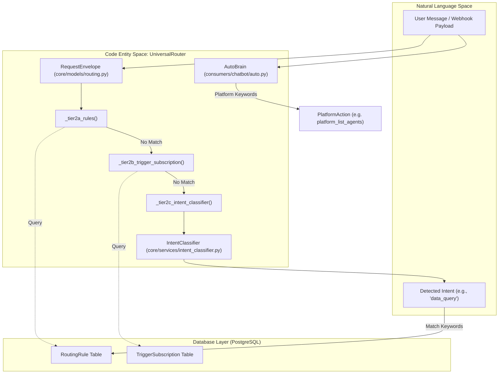
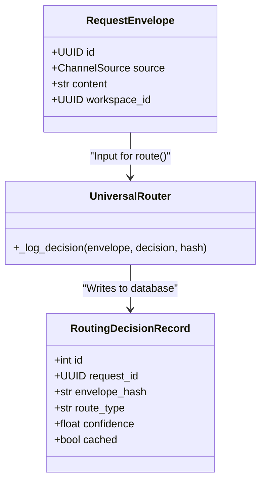

# Tier 2: Rule-Based Routing

Relevant source files

The following files were used as context for generating this wiki page:

- [docs/PRDS/53-WEBHOOK-TRIGGER-SYSTEM-PRD.md](docs/PRDS/53-WEBHOOK-TRIGGER-SYSTEM-PRD.md)
- [docs/reviews/COMPOSIO-TOOL-REGRESSION-REVIEW.md](docs/reviews/COMPOSIO-TOOL-REGRESSION-REVIEW.md)
- [frontend/components/settings/SettingsPanel.tsx](frontend/components/settings/SettingsPanel.tsx)
- [frontend/components/settings/SystemLLMSettingsTab.tsx](frontend/components/settings/SystemLLMSettingsTab.tsx)
- [frontend/components/settings/SystemSettingsTab.tsx](frontend/components/settings/SystemSettingsTab.tsx)
- [frontend/components/settings/WebhooksSettingsTab.tsx](frontend/components/settings/WebhooksSettingsTab.tsx)
- [frontend/components/workspace-provider.tsx](frontend/components/workspace-provider.tsx)
- [orchestrator/alembic/versions/20260213_add_workspace_webhook_key.py](orchestrator/alembic/versions/20260213_add_workspace_webhook_key.py)
- [orchestrator/api/chat.py](orchestrator/api/chat.py)
- [orchestrator/api/chat_voice.py](orchestrator/api/chat_voice.py)
- [orchestrator/api/webhooks.py](orchestrator/api/webhooks.py)
- [orchestrator/api/workspaces.py](orchestrator/api/workspaces.py)
- [orchestrator/consumers/chatbot/auto.py](orchestrator/consumers/chatbot/auto.py)
- [orchestrator/consumers/chatbot/intent_classifier.py](orchestrator/consumers/chatbot/intent_classifier.py)
- [orchestrator/consumers/chatbot/personality.py](orchestrator/consumers/chatbot/personality.py)
- [orchestrator/consumers/chatbot/service.py](orchestrator/consumers/chatbot/service.py)
- [orchestrator/consumers/chatbot/smart_tool_router.py](orchestrator/consumers/chatbot/smart_tool_router.py)
- [orchestrator/core/llm/manager.py](orchestrator/core/llm/manager.py)
- [orchestrator/core/models/routing.py](orchestrator/core/models/routing.py)
- [orchestrator/core/routing/engine.py](orchestrator/core/routing/engine.py)
- [orchestrator/core/routing/ingestors/webhook.py](orchestrator/core/routing/ingestors/webhook.py)
- [orchestrator/modules/orchestrator/service.py](orchestrator/modules/orchestrator/service.py)
- [orchestrator/modules/tools/discovery/actions_analytics_enhanced.py](orchestrator/modules/tools/discovery/actions_analytics_enhanced.py)
- [orchestrator/modules/tools/discovery/actions_harness.py](orchestrator/modules/tools/discovery/actions_harness.py)
- [orchestrator/modules/tools/discovery/handlers_analytics_enhanced.py](orchestrator/modules/tools/discovery/handlers_analytics_enhanced.py)
- [orchestrator/modules/tools/discovery/handlers_harness.py](orchestrator/modules/tools/discovery/handlers_harness.py)
- [orchestrator/modules/tools/discovery/handlers_missions.py](orchestrator/modules/tools/discovery/handlers_missions.py)
- [orchestrator/modules/tools/discovery/handlers_search.py](orchestrator/modules/tools/discovery/handlers_search.py)
- [orchestrator/modules/tools/discovery/platform_actions.py](orchestrator/modules/tools/discovery/platform_actions.py)
- [orchestrator/modules/tools/discovery/platform_executor.py](orchestrator/modules/tools/discovery/platform_executor.py)
- [orchestrator/modules/tools/tool_router.py](orchestrator/modules/tools/tool_router.py)
- [orchestrator/scripts/seed_blog_playbook.py](orchestrator/scripts/seed_blog_playbook.py)
- [orchestrator/services/harness_service.py](orchestrator/services/harness_service.py)

## Purpose and Scope

Tier 2 implements deterministic, rule-based routing for the Universal Router. It executes after Tier 0 (User Overrides) and Tier 1 (Cache Lookup) fail to produce a routing decision. Tier 2 consists of sequential sub-strategies that match incoming requests against workspace-configured routing rules, trigger subscriptions, and intent patterns.

Tier 2 provides workspace administrators with explicit control over routing behavior through:
- **Tier 2a**: Source pattern matching against `RoutingRule` table entries [core/routing/engine.py:109-115]().
- **Tier 2b**: Trigger subscriptions via `TriggerSubscription` table (specifically for Jira webhooks via Composio) [core/routing/engine.py:116-122]().
- **Tier 2c**: Keyword-based intent classification with fallback to rules [core/routing/engine.py:138-146]().

All Tier 2 operations are workspace-scoped to ensure multi-tenant isolation [core/routing/engine.py:89-93]().

---

## Tier 2 Architecture Overview

The routing engine processes an incoming `RequestEnvelope` through a chain of tiers. Tier 2 acts as the primary deterministic layer before falling back to semantic (Tier 2.5) or LLM-based (Tier 3) classification.

### Data Flow and Code Entities

**Sources**: [core/routing/engine.py:58-74](), [core/routing/engine.py:79-158](), [consumers/chatbot/auto.py:116-165]()

---

## Tier 2a: Routing Rules (Source Pattern Matching)

Tier 2a queries the `RoutingRule` table to find explicit matches based on the request's source channel (e.g., Slack, Telegram, Webhook).

### Implementation Details
The `_tier2a_rules` method filters rules by `workspace_id` and `is_active=True`, ordered by `priority` descending [core/routing/engine.py:182-191]().
- **Source Matching**: If `rule.source_pattern` is defined, it must match the envelope's source. If `None`, it acts as a catch-all for that workspace [core/routing/engine.py:198-202]().
- **Confidence**: Returns a `RoutingDecision` with `confidence=0.9` [core/routing/engine.py:204-209]().

**Sources**: [core/routing/engine.py:182-214]()

---

## Tier 2b: Trigger Subscriptions (Jira & Composio)

This tier handles specialized routing for external triggers, primarily focusing on Jira events ingested via Composio [core/routing/engine.py:220-224]().

### Resolution Logic
1. **Source Check**: Only executes if `envelope.source == ChannelSource.JIRA_TRIGGER` [core/routing/engine.py:226-227]().
2. **Entity Lookup**: Resolves the `ComposioEntity` for the workspace [core/routing/engine.py:230-234]().
3. **Subscription Match**: Searches for an active `TriggerSubscription`. It attempts to match the `trigger_name` found in the envelope metadata (e.g., `JIRA_NEW_ISSUE_TRIGGER`) [core/routing/engine.py:241-262]().
4. **Confidence**: Returns `confidence=0.95` [core/routing/engine.py:270-275]().

**Sources**: [core/routing/engine.py:220-278](), [core/models/composio.py:32-40]()

---

## Tier 2c: Intent Classification & Keywords

Tier 2c uses the `IntentClassifier` to perform keyword-based matching against rules when direct source patterns do not match.

### Process Flow
1. **Classification**: The `IntentClassifier` analyzes message content to return an intent category and a confidence score [core/routing/engine.py:288-290]().
2. **Threshold**: If confidence is `< 0.4`, the match is rejected [core/routing/engine.py:292-293]().
3. **Keyword Search**: The engine iterates through `RoutingRule` entries where the detected intent exists within the `intent_keywords` list [core/routing/engine.py:302-308]().
4. **Result**: Returns a decision with the confidence provided by the classifier [core/routing/engine.py:314-324]().

**Sources**: [core/routing/engine.py:284-326](), [core/services/intent_classifier.py:48-56]()

---

## Platform Action Keywords (AutoBrain)

A specialized form of rule-based routing occurs within the `AutoBrain` complexity assessor. It identifies "Platform Actions" using hardcoded heuristic patterns to bypass full LLM inference for simple system operations.

### Platform Keyword Categories
The system detects intents related to platform management using `_PLATFORM_KEYWORDS` [consumers/chatbot/auto.py:116-165]():

| Action Category | Example Keywords | Handler Function |
| :--- | :--- | :--- |
| `platform_list_agents` | "list my agents", "show my agents" | `list_agents` [modules/tools/discovery/platform_executor.py:175]() |
| `platform_list_recipes` | "list my recipes", "show my workflows" | `list_playbooks` [modules/tools/discovery/platform_executor.py:177]() |
| `platform_get_llm_usage` | "token usage", "how much have i spent" | `get_llm_usage` [modules/tools/discovery/platform_executor.py:179]() |
| `platform_query_data` | "query the database", "how many users" | `query_data` [modules/tools/discovery/handlers_scheduling.py:96]() |

### Complexity Assessment Integration
When `AutoBrain` detects these keywords, it marks the request with `Complexity.ATOM` or `Complexity.MOLECULE` [consumers/chatbot/auto.py:44-45](). This allows the `SmartChatOrchestrator` to execute the platform tool directly via the `PlatformActionExecutor` [modules/tools/discovery/platform_executor.py:164-173]().

**Sources**: [consumers/chatbot/auto.py:116-180](), [modules/tools/discovery/platform_executor.py:164-220]()

---

## Decision Logging and Persistence

Every decision made by Tier 2 is persisted to the `routing_decisions` table for audit and correction loops.

**Sources**: [core/routing/engine.py:561-586](), [core/models/routing.py:125-145]()

---