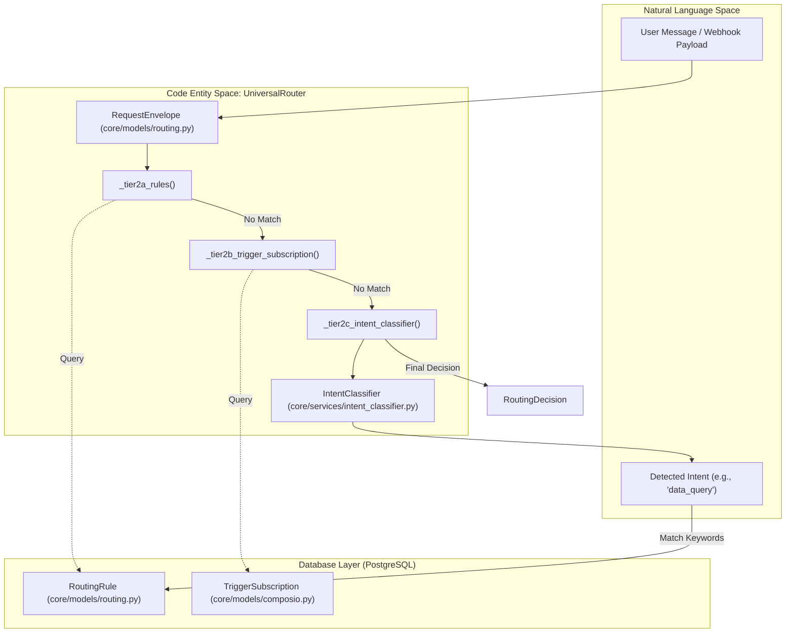
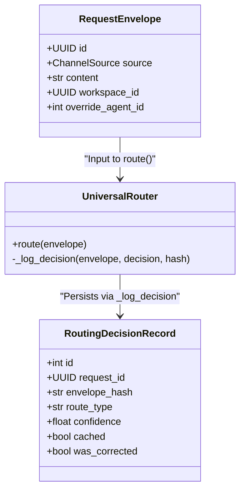

# Tier 2: Rule-Based Routing

Relevant source files

The following files were used as context for generating this wiki page:

- [orchestrator/api/routing.py](orchestrator/api/routing.py)
- [orchestrator/core/routing/engine.py](orchestrator/core/routing/engine.py)
- [orchestrator/modules/context/sections/tools.py](orchestrator/modules/context/sections/tools.py)
- [orchestrator/modules/tools/discovery/action_registry.py](orchestrator/modules/tools/discovery/action_registry.py)
- [orchestrator/modules/tools/discovery/handlers_search.py](orchestrator/modules/tools/discovery/handlers_search.py)
- [orchestrator/modules/tools/tool_router.py](orchestrator/modules/tools/tool_router.py)
- [orchestrator/scripts/setup_jira_trigger.py](orchestrator/scripts/setup_jira_trigger.py)
- [orchestrator/tests/test_action_registry_filtered.py](orchestrator/tests/test_action_registry_filtered.py)
- [orchestrator/tests/test_tool_router_semantic.py](orchestrator/tests/test_tool_router_semantic.py)

## Purpose and Scope

Tier 2 implements deterministic, rule-based routing for the Universal Router. It executes after Tier 0 (User Overrides) and Tier 1 (Cache Lookup) fail to produce a routing decision [[orchestrator/core/routing/engine.py:109-122]](). Tier 2 consists of sequential sub-strategies that match incoming requests against workspace-configured routing rules, trigger subscriptions, and intent patterns.

Tier 2 provides workspace administrators with explicit control over routing behavior through:
- **Tier 2a**: Source pattern matching against `RoutingRule` table entries [[orchestrator/core/routing/engine.py:109-115]]().
- **Tier 2b**: Trigger subscriptions via `TriggerSubscription` table (specifically for Jira webhooks via Composio) [[orchestrator/core/routing/engine.py:116-122]]().
- **Tier 2c**: Keyword-based intent classification matching against `RoutingRule.intent_keywords` [[orchestrator/core/routing/engine.py:138-146]]().

All Tier 2 operations are workspace-scoped to ensure multi-tenant isolation [[orchestrator/core/routing/engine.py:89-93]]().

**Sources**: [[orchestrator/core/routing/engine.py:1-16]](), [[orchestrator/core/routing/engine.py:109-146]]()

---

## Tier 2 Architecture Overview

The routing engine processes an incoming `RequestEnvelope` through a chain of tiers. Tier 2 acts as the primary deterministic layer before falling back to semantic similarity (Tier 2.5) or LLM-based classification (Tier 3).

### Data Flow and Code Entities

**Sources**: [[orchestrator/core/routing/engine.py:58-74]](), [[orchestrator/core/routing/engine.py:79-158]](), [[orchestrator/core/models/routing.py:60-83]]()

---

## Tier 2a: Routing Rules (Source Pattern Matching)

Tier 2a queries the `RoutingRule` table to find explicit matches based on the request's source channel (e.g., Slack, Telegram, Webhook).

### Implementation Details
The `_tier2a_rules` method filters rules by `workspace_id` and `is_active=True`, ordered by `priority` descending [[orchestrator/core/routing/engine.py:182-191]]().
- **Source Matching**: If `rule.source_pattern` is defined, it must match the envelope's source. If `None`, it acts as a catch-all for that workspace [[orchestrator/core/routing/engine.py:198-202]]().
- **Confidence**: Returns a `RoutingDecision` with `confidence=0.9` and `route_type` as "agent" or "workflow" [[orchestrator/core/routing/engine.py:204-209]]().

**Sources**: [[orchestrator/core/routing/engine.py:182-214]](), [[orchestrator/core/models/routing.py:108-122]]()

---

## Tier 2b: Trigger Subscriptions (Jira & Composio)

This tier handles specialized routing for external triggers, primarily focusing on Jira events ingested via Composio [[orchestrator/core/routing/engine.py:220-224]]().

### Resolution Logic
1. **Source Check**: Only executes if `envelope.source == ChannelSource.JIRA_TRIGGER` [[orchestrator/core/routing/engine.py:226-227]]().
2. **Subscription Match**: Searches for an active `TriggerSubscription`. It attempts to match the `trigger_name` found in the envelope metadata (e.g., `JIRA_NEW_ISSUE_TRIGGER`) [[orchestrator/core/routing/engine.py:241-262]]().
3. **Confidence**: Returns `confidence=0.95` [[orchestrator/core/routing/engine.py:270-275]]().

**Sources**: [[orchestrator/core/routing/engine.py:220-278]](), [[orchestrator/core/models/composio.py:22-32]](), [[orchestrator/scripts/setup_jira_trigger.py:123-137]]()

---

## Tier 2c: Intent Classification & Keywords

Tier 2c uses the `IntentClassifier` to perform keyword-based matching against rules when direct source patterns do not match.

### Process Flow
1. **Classification**: The `IntentClassifier` analyzes message content to return an intent category and a confidence score [[orchestrator/core/routing/engine.py:288-290]]().
2. **Threshold**: If confidence is `< 0.4`, the match is rejected [[orchestrator/core/routing/engine.py:292-293]]().
3. **Keyword Search**: The engine iterates through `RoutingRule` entries where the detected intent exists within the `intent_keywords` JSONB list [[orchestrator/core/routing/engine.py:302-308]]().
4. **Result**: Returns a decision with the confidence provided by the classifier [[orchestrator/core/routing/engine.py:314-324]]().

**Sources**: [[orchestrator/core/routing/engine.py:284-326]](), [[orchestrator/core/models/routing.py:116-116]]()

---

## Tool Discovery Integration

Tier 2 routing often leads to agent execution where rule-based logic extends to tool selection. The `ToolsSection` within the `ContextService` manages how tools are loaded based on the routing outcome.

### Tool Loading Strategies
When a rule routes to an agent, the `ToolsSection.load_tools` method can use several strategies [[orchestrator/modules/context/sections/tools.py:61-71]]():
- **FULL**: Loads all assigned tools, including core platform actions and Composio tools [[orchestrator/modules/context/sections/tools.py:144-150]]().
- **FILTERED**: Uses the `SmartToolRouter` to trim the tool list based on the intent detected during routing [[orchestrator/modules/context/sections/tools.py:167-177]]().
- **DISPATCHER_ONLY**: Limits the agent to the `platform_execute` tool, which can be semantically narrowed to top-K relevant actions [[orchestrator/modules/context/sections/tools.py:112-121]]().

**Sources**: [[orchestrator/modules/context/sections/tools.py:32-38]](), [[orchestrator/modules/context/sections/tools.py:61-106]](), [[orchestrator/modules/tools/tool_router.py:124-138]]()

---

## Decision Logging and Persistence

Every decision made by Tier 2 is persisted to the `routing_decisions` table for audit and correction loops.

**Sources**: [[orchestrator/core/routing/engine.py:561-586]](), [[orchestrator/core/models/routing.py:88-105]]()

---

## Admin API for Rules

Administrators manage Tier 2 behavior via the `/api/routing` endpoints.

| Endpoint | Method | Purpose |
| :--- | :--- | :--- |
| `/api/routing/rules` | `POST` | Create a new `RoutingRule` with `source_pattern` or `intent_keywords` [[orchestrator/api/routing.py:162-206]]() |
| `/api/routing/rules` | `GET` | List all active rules for the current workspace [[orchestrator/api/routing.py:213-231]]() |
| `/api/routing/decisions` | `GET` | Review recent routing outcomes and their confidence levels [[orchestrator/api/routing.py:110-155]]() |

**Sources**: [[orchestrator/api/routing.py:33-231]]()

---