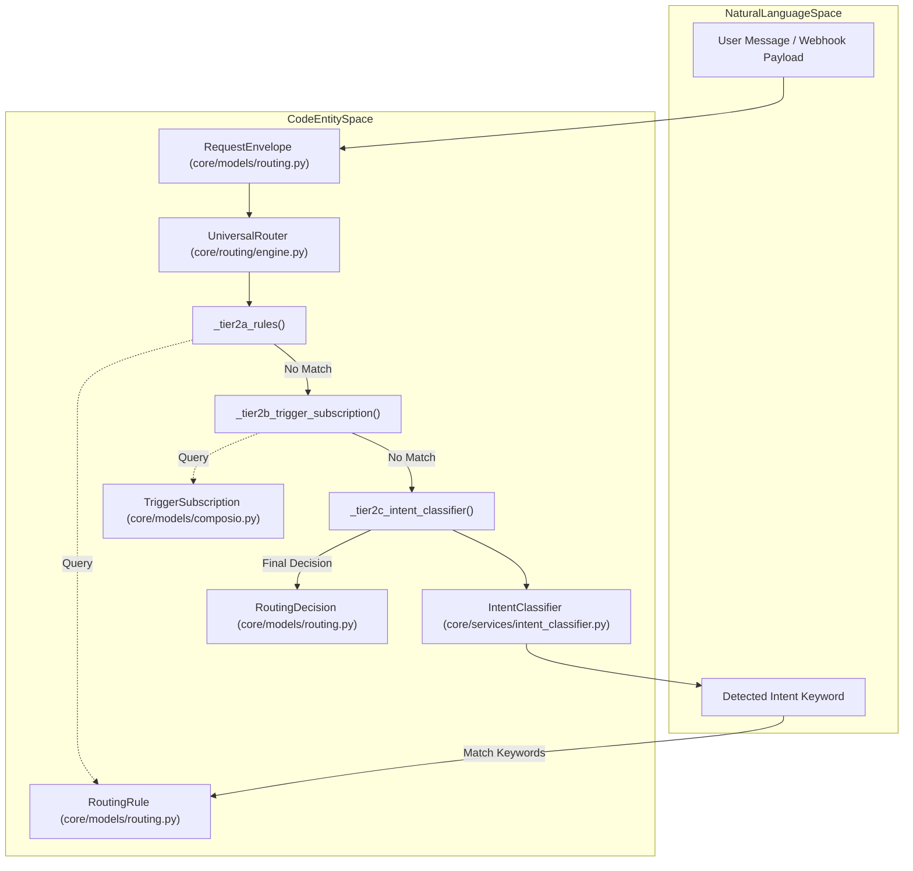
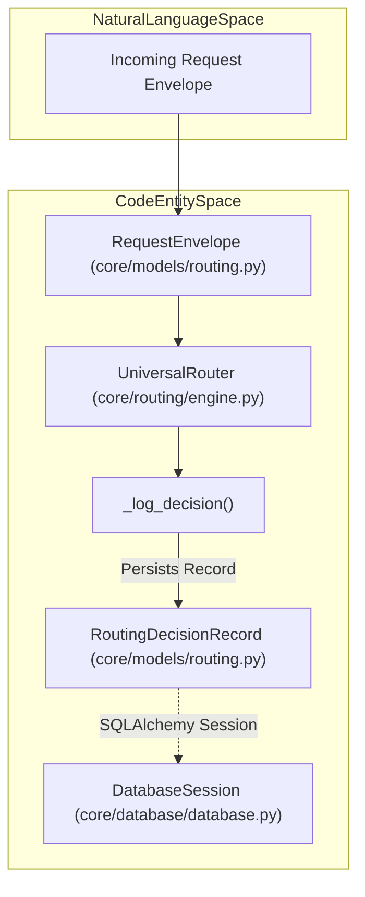

# Tier 2: Rule-Based Routing

Relevant source files

The following files were used as context for generating this wiki page:

- [orchestrator/api/chat.py](orchestrator/api/chat.py)
- [orchestrator/api/routing.py](orchestrator/api/routing.py)
- [orchestrator/consumers/chatbot/auto.py](orchestrator/consumers/chatbot/auto.py)
- [orchestrator/consumers/chatbot/service.py](orchestrator/consumers/chatbot/service.py)
- [orchestrator/core/llm/manager.py](orchestrator/core/llm/manager.py)
- [orchestrator/core/routing/engine.py](orchestrator/core/routing/engine.py)
- [orchestrator/modules/agents/factory/agent_factory.py](orchestrator/modules/agents/factory/agent_factory.py)
- [orchestrator/modules/tools/discovery/actions_harness.py](orchestrator/modules/tools/discovery/actions_harness.py)
- [orchestrator/modules/tools/discovery/actions_routing.py](orchestrator/modules/tools/discovery/actions_routing.py)
- [orchestrator/modules/tools/discovery/handlers_harness.py](orchestrator/modules/tools/discovery/handlers_harness.py)
- [orchestrator/modules/tools/discovery/handlers_routing.py](orchestrator/modules/tools/discovery/handlers_routing.py)
- [orchestrator/modules/tools/discovery/platform_actions.py](orchestrator/modules/tools/discovery/platform_actions.py)
- [orchestrator/modules/tools/discovery/platform_executor.py](orchestrator/modules/tools/discovery/platform_executor.py)
- [orchestrator/scripts/setup_jira_trigger.py](orchestrator/scripts/setup_jira_trigger.py)
- [orchestrator/services/harness_service.py](orchestrator/services/harness_service.py)
- [orchestrator/services/heartbeat_service.py](orchestrator/services/heartbeat_service.py)
- [orchestrator/services/page_context.py](orchestrator/services/page_context.py)
- [orchestrator/tests/test_harness_power_mode.py](orchestrator/tests/test_harness_power_mode.py)
- [orchestrator/tests/test_harness_routing_rule.py](orchestrator/tests/test_harness_routing_rule.py)
- [orchestrator/tests/test_harness_self_management.py](orchestrator/tests/test_harness_self_management.py)
- [orchestrator/tests/test_prd221_page_context.py](orchestrator/tests/test_prd221_page_context.py)
- [orchestrator/tests/test_prd221_page_prior_tools.py](orchestrator/tests/test_prd221_page_prior_tools.py)
- [orchestrator/tests/test_w1s9_idle_in_tx.py](orchestrator/tests/test_w1s9_idle_in_tx.py)

Tier 2 implements deterministic, rule-based routing for the `UniversalRouter`. It executes after Tier 0 (User Overrides) and Tier 1 (Cache Lookup) fail to produce a routing decision `[orchestrator/core/routing/engine.py:95-108]()`. Tier 2 consists of sequential sub-strategies that match incoming requests against workspace-configured routing rules, trigger subscriptions, and intent patterns `[orchestrator/core/routing/engine.py:109-146]()`.

Tier 2 provides workspace administrators with explicit control over routing behavior through:
- **Tier 2a**: Source pattern matching against `RoutingRule` table entries `[orchestrator/core/routing/engine.py:109-115]()`.
- **Tier 2b**: Trigger subscriptions via the `TriggerSubscription` table (specifically for external webhook triggers such as Jira via Composio) `[orchestrator/core/routing/engine.py:116-122]()`.
- **Tier 2c**: Keyword-based intent classification matching against `RoutingRule.intent_keywords` `[orchestrator/core/routing/engine.py:138-146]()`.

All Tier 2 operations are workspace-scoped to ensure strict multi-tenant isolation `[orchestrator/core/routing/engine.py:89-93]()`.

Sources: `[orchestrator/core/routing/engine.py:1-16]`, `[orchestrator/core/routing/engine.py:109-146]()`

---

## Tier 2 Architecture Overview

The routing engine processes an incoming `RequestEnvelope` through a tiered chain. Tier 2 acts as the primary deterministic layer before falling back to semantic similarity (Tier 2.5) or LLM-based classification (Tier 3).

### Data Flow and Code Entities

Sources: `[orchestrator/core/routing/engine.py:58-74]`, `[orchestrator/core/routing/engine.py:79-158]`, `[orchestrator/core/models/routing.py:60-83]()`

---

## Tier 2a: Routing Rules (Source Pattern Matching)

Tier 2a queries the `RoutingRule` table to find explicit matches based on the request's source channel (e.g., Slack, Telegram, Webhook).

### Implementation Details
The `_tier2a_rules` method filters rules by `workspace_id` and `is_active=True`, ordered by `priority` descending `[orchestrator/core/routing/engine.py:182-191]()`.
- **Source Matching**: If `rule.source_pattern` is defined, it must match the envelope's source. If `None`, it acts as a catch-all rule for that workspace `[orchestrator/core/routing/engine.py:198-202]()`.
- **Confidence**: Returns a `RoutingDecision` with `confidence=0.9` and `route_type` designated as either an agent or workflow target `[orchestrator/core/routing/engine.py:204-209]()`.

Sources: `[orchestrator/core/routing/engine.py:182-214]`, `[orchestrator/core/models/routing.py:108-122]()`

---

## Tier 2b: Trigger Subscriptions (Jira & Composio)

This tier handles specialized routing for external triggers, focusing on webhook events ingested via Composio `[orchestrator/core/routing/engine.py:220-224]()`.

### Resolution Logic
1. **Source Check**: Only executes if `envelope.source == ChannelSource.JIRA_TRIGGER` `[orchestrator/core/routing/engine.py:226-227]()`.
2. **Subscription Match**: Searches for an active `TriggerSubscription` entity, attempting to match the `trigger_name` found in the envelope metadata `[orchestrator/core/routing/engine.py:241-262]()`.
3. **Confidence**: Returns a high confidence score of `0.95` upon a successful subscription match `[orchestrator/core/routing/engine.py:270-275]()`.

Sources: `[orchestrator/core/routing/engine.py:220-278]`, `[orchestrator/core/models/composio.py:22-32]`, `[orchestrator/scripts/setup_jira_trigger.py:123-137]()`

---

## Tier 2c: Intent Classification & Keywords

Tier 2c utilizes the `IntentClassifier` service to perform keyword-based matching against rules when direct source patterns do not match.

### Process Flow
1. **Classification**: The `IntentClassifier` analyzes message content to return an intent category and a confidence score `[orchestrator/core/routing/engine.py:288-290]()`.
2. **Threshold Check**: If confidence falls below `0.4`, the match is rejected `[orchestrator/core/routing/engine.py:292-293]()`.
3. **Keyword Search**: The engine iterates through `RoutingRule` entries where the detected intent exists within the `intent_keywords` JSONB list `[orchestrator/core/routing/engine.py:302-308]()`.
4. **Result**: Returns a decision containing the confidence score provided by the classifier `[orchestrator/core/routing/engine.py:314-324]()`.

Sources: `[orchestrator/core/routing/engine.py:284-326]`, `[orchestrator/core/models/routing.py:116-116]()`

---

## Integration with AutoBrain (Complexity Assessment)

While `UniversalRouter` handles agent and workflow selection, `AutoBrain` operates in parallel as the progressive complexity assessor `[consumers/chatbot/auto.py:14-18]()`.

`AutoBrain` assesses request complexity across a 3-tier strategy:
1. **Tier 1**: Redis cache lookup.
2. **Tier 2**: Fast heuristic regex patterns `[consumers/chatbot/auto.py:97-119]()`.
3. **Tier 3**: LLM-based classification `[consumers/chatbot/auto.py:17]()`.

When a request matches platform management keywords, `AutoBrain` injects `tool_hints` such as `platform_list_agents` or `platform_query_data` `[consumers/chatbot/auto.py:121-176]()`. This ensures platform management requests route deterministically with high confidence.

Sources: `[consumers/chatbot/auto.py:1-22]`, `[consumers/chatbot/auto.py:121-176]()`

---

## Decision Logging and Persistence

Every decision made by Tier 2 is persisted to the `routing_decisions` table via `UniversalRouter._log_decision()` for audit trails and continuous learning loops.

### Decision Persistence Flow

Sources: `[orchestrator/core/routing/engine.py:561-586]`, `[orchestrator/core/models/routing.py:88-105]()`

---

## Admin API for Rules

Administrators manage Tier 2 rule definitions and audit trails via the `/api/routing` router endpoints.

| Endpoint | Method | Purpose |
| :--- | :--- | :--- |
| `/api/routing/rules` | `POST` | Create a new `RoutingRule` with `source_pattern` or `intent_keywords` `[orchestrator/api/routing.py:162-206]()` |
| `/api/routing/rules` | `GET` | List all active rules for the current workspace `[orchestrator/api/routing.py:213-231]()` |
| `/api/routing/decisions` | `GET` | Review recent routing outcomes and their confidence levels `[orchestrator/api/routing.py:110-155]()` |

Sources: `[orchestrator/api/routing.py:33-231]()`

---