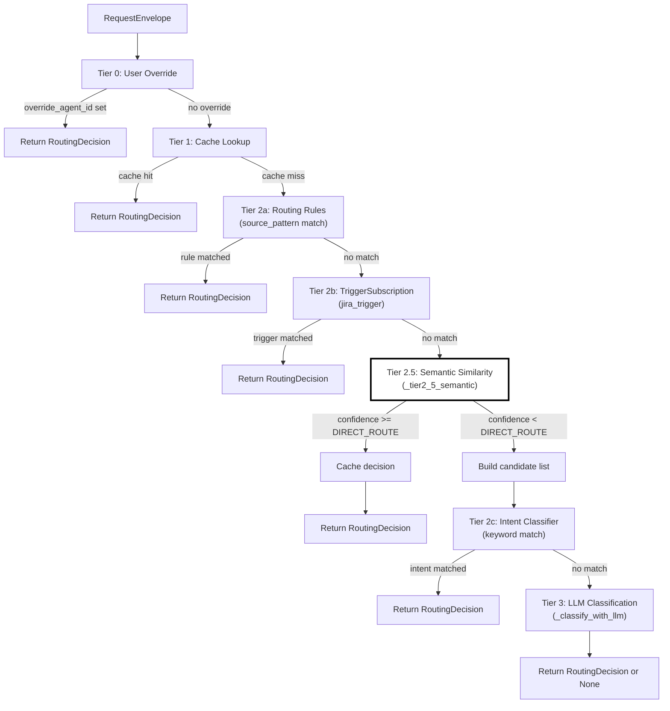
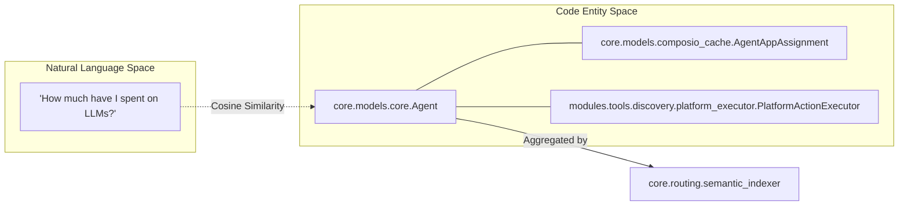
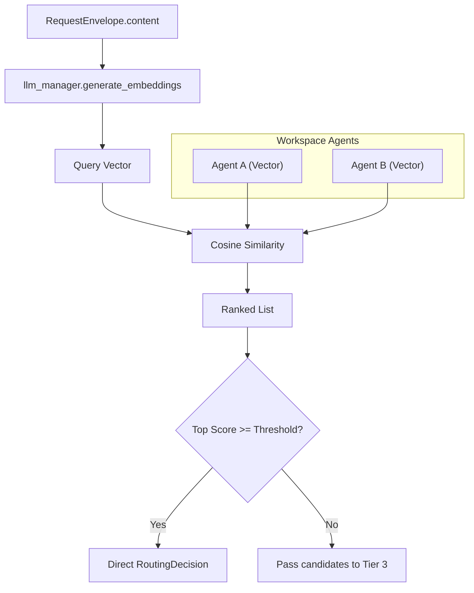
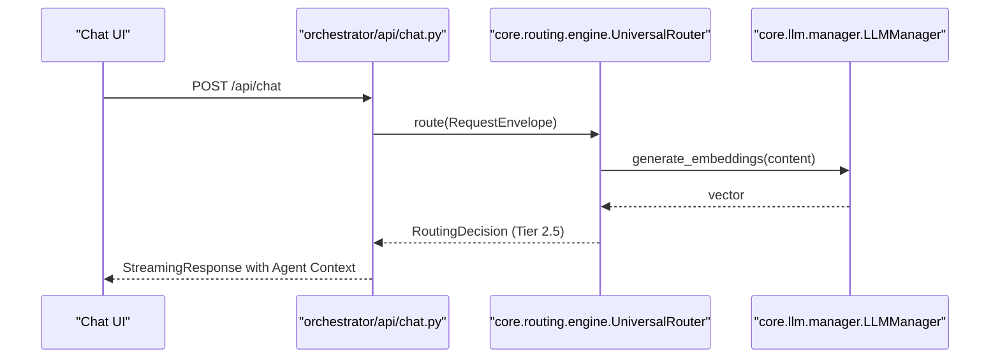

# Tier 2.5: Semantic Similarity

Relevant source files

The following files were used as context for generating this wiki page:

- [docs/reviews/COMPOSIO-TOOL-REGRESSION-REVIEW.md](docs/reviews/COMPOSIO-TOOL-REGRESSION-REVIEW.md)
- [orchestrator/alembic/versions/20260224_add_semantic_routing_columns.py](orchestrator/alembic/versions/20260224_add_semantic_routing_columns.py)
- [orchestrator/alembic/versions/20260225_create_marketplace_widgets.py](orchestrator/alembic/versions/20260225_create_marketplace_widgets.py)
- [orchestrator/alembic/versions/20260225_create_sdk_api_keys.py](orchestrator/alembic/versions/20260225_create_sdk_api_keys.py)
- [orchestrator/alembic/versions/20260225_create_widget_installs_reviews.py](orchestrator/alembic/versions/20260225_create_widget_installs_reviews.py)
- [orchestrator/alembic/versions/20260225_create_workspace_shares.py](orchestrator/alembic/versions/20260225_create_workspace_shares.py)
- [orchestrator/api/chat.py](orchestrator/api/chat.py)
- [orchestrator/api/chat_voice.py](orchestrator/api/chat_voice.py)
- [orchestrator/consumers/chatbot/auto.py](orchestrator/consumers/chatbot/auto.py)
- [orchestrator/consumers/chatbot/intent_classifier.py](orchestrator/consumers/chatbot/intent_classifier.py)
- [orchestrator/consumers/chatbot/personality.py](orchestrator/consumers/chatbot/personality.py)
- [orchestrator/consumers/chatbot/service.py](orchestrator/consumers/chatbot/service.py)
- [orchestrator/consumers/chatbot/smart_tool_router.py](orchestrator/consumers/chatbot/smart_tool_router.py)
- [orchestrator/core/llm/manager.py](orchestrator/core/llm/manager.py)
- [orchestrator/core/routing/engine.py](orchestrator/core/routing/engine.py)
- [orchestrator/core/routing/semantic_indexer.py](orchestrator/core/routing/semantic_indexer.py)
- [orchestrator/core/seeds/seed_cto_agent.py](orchestrator/core/seeds/seed_cto_agent.py)
- [orchestrator/modules/orchestrator/service.py](orchestrator/modules/orchestrator/service.py)
- [orchestrator/modules/tools/discovery/actions_analytics_enhanced.py](orchestrator/modules/tools/discovery/actions_analytics_enhanced.py)
- [orchestrator/modules/tools/discovery/handlers_analytics_enhanced.py](orchestrator/modules/tools/discovery/handlers_analytics_enhanced.py)
- [orchestrator/modules/tools/discovery/handlers_search.py](orchestrator/modules/tools/discovery/handlers_search.py)
- [orchestrator/modules/tools/discovery/platform_actions.py](orchestrator/modules/tools/discovery/platform_actions.py)
- [orchestrator/modules/tools/discovery/platform_executor.py](orchestrator/modules/tools/discovery/platform_executor.py)
- [orchestrator/modules/tools/tool_router.py](orchestrator/modules/tools/tool_router.py)

## Purpose and Scope

Tier 2.5 of the Universal Router implements **agent embedding-based cosine similarity** to intelligently route requests to the most relevant agent. This tier sits between rule-based routing (Tier 2a/2b) and keyword-based intent classification (Tier 2c), providing a balance between speed and reasoning.

Unlike keyword matching, which relies on exact string patterns, semantic similarity understands the **meaning** of the user's request and compares it against pre-computed vector representations of each agent's capabilities. This enables routing based on conceptual overlap rather than lexical overlap, which is critical for complex multi-agent environments.

**Sources:** [orchestrator/core/routing/engine.py:11-16](), [orchestrator/core/routing/engine.py:123-126]()

---

## Routing Tier Sequence

Tier 2.5 executes **after** pattern-based tiers (2a, 2b) but **before** keyword matching (2c) and LLM classification (Tier 3). This positioning is intentional: semantic matching is more nuanced than keyword matching but significantly faster and cheaper than full LLM calls.

### UniversalRouter Execution Flow

Title: UniversalRouter Tiered Logic

**Key design decision:** Tier 2.5 runs *before* Tier 2c because semantic matching understands agent capabilities, while keyword matching is coarse-grained and can be hijacked by overly broad rules. If semantic candidates are found, the system can prioritize them in the Tier 3 LLM fallback.

**Sources:** [orchestrator/core/routing/engine.py:123-147]()

---

## Agent Embedding Generation

Each agent's semantic embedding is a **vector representation** of its capabilities. The system aggregates data from multiple internal models to create a comprehensive profile for indexing.

### Embedding Input Sources
- **Core Identity:** Agent `name`, `description`, and `slug` from the `Agent` model.
- **Persona:** Instructions and personality traits defined in the agent's configuration.
- **Tools & Skills:** The descriptions of tools associated with the agent via `AgentAppAssignment` or `SkillLoader`.
- **Platform Actions:** If the agent has platform management capabilities, those actions (e.g., `platform_list_agents`) are included in the semantic text.

Title: Natural Language to Code Entity Mapping (Agent Profile)

**Sources:** [orchestrator/core/routing/engine.py:33-40](), [orchestrator/modules/tools/discovery/platform_executor.py:164-172](), [orchestrator/consumers/chatbot/intent_classifier.py:78-107]()

---

## Similarity Calculation and Thresholds

When a request arrives, Tier 2.5 computes cosine similarity between the **query embedding** and each active agent's embedding in the current workspace. The system utilizes the `LLMManager` to interface with embedding providers (typically OpenAI or OpenRouter).

### Confidence Thresholds

| Threshold | Type | Behavior |
|-----------|----------|----------|
| **High (e.g. 0.90+)** | `DIRECT_ROUTE` | Direct routing — return `RoutingDecision` immediately and cache the result for Tier 1. |
| **Medium (e.g. 0.50+)** | `CANDIDATE` | Included in the candidate list passed to Tier 3 (LLM) to narrow the search space. |
| **Low** | `REJECT` | Ignored; the agent is considered irrelevant to the user's intent. |

Title: Semantic Matching Process

**Sources:** [orchestrator/core/routing/engine.py:129-136](), [orchestrator/core/llm/manager.py:30-41]()

---

## Implementation Details

### Intent Integration
Tier 2.5 is closely coupled with the `SmartIntentClassifier`. If the classifier detects a specific intent (e.g., `DATA_QUERY`), the semantic router prioritizes agents whose toolsets match that intent (e.g., agents with `platform_get_llm_usage` or `query_database`).

### Tool Looping & Semantic Deduplication
Semantic similarity is also used in the `ToolExecutionTracker` within the `ChatService`. It prevents infinite tool loops by checking if a new tool query is semantically similar to a previous one in the same conversation turn using `_queries_are_similar`.

### Candidate Shortlisting
If no agent meets the direct routing threshold, Tier 2.5 returns a list of candidates. This list is then used in Tier 3 (LLM Classification) to provide the LLM with "hints," significantly improving the accuracy of the final routing decision compared to a "blind" classification.

**Sources:** [orchestrator/consumers/chatbot/service.py:57-67](), [orchestrator/consumers/chatbot/service.py:78-85](), [orchestrator/consumers/chatbot/intent_classifier.py:23-34](), [orchestrator/core/routing/engine.py:149-158]()

---

## Integration with Chat API

The routing decision (including semantic confidence) is processed within the `api/chat.py` flow. Before streaming a response, the `UniversalRouter` is called to resolve the target agent.

Title: Chat to Routing Integration

**Sources:** [orchestrator/api/chat.py:22-24](), [orchestrator/api/chat.py:103-107](), [orchestrator/core/llm/manager.py:86-117]()

---