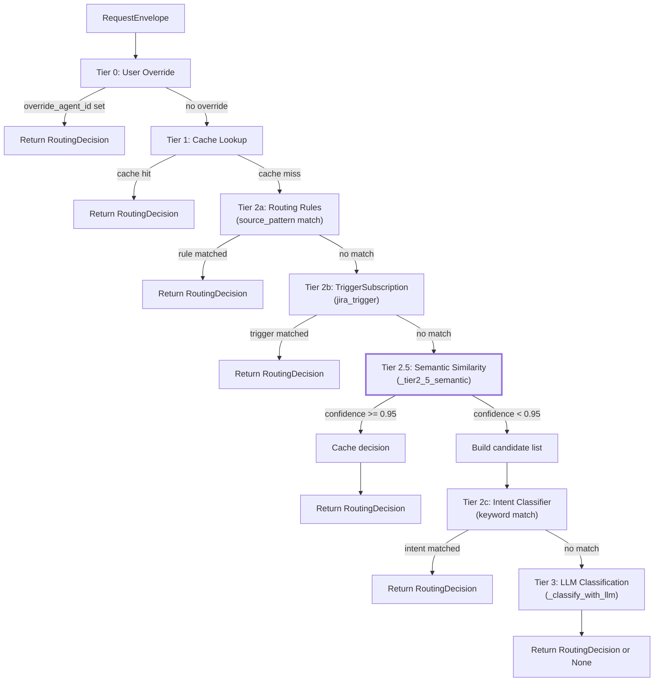
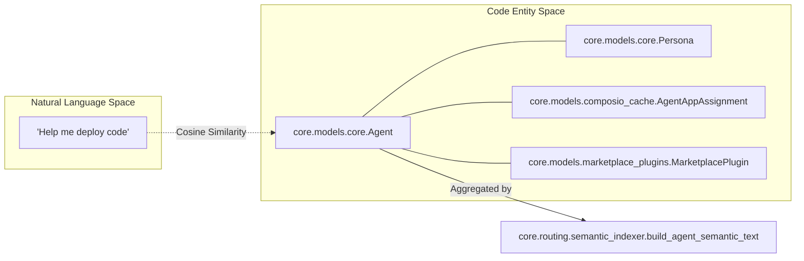
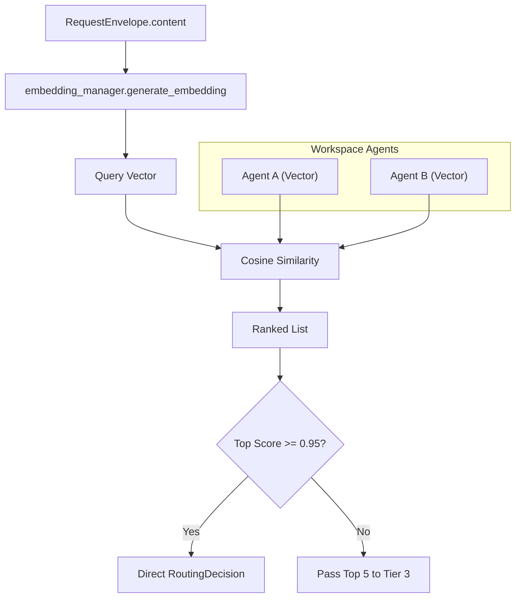
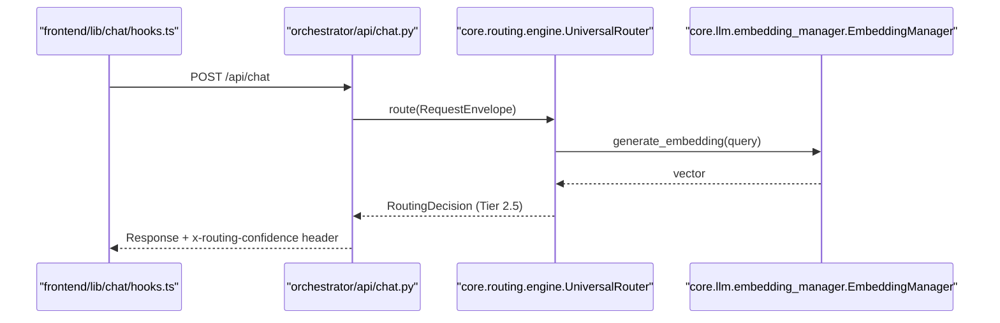

# Tier 2.5: Semantic Similarity

Relevant source files

The following files were used as context for generating this wiki page:

- [orchestrator/alembic/versions/20260224_add_semantic_routing_columns.py](orchestrator/alembic/versions/20260224_add_semantic_routing_columns.py)
- [orchestrator/alembic/versions/20260225_create_marketplace_widgets.py](orchestrator/alembic/versions/20260225_create_marketplace_widgets.py)
- [orchestrator/alembic/versions/20260225_create_sdk_api_keys.py](orchestrator/alembic/versions/20260225_create_sdk_api_keys.py)
- [orchestrator/alembic/versions/20260225_create_widget_installs_reviews.py](orchestrator/alembic/versions/20260225_create_widget_installs_reviews.py)
- [orchestrator/alembic/versions/20260225_create_workspace_shares.py](orchestrator/alembic/versions/20260225_create_workspace_shares.py)
- [orchestrator/api/routing.py](orchestrator/api/routing.py)
- [orchestrator/core/routing/engine.py](orchestrator/core/routing/engine.py)
- [orchestrator/core/routing/semantic_indexer.py](orchestrator/core/routing/semantic_indexer.py)
- [orchestrator/modules/context/sections/tools.py](orchestrator/modules/context/sections/tools.py)
- [orchestrator/modules/tools/discovery/action_registry.py](orchestrator/modules/tools/discovery/action_registry.py)
- [orchestrator/modules/tools/discovery/handlers_search.py](orchestrator/modules/tools/discovery/handlers_search.py)
- [orchestrator/modules/tools/tool_router.py](orchestrator/modules/tools/tool_router.py)
- [orchestrator/scripts/setup_jira_trigger.py](orchestrator/scripts/setup_jira_trigger.py)
- [orchestrator/tests/test_action_registry_filtered.py](orchestrator/tests/test_action_registry_filtered.py)
- [orchestrator/tests/test_tool_router_semantic.py](orchestrator/tests/test_tool_router_semantic.py)

## Purpose and Scope

Tier 2.5 of the Universal Router implements **agent embedding-based cosine similarity** to intelligently route requests to the most relevant agent. This tier sits between rule-based routing (Tier 2a/2b) and keyword-based intent classification (Tier 2c), providing a balance between speed and accuracy.

Unlike keyword matching, which relies on exact string patterns, semantic similarity understands the **meaning** of the user's request and compares it against pre-computed vector representations of each agent's capabilities. This enables routing based on conceptual overlap rather than lexical overlap.

**Sources:** [orchestrator/core/routing/engine.py:11-15](), [orchestrator/core/routing/semantic_indexer.py:2-8]()

---

## Routing Tier Sequence

Tier 2.5 executes **after** pattern-based tiers (2a, 2b) but **before** keyword matching (2c) and LLM classification (Tier 3). This positioning is intentional: semantic matching is more nuanced than keyword matching but faster than LLM calls.

### UniversalRouter Execution Flow

Title: UniversalRouter Tiered Logic

**Key design decision:** Tier 2.5 runs *before* Tier 2c because semantic matching understands agent capabilities, while keyword matching is coarse-grained and can be hijacked by overly broad rules. When semantic matching finds strong candidates, those are passed directly to Tier 3 (LLM), bypassing keyword matching entirely [orchestrator/core/routing/engine.py:124-126]().

**Sources:** [orchestrator/core/routing/engine.py:123-147]()

---

## Agent Embedding Generation

Each agent's semantic embedding is a **vector representation** of its capabilities. The `build_agent_semantic_text` function in `semantic_indexer.py` aggregates data from multiple database models to create a comprehensive profile for the vector engine.

### Embedding Input Sources
- **Core Identity:** `Agent.name`, `Agent.description`, `Agent.agent_type`, and `Agent.marketplace_category` [orchestrator/core/routing/semantic_indexer.py:42-48]().
- **Tags:** User-defined labels in `Agent.tags` [orchestrator/core/routing/semantic_indexer.py:51-53]().
- **Persona:** Data from `core.models.core.Persona` or `Agent.custom_persona_prompt` [orchestrator/core/routing/semantic_indexer.py:56-67]().
- **Skills:** Names and descriptions of assigned `Agent.skills` [orchestrator/core/routing/semantic_indexer.py:71-78]().
- **Tools:** Descriptions of connected apps from `ComposioAppCache` resolved via `AgentAppAssignment` [orchestrator/core/routing/semantic_indexer.py:82-108]().
- **Plugins:** Descriptions of assigned `MarketplacePlugin` items [orchestrator/core/routing/semantic_indexer.py:112-124]().

Title: Natural Language to Code Entity Mapping (Agent Profile)

**Sources:** [orchestrator/core/routing/semantic_indexer.py:33-126]()

---

## Similarity Calculation and Thresholds

When a request arrives, the `UniversalRouter` computes cosine similarity between the query embedding and each active agent's `semantic_embedding`. The system utilizes the `EmbeddingManager` (typically `qwen3-embedding-8b`, 2048-dim) to interface with providers [orchestrator/core/routing/semantic_indexer.py:7-8]().

### Confidence Thresholds

| Threshold | Constant | Behavior |
|-----------|----------|----------|
| **0.95** | `SIMILARITY_DIRECT_ROUTE` | Direct routing — return `RoutingDecision` immediately and cache the result [orchestrator/core/routing/semantic_indexer.py:24](). |
| **0.40** | `SIMILARITY_CANDIDATE_MIN` | Minimum score required for an agent to be included in the candidate list for Tier 3 [orchestrator/core/routing/semantic_indexer.py:25](). |
| **5** | `MAX_LLM_CANDIDATES` | Maximum number of agents passed to Tier 3 LLM classification [orchestrator/core/routing/semantic_indexer.py:26](). |

Title: Semantic Matching Process

**Sources:** [orchestrator/core/routing/engine.py:129-137](), [orchestrator/core/routing/semantic_indexer.py:24-26]()

---

## Implementation Details

### Incremental Reindexing
The system uses a `semantic_text_hash` stored in the `agents` table to avoid redundant embedding calls [orchestrator/alembic/versions/20260224_add_semantic_routing_columns.py:38](). The hash includes a model identifier (retrieved via `_get_embedding_model_id`) to ensure that if the embedding provider or model changes, all agents are automatically re-embedded [orchestrator/core/routing/semantic_indexer.py:143-152]().

### Candidate Shortlisting
If no agent meets the `SIMILARITY_DIRECT_ROUTE` threshold, Tier 2.5 returns a list of `semantic_candidates` [orchestrator/core/routing/engine.py:129](). This list is then used in Tier 3 (`_classify_with_llm`) to provide the LLM with "hints," significantly improving the accuracy of the final routing decision by narrowing the search space to the top 5 most semantically relevant agents [orchestrator/core/routing/engine.py:149]().

### Platform Action Narrowing (PRD-138)
The semantic logic extends to tool execution. In `ToolsSection`, if `SEMANTIC_TOOL_ROUTING` is enabled, the `platform_execute` tool's action enum is narrowed using `_rank_actions_for_dispatcher` [orchestrator/modules/context/sections/tools.py:118-121](). This uses the `ActionSemanticIndex` to rank the top-K platform actions (default 15) based on the user query [orchestrator/modules/tools/tool_router.py:100-102]().

**Sources:** [orchestrator/core/routing/engine.py:129-149](), [orchestrator/core/routing/semantic_indexer.py:159-187](), [orchestrator/modules/tools/tool_router.py:130-154]()

---

## Integration with Chat API

The routing decision (including semantic confidence) is processed within the chat pipeline. The `UniversalRouter` is called early in the request lifecycle to determine which agent or workflow should handle the message.

Title: Chat to Routing Integration

**Sources:** [orchestrator/core/routing/engine.py:79-80](), [orchestrator/core/routing/engine.py:129-137](), [orchestrator/modules/context/sections/tools.py:185-190]()

---