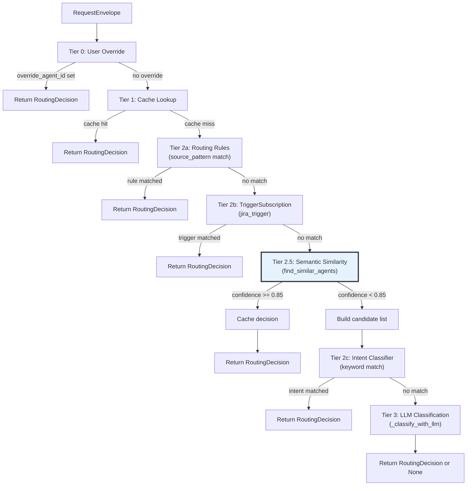
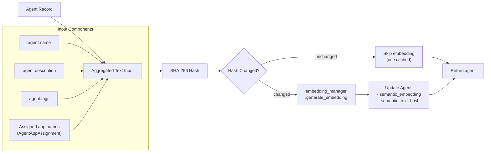
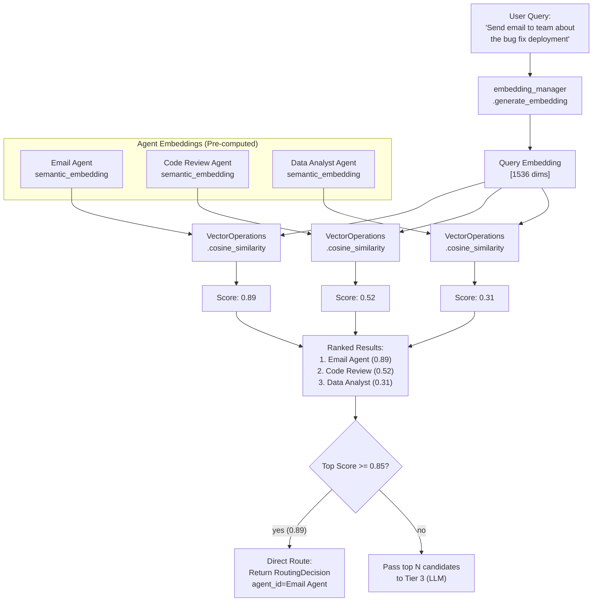
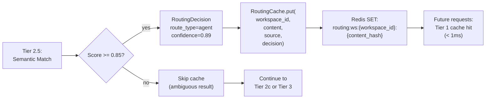
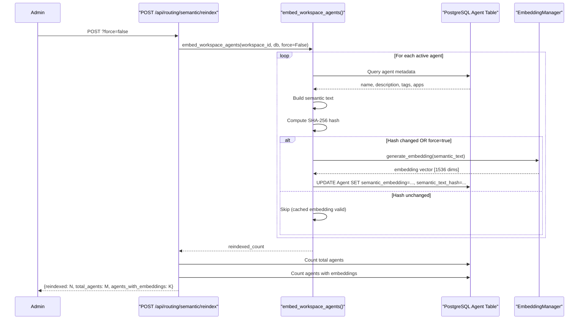
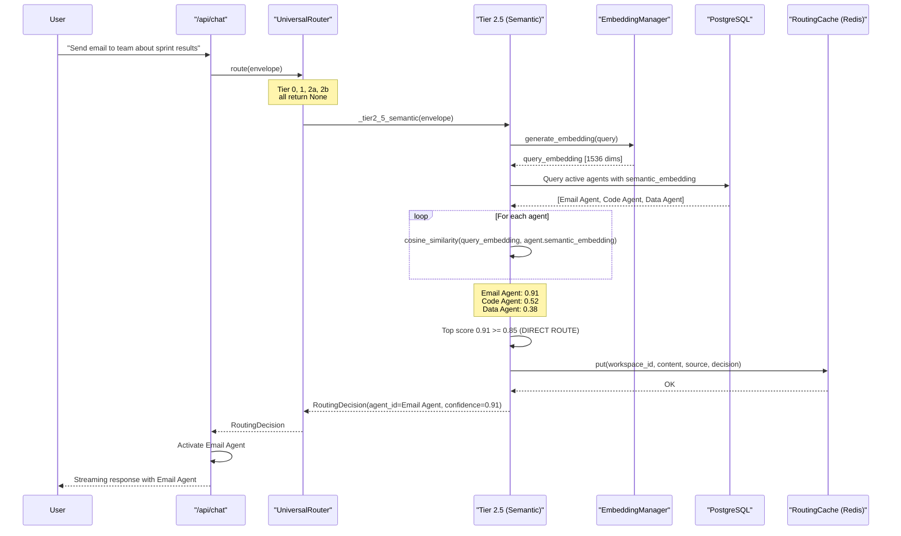
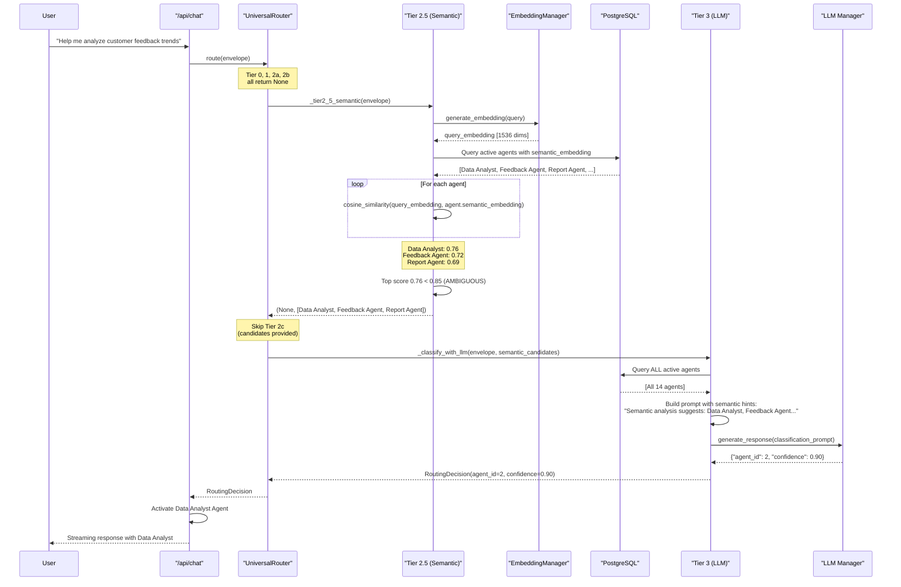

# Tier 2.5: Semantic Similarity

<details>
<summary>Relevant source files</summary>

The following files were used as context for generating this wiki page:

- [orchestrator/api/chat.py](orchestrator/api/chat.py)
- [orchestrator/api/routing.py](orchestrator/api/routing.py)
- [orchestrator/consumers/chatbot/auto.py](orchestrator/consumers/chatbot/auto.py)
- [orchestrator/consumers/chatbot/intent_classifier.py](orchestrator/consumers/chatbot/intent_classifier.py)
- [orchestrator/consumers/chatbot/personality.py](orchestrator/consumers/chatbot/personality.py)
- [orchestrator/consumers/chatbot/smart_orchestrator.py](orchestrator/consumers/chatbot/smart_orchestrator.py)
- [orchestrator/consumers/chatbot/smart_tool_router.py](orchestrator/consumers/chatbot/smart_tool_router.py)
- [orchestrator/core/models/system_settings.py](orchestrator/core/models/system_settings.py)
- [orchestrator/core/routing/engine.py](orchestrator/core/routing/engine.py)
- [orchestrator/modules/tools/discovery/__init__.py](orchestrator/modules/tools/discovery/__init__.py)
- [orchestrator/scripts/setup_jira_trigger.py](orchestrator/scripts/setup_jira_trigger.py)

</details>


## Purpose and Scope

Tier 2.5 of the Universal Router uses **agent embedding-based cosine similarity** to intelligently route requests to the most relevant agent. This tier sits between rule-based routing (Tier 2a/2b) and keyword-based intent classification (Tier 2c), providing a balance between speed and accuracy.

Unlike keyword matching, which relies on exact string patterns, semantic similarity understands the **meaning** of the user's request and compares it against pre-computed vector representations of each agent's capabilities. This enables routing based on conceptual overlap rather than lexical overlap.

For information about the overall routing architecture and how all tiers work together, see [Routing Architecture](#8.1). For details on the LLM-based fallback when semantic routing is inconclusive, see [Tier 3: LLM Classification](#8.6).

**Sources:** [orchestrator/core/routing/engine.py:121-134](), [orchestrator/core/routing/engine.py:360-446]()

---

## Routing Tier Sequence

Tier 2.5 executes **after** pattern-based tiers (2a, 2b) but **before** keyword matching (2c) and LLM classification (Tier 3). This positioning is intentional: semantic matching is more nuanced than keyword matching but faster than LLM calls.



**Key design decision:** Tier 2.5 runs *before* Tier 2c because semantic similarity understands agent capabilities, while keyword matching is coarse-grained and can be hijacked by overly broad rules. When semantic matching finds strong candidates, those are passed directly to Tier 3 (LLM), bypassing keyword matching entirely.

**Sources:** [orchestrator/core/routing/engine.py:121-144](), [orchestrator/core/routing/engine.py:308-354]()

---

## Agent Embedding Generation

Each agent's semantic embedding is a **vector representation** of its capabilities, computed from:
- Agent name
- Agent description
- Tags
- Assigned app names (from `AgentAppAssignment`)

The embedding is stored in the `Agent.semantic_embedding` column (PostgreSQL vector type) and cached to avoid repeated API calls. A `semantic_text_hash` column tracks the input text; embeddings are only regenerated when the hash changes.



### Embedding Model

Embeddings are generated via `EmbeddingManager` (typically OpenAI `text-embedding-3-small` or configurable alternatives) using the same embedding infrastructure as RAG. The model produces 1536-dimensional vectors optimized for semantic similarity comparisons.

**Sources:** [orchestrator/core/routing/semantic_indexer.py:1-100]() (referenced but not provided), [orchestrator/core/routing/engine.py:371-379]()

---

## Similarity Calculation

When a request arrives, Tier 2.5 computes cosine similarity between the **query embedding** and each active agent's **semantic_embedding**.



### Confidence Thresholds

| Threshold | Constant | Behavior |
|-----------|----------|----------|
| **0.85** | `SIMILARITY_DIRECT_ROUTE` | Direct routing — return `RoutingDecision` immediately, cache result |
| **< 0.85** | Below threshold | Pass top candidates to Tier 3 (LLM classification) |
| **N/A** | `MAX_LLM_CANDIDATES` (typically 5) | Maximum candidates to pass to Tier 3 |

**Sources:** [orchestrator/core/routing/engine.py:360-446](), [orchestrator/core/routing/semantic_indexer.py:50-100]() (referenced)

---

## Direct Routing vs Candidate Passing

Tier 2.5 operates in **two modes** depending on the top similarity score:

### Mode 1: Direct Routing (Confidence ≥ 0.85)

When the top agent's similarity score meets or exceeds the direct routing threshold (0.85), Tier 2.5:

1. Creates a `RoutingDecision` with `route_type="agent"`
2. Sets `confidence` to the similarity score
3. Stores the decision in `RoutingCache` for future Tier 1 hits
4. Returns immediately (bypasses Tier 2c and Tier 3)

```python
# orchestrator/core/routing/engine.py:417-431
if top_score >= SIMILARITY_DIRECT_ROUTE:
    decision = RoutingDecision(
        route_type="agent",
        agent_id=top_agent.id,
        confidence=top_score,
        reasoning=f"Semantic match '{top_agent.name}' (score={top_score:.2f})",
    )
    if self._cache is not None:
        self._cache.put(
            envelope.workspace_id,
            envelope.content,
            envelope.source,
            decision,
        )
    return decision, []
```

**Sources:** [orchestrator/core/routing/engine.py:417-431]()

### Mode 2: Candidate Passing (Confidence < 0.85)

When the top score is below the threshold, Tier 2.5:

1. Returns `None` as the decision (does not route directly)
2. Returns a list of top candidates (up to `MAX_LLM_CANDIDATES`)
3. Tier 2c (keyword matching) is **skipped** if candidates exist
4. Candidates are passed to Tier 3 (LLM) to narrow the selection

This mode provides the LLM with a **shortlist** of likely agents, reducing hallucination and improving accuracy. The LLM still sees all active agents but receives semantic hints.

```python
# orchestrator/core/routing/engine.py:434-442
# Below direct threshold — return top candidates for Tier 3
candidates = [
    agent for agent, _score in scored[:MAX_LLM_CANDIDATES]
]
logger.info(
    "[router] Tier 2.5: no direct match (top=%.2f), "
    "passing %d candidates to Tier 3",
    top_score, len(candidates),
)
return None, candidates
```

**Sources:** [orchestrator/core/routing/engine.py:434-446](), [orchestrator/core/routing/engine.py:147-156]()

---

## Integration with Tier 3 (LLM)

When Tier 2.5 passes candidates to Tier 3, the LLM classification prompt includes a **semantic hint** section to guide the LLM:

```python
# orchestrator/core/routing/engine.py:686-696
semantic_hint = ""
if semantic_candidates:
    names = [
        f"'{c.name}' (ID {c.id})"
        for c in semantic_candidates[:3]
    ]
    semantic_hint = (
        f"\nSemantic analysis suggests: {', '.join(names)}. "
        "Consider these first, but use your judgment based on the "
        "full agent list.\n"
    )
```

The LLM always sees **all active agents** in the workspace (not just the candidates) but uses the semantic hints as a starting point. This prevents the pre-filter from removing the correct agent due to embedding noise.

**Sources:** [orchestrator/core/routing/engine.py:452-612](), [orchestrator/core/routing/engine.py:686-696]()

---

## Cache Integration

Successful Tier 2.5 routing decisions are stored in `RoutingCache` (Redis-backed) for instant Tier 1 hits on subsequent identical requests. The cache key is derived from:
- `workspace_id`
- Normalized content (lowercased, whitespace-collapsed)
- `ChannelSource` (e.g., `chatbot`, `jira_trigger`)



**Cache TTL:** Routing cache entries use a configurable TTL (default 24 hours) to balance hit rate with freshness when agent configurations change.

**Sources:** [orchestrator/core/routing/engine.py:424-430](), [orchestrator/core/routing/cache.py:1-150]() (referenced)

---

## Fallback Behavior

Tier 2.5 gracefully degrades when semantic embeddings are unavailable:

### No Embeddings Available

If no agents in the workspace have embeddings (e.g., fresh workspace, indexer not run), Tier 2.5:

1. Logs a warning with counts (active agents vs agents with embeddings)
2. Returns `(None, [])` — no decision, no candidates
3. Routing falls through to Tier 2c (keyword matching) or Tier 3 (LLM)

```python
# orchestrator/core/routing/engine.py:381-405
if not scored:
    # Check why — are there agents but none with embeddings?
    agent_count = (
        self._db.query(Agent)
        .filter(
            Agent.workspace_id == envelope.workspace_id,
            Agent.status == "active",
        )
        .count()
    )
    embedded_count = (
        self._db.query(Agent)
        .filter(
            Agent.workspace_id == envelope.workspace_id,
            Agent.status == "active",
            Agent.semantic_embedding.isnot(None),
        )
        .count()
    )
    logger.warning(
        "[router] Tier 2.5: no scored agents — "
        "%d active agents, %d with embeddings in workspace %s",
        agent_count, embedded_count, envelope.workspace_id,
    )
    return None, []
```

### Exception Handling

If embedding generation fails (API error, network timeout), Tier 2.5 logs the exception and falls through:

```python
# orchestrator/core/routing/engine.py:444-446
except Exception:
    logger.exception("[router] Tier 2.5 failed — falling through")
    return None, []
```

This ensures routing always completes even when semantic matching is unavailable.

**Sources:** [orchestrator/core/routing/engine.py:381-446]()

---

## Management API

Administrators can manage semantic embeddings via two REST endpoints:

### POST /api/routing/semantic/reindex

Force regenerate embeddings for all active agents in the workspace. Supports a `force` query parameter to re-embed even if the text hash is unchanged (useful after model changes).



**Endpoint Schema:**
```json
{
  "status": "ok",
  "reindexed": 5,
  "total_agents": 14,
  "agents_with_embeddings": 14,
  "force": false
}
```

**Sources:** [orchestrator/api/routing.py:454-497]()

### GET /api/routing/semantic/status

Inspect embedding status for all active agents in the workspace. Returns per-agent metadata including whether embeddings exist and their dimensionality.

**Endpoint Schema:**
```json
{
  "total_agents": 14,
  "agents_with_embeddings": 14,
  "agents": [
    {
      "id": 1,
      "name": "Email Agent",
      "has_embedding": true,
      "embedding_dims": 1536,
      "text_hash": "abc123def456..."
    },
    {
      "id": 2,
      "name": "Data Analyst",
      "has_embedding": false,
      "embedding_dims": 0,
      "text_hash": null
    }
  ]
}
```

Use this endpoint to identify agents that need reindexing (e.g., after description updates).

**Sources:** [orchestrator/api/routing.py:504-541]()

---

## Performance Characteristics

| Operation | Latency | Cost | Cacheable |
|-----------|---------|------|-----------|
| **Query embedding** | ~50-100ms | $0.0001 per request (OpenAI API) | No (per-request) |
| **Cosine similarity** (×N agents) | <1ms (in-memory numpy) | Free | N/A |
| **Cache hit** (Tier 1) | <1ms (Redis GET) | Free | Yes |
| **Direct route** (confidence ≥ 0.85) | ~50-100ms total | ~$0.0001 | Yes (future requests) |
| **Candidate passing** (confidence < 0.85) | ~50-100ms + Tier 3 | ~$0.0001 + Tier 3 cost | Depends on Tier 3 |
| **Reindex (14 agents)** | ~2-3 seconds | ~$0.002 | N/A (one-time) |

### Optimization Notes

1. **Agent embeddings are pre-computed** and stored in PostgreSQL. Only the query embedding is generated per request.
2. **Cosine similarity is computed in-memory** using `VectorOperations.cosine_similarity` (numpy-based), not via database queries.
3. **Cache hits (Tier 1)** bypass embedding generation entirely, returning decisions in <1ms.
4. **Batch reindexing** uses `embedding_manager.generate_embeddings_batch()` to reduce API round-trips.

**Sources:** [orchestrator/core/routing/engine.py:360-446](), [orchestrator/core/math/vector_operations.py:1-50]() (referenced)

---

## Example Flow: High Confidence



**Sources:** [orchestrator/core/routing/engine.py:121-134](), [orchestrator/core/routing/engine.py:360-446]()

---

## Example Flow: Low Confidence (Candidate Passing)



**Sources:** [orchestrator/core/routing/engine.py:434-446](), [orchestrator/core/routing/engine.py:452-612]()

---

## Database Schema

The `Agent` model includes semantic routing columns:

| Column | Type | Description |
|--------|------|-------------|
| `semantic_embedding` | `VECTOR(1536)` | Pre-computed embedding vector (pgvector type) |
| `semantic_text_hash` | `VARCHAR(64)` | SHA-256 hash of input text (name + description + tags + apps) |

The hash enables **incremental reindexing**: embeddings are only regenerated when the hash changes, avoiding unnecessary API calls.

**Indexing:** The `semantic_embedding` column supports efficient similarity searches via pgvector's IVFFlat or HNSW indexes, though the current implementation fetches all agents in-memory and computes similarity in Python for simplicity.

**Sources:** [orchestrator/core/models/core.py:1-200]() (referenced, Agent model), [orchestrator/core/routing/semantic_indexer.py:50-150]() (referenced)

---

## Configuration

Tier 2.5 behavior is controlled by constants in the semantic indexer module:

```python
# Confidence threshold for direct routing
SIMILARITY_DIRECT_ROUTE = 0.85

# Maximum candidates to pass to Tier 3
MAX_LLM_CANDIDATES = 5
```

These constants are **not exposed as environment variables** in the current implementation. To adjust thresholds, modify the indexer module and restart the orchestrator.

**Future enhancement:** PRD-64 may expose these as system settings in the `system_settings` table for runtime configuration.

**Sources:** [orchestrator/core/routing/semantic_indexer.py:1-50]() (referenced)

---

## Comparison with Other Tiers

| Tier | Method | Latency | Accuracy | Use Case |
|------|--------|---------|----------|----------|
| **2a (Rules)** | Source pattern match | <1ms | 100% (when rule exists) | Explicit routing rules |
| **2b (Triggers)** | TriggerSubscription lookup | <1ms | 100% (when subscription exists) | Event-driven routing (Jira, webhooks) |
| **2.5 (Semantic)** | Cosine similarity | ~50-100ms | High (when embeddings accurate) | General-purpose intelligent routing |
| **2c (Keywords)** | Intent classifier regex | <1ms | Medium (broad categories) | Fallback pattern matching |
| **3 (LLM)** | LLM classification | ~200-500ms | Very high (contextual) | Ambiguous requests, multi-agent decisions |

**Key insight:** Tier 2.5 provides a **sweet spot** between speed (faster than LLM) and intelligence (smarter than keywords). It handles the majority of routine requests with high accuracy while deferring edge cases to the LLM.

**Sources:** [orchestrator/core/routing/engine.py:1-850]()

---

## Limitations and Edge Cases

### Cold Start Problem

Newly created agents have no embeddings until the first reindex runs. During this window, Tier 2.5 skips them (as if they don't exist) and routing falls through to lower tiers.

**Mitigation:** The workspace creation flow should trigger an async reindex job, or the agent creation API should embed new agents immediately.

### Embedding Staleness

Agent descriptions, tags, or app assignments can change without triggering automatic reindexing. The `semantic_text_hash` prevents unnecessary re-embedding but doesn't force updates.

**Mitigation:** Admins should run `POST /api/routing/semantic/reindex` after bulk agent updates. A cron job or background worker could also monitor for stale embeddings.

### Ambiguous Queries

When multiple agents have similar embeddings (e.g., "Email Agent" and "Gmail Agent"), the top score may be high but the wrong agent is selected. The `0.85` threshold reduces false positives but doesn't eliminate them.

**Mitigation:** Tier 3 (LLM) provides a second opinion when confidence is borderline. Semantic hints guide the LLM toward the correct agent.

### Model Dependency

Semantic routing quality depends on the embedding model. Changing from `text-embedding-3-small` to `text-embedding-3-large` or a different provider requires full reindexing with `force=true`.

**Mitigation:** Store the embedding model name in the `Agent` table and validate consistency during similarity calculations.

**Sources:** [orchestrator/core/routing/engine.py:381-405](), [orchestrator/api/routing.py:454-497]()

---