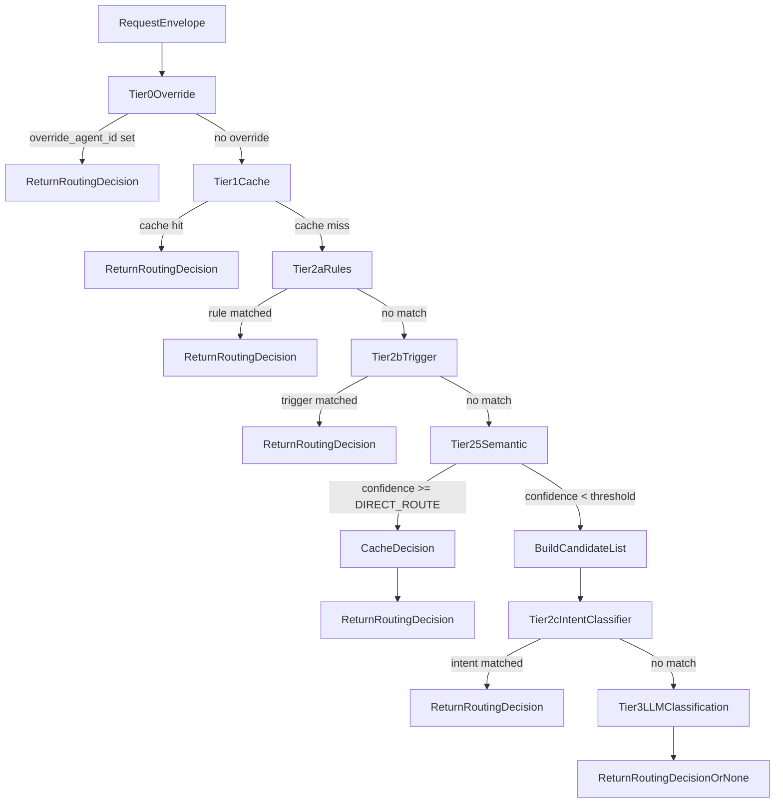
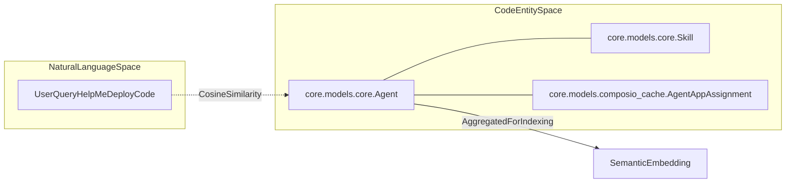
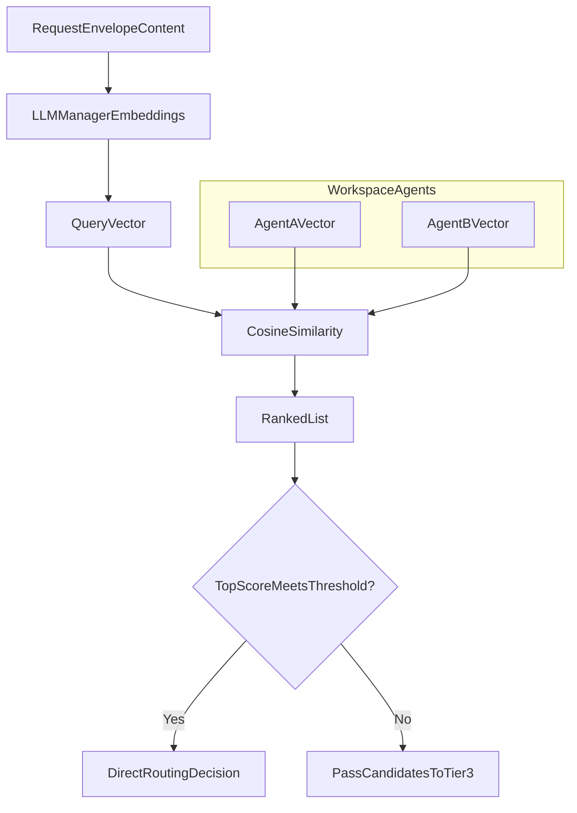
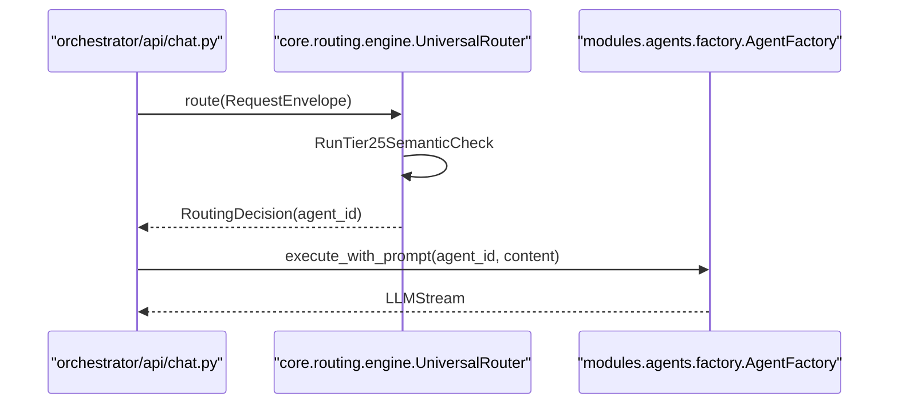

# Tier 2.5: Semantic Similarity

Relevant source files

The following files were used as context for generating this wiki page:

- [frontend/components/agents/agent-configuration-modal.tsx](frontend/components/agents/agent-configuration-modal.tsx)
- [frontend/components/agents/agent-configuration.tsx](frontend/components/agents/agent-configuration.tsx)
- [frontend/components/agents/agent-details-modal.tsx](frontend/components/agents/agent-details-modal.tsx)
- [frontend/components/agents/agent-performance.tsx](frontend/components/agents/agent-performance.tsx)
- [frontend/components/agents/agent-roster.tsx](frontend/components/agents/agent-roster.tsx)
- [frontend/components/agents/agent-skills.tsx](frontend/components/agents/agent-skills.tsx)
- [frontend/components/agents/agent-status-control-modal.tsx](frontend/components/agents/agent-status-control-modal.tsx)
- [frontend/components/agents/create-agent-modal.tsx](frontend/components/agents/create-agent-modal.tsx)
- [frontend/components/agents/create-skill-modal.tsx](frontend/components/agents/create-skill-modal.tsx)
- [frontend/components/agents/model-selector.tsx](frontend/components/agents/model-selector.tsx)
- [frontend/components/agents/skill-configuration-modal.tsx](frontend/components/agents/skill-configuration-modal.tsx)
- [frontend/hooks/use-agent-api.ts](frontend/hooks/use-agent-api.ts)
- [frontend/hooks/use-model-api.ts](frontend/hooks/use-model-api.ts)
- [frontend/lib/agent-constants.ts](frontend/lib/agent-constants.ts)
- [orchestrator/alembic/versions/add_job_title_to_agents.py](orchestrator/alembic/versions/add_job_title_to_agents.py)
- [orchestrator/api/agent_endpoints.py](orchestrator/api/agent_endpoints.py)
- [orchestrator/api/agents.py](orchestrator/api/agents.py)
- [orchestrator/api/chat.py](orchestrator/api/chat.py)
- [orchestrator/api/routing.py](orchestrator/api/routing.py)
- [orchestrator/consumers/chatbot/auto.py](orchestrator/consumers/chatbot/auto.py)
- [orchestrator/consumers/chatbot/service.py](orchestrator/consumers/chatbot/service.py)
- [orchestrator/core/llm/manager.py](orchestrator/core/llm/manager.py)
- [orchestrator/core/models/__init__.py](orchestrator/core/models/__init__.py)
- [orchestrator/core/models/core.py](orchestrator/core/models/core.py)
- [orchestrator/core/routing/engine.py](orchestrator/core/routing/engine.py)
- [orchestrator/modules/agents/factory/agent_factory.py](orchestrator/modules/agents/factory/agent_factory.py)
- [orchestrator/modules/tools/discovery/platform_actions.py](orchestrator/modules/tools/discovery/platform_actions.py)
- [orchestrator/modules/tools/discovery/platform_executor.py](orchestrator/modules/tools/discovery/platform_executor.py)
- [orchestrator/scripts/setup_jira_trigger.py](orchestrator/scripts/setup_jira_trigger.py)
- [orchestrator/services/heartbeat_service.py](orchestrator/services/heartbeat_service.py)
- [orchestrator/services/page_context.py](orchestrator/services/page_context.py)
- [orchestrator/tests/test_prd221_page_context.py](orchestrator/tests/test_prd221_page_context.py)
- [orchestrator/tests/test_prd221_page_prior_tools.py](orchestrator/tests/test_prd221_page_prior_tools.py)

## Purpose and Scope

Tier 2.5 of the Universal Router implements **agent embedding-based cosine similarity** to intelligently route requests to the most relevant agent. This tier sits between rule-based routing (Tier 2a/2b) and keyword-based or LLM classification (Tier 2c / Tier 3), providing an optimal balance between speed and accuracy.

Unlike keyword matching, which relies on exact string patterns, semantic similarity understands the **meaning** of the user's request and compares it against pre-computed vector representations of each agent's capabilities. This enables routing based on conceptual overlap rather than lexical overlap.

**Sources:** [orchestrator/core/routing/engine.py:11-15](), [orchestrator/core/routing/engine.py:123-137]()

---

## Routing Tier Sequence

Tier 2.5 executes **after** pattern-based tiers (2a, 2b) but **before** keyword matching (2c) and LLM classification (Tier 3). This positioning is intentional: semantic matching is more nuanced than keyword matching but faster than full LLM classification calls.

### UniversalRouter Execution Flow

Title: "UniversalRouterTieredLogic"

**Key design decision:** Tier 2.5 runs *before* Tier 2c because semantic matching understands agent capabilities, while keyword matching is coarse-grained and can be hijacked by overly strong rules. When semantic matching finds strong candidates, those are passed directly to Tier 3 (LLM), bypassing keyword matching entirely [orchestrator/core/routing/engine.py:124-147]().

**Sources:** [orchestrator/core/routing/engine.py:79-163]()

---

## Agent Embedding Generation & Re-Indexing

Each agent's semantic embedding is a **vector representation** of its capabilities. The system aggregates data from multiple database models to create a comprehensive profile for the vector engine.

### Embedding Input Sources
- **Core Identity:** `Agent.name`, `Agent.description`, and `Agent.agent_type` [orchestrator/modules/agents/factory/agent_factory.py:108-111]().
- **Persona:** Data from the agent's persona prompt or system instructions [orchestrator/modules/agents/factory/agent_factory.py:111]().
- **Skills:** Assigned `Skill` entities containing specific capabilities [orchestrator/modules/agents/factory/agent_factory.py:112]().
- **Tools:** Connected apps resolved via `AgentAppAssignment` and `ComposioAppCache` [orchestrator/modules/agents/factory/agent_factory.py:172]().

### Background Re-Indexing (`_reindex_agent_embedding`)
Whenever an agent is created or updated via the agent API, a non-blocking background task is triggered to re-embed the agent's profile without blocking the main request thread [orchestrator/api/agents.py:58-86]().

Title: "NaturalLanguageToCodeEntityAgentProfile"

**Sources:** [orchestrator/modules/agents/factory/agent_factory.py:105-177](), [orchestrator/core/routing/engine.py:32-34](), [orchestrator/api/agents.py:58-86]()

---

## Similarity Calculation and Thresholds

When a request arrives, the `UniversalRouter` computes cosine similarity between the query embedding and each active agent's stored vector.

### Confidence Thresholds & Direct Route

| Threshold | Component | Behavior |
|-----------|-----------|----------|
| **DIRECT_ROUTE** | `_tier2_5_semantic` | Immediate routing — returns `RoutingDecision` directly when confidence exceeds the threshold [orchestrator/core/routing/engine.py:130-136](). |
| **ROUTING_LLM_CONFIDENCE_THRESHOLD` | `_classify_with_llm` | Used in Tier 3 to validate LLM suggestions against semantic candidates [orchestrator/core/routing/engine.py:47](). |

Title: "SemanticMatchingProcess"

**Sources:** [orchestrator/core/routing/engine.py:129-149](), [orchestrator/core/llm/manager.py:52-53]()

---

## Implementation Details & Candidate Shortlisting

### Semantic Candidate Shortlisting
If no agent meets the direct route threshold, Tier 2.5 returns a list of `semantic_candidates` [orchestrator/core/routing/engine.py:129](). This shortlisting mechanism passes focused context to Tier 3 (`_classify_with_llm`), giving the LLM relevant agent choices without overwhelming its token context window [orchestrator/core/routing/engine.py:149]().

### Integration with Chat API
The `UniversalRouter` is invoked within the chat endpoint flow [orchestrator/api/chat.py:26](). Before streaming responses begin, the router attempts to resolve the request to an agent, ensuring that matched configurations are properly loaded via `AgentFactory` [orchestrator/modules/agents/factory/agent_factory.py:161]().

Title: "ChatToRoutingIntegration"

**Sources:** [orchestrator/api/chat.py:24-27](), [orchestrator/core/routing/engine.py:79-159](), [orchestrator/modules/agents/factory/agent_factory.py:161-178]()

---