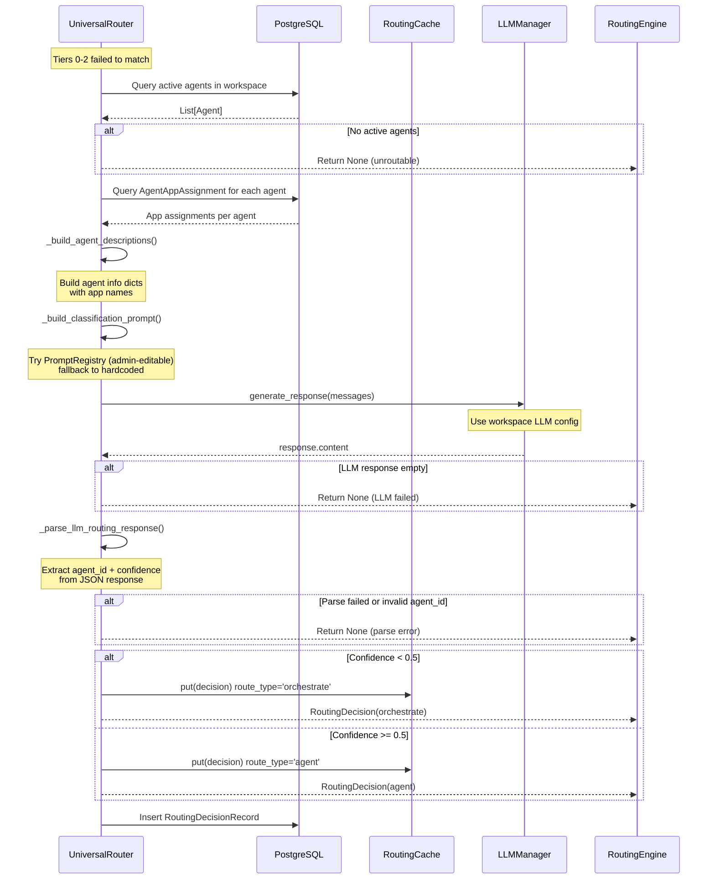
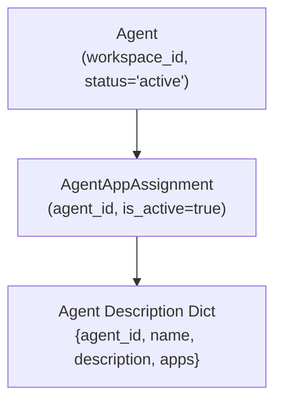
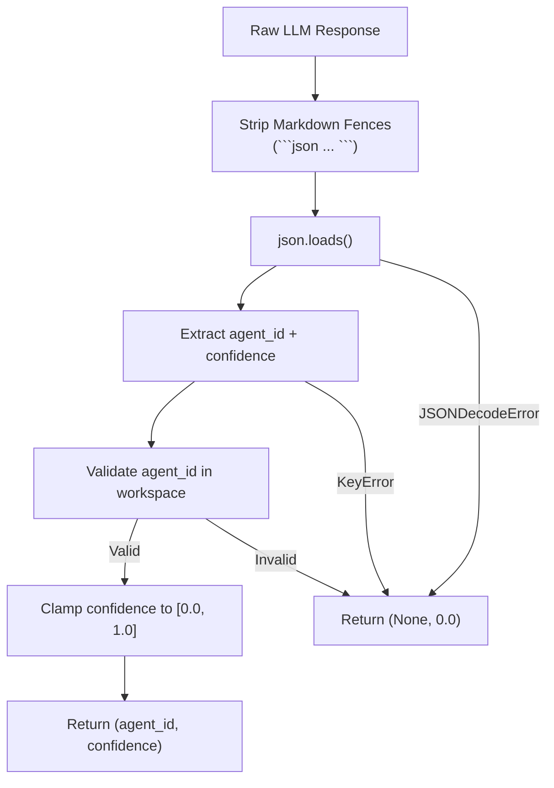
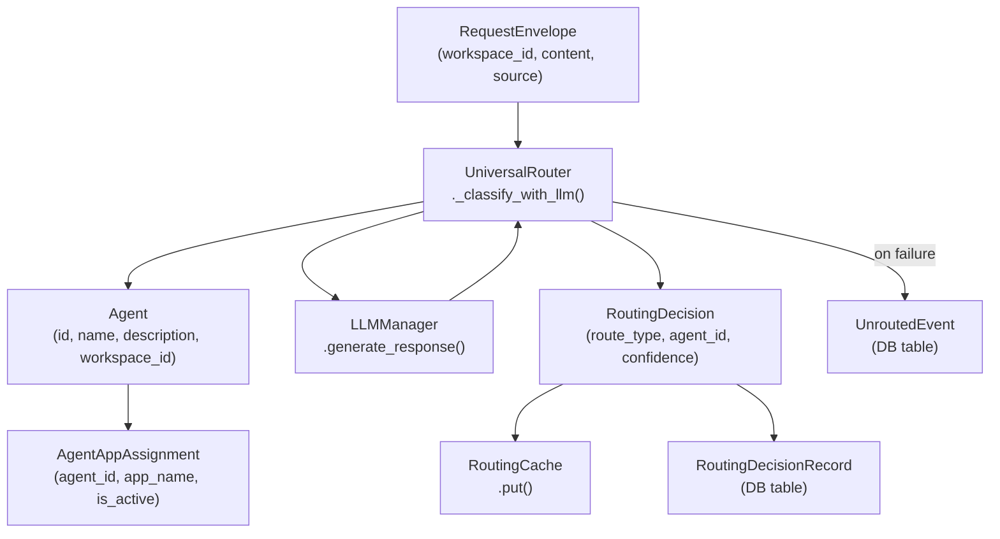

# Tier 3: LLM Classification

<details>
<summary>Relevant source files</summary>

The following files were used as context for generating this wiki page:

- [orchestrator/api/chat.py](orchestrator/api/chat.py)
- [orchestrator/api/routing.py](orchestrator/api/routing.py)
- [orchestrator/consumers/chatbot/auto.py](orchestrator/consumers/chatbot/auto.py)
- [orchestrator/consumers/chatbot/intent_classifier.py](orchestrator/consumers/chatbot/intent_classifier.py)
- [orchestrator/consumers/chatbot/personality.py](orchestrator/consumers/chatbot/personality.py)
- [orchestrator/consumers/chatbot/smart_orchestrator.py](orchestrator/consumers/chatbot/smart_orchestrator.py)
- [orchestrator/consumers/chatbot/smart_tool_router.py](orchestrator/consumers/chatbot/smart_tool_router.py)
- [orchestrator/core/models/system_settings.py](orchestrator/core/models/system_settings.py)
- [orchestrator/core/routing/engine.py](orchestrator/core/routing/engine.py)
- [orchestrator/modules/tools/discovery/__init__.py](orchestrator/modules/tools/discovery/__init__.py)
- [orchestrator/scripts/setup_jira_trigger.py](orchestrator/scripts/setup_jira_trigger.py)

</details>


## Purpose and Scope

This document covers **Tier 3: LLM Classification** in the Universal Router's tiered routing system. Tier 3 is the final fallback mechanism that uses a workspace-configured Large Language Model to dynamically select the most appropriate agent for a request when all prior routing tiers fail to produce a match.

For information about the overall routing architecture, see [Routing Architecture](#9.1). For details on prior tiers, see [Tier 0: User Overrides](#9.2), [Tier 1: Cache Lookup](#9.3), and [Tier 2: Rule-Based Routing](#9.4).

---

## Overview

Tier 3 LLM Classification is invoked when Tiers 0-2 (user overrides, cache, rules, and intent matching) fail to route a request. Unlike static rule-based routing, Tier 3 uses semantic understanding to select the most appropriate agent by analyzing the request content against agent descriptions and capabilities.

The classification process produces two outputs:
1. **Agent ID**: The selected agent to handle the request
2. **Confidence Score**: A float between 0.0 and 1.0 indicating classification certainty

Based on the confidence score, the router makes a routing decision:
- **High confidence** (`>= 0.5`): Route directly to the selected agent (`route_type='agent'`)
- **Low confidence** (`< 0.5`): Return for orchestrated workflow decomposition (`route_type='orchestrate'`)

**Sources:** [orchestrator/core/routing/engine.py:332-433]()

---

## Tier 3 Invocation Flow



**Tier 3: LLM Classification Sequence Diagram**

**Sources:** [orchestrator/core/routing/engine.py:332-433](), [orchestrator/core/routing/engine.py:78-144]()

---

## Confidence Threshold and Routing Logic

The confidence threshold determines whether the router trusts the LLM's classification enough to route directly to an agent, or whether the request requires full orchestrated workflow decomposition.

| Confidence Range | Route Type | Behavior | Cached |
|-----------------|-----------|----------|--------|
| `>= 0.5` | `agent` | Direct routing to selected agent | Yes |
| `< 0.5` | `orchestrate` | Return for workflow decomposition | Yes |
| `None` (parse failed) | `None` | Store as UnroutedEvent | No |

**Configuration:**

```python
# Default threshold from environment variable
ROUTING_LLM_CONFIDENCE_THRESHOLD = 0.5

# Read from config.py
_LLM_CONFIDENCE_THRESHOLD = float(
    os.getenv("ROUTING_LLM_CONFIDENCE_THRESHOLD", "0.5")
)
```

**Sources:** [orchestrator/core/routing/engine.py:44-46](), [orchestrator/config.py:144]()

---

## Agent Description Building

Before invoking the LLM, the router builds structured descriptions of all active agents in the workspace, including their assigned Composio app integrations.

### Agent Query

```sql
SELECT * FROM agents 
WHERE workspace_id = :workspace_id 
  AND status = 'active'
```

### Description Structure

```python
{
    "agent_id": int,
    "name": str,
    "description": str,
    "apps": List[str]  # Composio app names
}
```

### App Assignment Resolution

For each agent, the router queries `AgentAppAssignment` to retrieve assigned app names:



**Agent Description Building Process**

**Sources:** [orchestrator/core/routing/engine.py:435-458]()

---

## Classification Prompt Construction

The router builds a lightweight prompt that presents the request content and available agents to the LLM for classification.

### Prompt Template (Hardcoded Fallback)

```
You are a request router. Given the user's request, select the best agent 
to handle it from the list below.

User request: {content}

Available agents:
  - ID: {agent_id}, Name: {name}, Description: {description}, Apps: {apps}
  - ID: {agent_id}, Name: {name}, Description: {description}, Apps: {apps}
  ...

Respond with ONLY a JSON object (no markdown, no explanation):
{"agent_id": <int>, "confidence": <float between 0 and 1>}
```

### PromptRegistry Integration

The router first attempts to load the prompt from the admin-editable `PromptRegistry` using slug `"routing-classifier"`. This allows platform administrators to customize the routing prompt without code changes.

```python
# Try PromptRegistry (admin-editable), fallback to hardcoded
try:
    from core.services.prompt_registry import prompt_registry
    custom = prompt_registry.get_raw("routing-classifier")
    if custom:
        return custom.format_map({
            "message": content,
            "available_routes": agents_block,
        })
except Exception:
    pass

# Fallback to hardcoded prompt
return (
    "You are a request router. Given the user's request, select the best agent "
    "to handle it from the list below.\n\n"
    f"User request: {content}\n\n"
    f"Available agents:\n{agents_block}\n\n"
    "Respond with ONLY a JSON object (no markdown, no explanation):\n"
    '{"agent_id": <int>, "confidence": <float between 0 and 1>}\n'
)
```

**Sources:** [orchestrator/core/routing/engine.py:460-493]()

---

## LLM Invocation

The router invokes the LLM via the `LLMManager` singleton, which handles provider selection, credentials, and API communication.

### LLMManager Integration

```python
llm_manager = create_llm_manager(service_name="orchestrator")
messages = [{"role": "user", "content": prompt}]
response = await llm_manager.generate_response(messages)
```

The `LLMManager` uses the workspace's configured LLM provider and model. The `service_name="orchestrator"` parameter ensures the correct service-level configuration is loaded.

### Workspace LLM Configuration

Each workspace can configure its own LLM provider and model via system settings. The Tier 3 classification uses this workspace-specific configuration, not a global default.

**Sources:** [orchestrator/core/routing/engine.py:370-376]()

---

## Response Parsing and Validation

After receiving the LLM response, the router parses the JSON output and validates the agent ID against the workspace's active agent list.

### Expected Response Format

```json
{
  "agent_id": 123,
  "confidence": 0.87
}
```

### Parsing Logic



**Response Parsing Flow**

### Validation Rules

| Validation | Rule | Failure Behavior |
|-----------|------|------------------|
| JSON format | Must be valid JSON | Return `(None, 0.0)` |
| `agent_id` field | Must be present | Return `(None, 0.0)` |
| `agent_id` type | Must be convertible to `int` | Return `(None, 0.0)` |
| `agent_id` existence | Must be in workspace's active agent list | Return `(None, 0.0)` |
| `confidence` field | Optional, defaults to `0.0` | No failure |
| `confidence` type | Must be convertible to `float` | No failure |
| `confidence` range | Clamped to `[0.0, 1.0]` | No failure |

**Sources:** [orchestrator/core/routing/engine.py:495-533]()

---

## Routing Decision Construction

Based on the parsed confidence score, the router constructs a `RoutingDecision` object with the appropriate `route_type`.

### High Confidence Decision (>= 0.5)

```python
decision = RoutingDecision(
    route_type="agent",
    agent_id=agent_id,
    confidence=confidence,
    reasoning=f"LLM classification (confidence={confidence:.2f})",
)
```

This decision routes the request **directly** to the selected agent for immediate execution.

### Low Confidence Decision (< 0.5)

```python
decision = RoutingDecision(
    route_type="orchestrate",
    agent_id=agent_id,
    confidence=confidence,
    reasoning=f"LLM classification below threshold ({confidence:.2f} < {_LLM_CONFIDENCE_THRESHOLD})",
)
```

This decision signals that the request should be sent for **orchestrated workflow decomposition**, where multiple agents may collaborate to handle the request.

### RoutingDecision Data Model

```python
class RoutingDecision:
    route_type: str           # "agent" | "orchestrate" | "workflow"
    agent_id: Optional[int]
    workflow_id: Optional[int]
    confidence: float
    reasoning: str
    cached: bool = False
    intent_category: Optional[str] = None
```

**Sources:** [orchestrator/core/routing/engine.py:386-428](), [orchestrator/core/models/routing.py]()

---

## Caching Strategy

Both high-confidence and low-confidence decisions are cached in Redis via the `RoutingCache` to avoid redundant LLM calls for similar requests.

### Cache Key Format

```
routing:{workspace_id}:{normalized_content}:{source}
```

Where `normalized_content` is a lowercase, whitespace-normalized version of the request content.

### Cache Population

```python
if self._cache is not None:
    self._cache.put(
        envelope.workspace_id,
        envelope.content,
        envelope.source,
        decision,
    )
```

### Cache TTL

The default cache TTL is 24 hours, configurable via `ROUTING_CACHE_TTL_HOURS`:

```python
ROUTING_CACHE_TTL_HOURS: int = int(os.getenv("ROUTING_CACHE_TTL_HOURS", "24"))
```

Even low-confidence results are cached to prevent repeated LLM classification attempts for inherently ambiguous requests.

**Sources:** [orchestrator/core/routing/engine.py:403-409](), [orchestrator/core/routing/engine.py:420-427](), [orchestrator/config.py:143]()

---

## Error Handling and Unrouted Events

When all tiers fail to produce a routing decision (including Tier 3 LLM classification), the router stores an `UnroutedEvent` record for later analysis.

### Failure Scenarios

| Scenario | Logged To | Action |
|---------|-----------|--------|
| No active agents in workspace | `logger.warning` | Return `None` |
| Empty LLM response | `logger.warning` | Return `None` |
| JSON parse error | `logger.warning` | Return `None` |
| Invalid `agent_id` | `logger.warning` | Return `None` |
| LLM exception | `logger.exception` | Return `None` |

### UnroutedEvent Storage

```python
def _store_unrouted_event(
    self, envelope: RequestEnvelope, reason: str
) -> None:
    """Persist an unrouted event for later analysis."""
    try:
        event = UnroutedEvent(
            workspace_id=envelope.workspace_id,
            source=envelope.source.value,
            content=envelope.content,
            raw_payload=envelope.raw_payload,
            reason=reason,
        )
        self._db.add(event)
        self._db.commit()
    except Exception:
        logger.exception("[router] Failed to store unrouted event")
        self._db.rollback()
```

### UnroutedEvent Table Schema

```python
class UnroutedEvent(Base):
    __tablename__ = "unrouted_events"
    
    id: int (primary key)
    workspace_id: UUID
    source: str
    content: str
    raw_payload: dict (JSONB)
    reason: str
    created_at: datetime
```

Platform administrators can query the `unrouted_events` table to identify patterns in routing failures and improve routing rules or agent descriptions.

**Sources:** [orchestrator/core/routing/engine.py:539-555](), [orchestrator/core/models/routing.py]()

---

## Decision Logging

Every successful routing decision (including Tier 3 classifications) is logged to the `routing_decisions` table for analytics and debugging.

### RoutingDecisionRecord Schema

```python
class RoutingDecisionRecord(Base):
    __tablename__ = "routing_decisions"
    
    id: int (primary key)
    request_id: str
    envelope_hash: str
    workspace_id: UUID
    source: str
    content: str (truncated to 2000 chars)
    route_type: str
    agent_id: Optional[int]
    workflow_id: Optional[int]
    confidence: float
    cached: bool
    created_at: datetime
```

### Logging Implementation

```python
def _log_decision(
    self,
    envelope: RequestEnvelope,
    decision: RoutingDecision,
    env_hash: str,
) -> None:
    """Persist the routing decision to the routing_decisions table."""
    try:
        record = RoutingDecisionRecord(
            request_id=envelope.id,
            envelope_hash=env_hash,
            workspace_id=envelope.workspace_id,
            source=envelope.source.value,
            content=envelope.content[:2000],
            route_type=decision.route_type,
            agent_id=decision.agent_id,
            workflow_id=decision.workflow_id,
            confidence=decision.confidence,
            cached=decision.cached,
        )
        self._db.add(record)
        self._db.commit()
    except Exception:
        logger.exception("[router] Failed to log routing decision")
        self._db.rollback()
```

**Sources:** [orchestrator/core/routing/engine.py:560-585](), [orchestrator/core/models/routing.py]()

---

## Configuration Reference

### Environment Variables

| Variable | Type | Default | Description |
|---------|------|---------|-------------|
| `ROUTING_LLM_CONFIDENCE_THRESHOLD` | float | `0.5` | Minimum confidence for direct agent routing |
| `ROUTING_CACHE_TTL_HOURS` | int | `24` | Cache lifetime for routing decisions |
| `LLM_PROVIDER` | str | (system setting) | Workspace LLM provider |
| `LLM_MODEL` | str | (system setting) | Workspace LLM model |

### Config Class Properties

```python
from config import config

# Tier 3 configuration
config.ROUTING_LLM_CONFIDENCE_THRESHOLD  # 0.5
config.ROUTING_CACHE_TTL_HOURS           # 24

# LLM configuration (workspace-specific)
config.LLM_PROVIDER  # From system_settings or env
config.LLM_MODEL     # From system_settings or env
```

**Sources:** [orchestrator/config.py:143-144](), [orchestrator/config.py:88-106]()

---

## Data Structure Relationships



**Tier 3 Data Structure Relationships**

**Sources:** [orchestrator/core/routing/engine.py:332-585](), [orchestrator/core/models/routing.py](), [orchestrator/core/models/core.py](), [orchestrator/core/models/composio_cache.py]()

---

## Integration with Other Systems

### PromptRegistry Integration

Tier 3 integrates with the admin-editable PromptRegistry for customizable classification prompts. See [System Prompt Management](#11.1) for details on editing prompts via the admin interface.

```python
from core.services.prompt_registry import prompt_registry

custom = prompt_registry.get_raw("routing-classifier")
```

**Sources:** [orchestrator/core/routing/engine.py:475-483]()

### LLM Analytics Tracking

Every LLM call made by Tier 3 is tracked via the `UsageTracker` for cost analytics. See [LLM Usage Tracking](#10.1) for details on tracking and cost calculation.

**Sources:** [orchestrator/core/llm/manager.py]()

### Composio App Integration

Agent descriptions include assigned Composio app names to help the LLM understand each agent's tool capabilities. See [Tool Assignment](#6.5) for details on agent-app associations.

**Sources:** [orchestrator/core/routing/engine.py:440-448](), [orchestrator/core/models/composio_cache.py]()

---