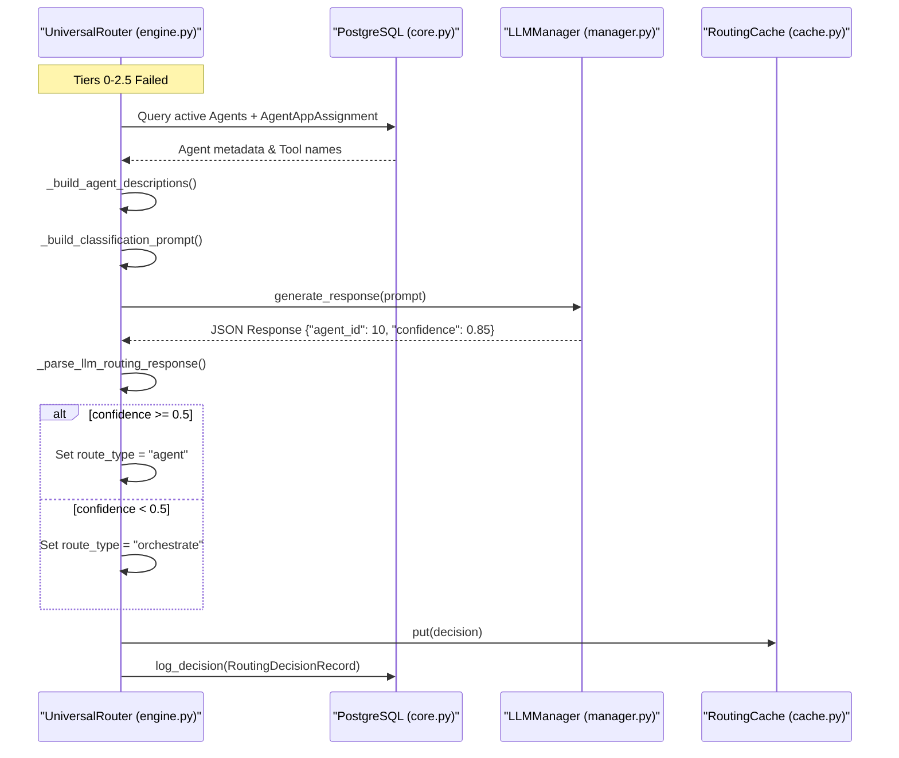
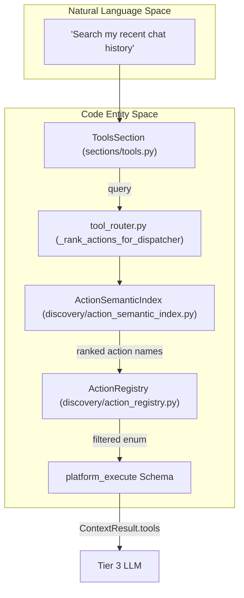
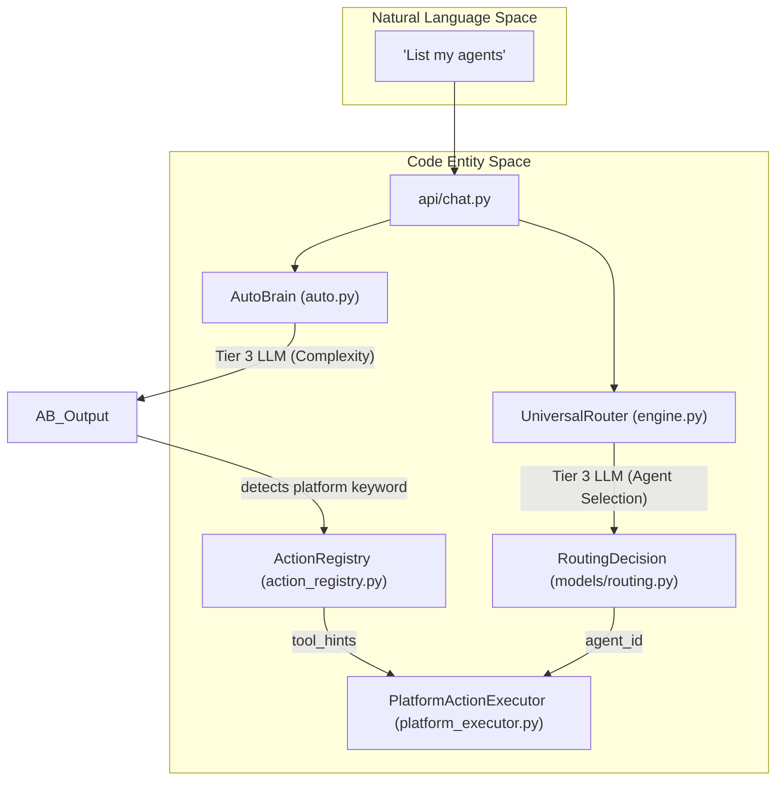

# Tier 3: LLM Classification

Relevant source files

The following files were used as context for generating this wiki page:

- [orchestrator/api/routing.py](orchestrator/api/routing.py)
- [orchestrator/core/routing/engine.py](orchestrator/core/routing/engine.py)
- [orchestrator/modules/context/sections/tools.py](orchestrator/modules/context/sections/tools.py)
- [orchestrator/modules/tools/discovery/action_registry.py](orchestrator/modules/tools/discovery/action_registry.py)
- [orchestrator/modules/tools/discovery/handlers_search.py](orchestrator/modules/tools/discovery/handlers_search.py)
- [orchestrator/modules/tools/tool_router.py](orchestrator/modules/tools/tool_router.py)
- [orchestrator/scripts/setup_jira_trigger.py](orchestrator/scripts/setup_jira_trigger.py)
- [orchestrator/tests/test_action_registry_filtered.py](orchestrator/tests/test_action_registry_filtered.py)
- [orchestrator/tests/test_tool_router_semantic.py](orchestrator/tests/test_tool_router_semantic.py)

## Purpose and Scope

This document covers **Tier 3: LLM Classification** in the Universal Router's tiered routing system. Tier 3 is the final dynamic fallback mechanism that uses a Large Language Model (LLM) to analyze request intent against agent descriptions and semantic hints. It is invoked only when deterministic tiers (Overrides, Cache, Rules, and Semantic Similarity) fail to resolve a definitive route.

For the complete routing hierarchy, see [Routing Architecture](10.1).

---

## Overview

Tier 3 LLM Classification serves as the high-reasoning fallback of the routing engine. It leverages the workspace's configured LLM to perform intent classification. Unlike Tier 2.5 (Semantic Similarity), which uses vector embeddings for fast retrieval, Tier 3 provides the LLM with the full context of available agents, their descriptions, and their integrated tools (apps) to make an informed decision.

The classification process produces:
1.  **Agent ID**: The selected agent to handle the request.
2.  **Confidence Score**: A float between 0.0 and 1.0 indicating certainty.
3.  **Route Type**: Either `agent` (direct) or `orchestrate` (multi-agent decomposition) based on the confidence threshold.

**Sources:** [orchestrator/core/routing/engine.py:13-15](), [orchestrator/core/routing/engine.py:148-158]()

---

## Tier 3 Implementation Flow

The `UniversalRouter._classify_with_llm` method executes the logic for deep intent analysis. It is triggered when `semantic_candidates` from Tier 2.5 are passed to Tier 3 or when no candidates were found and a full workspace scan is required [orchestrator/core/routing/engine.py:141-158]().

### Implementation Logic
1. **Agent Discovery**: Queries the database for all active `Agent` entities within the current `workspace_id` [orchestrator/core/routing/engine.py:332-345]().
2. **Context Enrichment**: Joins agents with `AgentAppAssignment` to identify which third-party tools (via Composio) the agent can access [orchestrator/core/routing/engine.py:435-445]().
3. **Prompt Construction**: Assembles a system prompt containing the user's message and the formatted list of available agents [orchestrator/core/routing/engine.py:460-475]().
4. **LLM Inference**: Calls the LLM (typically via `OpenRouterProvider` or `OpenAIProvider`) to get a structured JSON response [orchestrator/core/routing/engine.py:380-400]().
5. **Threshold Validation**: Compares the returned `confidence` against `config.ROUTING_LLM_CONFIDENCE_THRESHOLD` (default 0.5) [orchestrator/core/routing/engine.py:47-48](), [orchestrator/core/routing/engine.py:410-420]().

### Sequence Diagram
Title: Tier 3 LLM Classification Logic Flow

**Sources:** [orchestrator/core/routing/engine.py:332-433](), [orchestrator/core/routing/engine.py:560-585](), [orchestrator/core/models/routing.py:23-42]()

---

## Agent Context Assembly

To provide the LLM with sufficient context, the router builds a structured block of available agents. This bridges the "Natural Language Space" (user intent) with "Code Entity Space" (Agent IDs and Tool definitions).

### 1. Metadata Retrieval
The router fetches all agents where `status == 'active'` and joins them with `AgentAppAssignment` to identify which third-party tools (via Composio) the agent can access [orchestrator/core/routing/engine.py:435-445]().

### 2. Description Formatting
The `_build_agent_descriptions` helper creates a string representation for the prompt:
- **ID**: The database primary key `Agent.id`.
- **Name**: `Agent.name`.
- **Description**: `Agent.description`.
- **Apps**: A list of connected application names (e.g., "Slack", "Jira", "GitHub") [orchestrator/core/routing/engine.py:446-458]().

**Sources:** [orchestrator/core/routing/engine.py:435-458](), [orchestrator/core/models/composio_cache.py:33-40]()

---

## Semantic Tool Narrowing (PRD-138)

A significant enhancement in Tier 3 routing and tool selection is the introduction of semantic narrowing for platform actions. This ensures that when the LLM is acting as a router or dispatcher, it is not overwhelmed by the full list of ~47 platform actions.

### Action Registry & Semantic Index
The `ActionRegistry` provides the schema for platform operations [orchestrator/modules/tools/discovery/action_registry.py:55-61](). When `SEMANTIC_TOOL_ROUTING` is enabled, the system uses `ActionSemanticIndex.rank_actions` to filter the `platform_execute` dispatcher's enum to the top-K relevant actions based on the user's query [orchestrator/modules/tools/tool_router.py:124-138]().

### ToolsSection Integration
The `ToolsSection` in the context service manages this logic via `_load_dispatcher_only`. It calls `_rank_actions_for_dispatcher` to trim the `action.enum` in the OpenAI function schema [orchestrator/modules/context/sections/tools.py:112-142]().

Title: Semantic Narrowing Code Bridge

**Sources:** [orchestrator/modules/context/sections/tools.py:112-142](), [orchestrator/modules/tools/tool_router.py:124-138](), [orchestrator/modules/tools/discovery/action_registry.py:136-160]()

---

## Complexity Assessment (AutoBrain)

In the context of the `ChatbotIngestor`, Tier 3 routing is often preceded or supplemented by `AutoBrain` complexity assessment. 

While the `UniversalRouter` decides **who** handles the message, `AutoBrain` decides **how complex** the task is, ranging from `ATOM` to `ORGANISM`. It also detects "Platform Actions" (e.g., "list my agents") and uses `to_dispatcher_schema` with `allowed_names` to narrow the LLM's focus [orchestrator/modules/tools/discovery/action_registry.py:164-180]().

Title: Complexity and Routing Logic Bridge

**Sources:** [orchestrator/modules/tools/discovery/action_registry.py:164-180](), [orchestrator/core/routing/engine.py:148-158](), [orchestrator/api/routing.py:110-154]()

---

## Persistence & Learning

Tier 3 decisions are persisted to the `routing_decisions` table via `RoutingDecisionRecord`. This enables:
- **Audit Trails**: Understanding why the LLM chose a specific agent via the `reasoning` field [orchestrator/core/routing/engine.py:560-580]().
- **Cache Warming**: Tier 1 (Cache) uses the hash of successful Tier 3 decisions to bypass future LLM calls [orchestrator/core/routing/engine.py:102-107]().
- **Correction Loop**: If a user corrects a Tier 3 decision via the UI (`POST /api/routing/corrections`), the system updates the `RoutingCache` and marks the `RoutingDecisionRecord` as `was_corrected` [orchestrator/api/routing.py:81-84]().

**Sources:** [orchestrator/core/routing/engine.py:560-585](), [orchestrator/api/routing.py:81-84](), [orchestrator/core/routing/engine.py:87-100]()

---