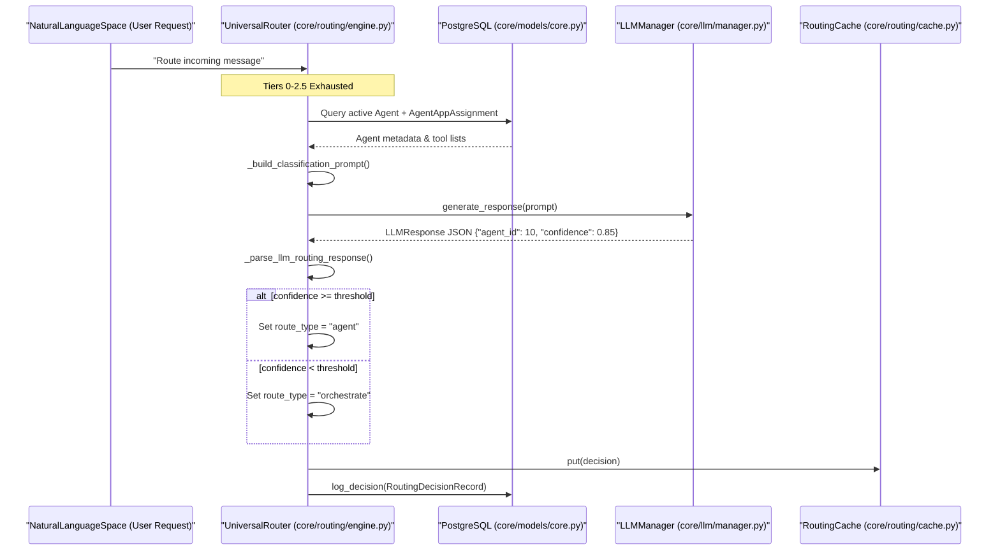
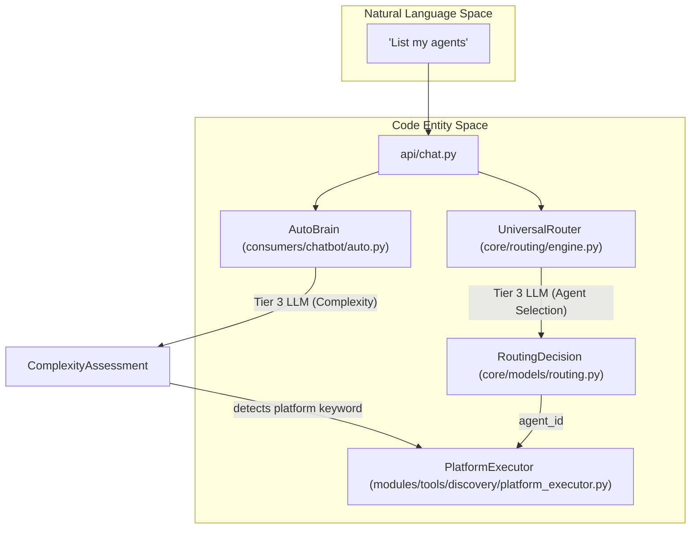

# Tier 3: LLM Classification

Relevant source files

The following files were used as context for generating this wiki page:

- [orchestrator/api/chat.py](orchestrator/api/chat.py)
- [orchestrator/api/routing.py](orchestrator/api/routing.py)
- [orchestrator/consumers/chatbot/auto.py](orchestrator/consumers/chatbot/auto.py)
- [orchestrator/consumers/chatbot/service.py](orchestrator/consumers/chatbot/service.py)
- [orchestrator/core/llm/manager.py](orchestrator/core/llm/manager.py)
- [orchestrator/core/routing/engine.py](orchestrator/core/routing/engine.py)
- [orchestrator/modules/agents/factory/agent_factory.py](orchestrator/modules/agents/factory/agent_factory.py)
- [orchestrator/modules/tools/discovery/platform_actions.py](orchestrator/modules/tools/discovery/platform_actions.py)
- [orchestrator/modules/tools/discovery/platform_executor.py](orchestrator/modules/tools/discovery/platform_executor.py)
- [orchestrator/scripts/setup_jira_trigger.py](orchestrator/scripts/setup_jira_trigger.py)
- [orchestrator/services/heartbeat_service.py](orchestrator/services/heartbeat_service.py)
- [orchestrator/services/page_context.py](orchestrator/services/page_context.py)
- [orchestrator/tests/test_prd221_page_context.py](orchestrator/tests/test_prd221_page_context.py)
- [orchestrator/tests/test_prd221_page_prior_tools.py](orchestrator/tests/test_prd221_page_prior_tools.py)

## Purpose and Scope

This document covers **Tier 3: LLM Classification** within the Universal Router's tiered routing architecture. Tier 3 serves as the final dynamic fallback mechanism, utilizing a Large Language Model (LLM) to analyze incoming request intent against active agent descriptions and semantic hints when deterministic routing tiers fail [orchestrator/core/routing/engine.py:13-16]().

For the complete routing hierarchy, see [Routing Architecture](10.1).

---

## Overview

When user requests cannot be resolved by deterministic tiers—such as User Overrides (Tier 0), Cache Lookups (Tier 1), Routing Rules (Tier 2a), Trigger Subscriptions (Tier 2b), or Semantic Similarity (Tier 2.5)—the request falls through to Tier 3 LLM Classification [orchestrator/core/routing/engine.py:58-164]().

Tier 3 queries the workspace's configured orchestrator LLM to perform deep intent analysis. It supplies the model with a roster of available agents, their descriptions, and integrated tool assignments to output a structured routing decision containing an agent ID, confidence score, and route type (`agent` or `orchestrate`) [orchestrator/core/routing/engine.py:148-158](), [orchestrator/core/llm/manager.py:34-36]().

Sources: [orchestrator/core/routing/engine.py:13-16](), [orchestrator/core/routing/engine.py:148-158]()

---

## Tier 3 Implementation Flow

The `UniversalRouter._classify_with_llm` method executes the intent evaluation logic [orchestrator/core/routing/engine.py:148-158](). 

### Execution Steps
1. **Agent Enumeration**: Queries active `Agent` entities within the current `workspace_id` [orchestrator/core/routing/engine.py:332-345]().
2. **Context Enrichment**: Resolves third-party application bindings via `AgentAppAssignment` [orchestrator/core/routing/engine.py:435-445]().
3. **Prompt Generation**: Constructs a classification prompt bundling the user content and agent capabilities [orchestrator/core/routing/engine.py:460-475]().
4. **LLM Inference**: Invokes `LLMManager` using the `orchestrator_llm` service tier configuration [orchestrator/core/routing/engine.py:380-400](), [orchestrator/core/llm/manager.py:34-36]().
5. **Threshold Validation**: Evaluates the returned confidence against `config.ROUTING_LLM_CONFIDENCE_THRESHOLD` [orchestrator/core/routing/engine.py:47-48](), [orchestrator/core/routing/engine.py:410-420]().

Title: "Tier 3 LLM Classification Execution Flow"

Sources: [orchestrator/core/routing/engine.py:332-433](), [orchestrator/core/routing/engine.py:560-585]()

---

## Agent Context Assembly

To ground the LLM's classification, the router compiles a structured representation of the workspace environment, bridging natural language intent with concrete system entities.

### Metadata and App Bindings
The router queries agents where `status == 'active'` and joins them with `AgentAppAssignment` records to identify accessible tool integrations [orchestrator/core/routing/engine.py:435-445](). The helper `_build_agent_descriptions` builds text blocks containing:
- Primary key ID (`Agent.id`)
- Agent name (`Agent.name`)
- Role or description (`Agent.description`)
- Associated application integrations (e.g., Slack, GitHub) [orchestrator/core/routing/engine.py:446-458](), [orchestrator/core/models/composio_cache.py:28-29]()

Sources: [orchestrator/core/routing/engine.py:435-458](), [orchestrator/core/models/composio_cache.py:28-29]()

---

## Complexity Assessment (AutoBrain)

Within chat ingestors, `AutoBrain` performs a progressive complexity assessment (`ATOM` to `ORGANISM`) that runs alongside routing [orchestrator/consumers/chatbot/auto.py:47-54](). 

AutoBrain utilizes its own Tier 3 LLM fallback mechanism constrained by a lean roster limit (`_ROSTER_LIMIT = 40`) to maintain low latency on chat hot paths [orchestrator/consumers/chatbot/auto.py:37-45]().

Title: "Complexity and Routing Logic Bridge"

Sources: [orchestrator/consumers/chatbot/auto.py:14-45](), [orchestrator/core/routing/engine.py:148-158](), [orchestrator/api/chat.py:18-24]()

---

## Persistence & Learning

All Tier 3 routing outcomes are written to the database as `RoutingDecisionRecord` entries [orchestrator/core/routing/engine.py:560-585](). This data powers:
- **Audit Logging**: Traceability of LLM routing reasoning via the `reasoning` field [orchestrator/core/routing/engine.py:560-580]().
- **Cache Warming**: Populating `RoutingCache` to bypass subsequent LLM evaluations for similar payloads [orchestrator/core/routing/engine.py:102-107]().
- **Correction Loops**: Allowing administrators to submit corrections via `POST /api/routing/corrections`, updating cache states and recording `was_corrected` flags [orchestrator/api/routing.py:82-85](), [orchestrator/api/routing.py:107-156]().

Sources: [orchestrator/core/routing/engine.py:560-585](), [orchestrator/api/routing.py:82-156]()

---