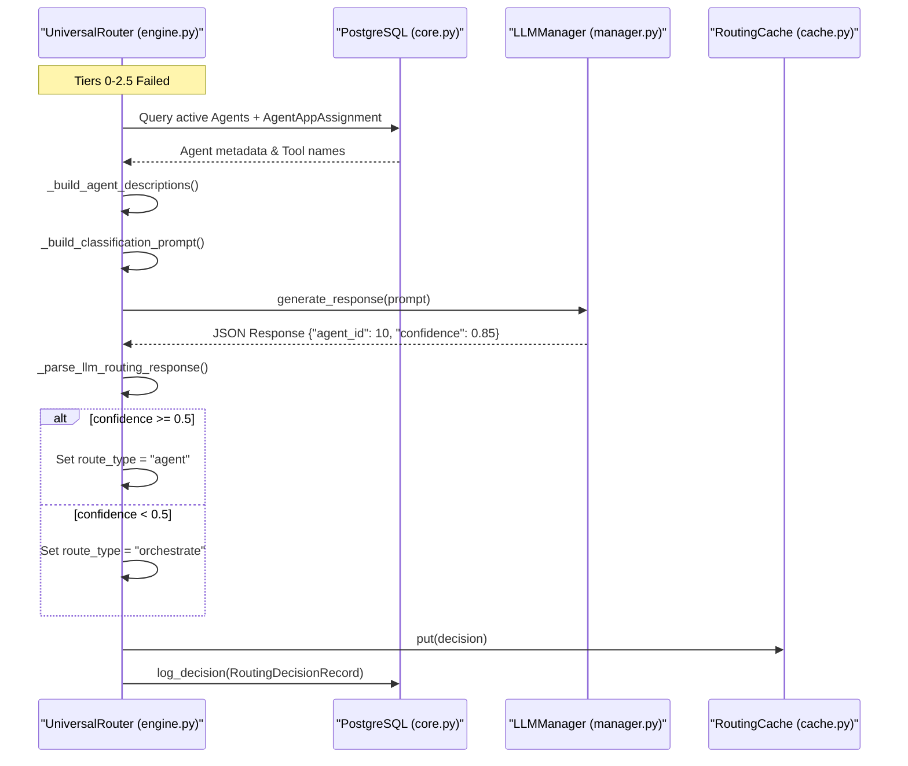
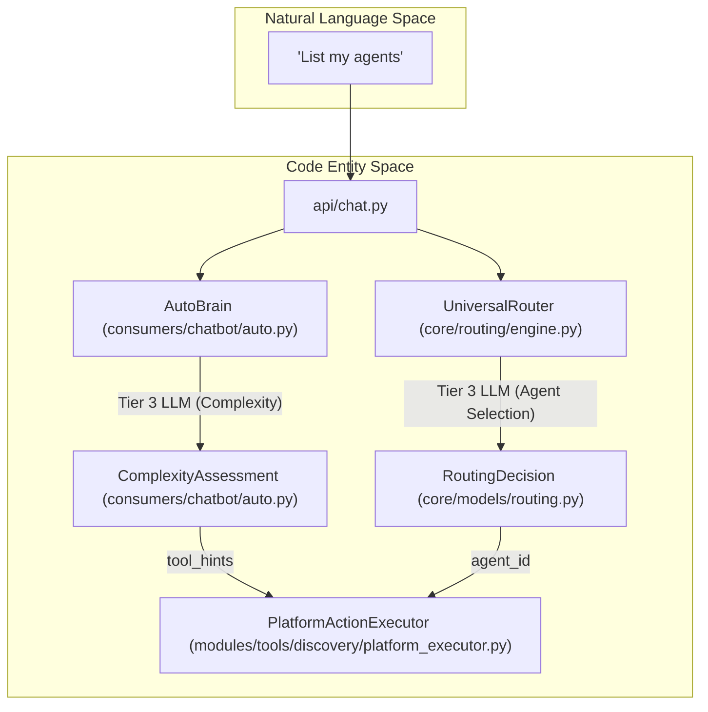

# Tier 3: LLM Classification

<details>
<summary>Relevant source files</summary>

The following files were used as context for generating this wiki page:

- [docs/reviews/COMPOSIO-TOOL-REGRESSION-REVIEW.md](docs/reviews/COMPOSIO-TOOL-REGRESSION-REVIEW.md)
- [orchestrator/api/chat.py](orchestrator/api/chat.py)
- [orchestrator/api/chat_voice.py](orchestrator/api/chat_voice.py)
- [orchestrator/consumers/chatbot/auto.py](orchestrator/consumers/chatbot/auto.py)
- [orchestrator/consumers/chatbot/intent_classifier.py](orchestrator/consumers/chatbot/intent_classifier.py)
- [orchestrator/consumers/chatbot/personality.py](orchestrator/consumers/chatbot/personality.py)
- [orchestrator/consumers/chatbot/service.py](orchestrator/consumers/chatbot/service.py)
- [orchestrator/consumers/chatbot/smart_tool_router.py](orchestrator/consumers/chatbot/smart_tool_router.py)
- [orchestrator/core/llm/manager.py](orchestrator/core/llm/manager.py)
- [orchestrator/core/routing/engine.py](orchestrator/core/routing/engine.py)
- [orchestrator/core/services/intent_classifier.py](orchestrator/core/services/intent_classifier.py)
- [orchestrator/modules/orchestrator/service.py](orchestrator/modules/orchestrator/service.py)
- [orchestrator/modules/tools/discovery/actions_analytics_enhanced.py](orchestrator/modules/tools/discovery/actions_analytics_enhanced.py)
- [orchestrator/modules/tools/discovery/handlers_analytics_enhanced.py](orchestrator/modules/tools/discovery/handlers_analytics_enhanced.py)
- [orchestrator/modules/tools/discovery/handlers_search.py](orchestrator/modules/tools/discovery/handlers_search.py)
- [orchestrator/modules/tools/discovery/platform_actions.py](orchestrator/modules/tools/discovery/platform_actions.py)
- [orchestrator/modules/tools/discovery/platform_executor.py](orchestrator/modules/tools/discovery/platform_executor.py)
- [orchestrator/modules/tools/tool_router.py](orchestrator/modules/tools/tool_router.py)

</details>


## Purpose and Scope

This document covers **Tier 3: LLM Classification** in the Universal Router's tiered routing system. Tier 3 is the final dynamic fallback mechanism that uses a Large Language Model (LLM) to analyze request intent against agent descriptions and semantic hints. It is invoked only when deterministic tiers (Overrides, Cache, Rules, and Semantic Similarity) fail to resolve a definitive route.

For the complete routing hierarchy, see [Routing Architecture](10.1).

---

## Overview

Tier 3 LLM Classification serves as the "brain" of the routing engine. It leverages the workspace's configured LLM to perform high-reasoning classification. Unlike Tier 2.5 (Semantic Similarity), which uses vector embeddings for fast retrieval, Tier 3 provides the LLM with the full context of available agents, their descriptions, and their integrated tools to make an informed decision.

The classification process produces:
1.  **Agent ID**: The selected agent to handle the request.
2.  **Confidence Score**: A float between 0.0 and 1.0 indicating certainty.
3.  **Route Type**: Either `agent` (direct) or `orchestrate` (multi-agent decomposition) based on the confidence threshold.

**Sources:** [orchestrator/core/routing/engine.py:13-15](), [orchestrator/core/routing/engine.py:148-158]()

---

## Tier 3 Implementation Flow

The `UniversalRouter._classify_with_llm` method executes the following logic:

### Implementation Logic
1. **Agent Discovery**: Queries the database for all active `Agent` entities within the current `workspace_id` [orchestrator/core/routing/engine.py:332-345]().
2. **Context Enrichment**: Joins agents with `AgentAppAssignment` to identify which third-party tools (via Composio) the agent can access [orchestrator/core/routing/engine.py:435-445]().
3. **Prompt Construction**: Assembles a system prompt containing the user's message and the formatted list of available agents [orchestrator/core/routing/engine.py:460-475]().
4. **LLM Inference**: Calls the LLM (typically via `OpenRouterProvider` or `OpenAIProvider`) to get a structured JSON response [orchestrator/core/routing/engine.py:380-405]().
5. **Threshold Validation**: Compares the returned `confidence` against `config.ROUTING_LLM_CONFIDENCE_THRESHOLD` [orchestrator/core/routing/engine.py:410-428]().

### Sequence Diagram
Title: Tier 3 LLM Classification Logic Flow


**Sources:** [orchestrator/core/routing/engine.py:332-433](), [orchestrator/core/routing/engine.py:560-585](), [orchestrator/core/models/routing.py:23-42]()

---

## Agent Context Assembly

To provide the LLM with sufficient context, the router builds a structured block of available agents. This bridges the "Natural Language Space" (user intent) with "Code Entity Space" (Agent IDs and Tool definitions).

### 1. Metadata Retrieval
The router fetches all agents where `status == 'active'` and joins them with `AgentAppAssignment` to identify which third-party tools (via Composio) the agent can access [orchestrator/core/routing/engine.py:435-445]().

### 2. Description Formatting
The `_build_agent_descriptions` helper creates a string representation for the prompt:
- **ID**: The database primary key `Agent.id`.
- **Name**: `Agent.name`.
- **Description**: `Agent.description`.
- **Apps**: A list of connected application names (e.g., "Slack", "Jira", "GitHub") [orchestrator/core/routing/engine.py:446-458]().

**Sources:** [orchestrator/core/routing/engine.py:435-458](), [orchestrator/core/models/composio_cache.py:33-40]()

---

## Classification Prompting

The system uses a strict JSON-output prompt to ensure machine-readability.

### Prompt Selection Logic
1.  **PromptRegistry**: It first attempts to fetch a dynamic template with the slug `routing-classifier`.
2.  **Hardcoded Fallback**: If no registry entry exists, it uses a default template [orchestrator/core/routing/engine.py:460-475]().

### Fallback Template Structure
```text
You are a request router. Given the user's request, select the best agent to handle it.
User request: {content}
Available agents:
- ID: 1, Name: Support, Description: Handles tickets, Apps: [Zendesk]
...
Respond with ONLY a JSON object: {"agent_id": <int>, "confidence": <float>}
```

**Sources:** [orchestrator/core/routing/engine.py:460-493]()

---

## Complexity Assessment (AutoBrain)

In the context of the `ChatbotIngestor`, Tier 3 routing is often preceded or supplemented by `AutoBrain` complexity assessment. While the `UniversalRouter` decides **who** handles the message, `AutoBrain` (Tier 3 LLM classification in `auto.py`) decides **how complex** the task is, ranging from `ATOM` to `ORGANISM` [orchestrator/consumers/chatbot/auto.py:5-22]().

`AutoBrain` utilizes a 3-tier assessment:
1. **Tier 1**: Redis cache lookup [orchestrator/consumers/chatbot/auto.py:15]().
2. **Tier 2**: Regex fast-paths for greetings and platform keywords [orchestrator/consumers/chatbot/auto.py:92-114]().
3. **Tier 3**: LLM classification for deep reasoning [orchestrator/consumers/chatbot/auto.py:17]().

Title: Complexity and Routing Logic Bridge


**Sources:** [orchestrator/consumers/chatbot/auto.py:14-22](), [orchestrator/consumers/chatbot/auto.py:59-82](), [orchestrator/modules/tools/discovery/platform_executor.py:164-173]()

---

## Tool Loop Prevention & Routing

Tier 3 routing is the gatekeeper for the `SmartChatOrchestrator`. Once a route is established, the system must prevent infinite tool loops. The `ToolExecutionTracker` implements exact and semantic deduplication to ensure the LLM doesn't repeatedly call the same tools for the same intent [orchestrator/consumers/chatbot/service.py:78-85]().

### Tool Retry Limits
| Tool Name | Limit |
| :--- | :--- |
| `composio_execute` | 2 |
| `search_knowledge` | 2 |
| `read_file` | 3 |
| `default` | 3 |

**Sources:** [orchestrator/consumers/chatbot/service.py:93-104](), [orchestrator/consumers/chatbot/service.py:114-140]()

---

## Persistence & Learning

Tier 3 decisions are persisted to the `routing_decisions` table via `RoutingDecisionRecord`. This enables:
- **Audit Trails**: Understanding why the LLM chose a specific agent [orchestrator/core/routing/engine.py:560-580]().
- **Cache Warming**: Tier 1 (Cache) uses the hash of successful Tier 3 decisions to bypass future LLM calls [orchestrator/core/routing/engine.py:102-107]().
- **Correction Loop**: If a user corrects a Tier 3 decision via the UI, the system updates the `RoutingCache` and marks the `RoutingDecisionRecord` as `was_corrected`.

**Sources:** [orchestrator/core/routing/engine.py:560-585](), [orchestrator/api/chat.py:143-150](), [orchestrator/consumers/chatbot/auto.py:74-83]()

---