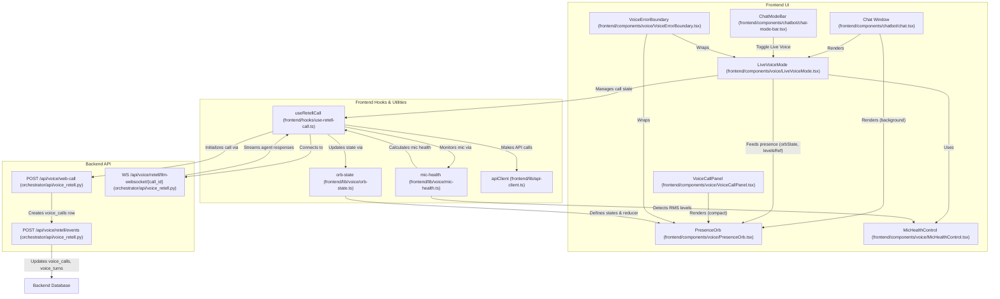

# Voice UI Components

Relevant source files

The following files were used as context for generating this wiki page:

- [frontend/app/api/generated-images/[id]/route.ts](frontend/app/api/generated-images/[id]/route.ts)
- [frontend/components/__tests__/prd207-live-voice.test.tsx](frontend/components/__tests__/prd207-live-voice.test.tsx)
- [frontend/components/chatbot/agent-selector.tsx](frontend/components/chatbot/agent-selector.tsx)
- [frontend/components/chatbot/chat-mode-bar.tsx](frontend/components/chatbot/chat-mode-bar.tsx)
- [frontend/components/chatbot/chat.tsx](frontend/components/chatbot/chat.tsx)
- [frontend/components/chatbot/code-block.tsx](frontend/components/chatbot/code-block.tsx)
- [frontend/components/chatbot/image-gallery.tsx](frontend/components/chatbot/image-gallery.tsx)
- [frontend/components/chatbot/message-actions.tsx](frontend/components/chatbot/message-actions.tsx)
- [frontend/components/chatbot/mission-created-card.tsx](frontend/components/chatbot/mission-created-card.tsx)
- [frontend/components/chatbot/mission-suggestion-card.tsx](frontend/components/chatbot/mission-suggestion-card.tsx)
- [frontend/components/chatbot/pin-agent-picker.tsx](frontend/components/chatbot/pin-agent-picker.tsx)
- [frontend/components/chatbot/sheet-artifact.tsx](frontend/components/chatbot/sheet-artifact.tsx)
- [frontend/components/voice/LiveVoiceMode.tsx](frontend/components/voice/LiveVoiceMode.tsx)
- [frontend/components/voice/MicHealthControl.tsx](frontend/components/voice/MicHealthControl.tsx)
- [frontend/components/voice/PresenceOrb.tsx](frontend/components/voice/PresenceOrb.tsx)
- [frontend/components/voice/VoiceCallPanel.tsx](frontend/components/voice/VoiceCallPanel.tsx)
- [frontend/components/voice/VoiceErrorBoundary.tsx](frontend/components/voice/VoiceErrorBoundary.tsx)
- [frontend/hooks/use-retell-call.ts](frontend/hooks/use-retell-call.ts)
- [frontend/lib/voice/mic-health.ts](frontend/lib/voice/mic-health.ts)
- [frontend/lib/voice/orb-state.ts](frontend/lib/voice/orb-state.ts)
- [orchestrator/alembic/versions/prd203_voice_turns.py](orchestrator/alembic/versions/prd203_voice_turns.py)
- [orchestrator/alembic/versions/prd207_su_capture.py](orchestrator/alembic/versions/prd207_su_capture.py)
- [orchestrator/alembic/versions/prd207_voice_live.py](orchestrator/alembic/versions/prd207_voice_live.py)
- [orchestrator/api/voice_retell.py](orchestrator/api/voice_retell.py)
- [orchestrator/core/models/voice_calls.py](orchestrator/core/models/voice_calls.py)
- [orchestrator/core/models/voice_turns.py](orchestrator/core/models/voice_turns.py)
- [orchestrator/core/services/image_store.py](orchestrator/core/services/image_store.py)
- [orchestrator/modules/voice/call_binding.py](orchestrator/modules/voice/call_binding.py)
- [orchestrator/modules/voice/live_settings.py](orchestrator/modules/voice/live_settings.py)
- [orchestrator/modules/voice/providers/retell.py](orchestrator/modules/voice/providers/retell.py)
- [orchestrator/modules/voice/retell_api.py](orchestrator/modules/voice/retell_api.py)
- [orchestrator/modules/voice/spoken_style.py](orchestrator/modules/voice/spoken_style.py)
- [orchestrator/modules/voice/telemetry.py](orchestrator/modules/voice/telemetry.py)
- [orchestrator/modules/voice/voice_meter.py](orchestrator/modules/voice/voice_meter.py)
- [orchestrator/tests/test_prd203_voice_retell.py](orchestrator/tests/test_prd203_voice_retell.py)
- [orchestrator/tests/test_prd207_voice_live.py](orchestrator/tests/test_prd207_voice_live.py)
- [orchestrator/tests/test_voice_quality.py](orchestrator/tests/test_voice_quality.py)

This page details the frontend components responsible for the Voice UI in Automatos AI, specifically focusing on the `LiveVoiceMode`, `PresenceOrb` visualizer, `useRetellCall` hook, `MicHealthControl` and RMS detection, `VoiceErrorBoundary`, `VoiceCallPanel`, and the `orb-state` management. These components collectively provide a real-time, interactive voice experience within the chat interface, integrating with the Retell voice transport system.

## LiveVoiceMode

The `LiveVoiceMode` component [frontend/components/voice/LiveVoiceMode.tsx:3-242]() is the central control strip for an active voice call. It manages the lifecycle of the voice call, including connecting, starting, stopping, and muting, and feeds presence information (such as speaking/listening state and audio levels) to other UI elements like the `PresenceOrb`.

It is rendered as a slim strip above the message box in the chat interface, displaying the call's state, duration, microphone status, and controls for muting/unmuting and ending the call. When a call fails to mint (e.g., due to budget limits or configuration issues), it displays an honest refusal message and options to retry or close.

Key functionalities include:
*   **Call Management**: Initiates and terminates the voice call using the `useRetellCall` hook [frontend/components/voice/LiveVoiceMode.tsx:70-82]().
*   **State Display**: Shows the current state of the call (e.g., "Auto is listening", "Mic live") and its duration [frontend/components/voice/LiveVoiceMode.tsx:152-167]().
*   **Mic Control**: Provides a button to toggle microphone mute/unmute [frontend/components/voice/LiveVoiceMode.tsx:170-183]() and a `MicDevicePicker` to select the input audio device [frontend/components/voice/LiveVoiceMode.tsx:186-191]().
*   **Presence Feedback**: Communicates the `orbState` and `levelsRef` (audio levels) to parent components for ambient visual feedback, such as the `PresenceOrb` [frontend/components/voice/LiveVoiceMode.tsx:92-93]().
*   **Error Handling**: Displays refusal or error messages if the call cannot be established or encounters issues [frontend/components/voice/LiveVoiceMode.tsx:135-136]().

The `LiveVoiceMode` component also handles the persistence of the selected capture device in local storage [frontend/components/voice/LiveVoiceMode.tsx:25-35]().

Sources:
*   [frontend/components/voice/LiveVoiceMode.tsx:3-242]()
*   [frontend/components/chatbot/chat-mode-bar.tsx:22-23]()

## PresenceOrb Canvas Visualizer

The `PresenceOrb` component [frontend/components/voice/PresenceOrb.tsx:1-425]() is a canvas-based visualizer that provides ambient feedback on the voice call's state and audio levels. It can operate in two modes: a compact band (for `VoiceCallPanel`) or a full-bleed background (for the chat window).

The visualizer renders dynamic elements such as woven ribbon bundles, luminous bars, and particles, with their intensity and movement reflecting the `OrbState` (e.g., `speaking`, `listening`, `thinking`) and live audio levels.

Key aspects of its implementation:
*   **Canvas Rendering**: Uses HTML5 Canvas API for drawing complex, animated visuals [frontend/components/voice/PresenceOrb.tsx:103-107]().
*   **State-driven Intensity**: The visual intensity of the orb changes based on the `OrbState`, providing a subtle yet informative cue to the user [frontend/components/voice/PresenceOrb.tsx:68-76]().
*   **Audio Level Integration**: It reads live audio levels from a `MutableRefObject<VoiceLevels>` [frontend/components/voice/PresenceOrb.tsx:34]() to animate elements like the luminous bars, without triggering React re-renders for every audio frame [frontend/hooks/use-retell-call.ts:11-12]().
*   **Dynamic Sizing**: Adjusts its dimensions based on its parent container when in background mode (`fullBleed`), ensuring it fills the available space [frontend/components/voice/PresenceOrb.tsx:153-156]().
*   **Palette**: Uses CSS HSL variables for brand colors, allowing for dynamic theming [frontend/components/voice/PresenceOrb.tsx:117-137]().
*   **Safety**: The rendering loop is wrapped in a `try/catch` block to prevent rendering faults from crashing the page [frontend/components/voice/PresenceOrb.tsx:24-26]().

### Orb State Management

The `orb-state` module [frontend/lib/voice/orb-state.ts]() defines the possible states of the `PresenceOrb` and the logic for transitioning between them.

**OrbState Enum**:
*   `connecting`: Initial state while establishing the call.
*   `listening`: Agent is listening for user input.
*   `speaking`: Agent is generating and speaking a response.
*   `thinking`: Agent is processing user input or generating a response.
*   `idle`: Call is active but no active speech or processing.
*   `error`: An error occurred during the call.
*   `ended`: The call has ended.

The `orbReducer` function [frontend/lib/voice/orb-state.ts:100-122]() manages state transitions based on events like `call_connecting`, `call_started`, `agent_start_talking`, `user_voice`, `tick`, and `call_ended`. This reducer ensures that the orb's visual state accurately reflects the call's real-time status.

**RMS Detection**: The `rmsLevel` function [frontend/lib/voice/orb-state.ts:122]() calculates the Root Mean Square (RMS) level from audio data, providing a measure of audio amplitude. This is used to drive the visual intensity of the orb.

Sources:
*   [frontend/components/voice/PresenceOrb.tsx:1-425]()
*   [frontend/lib/voice/orb-state.ts]()
*   [frontend/hooks/use-retell-call.ts:11-12]()
*   [frontend/components/__tests__/prd207-live-voice.test.tsx:28-39]()

## useRetellCall Hook

The `useRetellCall` hook [frontend/hooks/use-retell-call.ts:1-378]() is a React hook that encapsulates the logic for interacting with the Retell voice transport system. It replaces the previous `useVoiceStream` hook and leverages Retell's WebRTC SDK for real-time audio communication.

This hook is responsible for:
*   **Call Initialization**: Mints a short-lived access token server-side via `apiClient.post('/api/voice/web-call')` [frontend/hooks/use-retell-call.ts:200-201]() and initializes the Retell SDK client.
*   **Audio Stream Management**: Manages the user's microphone input stream, including device selection and muting [frontend/hooks/use-retell-call.ts:230-231]().
*   **Audio Level Analysis**: Continuously analyzes microphone input to detect silence and feed audio levels to the `levelsRef` [frontend/hooks/use-retell-call.ts:289-300]().
*   **State Management**: Maintains the `OrbState` (e.g., `listening`, `speaking`) and call duration, dispatching updates to the `orbReducer` [frontend/hooks/use-retell-call.ts:126-128]().
*   **Transcript Handling**: Processes real-time transcripts from Retell, updating captions and notifying `onLiveTurn` for live-typing effects in the chat [frontend/hooks/use-retell-call.ts:330-334]().
*   **Error and Refusal Handling**: Captures and exposes errors or refusals from the call minting process or during the call [frontend/hooks/use-retell-call.ts:202-210]().
*   **Device Enumeration**: Lists available audio input devices and refreshes the list on device changes [frontend/hooks/use-retell-call.ts:154-164]().

The `levelsRef` is a mutable ref [frontend/hooks/use-retell-call.ts:102]() that holds the current agent and user audio levels. This design allows the `PresenceOrb` to read these levels in its own `requestAnimationFrame` loop without causing frequent React re-renders, which is crucial for performance with high-frequency audio data.

Sources:
*   [frontend/hooks/use-retell-call.ts:1-378]()
*   [frontend/components/voice/LiveVoiceMode.tsx:70-82]()
*   [frontend/components/voice/PresenceOrb.tsx:34]()

## MicHealthControl and mic-health RMS detection

The `MicHealthControl` component [frontend/components/voice/MicHealthControl.tsx]() and the `mic-health` module [frontend/lib/voice/mic-health.ts]() are responsible for monitoring the health of the user's microphone input.

**MicHealthControl**:
This component provides UI elements related to microphone health, such as the `MicDevicePicker` for selecting an input device and the `MicSilentBanner` which warns the user if their microphone appears to be silent.

**mic-health RMS detection**:
The `mic-health` module [frontend/lib/voice/mic-health.ts]() implements the logic for detecting digital silence from the microphone input.
*   `initialMicHealth(now: number)`: Initializes the mic health state [frontend/lib/voice/mic-health.ts:14-20]().
*   `feedMicLevel(health: MicHealth, rms: number, now: number)`: Updates the mic health state with a new RMS level. It tracks a window of audio input and determines if the microphone has been consistently silent for a predefined duration (`MIC_SILENT_AFTER_MS`) [frontend/lib/voice/mic-health.ts:22-40]().
*   `MIC_SILENT_PEAK`: A threshold below which audio is considered silent [frontend/lib/voice/mic-health.ts:10]().

This detection helps identify scenarios where a microphone is connected but not picking up any sound, which can be a common issue with virtual audio devices or incorrect selections.

Sources:
*   [frontend/components/voice/MicHealthControl.tsx]()
*   [frontend/lib/voice/mic-health.ts]()
*   [frontend/components/__tests__/prd207-live-voice.test.tsx:90-124]()

## VoiceErrorBoundary

The `VoiceErrorBoundary` component [frontend/components/voice/VoiceErrorBoundary.tsx]() is a React Error Boundary specifically designed for the voice UI. It catches JavaScript errors that occur within its child components (e.g., `LiveVoiceMode` or `PresenceOrb`) and displays a fallback UI.

This ensures that a crash in the voice subsystem does not take down the entire application, providing a more robust user experience. It typically displays a message indicating that something went wrong and offers a way to reset or close the voice interface.

Sources:
*   [frontend/components/voice/VoiceErrorBoundary.tsx]()
*   [frontend/components/chatbot/chat.tsx:59]()

## VoiceCallPanel

The `VoiceCallPanel` component [frontend/components/voice/VoiceCallPanel.tsx]() is a UI panel that provides a compact view of the active voice call. It typically includes elements like the `PresenceOrb` in its compact `size` mode, displaying the call's status and basic controls.

While the full-bleed `PresenceOrb` might be in the chat background, the `VoiceCallPanel` offers a dedicated, smaller area for voice interaction controls and visual feedback.

Sources:
*   [frontend/components/voice/VoiceCallPanel.tsx]()
*   [frontend/components/voice/PresenceOrb.tsx:158-159]()

## Orb State Flow

The following diagram illustrates the state transitions of the `PresenceOrb` as managed by the `orbReducer` in `orb-state.ts`.

```mermaid
graph TD
    subgraph "Voice Call Lifecycle"
        Initial[Initial State] --> CallConnecting{Call Connecting}
        CallConnecting --> Connecting[Connecting]
        Connecting --> CallStarted{Call Started}
        CallStarted --> Listening[Listening]
        Listening -- "user_voice" --> Listening
        Listening -- "dead air > THINKING_AFTER_MS" --> Thinking[Thinking]
        Thinking -- "agent_start_talking" --> Speaking[Speaking]
        Speaking -- "agent_stop_talking" --> Listening
        Speaking -- "user_voice (barge-in)" --> Speaking
        Listening -- "call_ended" --> Ended[Ended]
        Thinking -- "call_ended" --> Ended
        Speaking -- "call_ended" --> Ended
        Connecting -- "call_ended" --> Ended
        Connecting -- "error" --> Error[Error]
        Listening -- "error" --> Error
        Thinking -- "error" --> Error
        Speaking -- "error" --> Error
    end

    subgraph "Mic Health Detection"
        MicHealthy[Mic Healthy] --> MicSilent{Mic Silent Detected}
        MicSilent -- "MIC_SILENT_AFTER_MS elapsed" --> MicSilentTrue[Mic Silent: True]
        MicSilentTrue -- "real signal > MIC_SILENT_PEAK" --> MicHealthy
    end

    style Initial fill:#f9f,stroke:#333,stroke-width:2px
    style Connecting fill:#ccf,stroke:#333,stroke-width:2px
    style Listening fill:#cfc,stroke:#333,stroke-width:2px
    style Thinking fill:#ffc,stroke:#333,stroke-width:2px
    style Speaking fill:#fcc,stroke:#333,stroke-width:2px
    style Ended fill:#eee,stroke:#333,stroke-width:2px
    style Error fill:#f00,stroke:#333,stroke-width:2px
    style MicHealthy fill:#cfc,stroke:#333,stroke-width:2px
    style MicSilentTrue fill:#fcc,stroke:#333,stroke-width:2px
```

Title: Orb State Transitions and Mic Health Detection
Sources:
*   [frontend/lib/voice/orb-state.ts:100-122]()
*   [frontend/lib/voice/mic-health.ts:22-40]()
*   [frontend/components/__tests__/prd207-live-voice.test.tsx:41-87]()
*   [frontend/components/__tests__/prd207-live-voice.test.tsx:90-124]()

## Voice UI Component Interaction

The following diagram illustrates the interaction between the main Voice UI components and their underlying hooks and modules.

Title: Voice UI Component Interaction Diagram
Sources:
*   [frontend/components/chatbot/chat.tsx:58-63]()
*   [frontend/components/voice/LiveVoiceMode.tsx:3-242]()
*   [frontend/components/voice/PresenceOrb.tsx:1-425]()
*   [frontend/hooks/use-retell-call.ts:1-378]()
*   [frontend/lib/voice/orb-state.ts]()
*   [frontend/lib/voice/mic-health.ts]()
*   [frontend/components/voice/MicHealthControl.tsx]()
*   [frontend/components/voice/VoiceErrorBoundary.tsx]()
*   [frontend/components/chatbot/chat-mode-bar.tsx:62-72]()
*   [orchestrator/api/voice_retell.py:99-163]()
*   [orchestrator/api/voice_retell.py:24-40]()
*   [orchestrator/api/voice_retell.py:1-20]()

---