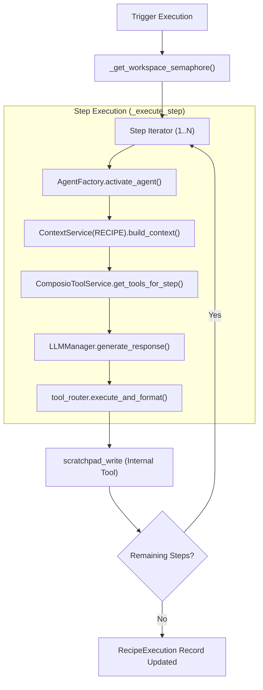

# Workflows & Recipes

<details>
<summary>Relevant source files</summary>

The following files were used as context for generating this wiki page:

- [frontend/components/context/configure-rag-modal.tsx](frontend/components/context/configure-rag-modal.tsx)
- [frontend/components/marketplace/marketplace-agents-tab.tsx](frontend/components/marketplace/marketplace-agents-tab.tsx)
- [frontend/components/marketplace/marketplace-homepage.tsx](frontend/components/marketplace/marketplace-homepage.tsx)
- [frontend/components/marketplace/marketplace-tools-tab.tsx](frontend/components/marketplace/marketplace-tools-tab.tsx)
- [frontend/components/shared/stats-bar.tsx](frontend/components/shared/stats-bar.tsx)
- [frontend/components/tools/tools-dashboard.tsx](frontend/components/tools/tools-dashboard.tsx)
- [frontend/components/workflows/active-workflows-panel.tsx](frontend/components/workflows/active-workflows-panel.tsx)
- [frontend/components/workflows/create-workflow-modal.tsx](frontend/components/workflows/create-workflow-modal.tsx)
- [frontend/components/workflows/edit-workflow-modal.tsx](frontend/components/workflows/edit-workflow-modal.tsx)
- [frontend/components/workflows/execution-kitchen.tsx](frontend/components/workflows/execution-kitchen.tsx)
- [frontend/components/workflows/json-schema-editor.tsx](frontend/components/workflows/json-schema-editor.tsx)
- [frontend/components/workflows/live-progress-panel.tsx](frontend/components/workflows/live-progress-panel.tsx)
- [frontend/components/workflows/run-workflow-modal.tsx](frontend/components/workflows/run-workflow-modal.tsx)
- [frontend/components/workflows/workflow-management.tsx](frontend/components/workflows/workflow-management.tsx)
- [frontend/lib/tooltips.json](frontend/lib/tooltips.json)
- [orchestrator/api/cache.py](orchestrator/api/cache.py)
- [orchestrator/api/recipe_executor.py](orchestrator/api/recipe_executor.py)
- [orchestrator/api/workflow_recipes.py](orchestrator/api/workflow_recipes.py)
- [orchestrator/modules/learning/tests/conftest.py](orchestrator/modules/learning/tests/conftest.py)
- [orchestrator/modules/learning/tests/test_learning_system.py](orchestrator/modules/learning/tests/test_learning_system.py)

</details>


## Purpose and Scope

This document covers the **Workflows & Recipes** system in Automatos AI, which enables multi-agent task orchestration through step-by-step execution pipelines. Recipes are user-defined workflows that chain multiple agents together to accomplish complex tasks, with support for scheduling, triggers, memory integration, and 5-dimensional quality assessment.

For details on the specific sub-systems, see the following child pages:
- [Creating Recipes](#6.1) — UI step builder and form configuration via `CreateRecipeModal` and `RecipeFormValues`.
- [Recipe Execution Engine](#6.2) — The `execute_recipe_direct` logic, workspace semaphores, and agent activation loop.
- [Execution Configuration](#6.3) — Sequential vs parallel modes, retries, and timeout management.
- [Scheduling & Triggers](#6.4) — Manual, cron, and webhook triggers; `RecipeScheduleConfig` and `TriggerSubscription`.
- [Recipe Memory & Learning](#6.5) — `RecipeLearningService` pattern extraction and `RecipeQualityService` 5D assessment.
- [Recipe Scratchpad](#6.6) — Inter-step data sharing with structured key-value storage and the `scratchpad_write` tool.
- [Workflow Pipeline Architecture](#6.7) — Comparison between legacy 9-stage and dynamic PRD-59 phases (PLAN, PREPARE, EXECUTE, EVALUATE, LEARN).
- [Workflow API Reference](#6.8) — Complete documentation for CRUD, execution, and cleanup endpoints.

---

## Core Concepts

### Workflows vs. Recipes

The system supports two distinct execution paradigms:

**Workflows** (Dynamic Pipeline):
- Orchestration through dynamic phases: `PLAN`, `PREPARE`, `EXECUTE`, `EVALUATE`, `LEARN` [orchestrator/api/recipe_executor.py:5-19]().
- Often associated with the legacy 9-stage tracker or the newer PRD-59 lifecycle [frontend/components/workflows/execution-kitchen.tsx:73-84]().

**Recipes** (Direct Step Execution):
- Simple step-by-step executor designed for "Starter Plan" simplicity [orchestrator/api/recipe_executor.py:5-7]().
- Bypasses the complex pipeline for sequential execution [orchestrator/api/recipe_executor.py:6-7]().
- Uses the same component path as the chatbot: `ContextService(RECIPE)`, `ComposioHintService`, and `tool_router` [orchestrator/api/recipe_executor.py:7-12]().

**Sources:** [orchestrator/api/recipe_executor.py:1-19](), [frontend/components/workflows/execution-kitchen.tsx:73-84]()

### Recipe Architecture

A recipe is defined by the `WorkflowTemplate` model (aliased as `WorkflowRecipe`), which stores the execution logic, agent assignments, and trigger configurations.

Title: Recipe Entity to Code Mapping
```mermaid
graph TB
    subgraph "Code Entity Space"
        Recipe["WorkflowTemplate (Model)"]
        Steps["steps (JSONB Field)"]
        SchedConfig["schedule_config (JSONB Field)"]
        ExecRecord["RecipeExecution (Model)"]
    end

    subgraph "Natural Language Space"
        Recipe --- "Automation Definition"
        Steps --- "Agent Steps & Prompt Templates"
        SchedConfig --- "Cron or Trigger Logic"
        ExecRecord --- "Execution History & Metrics"
    end

    Recipe --> Steps
    Recipe --> SchedConfig
    ExecRecord --> Recipe
```

**Sources:** [orchestrator/api/workflow_recipes.py:25-28](), [orchestrator/api/recipe_executor.py:34-37]()

---

## Recipe Execution Pipeline

### Direct Execution Flow

The `_execute_step` function is the core of the sequential executor. It activates agents via the `AgentFactory` and builds context using `ContextMode.RECIPE` [orchestrator/api/recipe_executor.py:66-149](). Concurrency is managed at the workspace level using `asyncio.Semaphore` [orchestrator/api/recipe_executor.py:42-59]().

Title: Recipe Execution Logic Flow


**Sources:** [orchestrator/api/recipe_executor.py:42-60](), [orchestrator/api/recipe_executor.py:118-125](), [orchestrator/api/recipe_executor.py:143-149](), [orchestrator/api/recipe_executor.py:166-173]()

### Recipe Scratchpad & Memory

To optimize token usage, the system utilizes a `RecipeScratchpad` instead of passing full message histories between steps [orchestrator/api/recipe_executor.py:14-16]().
- **Data Sharing:** Agents use the `scratchpad_write` tool to export specific results [orchestrator/api/recipe_executor.py:108-115]().
- **Context Injection:** `format_context_for_step` injects only relevant previous outputs into the `RecipeContextSection` [orchestrator/api/recipe_executor.py:130-141]().
- **Mem0 Integration:** Long-term memory is wired via `RecipeMemoryService` for pre/post execution recall [orchestrator/api/recipe_executor.py:18-19]().

**Sources:** [orchestrator/api/recipe_executor.py:14-19](), [orchestrator/api/recipe_executor.py:108-115](), [orchestrator/api/recipe_executor.py:130-141]()

---

## Scheduling & Triggers

The system supports automated execution via three primary channels:

| Trigger Type | Implementation | Code Reference |
| :--- | :--- | :--- |
| **Cron** | `PlaybookSchedulerService` schedules recurring jobs. | [orchestrator/api/workflow_recipes.py:34-48]() |
| **Composio** | `TriggerSubscription` maps external app events to recipes. | [orchestrator/api/workflow_recipes.py:50-70]() |
| **Webhooks** | Custom webhook IDs stored in `schedule_config`. | [orchestrator/api/workflow_recipes.py:55-58]() |

**Sources:** [orchestrator/api/workflow_recipes.py:34-126]()

---

## UI Components

The frontend provides a rich interface for managing and monitoring these workflows:

| Component | Purpose | File |
| :--- | :--- | :--- |
| `WorkflowManagement` | Main dashboard for recipes, history, and stats. | [frontend/components/workflows/workflow-management.tsx]() |
| `ExecutionKitchen` | Real-time "Theater" view for streaming execution logs. | [frontend/components/workflows/execution-kitchen.tsx]() |
| `ActiveWorkflowsPanel` | Monitor currently "cooking" recipes and system load. | [frontend/components/workflows/active-workflows-panel.tsx]() |
| `MarketplacePlaybooksTab`| Discover and install pre-built community recipes. | [frontend/components/marketplace/marketplace-homepage.tsx:170-172]() |
| `JsonSchemaEditor` | Structured editor for recipe input data and schemas. | [frontend/components/workflows/json-schema-editor.tsx]() |

**Sources:** [frontend/components/workflows/workflow-management.tsx:175-200](), [frontend/components/workflows/execution-kitchen.tsx:47-55](), [frontend/components/workflows/active-workflows-panel.tsx:139-148](), [frontend/components/workflows/json-schema-editor.tsx:20-28]()

---