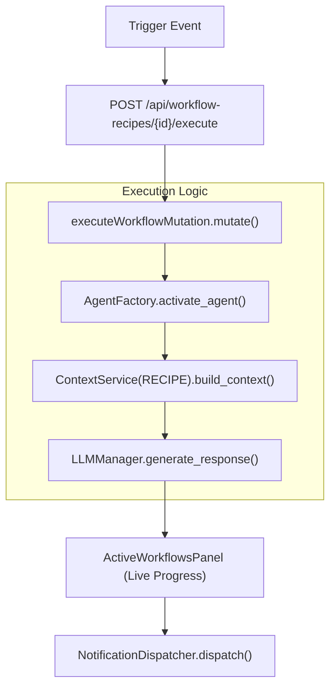

# Workflows & Recipes

<details>
<summary>Relevant source files</summary>

The following files were used as context for generating this wiki page:

- [docs/PRDS/125-WORKFLOW-DECOUPLING-MISSION-MIGRATION.md](docs/PRDS/125-WORKFLOW-DECOUPLING-MISSION-MIGRATION.md)
- [frontend/components/agents/org-chart-tab.tsx](frontend/components/agents/org-chart-tab.tsx)
- [frontend/components/dashboard/activity-chart.tsx](frontend/components/dashboard/activity-chart.tsx)
- [frontend/components/dashboard/dashboard.tsx](frontend/components/dashboard/dashboard.tsx)
- [frontend/components/dashboard/metric-cards.tsx](frontend/components/dashboard/metric-cards.tsx)
- [frontend/components/dashboard/widgets/activity-heatmap.tsx](frontend/components/dashboard/widgets/activity-heatmap.tsx)
- [frontend/components/dashboard/widgets/agent-collaboration-network.tsx](frontend/components/dashboard/widgets/agent-collaboration-network.tsx)
- [frontend/components/dashboard/widgets/agent-status-grid.tsx](frontend/components/dashboard/widgets/agent-status-grid.tsx)
- [frontend/components/dashboard/widgets/context-optimization-panel.tsx](frontend/components/dashboard/widgets/context-optimization-panel.tsx)
- [frontend/components/dashboard/widgets/learning-progress-chart.tsx](frontend/components/dashboard/widgets/learning-progress-chart.tsx)
- [frontend/components/dashboard/widgets/task-execution-timeline.tsx](frontend/components/dashboard/widgets/task-execution-timeline.tsx)
- [frontend/components/dashboard/widgets/token-usage-trends.tsx](frontend/components/dashboard/widgets/token-usage-trends.tsx)
- [frontend/components/workflows/active-workflows-panel.tsx](frontend/components/workflows/active-workflows-panel.tsx)
- [frontend/components/workflows/workflow-management.tsx](frontend/components/workflows/workflow-management.tsx)
- [orchestrator/api/marketplace.py](orchestrator/api/marketplace.py)
- [orchestrator/api/workflow_recipes.py](orchestrator/api/workflow_recipes.py)
- [orchestrator/core/seeds/platform-management-skill.md](orchestrator/core/seeds/platform-management-skill.md)

</details>


## Purpose and Scope

This document covers the **Workflows & Recipes** system in Automatos AI, which enables multi-agent task orchestration through step-by-step execution pipelines. Recipes are user-defined workflows that chain multiple agents together to accomplish complex tasks, with support for scheduling, triggers, memory integration, and 5-dimensional quality assessment.

Following the system's evolution, complex tasks previously handled by legacy workflows are being migrated to the **Mission** system (PRD-125), which utilizes a topological sort for task dependencies and a coordinator tick loop [docs/PRDS/125-WORKFLOW-DECOUPLING-MISSION-MIGRATION.md:15-18]().

For details on the specific sub-systems, see the following child pages:
- [Creating Recipes](#6.1) — UI step builder and form configuration [frontend/components/workflows/workflow-management.tsx:201-215]().
- [Recipe Execution Engine](#6.2) — The `execute_recipe_direct` logic and workspace semaphores.
- [Execution Configuration](#6.3) — Sequential vs parallel modes and timeout management.
- [Scheduling & Triggers](#6.4) — Manual, cron, and webhook triggers; `RecipeScheduleConfig` [orchestrator/api/workflow_recipes.py:59-65]().
- [Recipe Memory & Learning](#6.5) — `RecipeLearningService` pattern extraction and `RecipeQualityService` 5D assessment.
- [Recipe Scratchpad](#6.6) — Inter-step data sharing with structured key-value storage.
- [Workflow Pipeline Architecture](#6.7) — Comparison between legacy 9-stage and dynamic PRD-59 phases.
- [Workflow API Reference](#6.8) — Complete endpoint documentation [orchestrator/api/workflow_recipes.py:22-22]().

---

## Core Concepts

### Workflows vs. Recipes

The system supports two distinct execution paradigms:

**Workflows & Missions** (Dynamic Pipeline):
- Orchestration through dynamic phases: `PLAN`, `PREPARE`, `EXECUTE`, `EVALUATE`, `LEARN`.
- **Missions** are the preferred path for organ/organism complexity tasks, utilizing the `coordinator_service.py` 5s tick loop instead of the legacy filesystem-based pipeline [docs/PRDS/125-WORKFLOW-DECOUPLING-MISSION-MIGRATION.md:37-45]().

**Recipes** (Direct Step Execution):
- Simple step-by-step execution for predictable, repeatable automation.
- Bypasses complex pipelines for efficiency, often referred to as "Playbooks" in the UI [frontend/components/workflows/workflow-management.tsx:61-62]().
- Uses the same component path as the chatbot (`ContextService`, `LLMManager`) for alignment.

**Sources:** [docs/PRDS/125-WORKFLOW-DECOUPLING-MISSION-MIGRATION.md:15-45](), [frontend/components/workflows/workflow-management.tsx:57-62]()

### Recipe Architecture

A recipe (represented by the `WorkflowTemplate` model) is a structured template for multi-agent execution [orchestrator/api/workflow_recipes.py:25-25]().

Title: Recipe Data Structure
```mermaid
graph TB
    subgraph "Code Entity Space"
        Recipe["WorkflowTemplate (Model)"]
        Steps["steps (JSONB)"]
        SchedConfig["schedule_config (JSONB)"]
        ExecRecord["RecipeExecution (Model)"]
    end

    subgraph "Natural Language Space"
        Recipe --- "Automation Definition"
        Steps --- "Agent Assignments & Prompts"
        SchedConfig --- "Cron or Trigger Rules"
        ExecRecord --- "Execution History & Logs"
    end

    Recipe --> Steps
    Recipe --> SchedConfig
    ExecRecord --> Recipe
```

**Sources:** [orchestrator/api/workflow_recipes.py:25-28](), [orchestrator/api/marketplace.py:25-25]()

---

## Recipe Execution Pipeline

### Execution Flow

The system manages the lifecycle of a recipe run through a series of step executions. The UI tracks these through the `ActiveWorkflowsPanel`, which displays `recipe_runs` and `active_workflows` [frontend/components/workflows/active-workflows-panel.tsx:125-132]().

Title: Execution Logic to Code Mapping


**Sources:** [frontend/components/workflows/active-workflows-panel.tsx:54-58](), [frontend/components/workflows/active-workflows-panel.tsx:192-221](), [orchestrator/api/workflow_recipes.py:22-29]()

### Recipe Scratchpad & Data Sharing
Agents in a recipe share data through a structured scratchpad.
- **Platform Actions:** Agents use `platform_add_playbook_step` or `platform_update_playbook_step` to modify the flow programmatically [orchestrator/core/seeds/platform-management-skill.md:60-63]().
- **Inter-step Memory:** The `RecipeMemoryService` (Mem0) stores facts that persist across steps [orchestrator/core/seeds/platform-management-skill.md:114-117]().

**Sources:** [orchestrator/core/seeds/platform-management-skill.md:52-73](), [orchestrator/core/seeds/platform-management-skill.md:114-117]()

---

## Scheduling & Triggers

Recipes can be triggered through multiple mechanisms managed via `schedule_config`:

1.  **Manual:** Triggered via the `ExecutionKitchen` UI or the "Cook" button in the `ActiveWorkflowsPanel` [frontend/components/workflows/active-workflows-panel.tsx:192-193]().
2.  **Cron:** Scheduled recurring tasks using `cron_expression` managed by `PlaybookSchedulerService` [orchestrator/api/workflow_recipes.py:34-45]().
3.  **Triggers:** Subscriptions to external events via `TriggerSubscription` using Composio [orchestrator/api/workflow_recipes.py:107-116]().
4.  **Marketplace:** Recipes can be installed from the Community Marketplace, which clones the template and its agent dependencies to the local workspace [orchestrator/api/marketplace.py:144-150]().

**Sources:** [orchestrator/api/workflow_recipes.py:34-45](), [orchestrator/api/workflow_recipes.py:107-116](), [orchestrator/api/marketplace.py:144-150]()

---

## Monitoring & Analytics

Workflow and recipe performance is tracked via the `Analytics` system, providing visibility into costs and success rates.

- **Success Metrics:** `ActiveWorkflow` records track `total_executions`, `success_rate`, and `avg_duration` [frontend/components/workflows/active-workflows-panel.tsx:79-85]().
- **Live Monitoring:** The `ActivityChart` provides a real-time view of active missions and agent utilization [frontend/components/dashboard/activity-chart.tsx:138-143]().
- **Optimization:** The `ContextOptimizationPanel` tracks token savings and compression ratios achieved during multi-agent context assembly [frontend/components/dashboard/widgets/context-optimization-panel.tsx:135-149]().

**Sources:** [frontend/components/workflows/active-workflows-panel.tsx:79-85](), [frontend/components/dashboard/activity-chart.tsx:138-143](), [frontend/components/dashboard/widgets/context-optimization-panel.tsx:135-149]()

---

## UI Components

| Component | Purpose | File |
| :--- | :--- | :--- |
| `ActiveWorkflowsPanel` | Main dashboard for tracking running recipes and historical runs. | [frontend/components/workflows/active-workflows-panel.tsx:139-148]() |
| `ExecutionKitchen` | Dedicated interface for manual execution and real-time step monitoring. | [frontend/components/workflows/workflow-management.tsx:62-62]() |
| `PlaybooksTab` | Management interface for browsing and editing recipe templates. | [frontend/components/workflows/workflow-management.tsx:61-61]() |
| `LiveProgressPanel` | Detailed SSE-driven progress visualization for active recipe steps. | [frontend/components/workflows/active-workflows-panel.tsx:55-55]() |
| `StatsBar` | High-level summary of completed tasks, agent utilization, and duration. | [frontend/components/workflows/workflow-management.tsx:45-45]() |

**Sources:** [frontend/components/workflows/active-workflows-panel.tsx:139-156](), [frontend/components/workflows/workflow-management.tsx:45-62]()

---