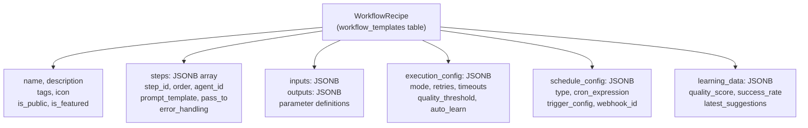
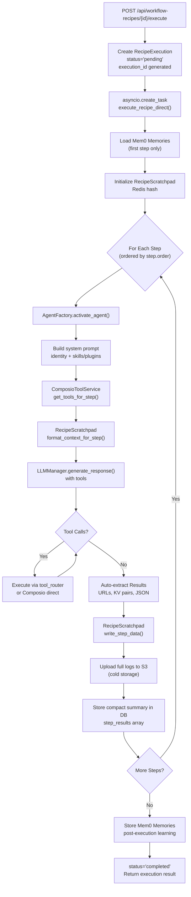
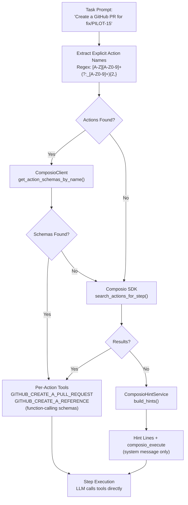
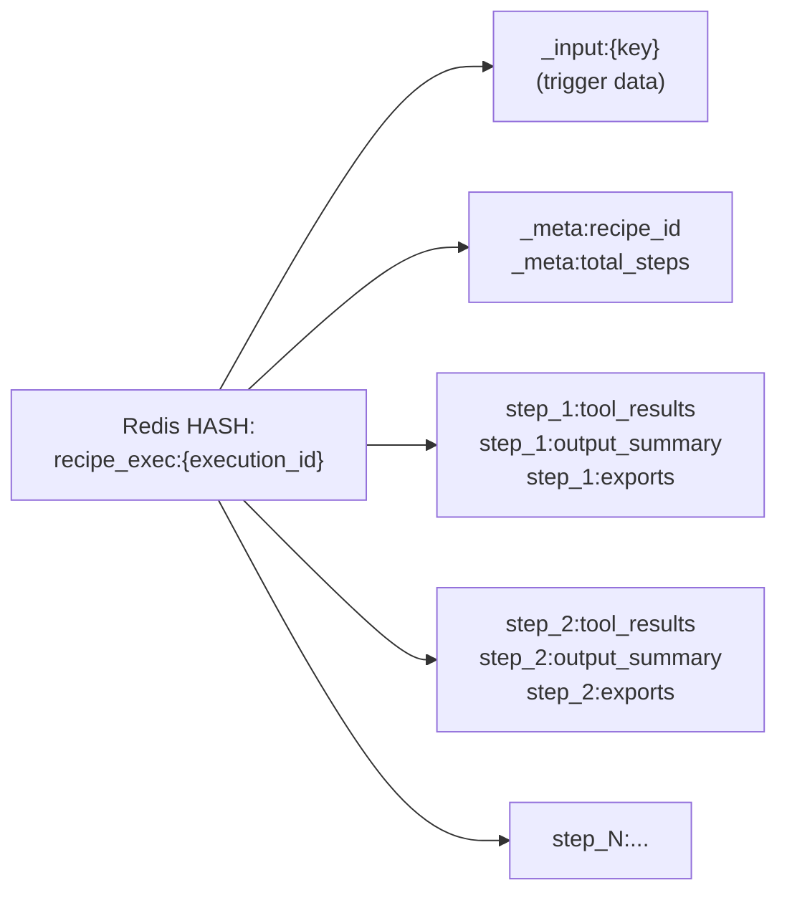
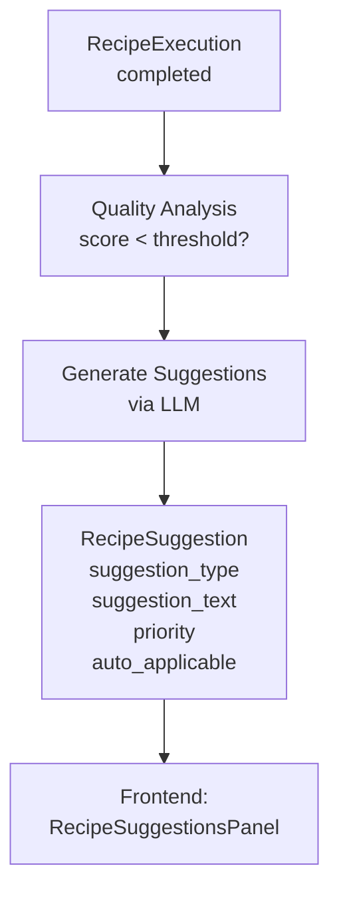
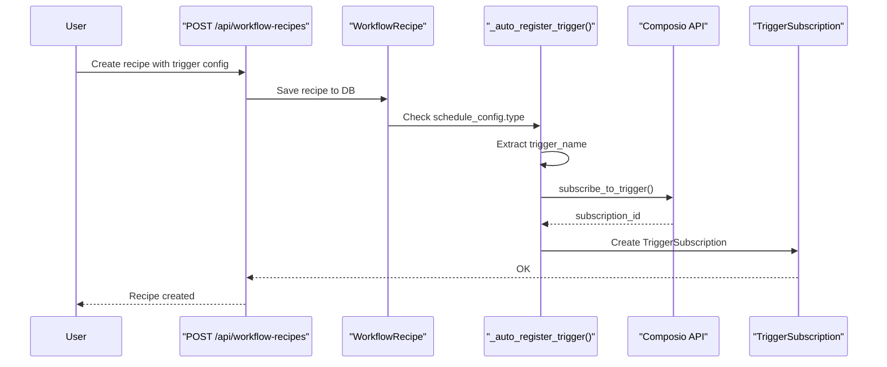
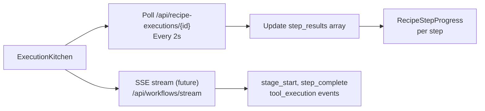

# Workflows & Recipes

<details>
<summary>Relevant source files</summary>

The following files were used as context for generating this wiki page:

- [frontend/components/workflows/create-recipe-modal.tsx](frontend/components/workflows/create-recipe-modal.tsx)
- [frontend/components/workflows/execution-kitchen.tsx](frontend/components/workflows/execution-kitchen.tsx)
- [frontend/components/workflows/recipe-execution-config.tsx](frontend/components/workflows/recipe-execution-config.tsx)
- [frontend/components/workflows/recipe-preview-panel.tsx](frontend/components/workflows/recipe-preview-panel.tsx)
- [frontend/components/workflows/recipe-step-builder.tsx](frontend/components/workflows/recipe-step-builder.tsx)
- [frontend/components/workflows/recipes-tab.tsx](frontend/components/workflows/recipes-tab.tsx)
- [frontend/components/workflows/view-recipe-modal.tsx](frontend/components/workflows/view-recipe-modal.tsx)
- [frontend/hooks/use-recipe-form.ts](frontend/hooks/use-recipe-form.ts)
- [frontend/tsconfig.tsbuildinfo](frontend/tsconfig.tsbuildinfo)
- [orchestrator/alembic/versions/20260202_add_workspace_id_to_skills_patterns_models.py](orchestrator/alembic/versions/20260202_add_workspace_id_to_skills_patterns_models.py)
- [orchestrator/api/recipe_executor.py](orchestrator/api/recipe_executor.py)
- [orchestrator/api/workflow_recipes.py](orchestrator/api/workflow_recipes.py)
- [orchestrator/api/workflows.py](orchestrator/api/workflows.py)
- [orchestrator/consumers/chatbot/service.py](orchestrator/consumers/chatbot/service.py)
- [orchestrator/core/llm/manager.py](orchestrator/core/llm/manager.py)
- [orchestrator/core/models/core.py](orchestrator/core/models/core.py)
- [orchestrator/core/services/recipe_memory_service.py](orchestrator/core/services/recipe_memory_service.py)
- [orchestrator/core/services/workspace_manager.py](orchestrator/core/services/workspace_manager.py)
- [orchestrator/modules/agents/factory/agent_factory.py](orchestrator/modules/agents/factory/agent_factory.py)
- [orchestrator/modules/orchestrator/pipeline.py](orchestrator/modules/orchestrator/pipeline.py)
- [orchestrator/modules/orchestrator/service.py](orchestrator/modules/orchestrator/service.py)

</details>


## Purpose and Scope

This document covers the **Workflows & Recipes** system in Automatos AI, which enables multi-agent task orchestration through step-by-step execution pipelines. Recipes are user-defined workflows that chain multiple agents together to accomplish complex tasks, with support for scheduling, triggers, memory integration, and self-learning capabilities.

For information about individual agents and their capabilities, see [Agents](#3). For analytics and monitoring of recipe executions, see [Analytics & Monitoring](#10). For the Universal Router that can trigger recipes, see [Universal Router](#9).

---

## Core Concepts

### Workflows vs. Recipes

The system supports two distinct execution paradigms:

**Workflows** (9-Stage Pipeline):
- Complex orchestration through 9 stages: Task Decomposition → Agent Selection → Context Engineering → Agent Execution → Result Aggregation → Learning Update → Quality Assessment → Memory Storage → Response Generation
- Used for dynamic, adaptive task execution
- Managed through `orchestrator/api/workflows.py`

**Recipes** (Direct Step Execution):
- Simple step-by-step execution with predefined agent assignments
- No decomposition or agent selection - steps execute sequentially or in parallel
- Lighter weight, more predictable execution path
- Primary focus of this document

**Sources:** [orchestrator/api/workflows.py:1-50](), [orchestrator/api/recipe_executor.py:1-20]()

### Recipe Structure

A recipe consists of:



**Sources:** [orchestrator/core/models/core.py:WorkflowTemplate](), [orchestrator/api/workflow_recipes.py:421-442]()

---

## Recipe Definition

### Database Schema

Recipes are stored in the `workflow_templates` table with the following key fields:

| Field | Type | Description |
|-------|------|-------------|
| `template_id` | VARCHAR | Unique identifier (e.g., "my-custom-recipe") |
| `name` | VARCHAR | Display name |
| `description` | TEXT | What the recipe does |
| `steps` | JSONB | Array of step definitions |
| `inputs` | JSONB | Input parameter schema |
| `outputs` | JSONB | Output schema |
| `execution_config` | JSONB | Runtime behavior config |
| `schedule_config` | JSONB | Scheduling configuration |
| `learning_data` | JSONB | Quality metrics and suggestions |
| `workspace_id` | UUID | Workspace ownership |
| `owner_type` | VARCHAR | 'workspace' or 'system' |

**Sources:** [orchestrator/core/models/core.py:1170-1350](), [orchestrator/api/workflow_recipes.py:383-389]()

### Steps Schema

Each step in the `steps` array must contain:

```typescript
{
  step_id: string,           // Unique ID within recipe
  order: number,             // Execution order (1, 2, 3...)
  agent_id: number,          // Agent to execute this step
  prompt_template: string,   // Task instruction (supports {input} substitution)
  pass_to?: string[],        // For parallel mode: which steps to pass results to
  error_handling?: string,   // 'stop' | 'continue' | 'retry'
  max_retries?: number       // Per-step retry limit
}
```

**Example steps array:**
```json
[
  {
    "step_id": "step-1",
    "order": 1,
    "agent_id": 42,
    "prompt_template": "Analyze the GitHub issue: {issue_url}",
    "error_handling": "stop"
  },
  {
    "step_id": "step-2", 
    "order": 2,
    "agent_id": 43,
    "prompt_template": "Create a PR to fix the issue based on analysis",
    "error_handling": "retry",
    "max_retries": 2
  }
]
```

**Validation rules:**
- All `agent_id` references must exist in the workspace
- `order` must start at 1 and increment sequentially
- `prompt_template` is required and non-empty

**Sources:** [orchestrator/core/models/core.py:1246-1276](), [orchestrator/api/workflow_recipes.py:444-473]()

### Execution Config

The `execution_config` field controls runtime behavior:

```typescript
{
  mode: 'sequential' | 'parallel',  // Execution strategy
  max_retries: number,              // Global retry limit (default: 1)
  retry_delay: number,              // Seconds between retries (default: 5)
  per_step_timeout: number,         // Seconds per step (default: 300)
  total_timeout: number,            // Total execution limit (default: 1800)
  quality_threshold: number,        // Min quality score 0-1 (default: 0.7)
  auto_learn: boolean              // Enable post-execution learning (default: true)
}
```

**Default values** are applied if omitted:

**Sources:** [orchestrator/api/workflow_recipes.py:404-412](), [orchestrator/core/models/core.py:1296-1335]()

### Schedule Config

The `schedule_config` field supports four execution triggers:

| Type | Description | Required Fields |
|------|-------------|-----------------|
| `manual` | User-triggered only | - |
| `cron` | Scheduled via cron expression | `cron_expression` |
| `trigger` | Composio trigger subscription | `trigger_config.trigger_name`, `trigger_config.source` |
| `webhook` | Webhook-based execution | Auto-generated `webhook_id` |

**Trigger config example (Composio):**
```json
{
  "type": "trigger",
  "trigger_config": {
    "source": "composio",
    "trigger_name": "GITHUB_PULL_REQUEST_EVENT",
    "trigger": "GITHUB_PULL_REQUEST_EVENT"  // UI shorthand
  },
  "webhook_id": "abc123..."  // Auto-generated for webhook URL
}
```

**Auto-registration:** When a recipe with `source: "composio"` trigger is created/updated, the system automatically subscribes to the trigger via Composio API and stores a `TriggerSubscription` record.

**Sources:** [orchestrator/api/workflow_recipes.py:37-113](), [orchestrator/api/workflow_recipes.py:415-419](), [orchestrator/api/workflow_recipes.py:478-481]()

---

## Recipe Execution Pipeline

### Execution Flow Overview

Recipe execution bypasses the 9-stage workflow pipeline and executes steps directly using the chatbot's exact component path (PRD-50 alignment):



**Sources:** [orchestrator/api/recipe_executor.py:559-735](), [orchestrator/api/workflow_recipes.py:783-856]()

### Step Execution Details

Each step execution (`_execute_step`) follows this pattern:

**1. Agent Activation:**
```python
factory = AgentFactory(db_session=db)
agent_runtime = await factory.activate_agent(agent.id)
llm = agent_runtime.llm_manager
```

**2. System Prompt Assembly:**
- Agent identity (name, type, description)
- Persona (custom or predefined)
- Plugin context (Tier 1 summary + Tier 2 full content) OR
- Skills (if no plugins assigned)
- Recipe step scope instruction (prevents task drift)

**3. Composio Tool Resolution:**

Two strategies are used:

**Strategy A: SDK Search (Primary)**
- Extract explicit action names from prompt (e.g., `GITHUB_CREATE_A_REFERENCE`)
- Fetch exact schemas via `ComposioToolService.get_tools_for_step()`
- Returns per-action function-calling tools with correct parameter schemas

**Strategy B: Hint-Based Fallback**
- Use `ComposioHintService.build_hints()` when SDK returns no tools
- Generates system message with available actions list
- LLM calls `composio_execute` mega-tool

**4. Context Injection:**
- Original trigger/input data (persistent across all steps)
- Mem0 memories (first step only)
- Scratchpad context from previous steps (structured keys, not full text)

**5. LLM Generation Loop:**
- Call `llm.generate_response()` with messages + tools
- If tool calls returned:
  - Execute via `tool_router.execute_and_format()` or Composio direct
  - Append tool results to messages
  - Continue loop (max 6 iterations)
- Return final text response

**6. Result Processing:**
- Auto-extract URLs, key-value pairs, JSON from response
- Write to scratchpad: `tool_results`, `output_summary`, `exports`
- Upload full logs (messages array) to S3
- Store compact summary in `RecipeExecution.step_results`

**Sources:** [orchestrator/api/recipe_executor.py:44-363](), [orchestrator/modules/tools/services/composio_tool_service.py:69-167](), [orchestrator/modules/tools/services/composio_hint_service.py:103-212]()

### Tool Resolution Architecture



**Key points:**
- **Primary path**: Extract explicit action names → direct schema lookup
- **Secondary path**: SDK semantic search (when no explicit names)
- **Fallback path**: Hint-based `composio_execute` mega-tool
- **Deduplication**: Same action + same args uses cached result

**Sources:** [orchestrator/modules/tools/services/composio_tool_service.py:69-167](), [orchestrator/modules/tools/services/composio_hint_service.py:89-212](), [orchestrator/api/recipe_executor.py:110-155]()

---

## Recipe Scratchpad

### Purpose and Token Savings

The `RecipeScratchpad` is a Redis-backed ephemeral context store that achieves **80-90% token savings** compared to dumping full agent outputs between steps.

**Problem it solves:**
- Step 1 output: 2000 tokens of verbose text
- Step 2 needs only: 3 key facts + 2 tool results
- Without scratchpad: 2000 tokens injected into Step 2 context
- With scratchpad: 150 tokens (structured keys only)

**Sources:** [orchestrator/core/services/recipe_scratchpad.py:1-20]()

### Key Layout



**Key naming conventions:**
- `_input:{key}` - Trigger/input data (e.g., `_input:issue_url`)
- `_meta:{key}` - Execution metadata
- `step_{N}:tool_results` - JSON array of tool execution summaries
- `step_{N}:output_summary` - First 500 chars of agent response
- `step_{N}:exports` - Agent's explicit `scratchpad_write` calls

**Example Redis hash:**
```
recipe_exec:exec-abc123
  _input:issue_url = "https://github.com/org/repo/issues/42"
  _meta:recipe_id = "15"
  _meta:total_steps = "3"
  step_1:tool_results = "[{\"action\":\"GITHUB_GET_ISSUE\",\"summary\":\"Title: Fix login bug\"}]"
  step_1:output_summary = "Analyzed the issue. Root cause is expired session..."
  step_1:exports = "{\"root_cause\":\"expired_session\",\"files\":[\"auth.py\"]}"
  step_2:tool_results = "[{\"action\":\"GITHUB_CREATE_A_REFERENCE\",\"ref\":\"fix/PILOT-15\"}]"
  step_2:output_summary = "Created branch fix/PILOT-15..."
```

**Sources:** [orchestrator/core/services/recipe_scratchpad.py:7-20](), [orchestrator/core/services/recipe_scratchpad.py:58-120]()

### Auto-Extraction

The scratchpad automatically extracts structured data from agent responses using zero-LLM heuristics:

**1. URLs:**
```python
_URL_RE = re.compile(r'https?://[^\s\'"<>]+')
```

**2. Key-Value Pairs:**
```python
_KV_RE = re.compile(r'^([A-Z][A-Za-z_ ]{1,30}):\s+(.+)$', re.MULTILINE)
# Matches: "Branch: fix/PILOT-15", "Issue ID: 42", etc.
```

**3. JSON Objects:**
- Attempts `json.loads()` on agent response
- Extracts top-level keys if successful

**4. Tool Results:**
- Each tool call's result stored in array
- Summarized as `{action: "TOOL_NAME", result: "..."}` (truncated)

**Example auto-extraction:**

Agent output:
```
I created a new branch for the fix.

Branch: fix/PILOT-15
PR URL: https://github.com/org/repo/pull/123
Status: Ready for review

Next steps: Run tests
```

Extracted:
```json
{
  "tool_results": [],
  "extracted_urls": ["https://github.com/org/repo/pull/123"],
  "extracted_kvs": {
    "Branch": "fix/PILOT-15",
    "PR URL": "https://github.com/org/repo/pull/123",
    "Status": "Ready for review"
  }
}
```

**Sources:** [orchestrator/core/services/recipe_scratchpad.py:26-30](), [orchestrator/core/services/recipe_scratchpad.py:199-299]()

### Context Formatting for Steps

When a step executes, it receives structured context from the scratchpad:

```python
def format_context_for_step(self, step_order: int) -> str:
    """
    Build context string for step N from scratchpad data.
    
    Returns formatted context with:
    - Original inputs
    - Results from steps 1 to N-1
    - Exports from previous steps
    """
```

**Example formatted context (Step 3):**
```
=== CONTEXT FROM PREVIOUS STEPS ===

Original Inputs:
  issue_url: https://github.com/org/repo/issues/42

Step 1 (Agent: Issue Analyzer):
  Tool: GITHUB_GET_ISSUE
  Result: {"title": "Fix login bug", "state": "open"}
  
  Agent exported:
    root_cause: expired_session
    files: ["auth.py"]

Step 2 (Agent: Branch Creator):
  Output summary: Created branch fix/PILOT-15 and prepared PR template...
  
  URLs: https://github.com/org/repo/pull/123
  
  Extracted data:
    Branch: fix/PILOT-15
    PR URL: https://github.com/org/repo/pull/123
```

**Sources:** [orchestrator/core/services/recipe_scratchpad.py:301-414](), [orchestrator/api/recipe_executor.py:178-183]()

---

## Memory Integration

### Mem0 Retrieval (Pre-Execution)

Before executing the first step, the system retrieves relevant memories from Mem0:

```python
from core.services.recipe_memory_service import RecipeMemoryService

memory_svc = RecipeMemoryService(db=db)
recipe_memories = memory_svc.retrieve_relevant_memories(
    recipe_id=recipe.id,
    context={"workspace_id": str(workspace_id), "input_data": input_data}
)
```

**Memory scope:**
```
user_id = f"ws_{workspace_id}_recipe_{template_id}"
```

This ensures memories are scoped per-recipe, not globally shared.

**Injection into Step 1:**
```python
if recipe_memories and step_order == 1:
    summary = recipe_memories.get("summary", "")
    if summary and summary != "No relevant memories found":
        messages.append({
            "role": "system",
            "content": f"## Learnings from Previous Runs\n{summary}"
        })
```

**Sources:** [orchestrator/api/recipe_executor.py:637-652](), [orchestrator/api/recipe_executor.py:151-163]()

### Memory Storage (Post-Execution)

After successful execution, key insights are stored in Mem0:

```python
try:
    memory_svc.store_execution_memory(
        recipe_id=recipe.id,
        execution_id=recipe_execution_id,
        step_results=step_results,
        final_output=output_data,
        quality_score=quality_score,
        workspace_id=workspace_id
    )
except Exception as exc:
    logger.info("[recipe_direct] Mem0 storage skipped: %s", exc)
```

**Stored memories include:**
- Successful tool combinations
- Error patterns and fixes
- Quality insights ("This recipe works best when X")
- Execution duration patterns

**Memory cleanup on recipe deletion:**
When a recipe is deleted, all associated memories are purged:

```python
# Delete all memories under the recipe scope
recipe_scope = f"ws_{ctx.workspace_id}_recipe_{template_id}"
all_mems = mem0.get_all(user_id=recipe_scope, limit=200)
for mem in all_mems:
    mem0.delete(mem.get("id"))
```

**Sources:** [orchestrator/api/recipe_executor.py:806-818](), [orchestrator/api/workflow_recipes.py:648-667]()

---

## Quality Assessment & Learning

### Quality Scoring

After execution, recipes are scored on multiple dimensions:

```python
quality_score = (
    output_completeness * 0.4 +    # Did we produce all expected outputs?
    success_rate * 0.3 +            # Historical success rate
    efficiency * 0.2 +              # Tokens/time vs baseline
    error_free * 0.1                # No errors in this run
)
```

The `quality_score` (0-1) is stored in `WorkflowRecipe.learning_data` and used for:
- Suggesting recipe improvements
- Ranking recipes in the UI
- Triggering auto-learning when below threshold

**Sources:** [orchestrator/core/models/core.py:1387-1396]()

### Suggestions System

The `RecipeSuggestion` model stores improvement recommendations:



**Suggestion types:**
- `step_refinement` - Improve prompt templates
- `agent_swap` - Use different agent for a step
- `tool_addition` - Suggest new tools to enable
- `error_fix` - Fix common failure patterns
- `performance` - Reduce token usage or latency

**UI display:**
Suggestions appear in the recipe detail view with:
- Priority badge (high/medium/low)
- Auto-applicable flag (can be applied with one click)
- Implementation guidance

**Sources:** [orchestrator/core/models/core.py:1422-1478](), [frontend/components/workflows/recipe-suggestions-panel.tsx:1-150]()

### Learning Data Structure

The `learning_data` JSONB field stores:

```json
{
  "quality_score": 0.85,
  "success_rate": 0.92,
  "avg_duration_ms": 12500,
  "avg_tokens": 4200,
  "total_executions": 15,
  "last_execution_at": "2024-01-15T10:30:00Z",
  "latest_suggestions": [
    {
      "id": 42,
      "type": "step_refinement",
      "text": "Step 2 prompt could be more specific...",
      "priority": "high",
      "created_at": "2024-01-15T10:31:00Z"
    }
  ],
  "error_patterns": {
    "rate_limit": 2,
    "timeout": 1
  }
}
```

**Sources:** [orchestrator/core/models/core.py:1228-1245]()

---

## Scheduling & Triggers

### Manual Execution

Direct execution via API:

```bash
POST /api/workflow-recipes/{recipe_id}/execute
Content-Type: application/json

{
  "input_data": {
    "issue_url": "https://github.com/org/repo/issues/42"
  }
}
```

**Response:**
```json
{
  "status": "pending",
  "recipe_execution_id": "exec-abc123",
  "message": "Recipe execution started"
}
```

**Sources:** [orchestrator/api/workflow_recipes.py:783-856]()

### Cron Scheduling

Recipes with `schedule_config.type = "cron"` are executed by a background scheduler:

**Example config:**
```json
{
  "type": "cron",
  "cron_expression": "0 9 * * 1-5",  // 9 AM weekdays
  "timezone": "UTC"
}
```

The cron scheduler (not shown in provided files) polls active recipes and triggers executions based on `cron_expression`.

**Sources:** [orchestrator/core/models/core.py:1344-1362]()

### Composio Triggers

Recipes can subscribe to Composio triggers (e.g., GitHub events):

**Setup flow:**



**Trigger config example:**
```json
{
  "type": "trigger",
  "trigger_config": {
    "source": "composio",
    "trigger_name": "GITHUB_PULL_REQUEST_EVENT",
    "filters": {
      "action": "opened",
      "repository": "org/repo"
    }
  },
  "webhook_id": "abc123..."
}
```

**Webhook handling:**
When Composio fires the trigger, it sends a webhook to:
```
{BACKEND_URL}/api/composio/webhook
```

The webhook handler:
1. Validates signature
2. Looks up matching `TriggerSubscription` by `composio_subscription_id`
3. Finds associated recipe via `workflow_id`
4. Triggers execution with webhook payload as `input_data`

**Sources:** [orchestrator/api/workflow_recipes.py:37-113](), [orchestrator/api/workflow_recipes.py:478-481]()

### Custom Webhooks

For non-Composio triggers, recipes can use generic webhooks:

**Webhook URL pattern:**
```
POST /api/workflow-recipes/{recipe_id}/execute
X-Webhook-Secret: {webhook_id}
```

The `webhook_id` is auto-generated and stored in `schedule_config`:

```python
if schedule_config and schedule_config.get('type') in ('trigger', 'webhook'):
    if 'webhook_id' not in schedule_config:
        schedule_config['webhook_id'] = uuid4().hex
```

**Sources:** [orchestrator/api/workflow_recipes.py:415-419]()

---

## Frontend Components

### RecipesTab

Main recipe browsing and management interface.

**Component:** `frontend/components/workflows/recipes-tab.tsx`

**Features:**
- Grid/list view toggle
- Search and filtering
- Recipe cards with metrics (steps, agents, runs)
- Quick "Cook" button for instant execution
- Edit/delete actions (non-system recipes only)
- Share to marketplace

**Card data:**
```typescript
interface RecipeCard {
  id: number
  template_id: string
  name: string
  description: string
  icon: string
  steps: Array<{step_id, order, agent_id, prompt_template}>
  use_count: number
  quality_score: number
  success_rate: number
  is_system: boolean
  marketplace_category?: string
  learning_data?: {
    latest_suggestions: Array<Suggestion>
  }
}
```

**Key interactions:**
- **View:** Opens `ViewRecipeModal` with full details
- **Edit:** Opens `CreateRecipeModal` in edit mode
- **Cook:** Calls `useExecuteRecipe()` mutation → opens `ExecutionKitchen`
- **Share:** Calls `useSubmitRecipeToMarketplace()` mutation

**Sources:** [frontend/components/workflows/recipes-tab.tsx:81-515]()

### ExecutionKitchen

Real-time execution visualization component (replaces old "Execution Theater").

**Component:** `frontend/components/workflows/execution-kitchen.tsx`

**Displays:**
- Recipe step progress (current step, status, duration)
- Streaming execution logs
- Tool calls and results
- Per-step metrics (tokens, duration)
- Quality score and suggestions (post-execution)

**Execution modes:**
1. **Recipe direct execution** - Step-by-step with `RecipeStepProgress`
2. **9-stage workflow** - Full pipeline with `TheaterStageProgress`

**Data flow:**



**Sources:** [frontend/components/workflows/execution-kitchen.tsx:1-300](), [frontend/components/workflows/recipe-step-progress.tsx:1-200]()

### RecipeStepProgress

Displays individual step execution details.

**Component:** `frontend/components/workflows/recipe-step-progress.tsx`

**Per-step data:**
```typescript
interface RecipeStepResult {
  step_id: string
  order: number
  agent_id: number
  agent_name: string
  prompt_template: string
  status: 'pending' | 'running' | 'completed' | 'failed'
  output: string | null
  tool_calls: Array<{
    action: string
    params: object
    result: string
    duration_ms: number
  }>
  duration_ms: number
  tokens_used: number
  started_at: string
  completed_at: string
  error: string | null
  log_url: string | null  // S3 URL for full logs
}
```

**UI features:**
- Collapsible accordion per step
- Status badge (running/completed/failed)
- Agent avatar and name
- Duration and token metrics
- Tool calls list with results
- Output preview (first 500 chars)
- "View full logs" link (fetches from S3)

**Sources:** [frontend/components/workflows/recipe-step-progress.tsx:1-250]()

### CreateRecipeModal

Recipe creation/editing wizard.

**Component:** `frontend/components/workflows/create-recipe-modal.tsx`

**Form structure:**
1. **Basic Info:** name, description, icon
2. **Steps:** Step builder with agent selection, prompt template
3. **Inputs/Outputs:** JSON schema for parameters
4. **Execution Config:** Mode, retries, timeouts
5. **Schedule Config:** Trigger type and configuration

**Step builder:**
```typescript
interface StepFormData {
  step_id: string
  order: number
  agent_id: string
  prompt_template: string
  error_handling: 'stop' | 'continue' | 'retry'
  pass_to?: string[]  // For parallel mode
}
```

**Validation:**
- All agents must exist in workspace
- Prompt templates required
- Order must be sequential (1, 2, 3...)
- JSON schemas must be valid

**Sources:** [frontend/components/workflows/create-recipe-modal.tsx:1-500]()

---

## API Reference

### Recipe CRUD

**List Recipes**
```http
GET /api/workflow-recipes?search={query}&limit={N}&sort_by={field}
```

**Get Recipe**
```http
GET /api/workflow-recipes/{recipe_id}
```
Returns recipe with enriched agent details per step.

**Create Recipe**
```http
POST /api/workflow-recipes
Content-Type: application/json

{
  "template_id": "my-recipe",
  "name": "My Recipe",
  "description": "...",
  "steps": [...],
  "inputs": {...},
  "outputs": {...},
  "execution_config": {...},
  "schedule_config": {...}
}
```

**Update Recipe**
```http
PUT /api/workflow-recipes/{recipe_id}
Content-Type: application/json

{
  "name": "Updated Name",
  "steps": [...]
}
```

**Delete Recipe**
```http
DELETE /api/workflow-recipes/{recipe_id}
```
Also cleans up trigger subscriptions and Mem0 memories.

**Sources:** [orchestrator/api/workflow_recipes.py:164-683]()

### Recipe Execution

**Execute Recipe**
```http
POST /api/workflow-recipes/{recipe_id}/execute
Content-Type: application/json

{
  "input_data": {
    "issue_url": "https://github.com/...",
    "assignee": "user@example.com"
  }
}
```

**Response:**
```json
{
  "status": "pending",
  "recipe_execution_id": "exec-abc123",
  "recipe_id": "my-recipe",
  "steps": [...]
}
```

**Get Execution Status**
```http
GET /api/recipe-executions/{execution_id}
```

**List Executions**
```http
GET /api/recipe-executions?recipe_id={id}&status={status}&limit={N}
```

**Sources:** [orchestrator/api/workflow_recipes.py:783-856]()

### Recipe Analytics

**Dashboard Stats**
```http
GET /api/workflow-recipes/stats/dashboard
```

Returns:
```json
{
  "overview": {
    "total_recipes": 15,
    "total_executions": 142,
    "avg_quality_score": 0.82,
    "avg_success_rate": 0.91
  },
  "status_breakdown": {
    "completed": 130,
    "failed": 10,
    "running": 2
  },
  "top_recipes": [
    {
      "id": 5,
      "name": "GitHub Issue Handler",
      "use_count": 45,
      "success_rate": 0.95,
      "quality_score": 0.88
    }
  ]
}
```

**Get Suggestions**
```http
GET /api/workflow-recipes/{recipe_id}/suggestions
```

**Sources:** [orchestrator/api/workflow_recipes.py:239-323]()

### Recipe Marketplace

**Submit to Marketplace**
```http
POST /api/workflow-recipes/{recipe_id}/submit-to-marketplace
Content-Type: application/json

{
  "category": "automation",
  "icon": "🤖"
}
```

**Featured Recipes**
```http
GET /api/workflow-recipes/featured/list?limit={N}
```

**Categories**
```http
GET /api/workflow-recipes/categories/list
```

**Sources:** [orchestrator/api/workflow_recipes.py:724-780]()

---

## Summary

The Workflows & Recipes system provides a flexible, step-by-step agent orchestration framework with:

- **Simple execution model** - Direct step execution without complex decomposition
- **Context compression** - RecipeScratchpad achieves 80-90% token savings
- **Memory integration** - Mem0 enables self-learning across executions
- **Flexible scheduling** - Manual, cron, Composio triggers, or webhooks
- **Quality assessment** - Automated scoring and improvement suggestions
- **Rich visualization** - Real-time execution monitoring in ExecutionKitchen

For advanced orchestration needs requiring dynamic task decomposition and agent selection, see the full workflow system in [Workflows API](#4.7).

**Sources:** [orchestrator/api/recipe_executor.py:1-850](), [orchestrator/api/workflow_recipes.py:1-856](), [orchestrator/core/services/recipe_scratchpad.py:1-450]()

---