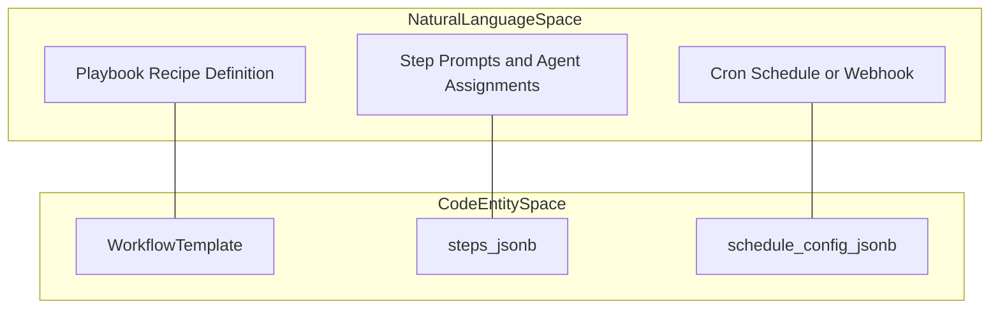
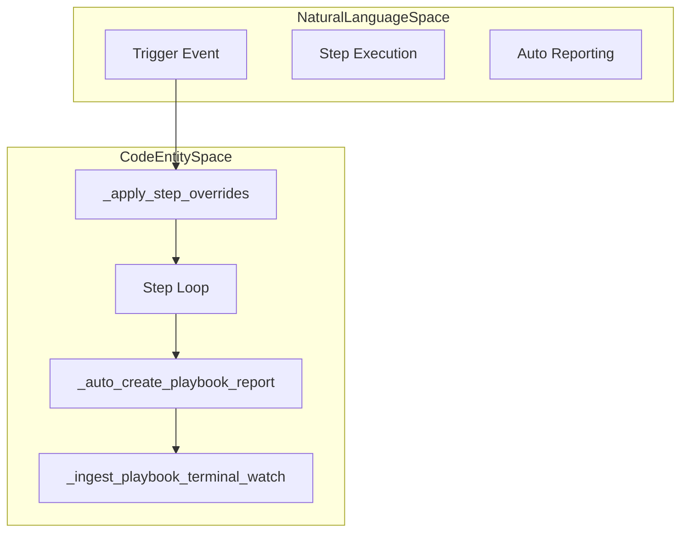

# Workflows & Recipes

Relevant source files

The following files were used as context for generating this wiki page:

- [frontend/components/workflows/execution-kitchen.tsx](frontend/components/workflows/execution-kitchen.tsx)
- [orchestrator/api/composio.py](orchestrator/api/composio.py)
- [orchestrator/api/recipe_executor.py](orchestrator/api/recipe_executor.py)
- [orchestrator/api/skills.py](orchestrator/api/skills.py)
- [orchestrator/api/tools.py](orchestrator/api/tools.py)
- [orchestrator/api/webhooks.py](orchestrator/api/webhooks.py)
- [orchestrator/api/workflow_recipes.py](orchestrator/api/workflow_recipes.py)
- [orchestrator/core/composio/client.py](orchestrator/core/composio/client.py)
- [orchestrator/core/composio/linkedin_image_workaround.py](orchestrator/core/composio/linkedin_image_workaround.py)
- [orchestrator/core/composio/tool_executor.py](orchestrator/core/composio/tool_executor.py)
- [orchestrator/core/credentials/tester.py](orchestrator/core/credentials/tester.py)
- [orchestrator/core/credentials/types.py](orchestrator/core/credentials/types.py)
- [orchestrator/core/database/credential_types_seed.json](orchestrator/core/database/credential_types_seed.json)
- [orchestrator/core/routing/ingestors/webhook.py](orchestrator/core/routing/ingestors/webhook.py)
- [orchestrator/services/metadata_sync_service.py](orchestrator/services/metadata_sync_service.py)
- [orchestrator/services/webhook_dedup.py](orchestrator/services/webhook_dedup.py)
- [orchestrator/tests/test_p2w0_service_imports_resolve.py](orchestrator/tests/test_p2w0_service_imports_resolve.py)
- [orchestrator/tests/test_p2w2_webhook_dedup.py](orchestrator/tests/test_p2w2_webhook_dedup.py)
- [orchestrator/tests/test_p2w2_webhook_signature_reject.py](orchestrator/tests/test_p2w2_webhook_signature_reject.py)

## Purpose and Scope

This document covers the **Workflows & Recipes** system in Automatos AI, which enables multi-agent task orchestration through step-by-step execution pipelines. Recipes are user-defined workflows that chain multiple agents together to accomplish complex tasks, with support for scheduling, triggers, memory integration, and multi-dimensional quality assessment.

For details on the specific sub-systems, see the following child pages:
- [Creating Recipes](#6.1) — Playbook/recipe creation UI, step builder, preview panel, JSON schema editor.
- [Recipe Execution Engine](#6.2) — `_execute_step`, workspace semaphores, step loop, agent activation, tool execution, playbook breaker and failure visibility.
- [Execution Configuration](#6.3) — Sequential vs parallel modes, retries, timeouts, `parallel_limit`, memory_isolation, auto_learning, power modes.
- [Scheduling & Triggers](#6.4) — Manual, cron, and webhook triggers; `playbook_scheduler`; `scheduled_task_service`; `TriggerSubscription`; webhook dedup and signature verification.
- [Recipe Memory & Learning](#6.5) — Playbook memory service, pattern extraction, quality assessment, and the learning flywheel.
- [Recipe Scratchpad](#6.6) — Inter-step data sharing with structured key-value storage, `scratchpad_write`/`read` tools.
- [Workflow Pipeline Architecture](#6.7) — Legacy 9-stage workflow vs dynamic phases (`PLAN`, `PREPARE`, `EXECUTE`, `EVALUATE`, `LEARN`), `WorkflowStageTracker`, SSE stage events.
- [Workflow API Reference](#6.8) — API endpoints for workflow/playbook CRUD, execution, templates, history, active workflows, cleanup.

---

## Core Concepts

### Workflows vs. Recipes

The system supports two distinct execution paradigms:

- **Workflows (Dynamic Pipeline):** Orchestration through dynamic execution phases (`PLAN`, `PREPARE`, `EXECUTE`, `EVALUATE`, `LEARN`) [orchestrator/api/workflows.py:63-69](). Used for autonomous, adaptive task execution where progress is tracked via `WorkflowStageTracker`.
- **Recipes (Direct Step Execution):** Simple step-by-step execution for predictable, repeatable automation [orchestrator/api/recipe_executor.py:5-7](). Bypasses the complex 9-stage pipeline for efficiency and uses the same component path as the chatbot (`ContextService`, `LLMManager`, `ToolRouter`) [orchestrator/api/recipe_executor.py:7-12]().

Title: Recipe Architecture Mapping

Sources: [orchestrator/api/recipe_executor.py:1-19](), [orchestrator/api/workflow_recipes.py:25-27](), [orchestrator/api/workflows.py:38-70]()

---

## Recipe Execution Pipeline

The recipe executor handles the lifecycle of a recipe run. It manages terminal state reporting via `_ingest_playbook_terminal_watch` and supports per-execution step overrides for prompt tweaking [orchestrator/api/recipe_executor.py:89-101](), [orchestrator/api/recipe_executor.py:129-140]().

Title: Execution Pipeline Flow

For details on execution internals, see [Recipe Execution Engine](#6.2).

Sources: [orchestrator/api/recipe_executor.py:89-158](), [orchestrator/api/recipe_executor.py:163-180]()

---

## Execution Configuration

Recipes support flexible configuration parameters such as sequential or parallel execution modes, retry policies, timeouts, memory isolation settings, and power modes. 

For complete configuration options, see [Execution Configuration](#6.3).

Sources: [orchestrator/api/recipe_executor.py:14-19]()

---

## Scheduling & Triggers

Playbooks can be invoked via manual UI triggers, scheduled cron expressions using `_sync_cron_schedule`, Composio trigger subscriptions (`_auto_register_trigger`), or external webhooks with cryptographic HMAC signature verification [orchestrator/api/workflow_recipes.py:36-128](), [orchestrator/api/webhooks.py:50-93]().

For implementation details, see [Scheduling & Triggers](#6.4).

Sources: [orchestrator/api/workflow_recipes.py:36-128](), [orchestrator/api/webhooks.py:50-93]()

---

## Recipe Memory & Learning

Recipes integrate with Mem0 and pattern extraction services to record execution summaries, evaluate quality metrics, and feed the continuous learning loop [orchestrator/api/recipe_executor.py:15-19]().

For more information, see [Recipe Memory & Learning](#6.5).

Sources: [orchestrator/api/recipe_executor.py:15-19]()

---

## Recipe Scratchpad

Inter-step data sharing is handled through the `RecipeScratchpad` structured key-value storage, which reduces token usage by 80-90% compared to verbose text dumps [orchestrator/api/recipe_executor.py:15-16](). Agents explicitly export data using the `scratchpad_write` tool [orchestrator/api/recipe_executor.py:16-17]().

For deep dives, see [Recipe Scratchpad](#6.6).

Sources: [orchestrator/api/recipe_executor.py:15-19]()

---

## Workflow Pipeline Architecture & UI

Workflows track progress across legacy stages and dynamic phases (`PLAN`, `PREPARE`, `EXECUTE`, `EVALUATE`, `LEARN`) via `WorkflowStageTracker` and SSE events [orchestrator/api/workflows.py:38-69](). 

Frontend execution is monitored in real-time through components like `ExecutionKitchen` and `TheaterStageProgress` [frontend/components/workflows/execution-kitchen.tsx:35-54]().

For architectural details, see [Workflow Pipeline Architecture](#6.7) and [Workflow API Reference](#6.8).

Sources: [orchestrator/api/workflows.py:38-69](), [frontend/components/workflows/execution-kitchen.tsx:35-54]()

---