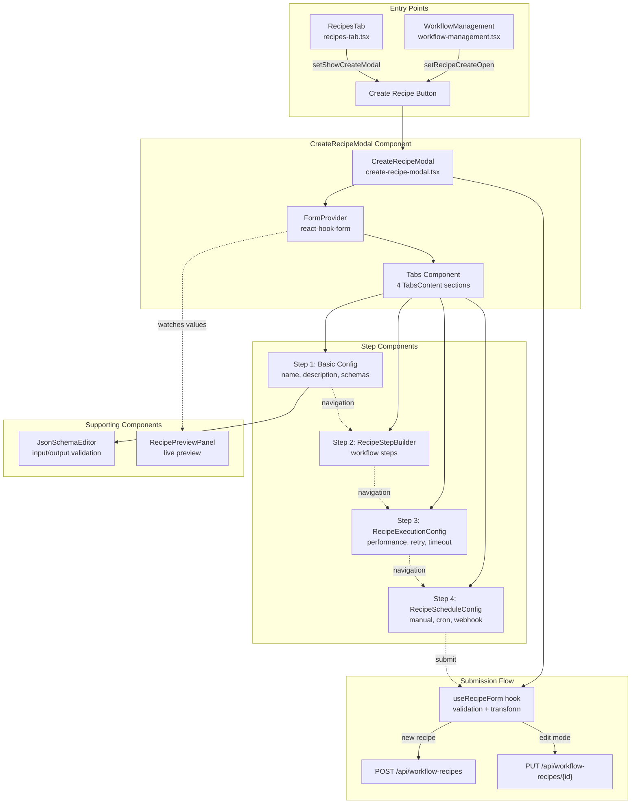
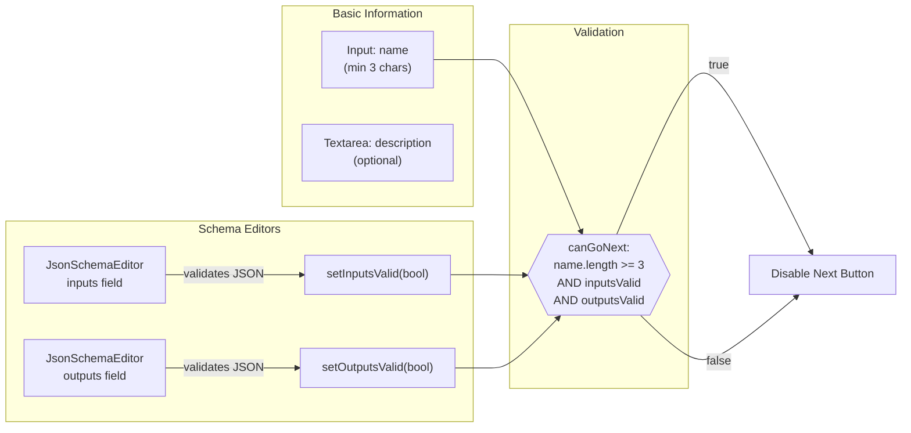
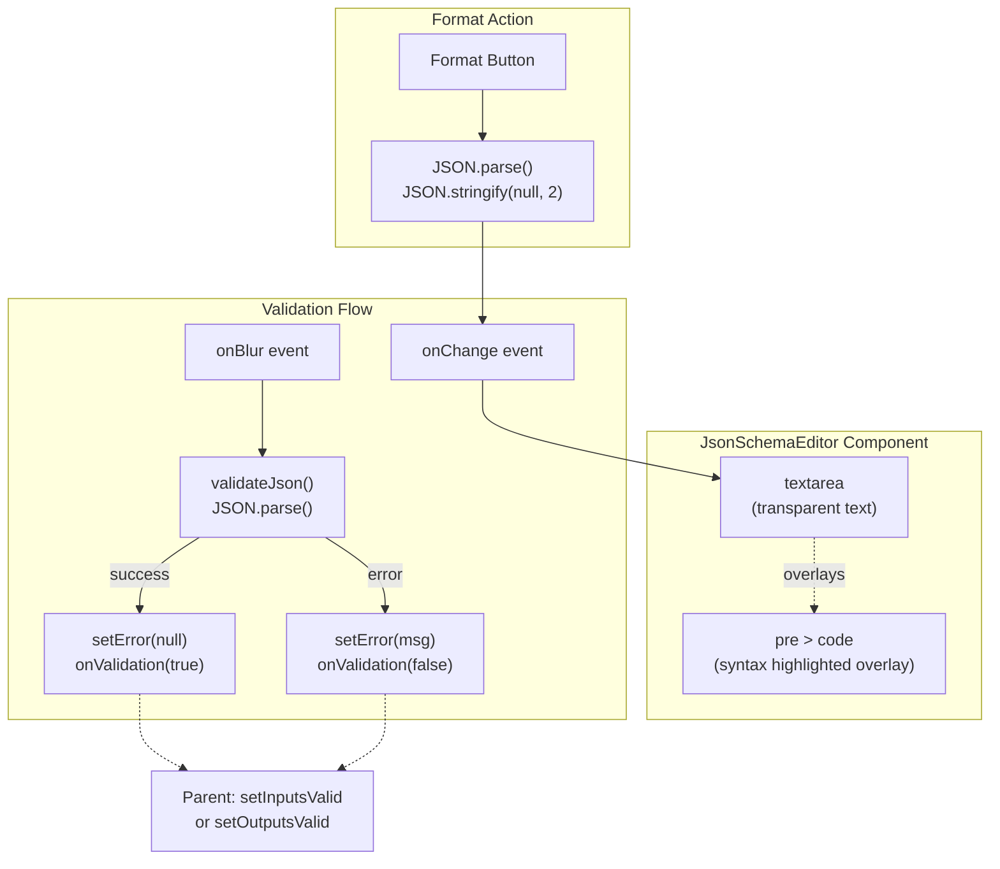
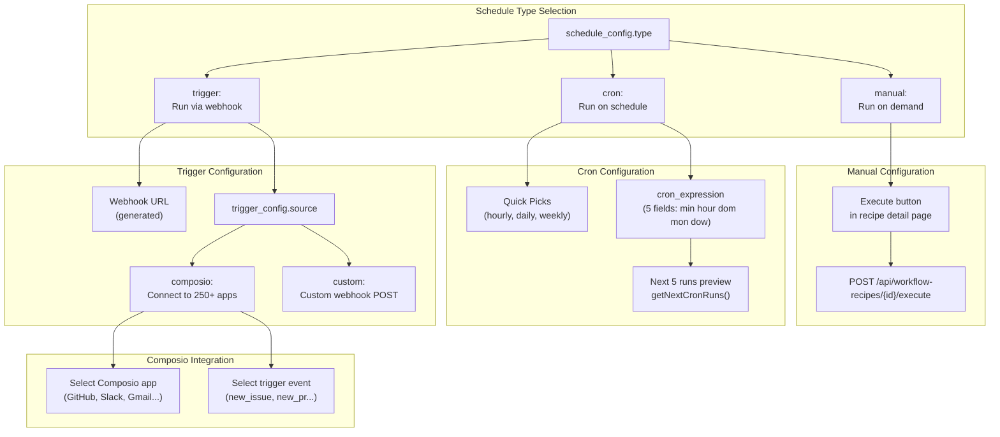
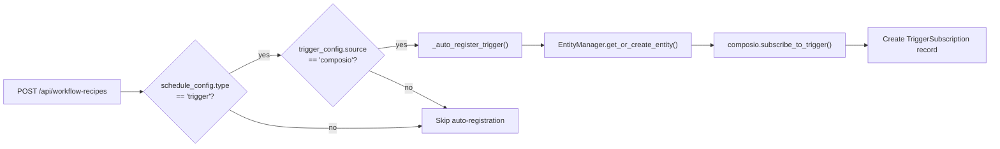
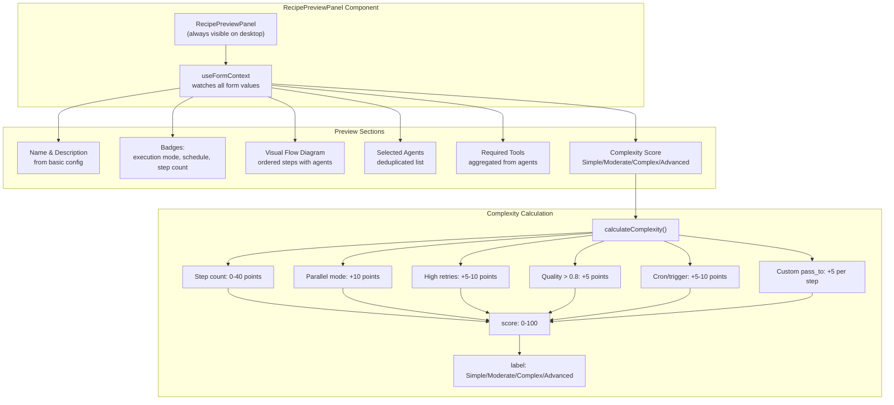
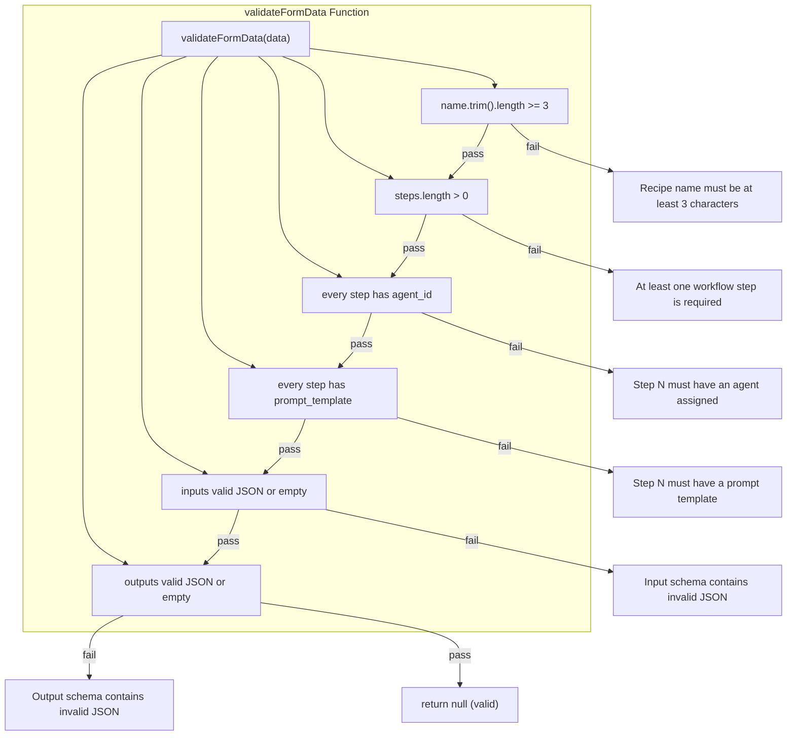
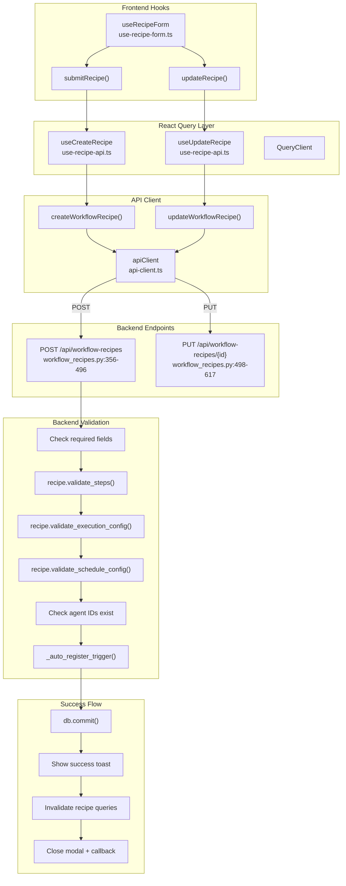

# Creating Recipes

<details>
<summary>Relevant source files</summary>

The following files were used as context for generating this wiki page:

- [frontend/components/workflows/create-recipe-modal.tsx](frontend/components/workflows/create-recipe-modal.tsx)
- [frontend/components/workflows/execution-kitchen.tsx](frontend/components/workflows/execution-kitchen.tsx)
- [frontend/components/workflows/recipe-execution-config.tsx](frontend/components/workflows/recipe-execution-config.tsx)
- [frontend/components/workflows/recipe-preview-panel.tsx](frontend/components/workflows/recipe-preview-panel.tsx)
- [frontend/components/workflows/recipe-step-builder.tsx](frontend/components/workflows/recipe-step-builder.tsx)
- [frontend/components/workflows/recipes-tab.tsx](frontend/components/workflows/recipes-tab.tsx)
- [frontend/components/workflows/view-recipe-modal.tsx](frontend/components/workflows/view-recipe-modal.tsx)
- [frontend/hooks/use-recipe-form.ts](frontend/hooks/use-recipe-form.ts)
- [orchestrator/alembic/versions/20260202_add_workspace_id_to_skills_patterns_models.py](orchestrator/alembic/versions/20260202_add_workspace_id_to_skills_patterns_models.py)
- [orchestrator/api/recipe_executor.py](orchestrator/api/recipe_executor.py)
- [orchestrator/api/workflow_recipes.py](orchestrator/api/workflow_recipes.py)
- [orchestrator/core/models/core.py](orchestrator/core/models/core.py)
- [orchestrator/core/services/recipe_memory_service.py](orchestrator/core/services/recipe_memory_service.py)
- [orchestrator/core/services/workspace_manager.py](orchestrator/core/services/workspace_manager.py)

</details>


## Purpose and Scope

This page documents the recipe creation workflow in Automatos AI, covering the 4-step wizard interface for defining multi-agent workflows. A recipe is a reusable workflow template that orchestrates multiple agents to perform complex tasks. This page focuses on the creation UI and form submission process.

For information about executing recipes after creation, see [Recipe Execution](#4.2). For detailed configuration options, see [Execution Configuration](#4.3) and [Scheduling & Triggers](#4.4).

---

## Recipe Concept

A **recipe** (stored as `WorkflowTemplate` in the database, aliased as `WorkflowRecipe` in the API) is a reusable workflow template that defines:
- **Steps**: Ordered sequence of agent invocations with prompt templates
- **Input/Output Schemas**: Optional JSON schemas for runtime validation
- **Execution Configuration**: Retry logic, timeouts, quality thresholds, memory isolation
- **Schedule Configuration**: Manual execution, cron schedules, or webhook triggers
- **Template Definition**: Version-controlled configuration structure

Recipes are workspace-scoped (`workspace_id` field) and can be shared via the marketplace. System recipes (`is_system=true`) are read-only templates provided by the platform.

**Sources:** [orchestrator/api/workflow_recipes.py:26](), [core/models](core/models)

---

## Entry Points

Recipes can be created from two primary entry points:

1. **Workflows Page**: The "Create Recipe" button in the page header ([frontend/components/workflows/workflow-management.tsx:546-550]())
2. **Recipes Tab**: The floating action button or empty state prompt ([frontend/components/workflows/recipes-tab.tsx:81-625]())

Both entry points open the `CreateRecipeModal` component, which is a 4-step wizard.

---

## Creation Wizard Overview

The recipe creation interface is a 4-step modal wizard implemented in `CreateRecipeModal`. The wizard uses progressive disclosure to guide users through configuration.

### Wizard Architecture



**Sources:** [frontend/components/workflows/workflow-management.tsx:546-550](), [frontend/components/workflows/recipes-tab.tsx:81-625](), [frontend/components/workflows/create-recipe-modal.tsx:1-394]()

### Form State Management

The wizard uses `react-hook-form` with the `RecipeFormValues` interface:

| Field | Type | Required | Description |
|-------|------|----------|-------------|
| `name` | string | Yes | Recipe name (min 3 chars, frontend validation) |
| `description` | string | Yes | Human-readable description |
| `inputs` | string | No | JSON schema string for input validation |
| `outputs` | string | No | JSON schema string for output validation |
| `steps` | array | Yes | Workflow steps with agent assignments (min 1) |
| `execution_config` | object | No | Performance and retry settings (defaults applied) |
| `schedule_config` | object | No | Scheduling type and parameters (defaults to manual) |

**Backend Validation:**
- `template_id`: Auto-generated from name + timestamp
- `template_definition`: Constructed from form data
- Agent IDs must exist in the workspace
- Steps must pass `validate_steps()` method
- Execution config must pass `validate_execution_config()` method
- Schedule config must pass `validate_schedule_config()` method

**Sources:** [frontend/components/workflows/create-recipe-modal.tsx:29-59](), [orchestrator/api/workflow_recipes.py:383-458]()

---

## Step 1: Basic Configuration

The first step collects fundamental recipe metadata and input/output schemas.

### Configuration Flow



**Sources:** [frontend/components/workflows/create-recipe-modal.tsx:234-289](), [frontend/components/workflows/create-recipe-modal.tsx:118-135]()

### JSON Schema Editor

The `JsonSchemaEditor` component provides syntax-highlighted JSON editing with real-time validation:

- **Syntax Highlighting**: Uses Prism.js for JSON colorization
- **Validation**: Parses JSON on blur and validates structure
- **Format Button**: Auto-formats valid JSON with 2-space indentation
- **Visual Feedback**: Shows check mark (valid) or error icon (invalid)



**Sources:** [frontend/components/workflows/json-schema-editor.tsx:1-211]()

### Example Schemas

**Input Schema:**
```json
{
  "order_id": {
    "type": "string",
    "required": true
  },
  "customer_email": {
    "type": "string",
    "format": "email"
  }
}
```

**Output Schema:**
```json
{
  "report": {
    "type": "string"
  },
  "score": {
    "type": "number",
    "minimum": 0,
    "maximum": 100
  }
}
```

**Sources:** [frontend/components/workflows/create-recipe-modal.tsx:270-287]()

---

## Step 2: Workflow Steps & Agents

The second step defines the workflow sequence using the `RecipeStepBuilder` component. Each step assigns an agent and defines its prompt template.

### Step Structure

Each workflow step contains:

| Field | Type | Required | Description |
|-------|------|----------|-------------|
| `step_id` | string | Yes | Unique identifier (e.g., "step-1") |
| `order` | number | Yes | Execution sequence (1, 2, 3...) |
| `agent_id` | number | Yes | ID of assigned agent (must exist in workspace) |
| `prompt_template` | string | Yes | Prompt template for the agent |
| `expected_output` | string | No | Description of expected output format |
| `pass_to` | string | No | Next step_id (for custom routing) |
| `error_handling` | string | No | "stop", "continue", or "retry" (default: "stop") |

**Backend Validation:**
- All agent IDs must resolve to existing agents in the workspace ([orchestrator/api/workflow_recipes.py:460-472]())
- Step validation performed by `recipe.validate_steps()` method
- Agent ID parsing handles both string and integer formats from the frontend

**Sources:** [frontend/components/workflows/create-recipe-modal.tsx:34-41](), [orchestrator/api/workflow_recipes.py:460-472]()

### Step Validation

The wizard validates that at least one step exists and all steps have an agent assigned:

```typescript
case 'steps':
  return (
    values.steps.length > 0 &&
    values.steps.every((s) => s.agent_id)
  )
```

**Sources:** [frontend/components/workflows/create-recipe-modal.tsx:123-127]()

---

## Step 3: Execution Settings

The third step configures performance, retry logic, timeouts, and quality thresholds via `RecipeExecutionConfig`.

### Configuration Categories

```mermaid
graph TB
    subgraph "RecipeExecutionConfig Component"
        PerfSection["Performance Section"]
        RetrySection["Retry Section"]
        TimeoutSection["Timeout Section"]
        QualitySection["Quality Section"]
        AdvancedSection["Advanced Section<br/>(collapsible)"]
    end
    
    subgraph "Performance Settings"
        Mode["execution_config.mode"]
        ModeSeq["sequential:<br/>steps run one after another"]
        ModePar["parallel:<br/>steps run simultaneously"]
        
        Mode --> ModeSeq
        Mode --> ModePar
    end
    
    subgraph "Retry Settings"
        MaxRetries["max_retries: 0-10"]
        RetryDelay["retry_delay: 500-10000ms"]
        BackoffStrategy["backoff_strategy:<br/>exponential, linear, fixed"]
    end
    
    subgraph "Timeout Settings"
        PerStepTimeout["timeout_per_step:<br/>1000-600000ms"]
        TotalTimeout["total_timeout:<br/>1000-3600000ms"]
        CalcTime["Calculated max time<br/>based on mode + steps"]
    end
    
    subgraph "Quality Settings"
        QualityThreshold["quality_threshold:<br/>0.0-1.0 slider"]
        AutoLearning["auto_learning:<br/>toggle switch"]
    end
    
    subgraph "Advanced Settings"
        ParallelLimit["parallel_limit:<br/>1-20 concurrent steps"]
        MemoryIsolation["memory_isolation:<br/>shared or isolated"]
    end
    
    PerfSection --> Mode
    RetrySection --> MaxRetries
    RetrySection --> RetryDelay
    RetrySection --> BackoffStrategy
    TimeoutSection --> PerStepTimeout
    TimeoutSection --> TotalTimeout
    TimeoutSection --> CalcTime
    QualitySection --> QualityThreshold
    QualitySection --> AutoLearning
    AdvancedSection --> ParallelLimit
    AdvancedSection --> MemoryIsolation
```



**Sources:** [frontend/components/workflows/recipe-execution-config.tsx:1-324]()

### Default Execution Configuration

If `execution_config` is not provided or incomplete, the backend applies these defaults:

| Setting | Default Value | Unit | Description |
|---------|---------------|------|-------------|
| `mode` | "sequential" | - | Execution strategy |
| `max_retries` | 1 | count | Maximum retry attempts per step |
| `retry_delay` | 5 | seconds | Initial delay between retries |
| `per_step_timeout` | 300 | seconds | 5 minutes per step |
| `total_timeout` | 1800 | seconds | 30 minutes total |
| `quality_threshold` | 0.7 | 0-1 | Minimum quality score for success |
| `auto_learn` | true | bool | Enable automatic pattern learning |

**Frontend Default Values (before submission):**
- `max_retries`: 3
- `retry_delay`: 1000 ms (converted to 1 second for backend)
- `timeout_per_step`: 120000 ms (converted to 120 seconds for backend)
- `total_timeout`: 600000 ms (converted to 600 seconds for backend)
- `backoff_strategy`: "exponential"
- `parallel_limit`: 5
- `memory_isolation`: "shared"

**Note:** Frontend uses milliseconds for timeouts, which are converted to seconds during API transformation.

**Sources:** [frontend/components/workflows/create-recipe-modal.tsx:83-94](), [orchestrator/api/workflow_recipes.py:404-412]()

### Calculated Max Time

The component dynamically calculates the theoretical maximum execution time:

```typescript
const calculatedMaxTime = React.useMemo(() => {
  const stepCount = Math.max(steps.length, 1)
  return config.mode === 'sequential'
    ? stepCount * config.timeout_per_step
    : config.timeout_per_step
}, [steps.length, config.mode, config.timeout_per_step])
```

For sequential mode, the max time is `step_count × timeout_per_step`. For parallel mode, it's just `timeout_per_step` since steps run concurrently.

**Sources:** [frontend/components/workflows/recipe-execution-config.tsx:43-48]()

---

## Step 4: Scheduling & Triggers

The fourth step configures when and how the recipe executes via `RecipeScheduleConfig`.

### Schedule Types



**Sources:** [frontend/components/workflows/recipe-schedule-config.tsx:1-401]()

### Cron Expression Format

Cron expressions use 5 fields:
```
minute hour day(month) month day(week)
  0     9      *        *       1-5
```

This example runs at 9am on weekdays.

**Quick Picks:**
| Label | Cron Expression | Description |
|-------|-----------------|-------------|
| Every hour | `0 * * * *` | Top of every hour |
| Daily at 9am | `0 9 * * *` | 9:00 AM every day |
| Weekdays at 9am | `0 9 * * 1-5` | Monday-Friday at 9am |
| Weekly on Monday | `0 9 * * 1` | Mondays at 9am |

**Sources:** [frontend/components/workflows/recipe-schedule-config.tsx:17-23]()

### Cron Preview Generation

The `getNextCronRuns` function calculates the next 5 execution times:

```typescript
function getNextCronRuns(expression: string, count: number): string[]
```

It iterates through future timestamps, checking if each minute matches all cron fields, and returns formatted date strings like "Mon, Dec 16, 09:00 AM".

**Sources:** [frontend/components/workflows/recipe-schedule-config.tsx:30-88]()

### Webhook Configuration

For triggered recipes, a `webhook_id` is automatically generated if not provided:

```typescript
// Frontend generates webhook_id during form submission
if (schedule_config.type === 'trigger' || schedule_config.type === 'webhook') {
  if (!schedule_config.webhook_id) {
    schedule_config.webhook_id = uuid4().hex
  }
}
```

**Backend Auto-Registration:**

When a recipe with `schedule_config.type === "trigger"` and `trigger_config.source === "composio"` is created, the system automatically:

1. Checks for existing active subscription for the trigger
2. Fetches or creates a Composio entity for the workspace
3. Calls `composio.subscribe_to_trigger()` with the entity ID
4. Stores a `TriggerSubscription` record with `workflow_id` pointing to the recipe
5. Returns the `composio_subscription_id`

**Trigger Types:**
- **Composio triggers**: Require `trigger_config.trigger_name` (e.g., "GITHUB_NEW_ISSUE")
- **Custom webhooks**: Only need the `webhook_id` for the webhook URL

**Auto-Registration Flow:**



**Sources:** [orchestrator/api/workflow_recipes.py:37-113](), [orchestrator/api/workflow_recipes.py:415-418](), [orchestrator/api/workflow_recipes.py:478-481]()

---

## Preview Panel

The `RecipePreviewPanel` provides real-time feedback as the user fills out the form.

### Preview Features



**Sources:** [frontend/components/workflows/recipe-preview-panel.tsx:1-297]()

### Complexity Scoring

The complexity score ranges from 0-100 and is categorized as:

| Score Range | Label | Color |
|-------------|-------|-------|
| 0-25 | Simple | Success green |
| 26-50 | Moderate | Warning yellow |
| 51-75 | Complex | Primary orange |
| 76-100 | Advanced | Destructive red |

**Scoring Factors:**
- Base: 8 points per step (max 40)
- Parallel mode: +10 points
- Max retries > 5: +10 points (or +5 if > 2)
- Quality threshold > 0.8: +5 points
- Cron schedule: +5 points
- Webhook trigger: +10 points
- Custom routing (pass_to): +5 per step

**Sources:** [frontend/components/workflows/recipe-preview-panel.tsx:37-71]()

---

## Form Validation

The `useRecipeForm` hook handles validation before submission.

### Validation Rules



**Sources:** [frontend/hooks/use-recipe-form.ts:109-148]()

### Validation Implementation

```typescript
function validateFormData(data: RecipeFormValues): string | null {
  // Name validation
  if (!data.name || data.name.trim().length < 3) {
    return 'Recipe name must be at least 3 characters'
  }

  // Steps validation
  if (!data.steps || data.steps.length === 0) {
    return 'At least one workflow step is required'
  }

  for (let i = 0; i < data.steps.length; i++) {
    const step = data.steps[i]
    if (!step.agent_id) {
      return `Step ${i + 1} must have an agent assigned`
    }
    if (!step.prompt_template || step.prompt_template.trim().length === 0) {
      return `Step ${i + 1} must have a prompt template`
    }
  }

  // JSON schema validation
  if (data.inputs && data.inputs.trim() !== '{}') {
    try {
      JSON.parse(data.inputs)
    } catch {
      return 'Input schema contains invalid JSON'
    }
  }

  if (data.outputs && data.outputs.trim() !== '{}') {
    try {
      JSON.parse(data.outputs)
    } catch {
      return 'Output schema contains invalid JSON'
    }
  }

  return null // Valid
}
```

**Sources:** [frontend/hooks/use-recipe-form.ts:109-148]()

---

## API Transformation

The `transformFormToApiPayload` function converts `RecipeFormValues` to the backend API format.

### Transformation Flow

```mermaid
graph TB
    subgraph "Frontend Form Data"
        FormValues["RecipeFormValues"]
        
        FormName["name: string"]
        FormDesc["description: string"]
        FormInputs["inputs: string (JSON)"]
        FormOutputs["outputs: string (JSON)"]
        FormSteps["steps: array"]
        FormExecConfig["execution_config: object"]
        FormScheduleConfig["schedule_config: object"]
        
        FormValues --> FormName
        FormValues --> FormDesc
        FormValues --> FormInputs
        FormValues --> FormOutputs
        FormValues --> FormSteps
        FormValues --> FormExecConfig
        FormValues --> FormScheduleConfig
    end
    
    subgraph "Transformation Logic"
        Transform["transformFormToApiPayload()"]
        
        GenerateID["Generate template_id<br/>from name + timestamp"]
        ParseJSON["Parse inputs/outputs<br/>JSON.parse()"]
        BuildSteps["Build steps array<br/>parse agent_id to int"]
        BuildTemplate["Build template_definition<br/>with version: 1.0"]
        ConvertTimeouts["Convert timeouts<br/>ms to seconds"]
        BuildExecConfig["Build execution_config<br/>map field names"]
        BuildScheduleConfig["Build schedule_config<br/>conditional fields"]
        
        Transform --> GenerateID
        Transform --> ParseJSON
        Transform --> BuildSteps
        Transform --> BuildTemplate
        Transform --> ConvertTimeouts
        Transform --> BuildExecConfig
        Transform --> BuildScheduleConfig
    end
    
    subgraph "Backend API Payload"
        Payload["POST /api/workflow-recipes"]
        
        PayloadTemplateID["template_id: slug"]
        PayloadName["name: string"]
        PayloadDesc["description: string"]
        PayloadTemplateDef["template_definition: object"]
        PayloadSteps["steps: array"]
        PayloadInputs["inputs: object (optional)"]
        PayloadOutputs["outputs: object (optional)"]
        PayloadExecConfig["execution_config: object"]
        PayloadScheduleConfig["schedule_config: object"]
        PayloadTags["tags: array"]
        PayloadIsPublic["is_public: bool"]
        
        Payload --> PayloadTemplateID
        Payload --> PayloadName
        Payload --> PayloadDesc
        Payload --> PayloadTemplateDef
        Payload --> PayloadSteps
        Payload --> PayloadInputs
        Payload --> PayloadOutputs
        Payload --> PayloadExecConfig
        Payload --> PayloadScheduleConfig
        Payload --> PayloadTags
        Payload --> PayloadIsPublic
    end
    
    FormValues --> Transform
    Transform --> Payload
```



**Sources:** [frontend/hooks/use-recipe-form.ts:12-103]()

### Key Transformations

**Template ID Generation:**
```typescript
const templateId = data.name
  .toLowerCase()
  .replace(/[^a-z0-9]+/g, '-')
  .replace(/^-|-$/g, '')
  + '-' + Date.now().toString(36)
```
Converts name to slug format and appends timestamp-based suffix.

**Agent ID Parsing:**
```typescript
agent_id: typeof step.agent_id === 'string' 
  ? parseInt(step.agent_id, 10) 
  : step.agent_id
```
Ensures agent_id is an integer for the backend.

**Timeout Conversion:**
```typescript
per_step_timeout: Math.round(data.execution_config.timeout_per_step / 1000)
total_timeout: Math.round(data.execution_config.total_timeout / 1000)
```
Converts milliseconds to seconds (backend expects seconds).

**Field Mapping:**
| Frontend Field | Backend Field |
|----------------|---------------|
| `execution_config.timeout_per_step` | `execution_config.per_step_timeout` |
| `execution_config.timeout_per_step` | `execution_config.total_timeout` |
| `execution_config.auto_learning` | `execution_config.auto_learn` |

**Sources:** [frontend/hooks/use-recipe-form.ts:12-103]()

---

## Submission Process

### Create vs Update

The modal supports both creating new recipes and updating existing ones based on the `recipeId` prop:

```typescript
const isEditMode = !!recipeId

const handleSave = async () => {
  const data = methods.getValues()
  if (isEditMode && recipeId) {
    await updateRecipe(recipeId, data, () => {
      onSave?.(data)
      handleClose()
    })
  } else {
    await submitRecipe(data, () => {
      onSave?.(data)
      handleClose()
    })
  }
}
```

**Sources:** [frontend/components/workflows/create-recipe-modal.tsx:149-162]()

### API Calls



**Query Key Invalidation:**

On successful creation/update, the following query keys are invalidated:
- `recipeKeys.lists()` - All recipe list queries
- `recipeKeys.featured()` - Featured recipes query
- `recipeKeys.detail(recipeId)` - Specific recipe detail (update only)

**Sources:** [frontend/hooks/use-recipe-form.ts:165-255](), [frontend/hooks/use-recipe-api.ts:64-91](), [orchestrator/api/workflow_recipes.py:356-617]()

### Error Handling

Both `submitRecipe` and `updateRecipe` catch errors and display them via toast notifications:

```typescript
catch (err: unknown) {
  const message =
    err instanceof Error
      ? err.message
      : typeof err === 'object' && err !== null && 'detail' in err
        ? String((err as { detail: unknown }).detail)
        : 'Failed to create recipe. Please try again.'

  toast({
    title: 'Error Creating Recipe',
    description: message,
    variant: 'destructive',
  })
}
```

**Sources:** [frontend/hooks/use-recipe-form.ts:191-203]()

---

## Navigation and State

### Step Navigation Logic

The wizard tracks the current step index and enables/disables navigation based on validation:

```typescript
const canGoNext = React.useMemo(() => {
  const values = methods.getValues()
  switch (currentStepId) {
    case 'basic':
      return values.name.trim().length >= 3 && inputsValid && outputsValid
    case 'steps':
      return (
        values.steps.length > 0 &&
        values.steps.every((s) => s.agent_id)
      )
    case 'execution':
      return true
    case 'schedule':
      return true
    default:
      return false
  }
}, [currentStepId, methods, inputsValid, outputsValid, watchedName, watchedSteps, watchedInputs, watchedOutputs])
```

**Navigation Rules:**
- **Step 1 (basic)**: Requires valid name (3+ chars) and valid JSON schemas
- **Step 2 (steps)**: Requires at least one step with an agent assigned
- **Step 3 (execution)**: Always valid (has defaults)
- **Step 4 (schedule)**: Always valid (manual is default)

**Sources:** [frontend/components/workflows/create-recipe-modal.tsx:118-135]()

### Form Reset

When the modal closes, the form resets to default values:

```typescript
const handleClose = () => {
  setCurrentStep(0)
  methods.reset()
  onClose()
}
```

**Sources:** [frontend/components/workflows/create-recipe-modal.tsx:164-168]()

---

## Component Integration

### Modal Composition

The `CreateRecipeModal` is composed of several specialized components:

| Component | Purpose | Source File |
|-----------|---------|-------------|
| `CreateRecipeModal` | Main wizard container | create-recipe-modal.tsx |
| `JsonSchemaEditor` | Input/output schema editing | json-schema-editor.tsx |
| `RecipeStepBuilder` | Step sequence configuration | recipe-step-builder.tsx |
| `RecipeExecutionConfig` | Execution settings | recipe-execution-config.tsx |
| `RecipeScheduleConfig` | Schedule configuration | recipe-schedule-config.tsx |
| `RecipePreviewPanel` | Live preview | recipe-preview-panel.tsx |

### Hook Integration

| Hook | Purpose | Source File |
|------|---------|-------------|
| `useRecipeForm` | Form submission logic | use-recipe-form.ts |
| `useCreateRecipe` | POST API mutation | use-recipe-api.ts:64-75 |
| `useUpdateRecipe` | PUT API mutation | use-recipe-api.ts:78-91 |
| `useDeleteRecipe` | DELETE API mutation | use-recipe-api.ts:94-105 |
| `useAgents` | Fetch available agents | use-agent-api.ts |
| `useForm` (react-hook-form) | Form state management | External library |

### API Endpoint Integration

| Operation | HTTP Method | Endpoint | Handler |
|-----------|-------------|----------|---------|
| Create recipe | POST | `/api/workflow-recipes` | workflow_recipes.py:356-496 |
| Update recipe | PUT | `/api/workflow-recipes/{recipe_id}` | workflow_recipes.py:498-617 |
| Delete recipe | DELETE | `/api/workflow-recipes/{recipe_id}` | workflow_recipes.py:619-683 |
| List recipes | GET | `/api/workflow-recipes` | workflow_recipes.py:164-236 |
| Get recipe detail | GET | `/api/workflow-recipes/{recipe_id}` | workflow_recipes.py:326-353 |

**Sources:** [frontend/components/workflows/create-recipe-modal.tsx:1-394](), [frontend/hooks/use-recipe-form.ts:1-263](), [frontend/hooks/use-recipe-api.ts:1-198](), [orchestrator/api/workflow_recipes.py:1-1050]()

---

## Summary Table

| Feature | Implementation | Validation |
|---------|----------------|------------|
| **Basic Config** | Name, description, I/O schemas | Name ≥ 3 chars, valid JSON |
| **Steps** | Agent selection, prompt templates | ≥ 1 step, all have agents |
| **Execution** | Mode, retry, timeout, quality | Defaults provided, always valid |
| **Scheduling** | Manual, cron, webhook | Type selection, cron validation |
| **Preview** | Live feedback, complexity score | N/A (read-only) |
| **Submission** | Transform → POST/PUT → Toast | Full form validation before API |

---