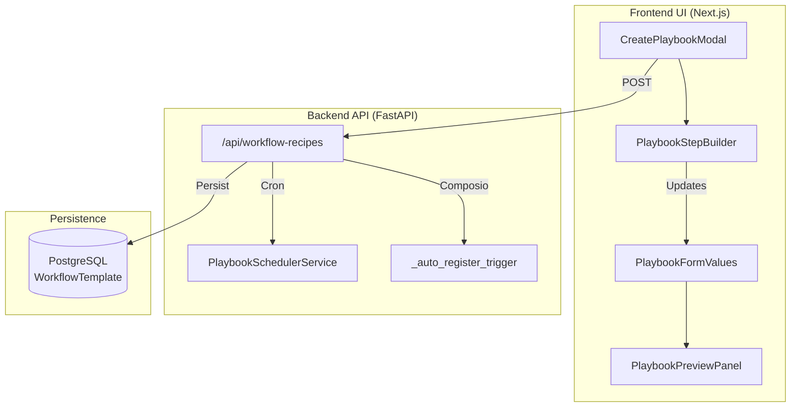

# Creating Recipes

Relevant source files

The following files were used as context for generating this wiki page:

- [frontend/components/activity/memory/memory-viewer.tsx](frontend/components/activity/memory/memory-viewer.tsx)
- [frontend/components/activity/projects/project-card.tsx](frontend/components/activity/projects/project-card.tsx)
- [frontend/components/agents/org-chart-tab.tsx](frontend/components/agents/org-chart-tab.tsx)
- [frontend/components/assignments/assignments-playbooks-grid.tsx](frontend/components/assignments/assignments-playbooks-grid.tsx)
- [frontend/components/composio/feature-card.tsx](frontend/components/composio/feature-card.tsx)
- [frontend/components/documents/upload-provider-modal.tsx](frontend/components/documents/upload-provider-modal.tsx)
- [frontend/components/marketplace/marketplace-playbooks-tab.tsx](frontend/components/marketplace/marketplace-playbooks-tab.tsx)
- [frontend/components/workflows/playbook-execution-config.tsx](frontend/components/workflows/playbook-execution-config.tsx)
- [frontend/components/workflows/playbook-preview-panel.tsx](frontend/components/workflows/playbook-preview-panel.tsx)
- [frontend/components/workflows/playbook-schedule-config.tsx](frontend/components/workflows/playbook-schedule-config.tsx)
- [frontend/components/workflows/playbook-step-builder.tsx](frontend/components/workflows/playbook-step-builder.tsx)
- [frontend/components/workflows/playbook-step-progress.tsx](frontend/components/workflows/playbook-step-progress.tsx)
- [frontend/components/workflows/playbooks-tab.tsx](frontend/components/workflows/playbooks-tab.tsx)
- [frontend/components/workflows/view-playbook-modal.tsx](frontend/components/workflows/view-playbook-modal.tsx)
- [orchestrator/api/marketplace.py](orchestrator/api/marketplace.py)
- [orchestrator/api/workflow_recipes.py](orchestrator/api/workflow_recipes.py)
- [orchestrator/core/seeds/platform-management-skill.md](orchestrator/core/seeds/platform-management-skill.md)
- [orchestrator/modules/tools/discovery/handlers_playbooks.py](orchestrator/modules/tools/discovery/handlers_playbooks.py)

## Purpose and Scope

This page documents the recipe creation workflow in Automatos AI, covering the frontend implementation of the creation UI, form state management, and the backend orchestration logic. A recipe (referred to in the database as a `WorkflowTemplate` or "Playbook") is a reusable template that orchestrates multiple agents to perform sequential or parallel tasks.

---

## Recipe Concept

A **recipe** is a structured automation blueprint stored in the `workflow_templates` table [orchestrator/api/workflow_recipes.py:25-25](). It defines a series of discrete operations that agents perform in a specific order or concurrently.

- **Steps**: An ordered array of step definitions containing `agent_id`, `prompt_template`, and `error_handling` strategies [frontend/components/workflows/playbook-step-builder.tsx:121-129]().
- **Execution Mode**: Supports `sequential` (step-by-step) or `parallel` (simultaneous) execution [frontend/components/workflows/playbook-preview-panel.tsx:140-152]().
- **Variables**: Prompts support dynamic interpolation using the `{variable_name}` syntax [frontend/components/workflows/playbook-step-builder.tsx:212-212]().
- **Scheduling**: Supports manual execution, cron-based scheduling, and event-driven triggers via Composio [orchestrator/api/workflow_recipes.py:34-70]().

**Sources:** [orchestrator/api/workflow_recipes.py:1-30](), [frontend/components/workflows/playbook-step-builder.tsx:120-130]()

---

## Creation Wizard Architecture

The recipe creation interface is a multi-step modal wizard implemented via `CreatePlaybookModal`. It utilizes `react-hook-form` to manage the complex state of steps, execution configs, and schedules.

### Data Flow Diagram

**Sources:** [frontend/components/workflows/playbook-step-builder.tsx:109-111](), [orchestrator/api/workflow_recipes.py:22-30](), [frontend/components/workflows/playbook-preview-panel.tsx:70-76]()

### Form State Management (`PlaybookFormValues`)

The form state is centralized to ensure consistency between the step builder and the preview panel.

| Field | Type | Description |
|-------|------|-------------|
| `name` | `string` | Human-readable title of the recipe [frontend/components/workflows/playbook-preview-panel.tsx:72-72](). |
| `steps` | `Array` | List of step objects including `agent_id` and `prompt_template` [frontend/components/workflows/playbook-step-builder.tsx:111-111](). |
| `execution_config` | `Object` | Contains `mode` (sequential/parallel) and `max_retries` [frontend/components/workflows/playbook-preview-panel.tsx:75-75](). |
| `schedule_config` | `Object` | Defines the `type` (manual, cron, trigger) and associated config [frontend/components/workflows/playbook-preview-panel.tsx:76-76](). |

**Sources:** [frontend/components/workflows/playbook-step-builder.tsx:110-112](), [frontend/components/workflows/playbook-preview-panel.tsx:70-77]()

---

## Step Builder & Logic

The `PlaybookStepBuilder` component handles the construction of the workflow DAG (Directed Acyclic Graph).

- **Agent Assignment**: Steps require an `agent_id`. The UI filters for `active` agents to ensure execution reliability [frontend/components/workflows/playbook-step-builder.tsx:114-118]().
- **Prompt Templating**: A specialized `VariableHighlightTextarea` provides visual feedback for `{variable}` tags used for data interpolation [frontend/components/workflows/playbook-step-builder.tsx:56-107]().
- **Validation**: The builder performs real-time validation, including checking for circular dependencies in `pass_to` chains [frontend/components/workflows/playbook-step-builder.tsx:168-186]().
- **Error Handling**: Users can configure steps to `stop`, `skip`, `retry`, or use a `fallback` upon failure [frontend/components/workflows/playbook-step-builder.tsx:49-54]().

**Sources:** [frontend/components/workflows/playbook-step-builder.tsx:49-54](), [frontend/components/workflows/playbook-step-builder.tsx:168-202]()

---

## Preview & Complexity Analysis

The `PlaybookPreviewPanel` provides a live visualization of the recipe and calculates a complexity score to help users understand the operational "weight" of the workflow.

### Complexity Scoring Logic
The score (0-100) is derived from:
- **Step Count**: 8 points per step (capped at 40) [frontend/components/workflows/playbook-preview-panel.tsx:45-45]().
- **Execution Mode**: Parallel mode adds 10 points [frontend/components/workflows/playbook-preview-panel.tsx:48-48]().
- **Reliability**: High retry counts (>5) add 10 points [frontend/components/workflows/playbook-preview-panel.tsx:51-51]().
- **Triggers**: Cron (+5) or External Triggers (+10) increase complexity [frontend/components/workflows/playbook-preview-panel.tsx:55-56]().
- **Routing**: Custom `pass_to` routing adds 5 points per branch [frontend/components/workflows/playbook-preview-panel.tsx:59-60]().

**Sources:** [frontend/components/workflows/playbook-preview-panel.tsx:37-68]()

---

## Backend Registration & Scheduling

When a recipe is saved, the backend performs several critical synchronization tasks.

### Cron & Trigger Sync
- **Cron**: If `schedule_config` is type `cron`, the `_sync_cron_schedule` function registers the recipe with the `PlaybookSchedulerService` [orchestrator/api/workflow_recipes.py:34-48]().
- **External Triggers**: For `trigger` types sourced from `composio`, the system calls `_auto_register_trigger` to subscribe to external events and store a `TriggerSubscription` [orchestrator/api/workflow_recipes.py:50-126]().

### Agent Enrichment
The API provides an `_enrich_steps_with_agents` helper that fetches full agent metadata (model, provider, status) for each step ID, ensuring the frontend has the necessary context to render agent icons and capabilities [orchestrator/api/workflow_recipes.py:140-174]().

**Sources:** [orchestrator/api/workflow_recipes.py:34-48](), [orchestrator/api/workflow_recipes.py:50-126](), [orchestrator/api/workflow_recipes.py:140-174]()

---

## Marketplace & Portability

Recipes can be published to and installed from the Community Marketplace.

- **Publishing**: Agents or admins can publish recipes by setting `owner_type` to `marketplace`. This makes the recipe visible in the `MarketplacePlaybooksTab` [orchestrator/api/marketplace.py:155-156]().
- **Installation**: The `useInstallPlaybookFromMarketplace` hook handles cloning the recipe into a local workspace [frontend/components/marketplace/marketplace-playbooks-tab.tsx:101-135]().
- **Dependency Resolution**: During installation, the system attempts to resolve and clone required agents. If an agent is missing, the system generates warnings for the user [frontend/components/marketplace/marketplace-playbooks-tab.tsx:114-122]().

**Sources:** [orchestrator/api/marketplace.py:123-138](), [frontend/components/marketplace/marketplace-playbooks-tab.tsx:101-135]()

---