# Creating Recipes

<details>
<summary>Relevant source files</summary>

The following files were used as context for generating this wiki page:

- [frontend/components/context/configure-rag-modal.tsx](frontend/components/context/configure-rag-modal.tsx)
- [frontend/components/workflows/create-workflow-modal.tsx](frontend/components/workflows/create-workflow-modal.tsx)
- [frontend/components/workflows/edit-workflow-modal.tsx](frontend/components/workflows/edit-workflow-modal.tsx)
- [frontend/components/workflows/json-schema-editor.tsx](frontend/components/workflows/json-schema-editor.tsx)
- [frontend/components/workflows/live-progress-panel.tsx](frontend/components/workflows/live-progress-panel.tsx)
- [frontend/components/workflows/run-workflow-modal.tsx](frontend/components/workflows/run-workflow-modal.tsx)
- [orchestrator/api/cache.py](orchestrator/api/cache.py)

</details>


## Purpose and Scope

This page documents the recipe creation workflow in Automatos AI, covering the frontend implementation of the creation UI, form state management, and the data transformation process before submission to the backend API. A recipe is a reusable workflow template that orchestrates multiple agents to perform complex tasks.

---

## Recipe Concept

A **recipe** (stored as `WorkflowTemplate` in the database) is a reusable template that defines:
- **Steps**: Ordered sequence of agent invocations with prompt templates [frontend/components/workflows/create-recipe-modal.tsx:34-42]().
- **Input/Output Schemas**: Optional JSON schemas for runtime validation [frontend/components/workflows/create-recipe-modal.tsx:32-33]().
- **Execution Configuration**: Performance settings, retry logic, and timeouts [frontend/components/workflows/create-recipe-modal.tsx:43-51]().
- **Schedule Configuration**: Manual execution, cron schedules, or webhook triggers [frontend/components/workflows/create-recipe-modal.tsx:52-57]().

Recipes are workspace-scoped and can be shared via the platform marketplace.

**Sources:** [frontend/components/workflows/create-recipe-modal.tsx:29-58](), [frontend/hooks/use-recipe-form.ts:89-102]()

---

## Creation Wizard Overview

The recipe creation interface is a 4-step modal wizard implemented in `CreateRecipeModal`. The wizard uses progressive disclosure to guide users through configuration.

### Wizard Architecture

```mermaid
graph TB
    subgraph "Entry Points"
        ["WorkflowManagement"]
        ["RecipesTab"]
        
        ["WorkflowManagement"] -->|open| Modal["CreateRecipeModal"]
        ["RecipesTab"] -->|open| Modal
    end
    
    subgraph "CreateRecipeModal Component"
        Modal["CreateRecipeModal<br/>create-recipe-modal.tsx"]
        FormProvider["FormProvider<br/>react-hook-form"]
        Steps["STEPS constant<br/>basic, steps, execution, schedule"]
        
        Modal --> FormProvider
        FormProvider --> Steps
    end
    
    subgraph "Step Components"
        Step1["Step 1: Basic Config<br/>name, description, schemas"]
        Step2["RecipeStepBuilder<br/>workflow steps"]
        Step3["RecipeExecutionConfig<br/>performance, retry, timeout"]
        Step4["RecipeScheduleConfig<br/>manual, cron, webhook"]
        
        Steps --> Step1
        Steps --> Step2
        Steps --> Step3
        Steps --> Step4
    end
    
    subgraph "Supporting Components"
        JsonEditor["JsonSchemaEditor<br/>input/output validation"]
        Preview["RecipePreviewPanel<br/>live preview"]
        
        Step1 --> JsonEditor
        FormProvider -.->|watches values| Preview
    end
    
    subgraph "Submission Flow"
        FormHook["useRecipeForm hook<br/>validation + transform"]
        CreateAPI["POST /api/workflow-recipes"]
        UpdateAPI["PUT /api/workflow-recipes/{id}"]
        
        Modal --> FormHook
        FormHook -->|new recipe| CreateAPI
        FormHook -->|edit mode| UpdateAPI
    end
```

**Sources:** [frontend/components/workflows/create-recipe-modal.tsx:20-27](), [frontend/components/workflows/create-recipe-modal.tsx:68-214](), [frontend/hooks/use-recipe-form.ts:160-255]()

### Form State Management

The wizard uses `react-hook-form` with the `RecipeFormValues` interface. Default values are initialized in the modal to ensure a valid starting state [frontend/components/workflows/create-recipe-modal.tsx:74-96]().

| Field | Type | Default | Description |
|-------|------|---------|-------------|
| `name` | string | `''` | Recipe name (min 3 chars) |
| `inputs` | string | `'{}'` | JSON schema string for inputs |
| `steps` | array | `[]` | Workflow steps with agent assignments |
| `execution_config.mode` | string | `'sequential'` | Sequential or Parallel execution |
| `execution_config.max_retries` | number | `3` | Max retries per step |
| `schedule_config.type` | string | `'manual'` | Manual, Cron, or Trigger |

**Sources:** [frontend/components/workflows/create-recipe-modal.tsx:29-58](), [frontend/components/workflows/create-recipe-modal.tsx:74-96]()

---

## Step 1: Basic Configuration & JSON Editing

The first step collects metadata and defines the data contract for the recipe.

### JSON Schema Editor
The `JsonSchemaEditor` component provides a custom editing experience with syntax highlighting via `Prism.js` [frontend/components/workflows/json-schema-editor.tsx:39-43]().

- **Validation**: It parses JSON on blur and provides real-time error feedback [frontend/components/workflows/json-schema-editor.tsx:59-68]().
- **Formatting**: A "Format" button allows users to auto-indent valid JSON using `JSON.stringify(parsed, null, 2)` [frontend/components/workflows/json-schema-editor.tsx:92-98]().
- **Implementation**: Uses a transparent `textarea` overlaid on a syntax-highlighted `pre` tag to maintain a native editing feel with IDE-like visuals [frontend/components/workflows/json-schema-editor.tsx:172-199]().

**Sources:** [frontend/components/workflows/json-schema-editor.tsx:1-211]()

---

## Step 2: Workflow Steps & Agents

The `RecipeStepBuilder` allows users to define the execution sequence.

- **Agent Selection**: Fetches active agents from the workspace using `useAgents` [frontend/components/workflows/recipe-step-builder.tsx:112-118]().
- **Prompt Templates**: Supports variable interpolation using `{variable_name}` syntax. A custom `VariableHighlightTextarea` provides visual cues for these variables [frontend/components/workflows/recipe-step-builder.tsx:56-107]().
- **Routing**: Steps can define a `pass_to` field to create non-linear execution flows [frontend/components/workflows/recipe-step-builder.tsx:161-165]().
- **Validation**: Detects circular dependencies in the `pass_to` chain to prevent infinite loops during execution [frontend/components/workflows/recipe-step-builder.tsx:168-186]().

**Sources:** [frontend/components/workflows/recipe-step-builder.tsx:109-202]()

---

## Step 3: Execution Settings

`RecipeExecutionConfig` manages performance and reliability settings.

- **Execution Mode**: Users choose between `sequential` (steps run in order) and `parallel` (steps run simultaneously) [frontend/components/workflows/recipe-execution-config.tsx:45-80]().
- **Timeouts**: Configures `timeout_per_step` and `total_timeout`. The UI calculates the total theoretical maximum time based on the selected mode [frontend/components/workflows/recipe-execution-config.tsx:30-35]().
- **Memory Isolation**: Options for `shared` (steps share context) or `isolated` memory [frontend/components/workflows/recipe-execution-config.tsx:10-13]().

**Sources:** [frontend/components/workflows/recipe-execution-config.tsx:21-160]()

---

## Step 4: Scheduling & Triggers

`RecipeScheduleConfig` defines the entry point for recipe execution.

- **Cron Schedule**: Provides "Quick Picks" for common schedules (e.g., "Daily at 9am") and a preview of the next 5 execution times based on the cron expression [frontend/components/workflows/recipe-schedule-config.tsx:18-84]().
- **Webhook Triggers**: For recipes triggered by external events, the UI displays a generated webhook URL [frontend/components/workflows/recipe-schedule-config.tsx:102-104]().

**Sources:** [frontend/components/workflows/recipe-schedule-config.tsx:12-124]()

---

## Data Transformation and Submission

Before sending data to the backend, the `useRecipeForm` hook transforms the frontend state into the API-compliant payload.

### API Transformation Flow

```mermaid
graph LR
    subgraph "Frontend Space (RecipeFormValues)"
        F_Steps["steps: Array"]
        F_Timeouts["timeouts: ms"]
        F_JSON["inputs/outputs: string"]
    end

    subgraph "Code Entity: transformFormToApiPayload"
        T_ID["Generate template_id<br/>(slug + timestamp)"]
        T_Steps["Map steps<br/>(parse agent_id to int)"]
        T_Time["Convert timeouts<br/>(ms / 1000)"]
        T_JSON["JSON.parse(inputs/outputs)"]
    end

    subgraph "Backend Space (API Payload)"
        B_Template["template_definition: object"]
        B_Exec["execution_config: object"]
        B_ID["template_id: string"]
    end

    F_Steps --> T_Steps
    F_Timeouts --> T_Time
    F_JSON --> T_JSON
    T_ID --> B_ID
    T_Steps --> B_Template
    T_Time --> B_Exec
    T_JSON --> B_Template
```



**Key Transformations:**
1. **Timeouts**: Frontend values in milliseconds are converted to seconds for the backend [frontend/hooks/use-recipe-form.ts:71-72]().
2. **Template ID**: A slug-style `template_id` is generated from the recipe name [frontend/hooks/use-recipe-form.ts:14-18]().
3. **JSON Parsing**: Schema strings are parsed into objects. If parsing fails or the string is empty, they remain undefined [frontend/hooks/use-recipe-form.ts:21-40]().
4. **Step Mapping**: Frontend step objects are mapped to the backend structure, ensuring `agent_id` is passed as an integer [frontend/hooks/use-recipe-form.ts:43-51]().

**Sources:** [frontend/hooks/use-recipe-form.ts:12-102](), [frontend/hooks/use-recipe-form.ts:166-197]()

---

## Preview and Complexity Analysis

The `RecipePreviewPanel` provides a live visualization of the recipe as it is being built. It includes a complexity assessment logic to warn users about advanced configurations.

### Complexity Scoring Logic
The `calculateComplexity` function aggregates points based on recipe features [frontend/components/workflows/recipe-preview-panel.tsx:37-41]():
- **Step Count**: 8 points per step (capped at 40) [frontend/components/workflows/recipe-preview-panel.tsx:45]().
- **Parallel Mode**: +10 points [frontend/components/workflows/recipe-preview-panel.tsx:48]().
- **Triggers**: Webhook triggers add +10 points vs manual [frontend/components/workflows/recipe-preview-panel.tsx:56]().
- **Custom Routing**: Each step with a `pass_to` destination adds +5 points [frontend/components/workflows/recipe-preview-panel.tsx:59-60]().

**Complexity Labels:**
- **Simple**: ≤ 25 points
- **Moderate**: ≤ 50 points
- **Complex**: ≤ 75 points
- **Advanced**: > 75 points

**Sources:** [frontend/components/workflows/recipe-preview-panel.tsx:37-68](), [frontend/components/workflows/recipe-preview-panel.tsx:111-114]()

---