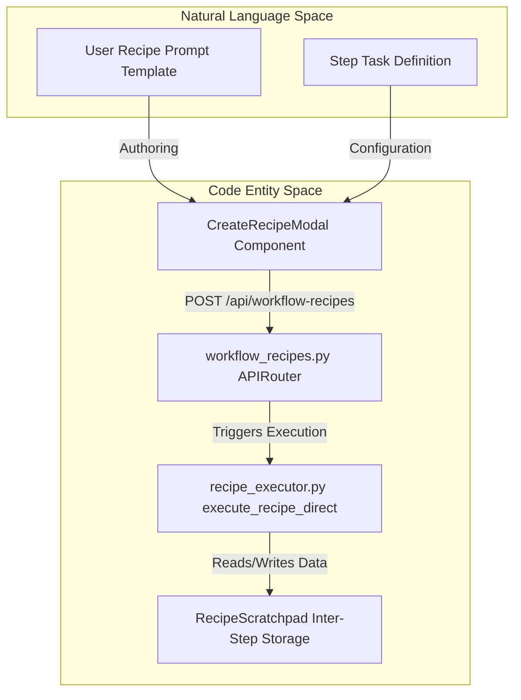
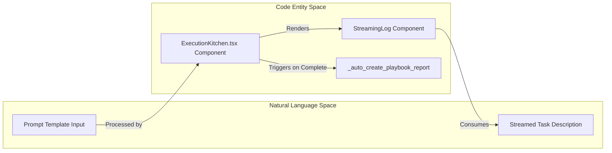

# Creating Recipes

Relevant source files

The following files were used as context for generating this wiki page:

- [frontend/components/assignments/assignments-missions-grid.tsx](frontend/components/assignments/assignments-missions-grid.tsx)
- [frontend/components/assignments/assignments-page.tsx](frontend/components/assignments/assignments-page.tsx)
- [frontend/components/assignments/assignments-playbooks-grid.tsx](frontend/components/assignments/assignments-playbooks-grid.tsx)
- [frontend/components/assignments/mission-card-constellation.tsx](frontend/components/assignments/mission-card-constellation.tsx)
- [frontend/components/context/pattern-details-modal.tsx](frontend/components/context/pattern-details-modal.tsx)
- [frontend/components/context/rag-context-builder.tsx](frontend/components/context/rag-context-builder.tsx)
- [frontend/components/marketplace/marketplace-playbooks-tab.tsx](frontend/components/marketplace/marketplace-playbooks-tab.tsx)
- [frontend/components/missions/mission-list.tsx](frontend/components/missions/mission-list.tsx)
- [frontend/components/missions/mission-results-panel.tsx](frontend/components/missions/mission-results-panel.tsx)
- [frontend/components/workflows/execution-kitchen.tsx](frontend/components/workflows/execution-kitchen.tsx)
- [frontend/components/workflows/playbook-execution-config.tsx](frontend/components/workflows/playbook-execution-config.tsx)
- [frontend/components/workflows/playbook-preview-panel.tsx](frontend/components/workflows/playbook-preview-panel.tsx)
- [frontend/components/workflows/playbook-schedule-config.tsx](frontend/components/workflows/playbook-schedule-config.tsx)
- [frontend/components/workflows/playbook-step-builder.tsx](frontend/components/workflows/playbook-step-builder.tsx)
- [frontend/components/workflows/playbooks-tab.tsx](frontend/components/workflows/playbooks-tab.tsx)
- [frontend/components/workflows/view-playbook-modal.tsx](frontend/components/workflows/view-playbook-modal.tsx)
- [frontend/hooks/use-assignments-api.ts](frontend/hooks/use-assignments-api.ts)
- [orchestrator/api/assignments.py](orchestrator/api/assignments.py)
- [orchestrator/api/composio.py](orchestrator/api/composio.py)
- [orchestrator/api/recipe_executor.py](orchestrator/api/recipe_executor.py)
- [orchestrator/api/skills.py](orchestrator/api/skills.py)
- [orchestrator/api/tools.py](orchestrator/api/tools.py)
- [orchestrator/api/webhooks.py](orchestrator/api/webhooks.py)
- [orchestrator/api/workflow_recipes.py](orchestrator/api/workflow_recipes.py)
- [orchestrator/core/composio/client.py](orchestrator/core/composio/client.py)
- [orchestrator/core/composio/linkedin_image_workaround.py](orchestrator/core/composio/linkedin_image_workaround.py)
- [orchestrator/core/composio/tool_executor.py](orchestrator/core/composio/tool_executor.py)
- [orchestrator/core/credentials/tester.py](orchestrator/core/credentials/tester.py)
- [orchestrator/core/credentials/types.py](orchestrator/core/credentials/types.py)
- [orchestrator/core/database/credential_types_seed.json](orchestrator/core/database/credential_types_seed.json)
- [orchestrator/core/routing/ingestors/webhook.py](orchestrator/core/routing/ingestors/webhook.py)
- [orchestrator/services/metadata_sync_service.py](orchestrator/services/metadata_sync_service.py)
- [orchestrator/services/webhook_dedup.py](orchestrator/services/webhook_dedup.py)
- [orchestrator/tests/test_p2w0_service_imports_resolve.py](orchestrator/tests/test_p2w0_service_imports_resolve.py)
- [orchestrator/tests/test_p2w2_webhook_dedup.py](orchestrator/tests/test_p2w2_webhook_dedup.py)
- [orchestrator/tests/test_p2w2_webhook_signature_reject.py](orchestrator/tests/test_p2w2_webhook_signature_reject.py)

## Purpose and Scope

This page documents the recipe creation workflow in Automatos AI, covering the frontend implementation of the creation UI, form state management, the step builder, preview panel, JSON configuration editor, and direct execution logic. A recipe (referred to in the database as a `WorkflowTemplate`) is a reusable template that orchestrates multiple agents to perform sequential or parallel tasks.

Sources: [`orchestrator/api/recipe_executor.py:1-19`]()োতে, [`orchestrator/api/workflow_recipes.py:1-30`]()

---

## Recipe Concept

A **recipe** (or **playbook**) is a structured automation blueprint stored in the `workflow_templates` table [`orchestrator/api/workflow_recipes.py:25-25`](). It defines:
- **Steps**: An ordered sequence of agent assignments, prompt templates, and resource bindings [`orchestrator/api/recipe_executor.py:129-157`]().
- **Execution Engine**: Recipes in the starter plan bypass the standard 9-stage coordinator pipeline and use `recipe_executor.py` for direct, sequential execution [`orchestrator/api/recipe_executor.py:5-19`]().
- **Context Handling**: Employs `RecipeScratchpad` for inter-step data sharing, eliminating verbose intermediate text dumps and achieving significant token savings [`orchestrator/api/recipe_executor.py:15-16`]().
- **Scheduling**: Supports cron-based automation via `PlaybookSchedulerService` and Composio-driven event triggers [`orchestrator/api/workflow_recipes.py:36-50`]().

Sources: [`orchestrator/api/recipe_executor.py:1-19`]()োতে, [`orchestrator/api/workflow_recipes.py:1-30`]()

---

## Creation Wizard Overview

The recipe creation interface is structured as a multi-step modal wizard. It guides users through metadata entry, step construction using the step builder, live JSON schema/configuration inspection via the preview panel, and scheduling.

### Wizard Architecture & Space Bridging

Below is a diagram bridging the **Natural Language Space** (user intents, prompts, step definitions) to the **Code Entity Space** (backend routes, direct executor, scratchpad memory) during recipe authoring and execution.

Sources: [`orchestrator/api/workflow_recipes.py:22-30`]()োতে, [`orchestrator/api/recipe_executor.py:1-19`]()

### Form State Management

The frontend wizard maintains configuration state using `WorkflowRecipe` models and localized form values:

| Field | Description | Code Entity |
|-------|-------------|-------------|
| `steps` | Ordered list of steps containing `agent_id` and `prompt_template` | `WorkflowRecipe.steps` [`orchestrator/api/workflow_recipes.py:157-176`]() |
| `schedule_config` | Cron schedules or webhook/Composio trigger configurations | `WorkflowRecipe.schedule_config` [`orchestrator/api/workflow_recipes.py:61-65`]() |
| `owner_type` | Specifies whether the recipe belongs to a workspace or marketplace | `WorkflowRecipe.owner_type` |
| `execution_metadata` | Stores per-execution step prompt tweaks and overrides | `execution_metadata.step_overrides` [`orchestrator/api/recipe_executor.py:129-139`]() |

Sources: [`orchestrator/api/workflow_recipes.py:25-28`]()োতে, [`orchestrator/api/recipe_executor.py:129-157`]()

---

## Step Builder & Agent Assignment

The step builder interface allows users to compose workflows by assigning specific specialized agents to individual execution steps.

- **Agent Selection**: Agents are queried from the workspace database and bound to steps via `agent_id` [`orchestrator/api/workflow_recipes.py:148-154`]().
- **Agent Enrichment**: The backend API enriches step definitions with active agent details (such as models, providers, and tool counts) via `_enrich_steps_with_agents` [`orchestrator/api/workflow_recipes.py:142-176`]().
- **Step Overrides**: During execution or rerun configuration, `_apply_step_overrides` merges execution-specific prompt templates without mutating the underlying shared template [`orchestrator/api/recipe_executor.py:129-157`]().

Sources: [`orchestrator/api/workflow_recipes.py:142-176`]()োতে, [`orchestrator/api/recipe_executor.py:129-158`]()

---

## Tooling and File Handling

Recipes integrate natively with the Composio tool ecosystem and platform workspace clients for file-heavy workflows.

- **File Upload Resolution**: The `resolve_file_uploads` function ensures that media or document references in recipe action parameters (e.g., social media uploads) are properly resolved to S3-backed `FileUploadable` instances [`orchestrator/core/composio/tool_executor.py:124-133`]().
- **LinkedIn Workaround**: For direct image posting actions, the executor intercepts `LINKEDIN_CREATE_LINKED_IN_POST` calls and routes them through `linkedin_image_workaround.py` to circumvent SDK limitations [`orchestrator/core/composio/linkedin_image_workaround.py:1-24`]().
- **Scratchpad Injection**: The `scratchpad_write` utility tool is automatically injected into the agent execution context to allow structured data export between recipe steps [`orchestrator/api/recipe_executor.py:15-16`]().

Sources: [`orchestrator/core/composio/tool_executor.py:124-152`]()োতে, [`orchestrator/core/composio/linkedin_image_workaround.py:1-24`]()োতে, [`orchestrator/api/recipe_executor.py:1-19`]()

---

## Scheduling & Triggers

Recipes support automated invocation via scheduled crons and event triggers managed through backend services.

### 1. Cron Scheduling
The `_sync_cron_schedule` helper integrates with `PlaybookSchedulerService` to register or unregister cron timers dynamically [`orchestrator/api/workflow_recipes.py:36-50`]().

### 2. Event Triggers
The `_auto_register_trigger` function handles external event bindings:
- **Composio Subscriptions**: Registers trigger subscriptions and maps callback URLs (`/api/composio/webhook`) [`orchestrator/api/workflow_recipes.py:52-105`]().
- **Signature Verification**: Incoming webhook requests are verified using HMAC-SHA256 (`_verify_webhook_signature`) or Slack v0 signing protocols (`_verify_slack_signature`) [`orchestrator/api/webhooks.py:48-91`]()োতে, [`orchestrator/api/webhooks.py:125-152`]().

Sources: [`orchestrator/api/workflow_recipes.py:36-126`]()োতে, [`orchestrator/api/webhooks.py:48-152`]()

---

## Execution Kitchen & Real-time Feedback

The `ExecutionKitchen` component provides the runtime "Theater View" for monitoring recipe execution status.

### Execution Processing Flow

Another perspective bridging natural language inputs to code execution components during runtime visualization is detailed below:

Sources: [`frontend/components/workflows/execution-kitchen.tsx:56-93`]()োতে, [`orchestrator/api/recipe_executor.py:163-186`]()

- **Dynamic Logging**: The `StreamingLog` component processes `LogEntry` structures capturing progress, memory writes, and inter-agent communication [`frontend/components/workflows/execution-kitchen.tsx:56-70`]().
- **Stage Tracking**: Visualizes execution progression across defined task phases [`frontend/components/workflows/execution-kitchen.tsx:73-93`]().
- **Auto-Reporting**: Upon execution completion, `_auto_create_playbook_report` generates and persists a structured Markdown summary into the agent reports repository [`orchestrator/api/recipe_executor.py:163-186`]().

Sources: [`frontend/components/workflows/execution-kitchen.tsx:56-93`]()োতে, [`orchestrator/api/recipe_executor.py:163-186`]()

---