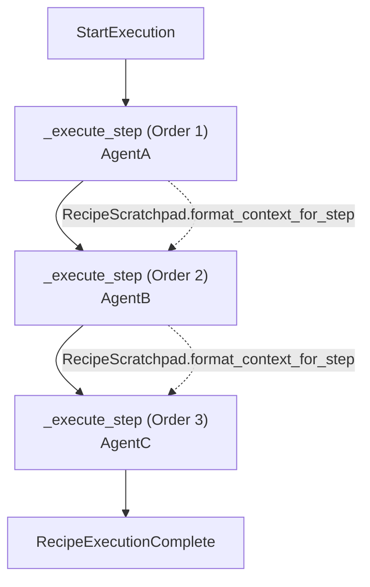
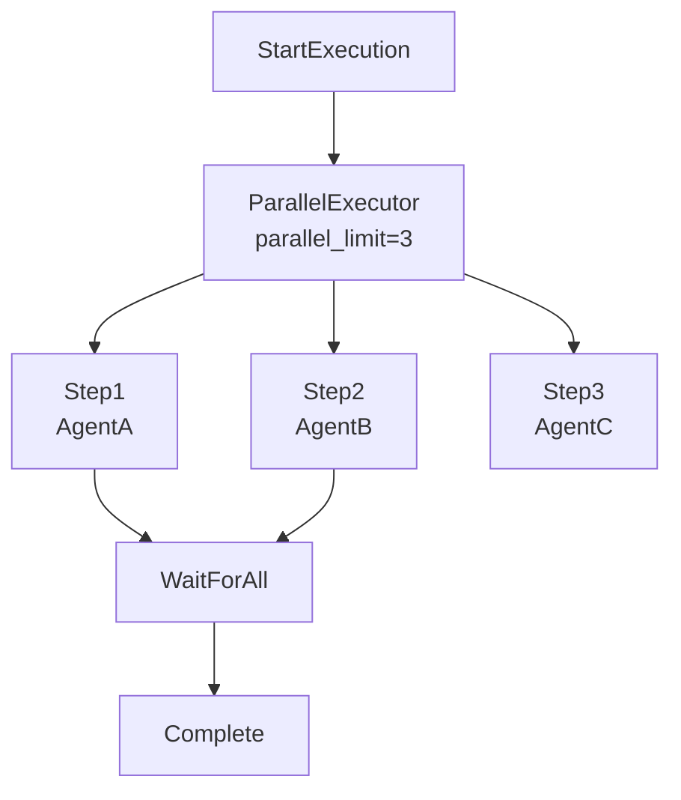
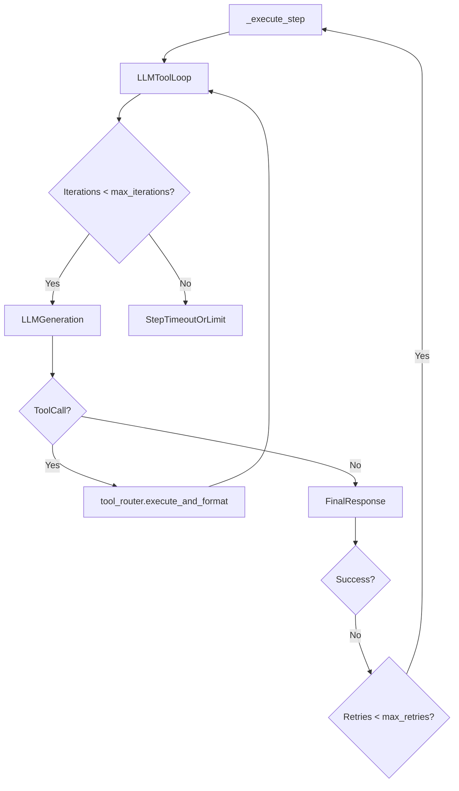
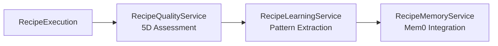
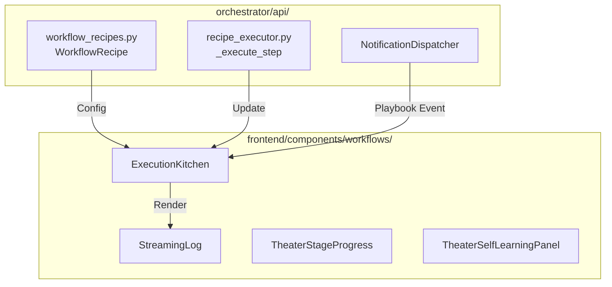

# Execution Configuration

Relevant source files

The following files were used as context for generating this wiki page:

- [frontend/components/workflows/execution-kitchen.tsx](frontend/components/workflows/execution-kitchen.tsx)
- [orchestrator/api/composio.py](orchestrator/api/composio.py)
- [orchestrator/api/recipe_executor.py](orchestrator/api/recipe_executor.py)
- [orchestrator/api/skills.py](orchestrator/api/skills.py)
- [orchestrator/api/tools.py](orchestrator/api/tools.py)
- [orchestrator/api/webhooks.py](orchestrator/api/webhooks.py)
- [orchestrator/api/workflow_recipes.py](orchestrator/api/workflow_recipes.py)
- [orchestrator/core/composio/client.py](orchestrator/core/composio/client.py)
- [orchestrator/core/composio/linkedin_image_workaround.py](orchestrator/core/composio/linkedin_image_workaround.py)
- [orchestrator/core/composio/tool_executor.py](orchestrator/core/composio/tool_executor.py)
- [orchestrator/core/credentials/tester.py](orchestrator/core/credentials/tester.py)
- [orchestrator/core/credentials/types.py](orchestrator/core/credentials/types.py)
- [orchestrator/core/database/credential_types_seed.json](orchestrator/core/database/credential_types_seed.json)
- [orchestrator/core/routing/ingestors/webhook.py](orchestrator/core/routing/ingestors/webhook.py)
- [orchestrator/modules/coordination/__init__.py](orchestrator/modules/coordination/__init__.py)
- [orchestrator/modules/coordination/agent_matcher.py](orchestrator/modules/coordination/agent_matcher.py)
- [orchestrator/modules/coordination/templates.py](orchestrator/modules/coordination/templates.py)
- [orchestrator/services/metadata_sync_service.py](orchestrator/services/metadata_sync_service.py)
- [orchestrator/services/webhook_dedup.py](orchestrator/services/webhook_dedup.py)
- [orchestrator/tests/test_82c_wiring.py](orchestrator/tests/test_82c_wiring.py)
- [orchestrator/tests/test_agents_api_plugins.py](orchestrator/tests/test_agents_api_plugins.py)
- [orchestrator/tests/test_budget_gate.py](orchestrator/tests/test_budget_gate.py)
- [orchestrator/tests/test_coordinator_parallel.py](orchestrator/tests/test_coordinator_parallel.py)
- [orchestrator/tests/test_p2w0_service_imports_resolve.py](orchestrator/tests/test_p2w0_service_imports_resolve.py)
- [orchestrator/tests/test_p2w2_webhook_dedup.py](orchestrator/tests/test_p2w2_webhook_dedup.py)
- [orchestrator/tests/test_p2w2_webhook_signature_reject.py](orchestrator/tests/test_p2w2_webhook_signature_reject.py)
- [orchestrator/tests/test_parallel_decomposition.py](orchestrator/tests/test_parallel_decomposition.py)
- [orchestrator/tests/test_planner_capability_routing.py](orchestrator/tests/test_planner_capability_routing.py)
- [orchestrator/tests/test_plugin_assignment_api.py](orchestrator/tests/test_plugin_assignment_api.py)
- [orchestrator/tests/test_plugin_runtime_integration.py](orchestrator/tests/test_plugin_runtime_integration.py)
- [orchestrator/tests/test_prd128_notification_dispatcher.py](orchestrator/tests/test_prd128_notification_dispatcher.py)
- [orchestrator/tests/test_synthesis_executor.py](orchestrator/tests/test_synthesis_executor.py)

This page documents the execution configuration system for workflow recipes, which controls how recipe steps are executed, retried, timed out, and isolated. Execution configuration determines the runtime behavior of multi-step workflows, including concurrency strategy, error handling, and memory management.

For information about creating recipes and defining steps, see [Creating Recipes](6.1). For the execution engine that processes these configurations, see [Recipe Execution Engine](6.2). For scheduling recipes to run automatically, see [Scheduling & Triggers](6.4).

---

## Configuration Structure

Execution configuration is stored as a JSONB field in the `workflow_templates` table's `schedule_config` and `execution_metadata` columns, represented in the backend via the `WorkflowRecipe` model alias `WorkflowTemplate` [orchestrator/api/workflow_recipes.py:25-27](). The configuration controls all runtime behavior for recipe execution, including per-execution step overrides introduced under PRD-204 [orchestrator/api/recipe_executor.py:126-127]().

### Configuration Fields

| Field | Type | Description | Default | Range/Options |
|-------|------|-------------|---------|---------------|
| `mode` | string | Execution strategy | `"sequential"` | `"sequential"`, `"parallel"` |
| `max_retries` | integer | Retry attempts per step | `3` | `0-5` |
| `timeout_per_step` | integer | Step timeout (seconds) | `120` | `10-600` |
| `total_timeout` | integer | Total execution timeout (seconds) | `600` | `10-3600` |
| `auto_learning` | boolean | Enable pattern extraction | `true` | `true`, `false` |
| `parallel_limit` | integer | Max concurrent steps (parallel mode) | `3` | `1-20` |
| `memory_isolation` | string | Context sharing strategy | `"shared"` | `"shared"`, `"isolated"` |
| `step_overrides` | dict | Per-execution prompt tweaks | `None` | `{step_id: {"prompt_template": "..."}}` |

Sources: [orchestrator/api/workflow_recipes.py:25-28](), [orchestrator/api/recipe_executor.py:129-141](), [orchestrator/api/recipe_executor.py:163-175]()

---

## Execution Modes

### Sequential Mode

Steps execute one after another in order. Each step waits for the previous step to complete before starting. Output from step $N$ is passed to step $N+1$ via the `RecipeScratchpad` which provides a substantial token saving over verbose text dumps [orchestrator/api/recipe_executor.py:14-16]().

Diagram: Recipe Execution Data Flow (Sequential) mapping natural language orchestration to `_execute_step` and `RecipeScratchpad`.

Sources: [orchestrator/api/recipe_executor.py:5-19](), [orchestrator/api/recipe_executor.py:129-141]()

**Characteristics:**
- **Predictable Order**: Guaranteed execution sequence based on the step configuration array [orchestrator/api/recipe_executor.py:5-7]().
- **Contextual Awareness**: Steps access scratchpad exports via `ContextService(RECIPE)` [orchestrator/api/recipe_executor.py:9-10]().
- **Step Overrides**: PRD-204 allows merging `execution_metadata.step_overrides` into the step list for a specific run without mutating the shared template [orchestrator/api/recipe_executor.py:129-141]().

### Parallel Mode

Steps execute simultaneously up to the `parallel_limit`. While `recipe_executor.py` specializes in sequential execution for starter recipes [orchestrator/api/recipe_executor.py:5-7](), advanced orchestration layers handle parallel execution and concurrency pooling.

Diagram: Parallel Execution Logic mapping `parallel_limit` concurrency controls.

Sources: [orchestrator/api/recipe_executor.py:5-7](), [frontend/components/workflows/execution-kitchen.tsx:35-37]()

---

## Retry and Timeout Configuration

### Maximum Retries & Iterations

The system distinguishes between **Execution Retries** (re-running a failed step) and **Tool Iterations** (LLM conversational turns within a single step). 

1. **Step Iterations**: Managed by the LLM tool loop. Higher values allow agents to perform complex multi-turn work via `tool_router.execute_and_format()` [orchestrator/api/recipe_executor.py:12]().
2. **Retries**: Controls how many times a failed step is retried before the `RecipeExecution` status transitions to `failed`.

Diagram: Retry and Tool Loop Flow mapping `_execute_step` to tool execution.

Sources: [orchestrator/api/recipe_executor.py:5-13](), [orchestrator/api/recipe_executor.py:129-141]()

---

## Memory Isolation & Learning

### Memory Isolation
Memory isolation controls whether steps share execution context or run independently:
- **Shared Memory (Default)**: Steps share a common `RecipeScratchpad`. Agents are provided with the `scratchpad_write` tool for explicit data exports [orchestrator/api/recipe_executor.py:15-16]().
- **Isolated Memory**: Each step runs in a clean context with no access to previous step outputs.

### Auto-Learning & Reporting
When `auto_learning` is enabled, the system assesses execution quality and extracts patterns. PRD-128 and PRD-204 added unified notifications and auto-reporting for playbook completions [orchestrator/api/recipe_executor.py:45-55](), [orchestrator/api/recipe_executor.py:163-175]().

Diagram: Learning Pipeline mapping execution output to memory services.

The system tracks:
- **Execution Metrics**: `total_duration_ms`, `total_tokens`, and `success` status [orchestrator/api/recipe_executor.py:171-174]().
- **Auto-Reporting**: Persists an `agent_reports` row summarizing the execution, stored as Markdown in S3 [orchestrator/api/recipe_executor.py:176-185]().
- **Notifications**: Dispatches `playbook` event types through `NotificationDispatcher` [orchestrator/api/recipe_executor.py:65-75]().

Sources: [orchestrator/api/recipe_executor.py:14-19](), [orchestrator/api/recipe_executor.py:45-55](), [orchestrator/api/recipe_executor.py:163-185]()

---

## Frontend Configuration UI

### Execution Kitchen
The `ExecutionKitchen` component provides real-time visualization of configuration parameters, displaying `StreamingLog` and theater panels [frontend/components/workflows/execution-kitchen.tsx:3-54]().

Diagram: UI Entity Association bridging Natural Language Space (`ExecutionKitchen`) to Code Entities (`WorkflowRecipe`, `_execute_step`).

**Key UI Elements:**
- **Execution Log**: Displays events of types `stage_start`, `agent_spawn`, `task_progress`, and `memory_write` [frontend/components/workflows/execution-kitchen.tsx:60-61]().
- **Theater Components**: `TheaterStepExecution` and `TheaterSelfLearningPanel` provide deep introspection into step-level data and learning outcomes [frontend/components/workflows/execution-kitchen.tsx:35-42]().
- **Live Watch**: PRD-204 integrates terminal state reporting to the live watch registry [orchestrator/api/recipe_executor.py:89-100]().

Sources: [frontend/components/workflows/execution-kitchen.tsx:35-70](), [orchestrator/api/recipe_executor.py:89-100]()

---