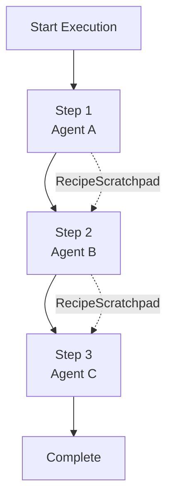
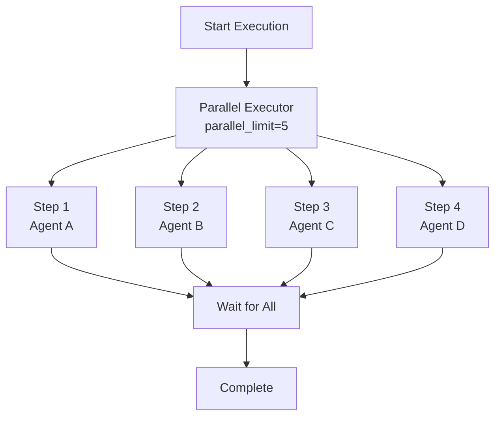
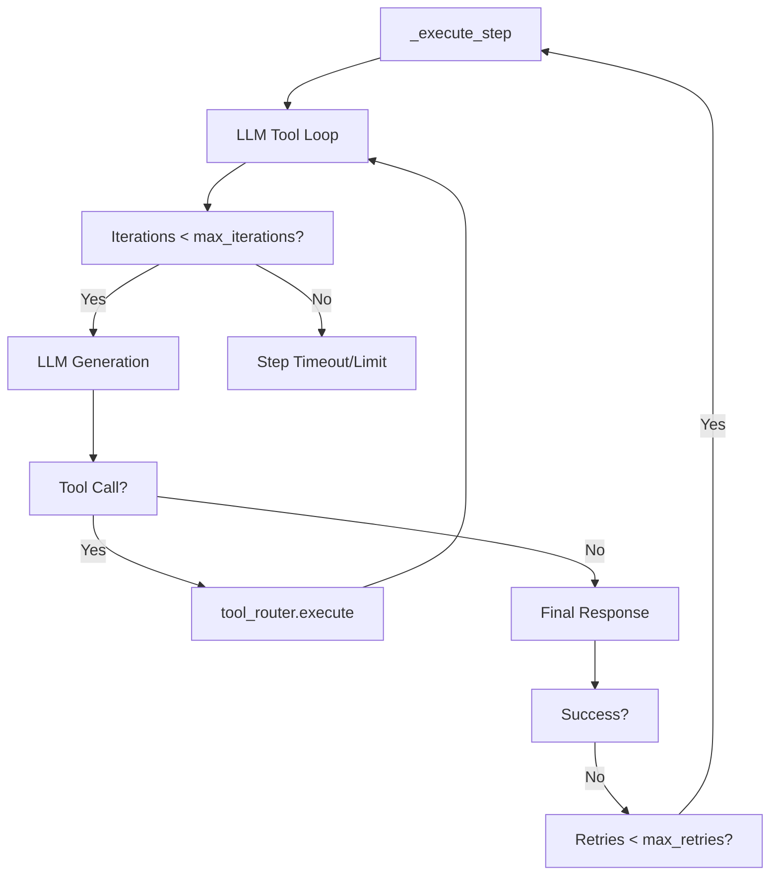
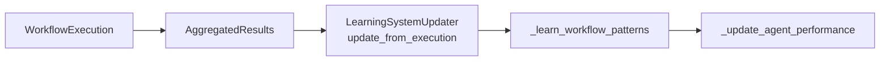
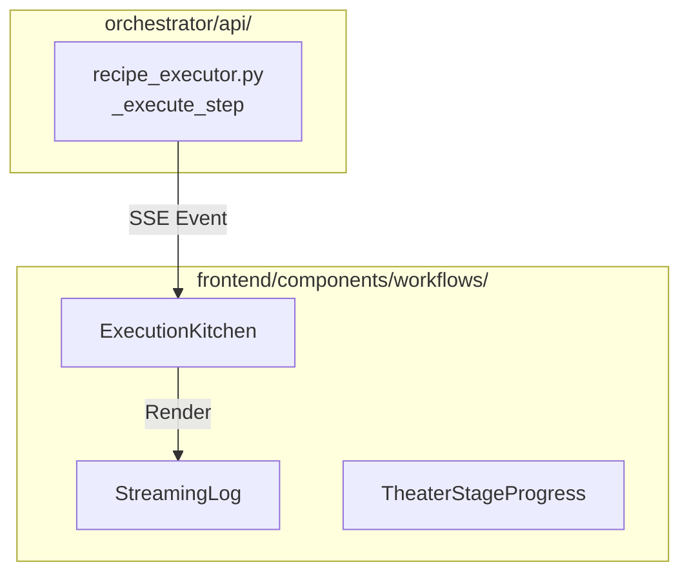

# Execution Configuration

Relevant source files

The following files were used as context for generating this wiki page:

- [frontend/components/context/configure-rag-modal.tsx](frontend/components/context/configure-rag-modal.tsx)
- [frontend/components/marketplace/marketplace-agents-tab.tsx](frontend/components/marketplace/marketplace-agents-tab.tsx)
- [frontend/components/marketplace/marketplace-homepage.tsx](frontend/components/marketplace/marketplace-homepage.tsx)
- [frontend/components/marketplace/marketplace-tools-tab.tsx](frontend/components/marketplace/marketplace-tools-tab.tsx)
- [frontend/components/shared/stats-bar.tsx](frontend/components/shared/stats-bar.tsx)
- [frontend/components/tools/tools-dashboard.tsx](frontend/components/tools/tools-dashboard.tsx)
- [frontend/components/workflows/active-workflows-panel.tsx](frontend/components/workflows/active-workflows-panel.tsx)
- [frontend/components/workflows/create-workflow-modal.tsx](frontend/components/workflows/create-workflow-modal.tsx)
- [frontend/components/workflows/edit-workflow-modal.tsx](frontend/components/workflows/edit-workflow-modal.tsx)
- [frontend/components/workflows/execution-kitchen.tsx](frontend/components/workflows/execution-kitchen.tsx)
- [frontend/components/workflows/json-schema-editor.tsx](frontend/components/workflows/json-schema-editor.tsx)
- [frontend/components/workflows/live-progress-panel.tsx](frontend/components/workflows/live-progress-panel.tsx)
- [frontend/components/workflows/run-workflow-modal.tsx](frontend/components/workflows/run-workflow-modal.tsx)
- [frontend/components/workflows/workflow-management.tsx](frontend/components/workflows/workflow-management.tsx)
- [frontend/lib/tooltips.json](frontend/lib/tooltips.json)
- [orchestrator/api/cache.py](orchestrator/api/cache.py)
- [orchestrator/api/recipe_executor.py](orchestrator/api/recipe_executor.py)
- [orchestrator/api/workflow_recipes.py](orchestrator/api/workflow_recipes.py)
- [orchestrator/modules/learning/tests/conftest.py](orchestrator/modules/learning/tests/conftest.py)
- [orchestrator/modules/learning/tests/test_learning_system.py](orchestrator/modules/learning/tests/test_learning_system.py)

This page documents the execution configuration system for workflow recipes, which controls how recipe steps are executed, retried, timed out, and isolated. Execution configuration determines the runtime behavior of multi-step workflows, including concurrency strategy, error handling, and memory management.

For information about creating recipes and defining steps, see [Creating Recipes](6.1). For the execution engine that processes these configurations, see [Recipe Execution Engine](6.2). For scheduling recipes to run automatically, see [Scheduling & Triggers](6.4).

---

## Configuration Structure

Execution configuration is stored as a JSONB field in the `workflow_templates` table's `execution_config` column. In the codebase, this model is often aliased as `WorkflowRecipe` for transition purposes [orchestrator/api/workflow_recipes.py:25-28](). The configuration controls all runtime behavior for recipe execution.

### Configuration Fields

| Field | Type | Description | Default | Range/Options |
|-------|------|-------------|---------|---------------|
| `mode` | string | Execution strategy | `"sequential"` | `"sequential"`, `"parallel"` |
| `max_retries` | integer | Retry attempts per step | `3` | `0-5` |
| `timeout_per_step` | integer | Step timeout (ms in UI, seconds in API) | `120000` | `10000-600000` |
| `total_timeout` | integer | Total execution timeout (ms in UI, seconds in API) | `600000` | `10000-3600000` |
| `auto_learning` | boolean | Enable pattern extraction | `true` | `true`, `false` |
| `parallel_limit` | integer | Max concurrent steps (parallel mode) | `5` | `1-20` |
| `memory_isolation` | string | Context sharing strategy | `"shared"` | `"shared"`, `"isolated"` |

**Sources:** [orchestrator/api/workflow_recipes.py:25-31](), [frontend/components/workflows/workflow-management.tsx:178-205]()

---

## Execution Modes

### Sequential Mode

Steps execute one after another in order. Each step waits for the previous step to complete before starting. Output from step $N$ is passed to step $N+1$ via the `RecipeScratchpad` which provides a 80-90% token saving over verbose text dumps [orchestrator/api/recipe_executor.py:5-19]().

**Recipe Execution Data Flow (Sequential)**

**Characteristics:**
- **Predictable Order**: Guaranteed execution sequence based on `step_order` [orchestrator/api/recipe_executor.py:89-90]().
- **Contextual Awareness**: Steps can access `previous_output` formatted by the scratchpad via `ContextService` using `ContextMode.RECIPE` [orchestrator/api/recipe_executor.py:129-148]().
- **Resource Efficiency**: Uses a per-workspace semaphore (`_workspace_semaphores`) to bound total concurrent recipes to a default of 3 per workspace [orchestrator/api/recipe_executor.py:42-60]().

**Sources:** [orchestrator/api/recipe_executor.py:5-19](), [orchestrator/api/recipe_executor.py:129-148]()

### Parallel Mode

Steps execute simultaneously up to the `parallel_limit`. While the `recipe_executor.py` focuses on sequential execution for "Starter Plan" recipes [orchestrator/api/recipe_executor.py:5-7](), the enhanced workflow system supports complex orchestration through a multi-stage pipeline.

**Parallel Execution Logic**

**Characteristics:**
- **Concurrency Control**: Respects `parallel_limit` to prevent resource exhaustion.
- **Independence**: Best used when steps do not depend on each other's outputs.
- **Stage Tracking**: Uses `TheaterStageProgress` and `WorkflowStreamViewer` to emit events for real-time UI updates during multi-agent coordination [frontend/components/workflows/execution-kitchen.tsx:29-36]().

**Sources:** [frontend/components/workflows/execution-kitchen.tsx:29-36](), [orchestrator/api/recipe_executor.py:42-60]()

---

## Retry and Timeout Configuration

### Maximum Retries & Iterations

The system distinguishes between **Execution Retries** (re-running a failed step) and **Tool Iterations** (LLM turns within a single step). 

1.  **Step Iterations**: Managed by `max_iterations` (default 25). Higher values allow agents to perform complex work like bug fixing (~15-20 turns) [orchestrator/api/recipe_executor.py:76-97]().
2.  **Retries**: Controls how many times a failed step is retried before giving up.

**Retry/Iteration Logic Flow**

**Sources:** [orchestrator/api/recipe_executor.py:76-97](), [orchestrator/api/recipe_executor.py:117-125]()

### Timeout Configuration

The system enforces timeouts to prevent runaway resource consumption.
- **Per-Step Timeout**: Maximum time allowed for a single agent execution.
- **Total Timeout**: Maximum time for the entire workflow sequence.

In the `ExecutionKitchen`, these durations are tracked and formatted for the user to monitor performance [frontend/components/workflows/execution-kitchen.tsx:96-97]().

**Sources:** [frontend/components/workflows/execution-kitchen.tsx:96-97]()

---

## Memory Isolation & Learning

### Memory Isolation
Memory isolation controls whether steps share execution context or run independently.
- **Shared Memory (Default)**: Steps share a common `RecipeScratchpad`. Agents are provided with the `scratchpad_write` and `scratchpad_read` tools to exchange data [orchestrator/api/recipe_executor.py:108-115]().
- **Isolated Memory**: Each step runs in a clean context.

### Auto-Learning
When `auto_learning` is enabled, the system extracts patterns from the execution to improve future performance.

**Learning Pipeline**

The system tracks:
- **Agent Performance**: Success rates per agent based on task completion without errors.
- **Workflow Patterns**: Strategy (sequential/parallel), complexity, and agent count effectiveness.
- **Self-Learning UI**: The `TheaterSelfLearningPanel` visualizes quality scores and memory updates in real-time [frontend/components/workflows/execution-kitchen.tsx:38-43]().

**Sources:** [frontend/components/workflows/execution-kitchen.tsx:38-43](), [orchestrator/api/recipe_executor.py:15-19]()

---

## Frontend Configuration UI

### Execution Kitchen
The `ExecutionKitchen` component provides the real-time visualization of these configurations in action [frontend/components/workflows/execution-kitchen.tsx:47-55]().

**UI Entity Association**

**Key UI Elements:**
- **Execution Log**: Displays events of types `stage_start`, `agent_spawn`, `task_progress`, and `memory_write` [frontend/components/workflows/execution-kitchen.tsx:57-71]().
- **Stage Tracking**: Visualizes the 9-stage pipeline from "Task Decomposition" to "Response Generation" [frontend/components/workflows/execution-kitchen.tsx:74-84]().
- **JSON Schema Editor**: Used for configuring complex input data for recipe triggers, ensuring valid payloads are sent to the executor [frontend/components/workflows/json-schema-editor.tsx:20-28]().

**Sources:** [frontend/components/workflows/execution-kitchen.tsx:47-84](), [frontend/components/workflows/json-schema-editor.tsx:20-28]()

---