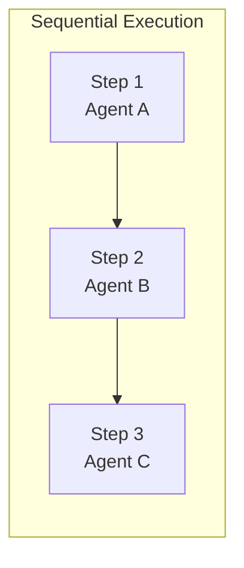
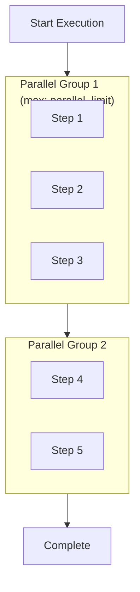
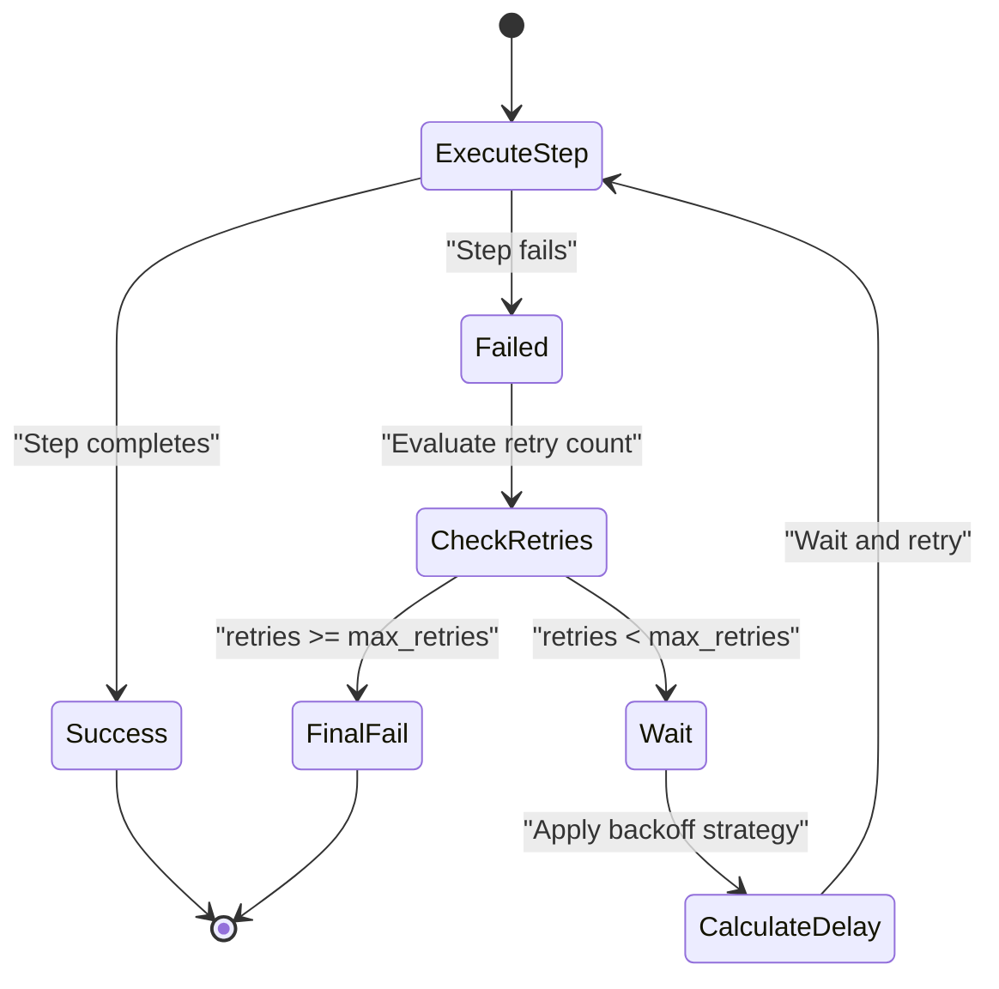
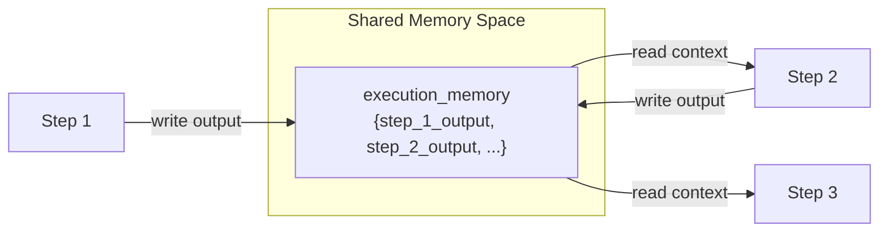
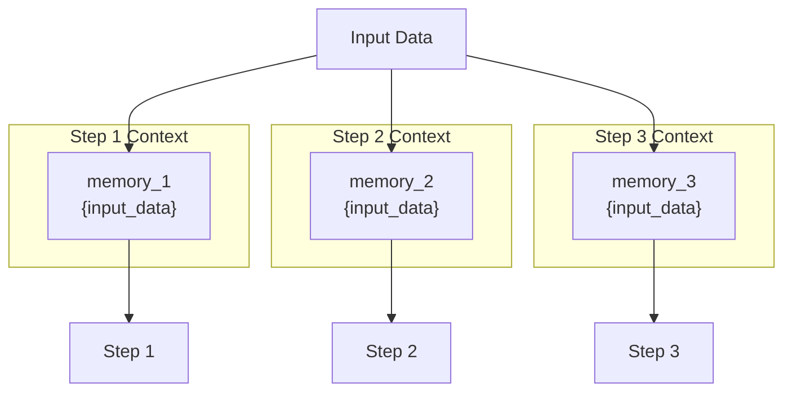
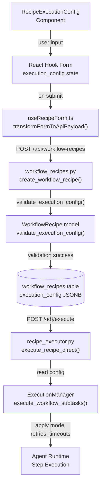

# Execution Configuration

<details>
<summary>Relevant source files</summary>

The following files were used as context for generating this wiki page:

- [frontend/components/workflows/create-recipe-modal.tsx](frontend/components/workflows/create-recipe-modal.tsx)
- [frontend/components/workflows/execution-kitchen.tsx](frontend/components/workflows/execution-kitchen.tsx)
- [frontend/components/workflows/recipe-execution-config.tsx](frontend/components/workflows/recipe-execution-config.tsx)
- [frontend/components/workflows/recipe-preview-panel.tsx](frontend/components/workflows/recipe-preview-panel.tsx)
- [frontend/components/workflows/recipe-step-builder.tsx](frontend/components/workflows/recipe-step-builder.tsx)
- [frontend/components/workflows/recipes-tab.tsx](frontend/components/workflows/recipes-tab.tsx)
- [frontend/components/workflows/view-recipe-modal.tsx](frontend/components/workflows/view-recipe-modal.tsx)
- [frontend/hooks/use-recipe-form.ts](frontend/hooks/use-recipe-form.ts)
- [orchestrator/alembic/versions/20260202_add_workspace_id_to_skills_patterns_models.py](orchestrator/alembic/versions/20260202_add_workspace_id_to_skills_patterns_models.py)
- [orchestrator/api/recipe_executor.py](orchestrator/api/recipe_executor.py)
- [orchestrator/api/workflow_recipes.py](orchestrator/api/workflow_recipes.py)
- [orchestrator/core/models/core.py](orchestrator/core/models/core.py)
- [orchestrator/core/services/recipe_memory_service.py](orchestrator/core/services/recipe_memory_service.py)
- [orchestrator/core/services/workspace_manager.py](orchestrator/core/services/workspace_manager.py)

</details>


This page documents the execution configuration system for workflow recipes, which controls runtime behavior including execution mode, retry logic, timeouts, quality thresholds, and memory isolation.

For information about creating and editing recipes, see [Creating Recipes](#4.1). For information about how recipes are executed at runtime, see [Recipe Execution](#4.2).

---

## Overview

Execution configuration is a JSON object stored in the `execution_config` column of the `workflow_recipes` table. It defines how the recipe's steps are executed, including performance characteristics, error handling, and quality controls. Configuration is set during recipe creation/editing through a dedicated UI step and validated by the backend before storage.

**Sources:** [orchestrator/api/workflow_recipes.py:218-227](), [frontend/components/workflows/create-recipe-modal.tsx:83-94]()

---

## Configuration Schema

### Core Options

The execution configuration object contains the following fields:

| Field | Type | Default | Description |
|-------|------|---------|-------------|
| `mode` | string | `"sequential"` | Execution mode: `"sequential"` or `"parallel"` |
| `max_retries` | integer | `3` | Maximum retry attempts per step |
| `retry_delay` | integer | `1000` | Initial retry delay in milliseconds |
| `backoff_strategy` | string | `"exponential"` | Backoff strategy: `"exponential"`, `"linear"`, or `"fixed"` |
| `per_step_timeout` | integer | `120` | Timeout per step in seconds |
| `total_timeout` | integer | `600` | Total execution timeout in seconds |
| `quality_threshold` | float | `0.7` | Minimum quality score (0.0-1.0) |
| `auto_learn` | boolean | `true` | Enable automatic learning from executions |
| `parallel_limit` | integer | `5` | Max concurrent steps in parallel mode |
| `memory_isolation` | string | `"shared"` | Memory sharing: `"shared"` or `"isolated"` |

**Sources:** [orchestrator/api/workflow_recipes.py:218-227](), [frontend/components/workflows/recipe-execution-config.tsx:1-324]()

---

## Execution Mode

### Sequential Mode

In sequential mode, recipe steps execute one after another in order. Each step waits for the previous step to complete before starting. Output from one step can be passed to the next step's context.



**Use Cases:**
- Steps have dependencies on previous outputs
- Order-sensitive workflows (e.g., analyze → validate → deploy)
- Debugging and step-by-step observation

**Sources:** [frontend/components/workflows/recipe-execution-config.tsx:60-73]()

### Parallel Mode

In parallel mode, steps execute concurrently up to the `parallel_limit`. Independent steps run simultaneously to reduce total execution time. The `parallel_limit` prevents resource exhaustion.



**Use Cases:**
- Independent analysis tasks (e.g., multiple security scans)
- Data processing across partitions
- High-throughput workflows

**Warning:** Parallel mode requires steps to be independent. Steps depending on other steps' outputs will fail.

**Sources:** [frontend/components/workflows/recipe-execution-config.tsx:74-92](), [orchestrator/modules/agents/execution/execution_manager.py:336-414]()

---

## Retry Configuration

### Retry Strategy

When a step fails, the execution manager retries it up to `max_retries` times. The delay between retries is calculated based on `backoff_strategy`:

| Strategy | Delay Formula | Example (base=1000ms) |
|----------|---------------|------------------------|
| `exponential` | `retry_delay * (2 ^ attempt)` | 1s, 2s, 4s, 8s, 16s |
| `linear` | `retry_delay * (attempt + 1)` | 1s, 2s, 3s, 4s, 5s |
| `fixed` | `retry_delay` | 1s, 1s, 1s, 1s, 1s |

**Diagram: Retry Flow with Exponential Backoff**



**Sources:** [frontend/components/workflows/recipe-execution-config.tsx:96-145](), [orchestrator/api/workflow_recipes.py:218-227]()

---

## Timeout Configuration

### Per-Step Timeout

The `per_step_timeout` (in seconds) limits individual step execution time. If a step exceeds this duration, it is terminated and marked as failed. The step may be retried if retries are configured.

### Total Timeout

The `total_timeout` (in seconds) limits the entire recipe execution. This prevents runaway executions and ensures recipes complete within expected timeframes.

**Timeout Calculation:**

For sequential mode:
```
calculated_max = per_step_timeout × step_count
```

For parallel mode:
```
calculated_max = per_step_timeout (all steps run concurrently)
```

The `total_timeout` should be set considering the calculated maximum plus overhead for retries and inter-step processing.

**Sources:** [frontend/components/workflows/recipe-execution-config.tsx:147-192](), [orchestrator/api/workflow_recipes.py:223-224]()

---

## Quality and Learning

### Quality Threshold

The `quality_threshold` (0.0 to 1.0) defines the minimum acceptable quality score for recipe executions. After execution, the quality assessment service evaluates the execution across 5 dimensions:

1. **Completeness** - All steps executed successfully
2. **Accuracy** - Outputs match expected schema
3. **Efficiency** - Time and token usage
4. **Reliability** - Retry count and error rate
5. **Cost** - Total LLM cost

If the quality score falls below the threshold, the execution may trigger alerts or corrective actions.

**Sources:** [frontend/components/workflows/recipe-execution-config.tsx:194-224]()

### Auto-Learning

When `auto_learn` is `true`, the `RecipeLearningService` automatically analyzes completed executions to extract:

- **Success patterns** - Common characteristics of successful runs
- **Failure patterns** - Error patterns and root causes
- **Performance patterns** - Optimization opportunities

Learning data is stored in the `learning_data` JSONB column and exposed via the `/api/workflow-recipes/{id}/suggestions` endpoint.

**Sources:** [orchestrator/api/workflow_recipes.py:713-767](), [frontend/components/workflows/recipe-execution-config.tsx:226-245]()

---

## Memory Isolation

### Shared Memory Mode

In `"shared"` memory mode, all steps in a recipe execution share the same context. Previous step outputs are available to subsequent steps, enabling data passing and workflow continuity.



**Use Cases:**
- Sequential workflows with data dependencies
- Accumulating results across steps
- Context building for later steps

**Sources:** [orchestrator/modules/agents/execution/execution_manager.py:277-280]()

### Isolated Memory Mode

In `"isolated"` memory mode, each step has its own independent context. Steps cannot access other steps' outputs. This prevents data contamination and ensures predictable behavior.



**Use Cases:**
- Parallel workflows with independent steps
- Testing and validation (no side effects)
- Reproducible analysis tasks

**Sources:** [frontend/components/workflows/recipe-execution-config.tsx:293-318]()

---

## Data Flow: UI to Execution

**Diagram: Configuration Data Flow**



**Sources:** [frontend/components/workflows/recipe-execution-config.tsx:34-252](), [frontend/hooks/use-recipe-form.ts:66-103](), [orchestrator/api/workflow_recipes.py:171-299]()

---

## Frontend Configuration UI

The execution configuration UI is implemented in `RecipeExecutionConfig` component, which is step 3 of the 4-step recipe creation wizard.

### UI Sections

1. **Performance** - Execution mode selection (sequential/parallel)
2. **Retry Configuration** - Max retries, retry delay, backoff strategy
3. **Timeout Settings** - Per-step and total timeouts
4. **Quality** - Quality threshold slider and auto-learning toggle
5. **Advanced Settings** - Parallel limit and memory isolation (collapsible)

**Form Value Transformation:**

The frontend stores timeouts in milliseconds for UI consistency, but the backend expects seconds. Transformation occurs in `transformFormToApiPayload()`:

```typescript
// Frontend form values (ms)
timeout_per_step: 120000  // 120 seconds
total_timeout: 600000     // 600 seconds

// Backend API payload (seconds)
per_step_timeout: 120
total_timeout: 600
```

**Sources:** [frontend/components/workflows/recipe-execution-config.tsx:34-252](), [frontend/hooks/use-recipe-form.ts:66-76]()

---

## Backend Validation

The `WorkflowRecipe` model validates execution configuration before saving to the database. Validation is performed in `validate_execution_config()` method.

**Validation Rules:**

1. **Mode** - Must be `"sequential"` or `"parallel"`
2. **Retries** - `max_retries` must be >= 0
3. **Backoff** - Must be `"exponential"`, `"linear"`, or `"fixed"`
4. **Timeouts** - Must be positive integers
5. **Quality** - Must be float between 0.0 and 1.0
6. **Auto-learn** - Must be boolean
7. **Parallel limit** - Must be positive integer (if mode is parallel)
8. **Memory isolation** - Must be `"shared"` or `"isolated"`

**Error Handling:**

If validation fails, the API returns HTTP 400 with a detailed error message:

```json
{
  "detail": "Invalid execution_config: quality_threshold must be between 0.0 and 1.0"
}
```

**Sources:** [orchestrator/api/workflow_recipes.py:258-261](), [orchestrator/api/workflow_recipes.py:368-373]()

---

## Runtime Usage

### ExecutionManager Configuration

The `ExecutionManager` reads the recipe's `execution_config` when creating the execution plan. The configuration affects several aspects of execution:

**Execution Plan Creation:**

```python
def _create_execution_plan(
    self, 
    subtasks: List[Dict[str, Any]], 
    execution_strategy: str = "parallel"
) -> ExecutionPlan:
    """
    Creates execution plan based on strategy from execution_config.mode
    - sequential: Each task in its own group
    - parallel: Tasks grouped by max_parallel_executions
    """
```

**Retry Logic Application:**

The retry configuration is applied in `_execute_single_subtask()`. The method wraps step execution in a retry loop:

```python
for retry_attempt in range(max_retries + 1):
    try:
        result = await agent.execute(...)
        break  # Success
    except Exception as e:
        if retry_attempt < max_retries:
            delay = calculate_backoff(retry_delay, retry_attempt, strategy)
            await asyncio.sleep(delay)
        else:
            raise  # Final failure
```

**Sources:** [orchestrator/modules/agents/execution/execution_manager.py:336-414](), [orchestrator/modules/agents/execution/execution_manager.py:416-591]()

---

## Database Storage

Execution configuration is stored in the `workflow_recipes.execution_config` JSONB column. This allows flexible schema evolution while maintaining query performance.

**Table Schema:**

```sql
CREATE TABLE workflow_recipes (
    id SERIAL PRIMARY KEY,
    template_id VARCHAR(255) UNIQUE NOT NULL,
    name VARCHAR(255) NOT NULL,
    execution_config JSONB,
    -- other columns...
);
```

**Example Stored Value:**

```json
{
  "mode": "sequential",
  "max_retries": 3,
  "retry_delay": 1000,
  "backoff_strategy": "exponential",
  "per_step_timeout": 120,
  "total_timeout": 600,
  "quality_threshold": 0.7,
  "auto_learn": true,
  "parallel_limit": 5,
  "memory_isolation": "shared"
}
```

**Sources:** [orchestrator/api/workflow_recipes.py:230-240](), [orchestrator/alembic/versions/20260201_add_recipe_executions.py:26-42]()

---

## Configuration Defaults

If no `execution_config` is provided during recipe creation, the following defaults are applied:

```python
execution_config = recipe_data.get('execution_config') or {
    'mode': 'sequential',
    'max_retries': 1,
    'retry_delay': 5,
    'per_step_timeout': 300,
    'total_timeout': 1800,
    'quality_threshold': 0.7,
    'auto_learn': True,
}
```

Note: These backend defaults differ slightly from frontend defaults. The frontend uses more aggressive defaults (3 retries, 120s per step) suitable for interactive recipe creation, while backend defaults are more conservative for system-created recipes.

**Sources:** [orchestrator/api/workflow_recipes.py:218-227]()

---

## Example Configurations

### High-Reliability Configuration

For critical workflows requiring maximum reliability:

```json
{
  "mode": "sequential",
  "max_retries": 5,
  "retry_delay": 2000,
  "backoff_strategy": "exponential",
  "per_step_timeout": 300,
  "total_timeout": 3600,
  "quality_threshold": 0.9,
  "auto_learn": true,
  "memory_isolation": "shared"
}
```

### High-Performance Configuration

For fast, parallel workflows with independent steps:

```json
{
  "mode": "parallel",
  "max_retries": 1,
  "retry_delay": 500,
  "backoff_strategy": "fixed",
  "per_step_timeout": 60,
  "total_timeout": 180,
  "quality_threshold": 0.6,
  "auto_learn": true,
  "parallel_limit": 10,
  "memory_isolation": "isolated"
}
```

### Testing Configuration

For development and testing:

```json
{
  "mode": "sequential",
  "max_retries": 0,
  "retry_delay": 0,
  "backoff_strategy": "fixed",
  "per_step_timeout": 30,
  "total_timeout": 300,
  "quality_threshold": 0.5,
  "auto_learn": false,
  "memory_isolation": "isolated"
}
```

**Sources:** [frontend/components/workflows/create-recipe-modal.tsx:83-94]()

---

## Related Components

| Component | Purpose | Reference |
|-----------|---------|-----------|
| `RecipeExecutionConfig` | Frontend UI for configuration | [recipe-execution-config.tsx]() |
| `ExecutionManager` | Runtime execution engine | [execution_manager.py]() |
| `RecipeQualityService` | Quality assessment using threshold | [See page 4.5](#4.5) |
| `RecipeLearningService` | Auto-learning implementation | [See page 4.5](#4.5) |
| `RecipeExecution` model | Stores execution state | [See page 4.2](#4.2) |

**Sources:** [frontend/components/workflows/recipe-execution-config.tsx:1-324](), [orchestrator/modules/agents/execution/execution_manager.py:85-186]()

---