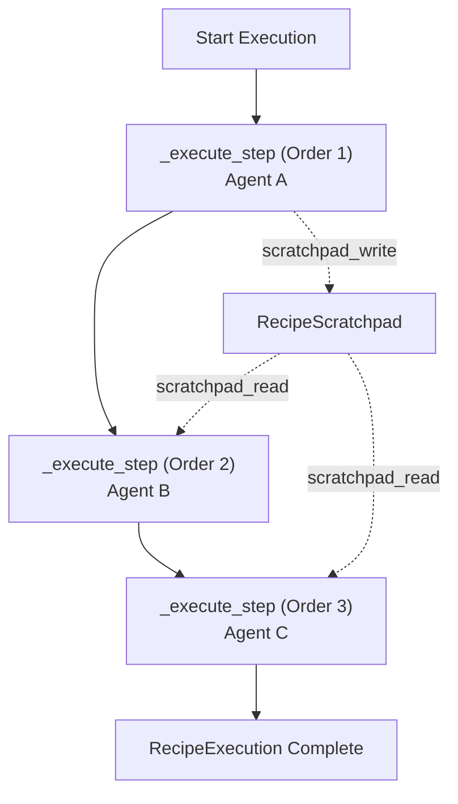
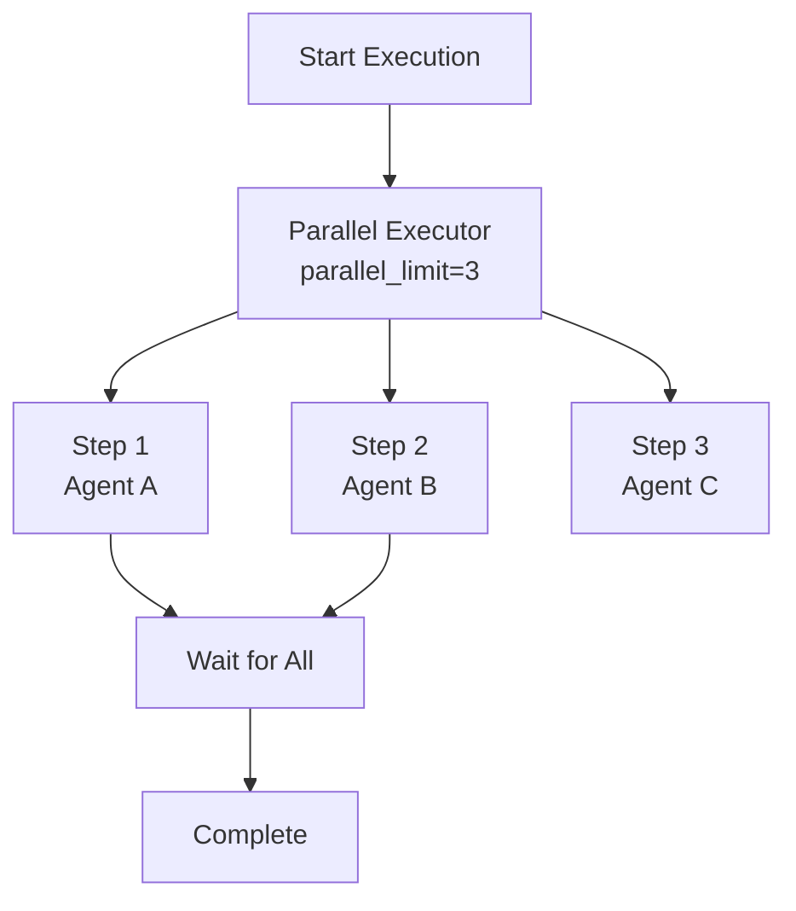
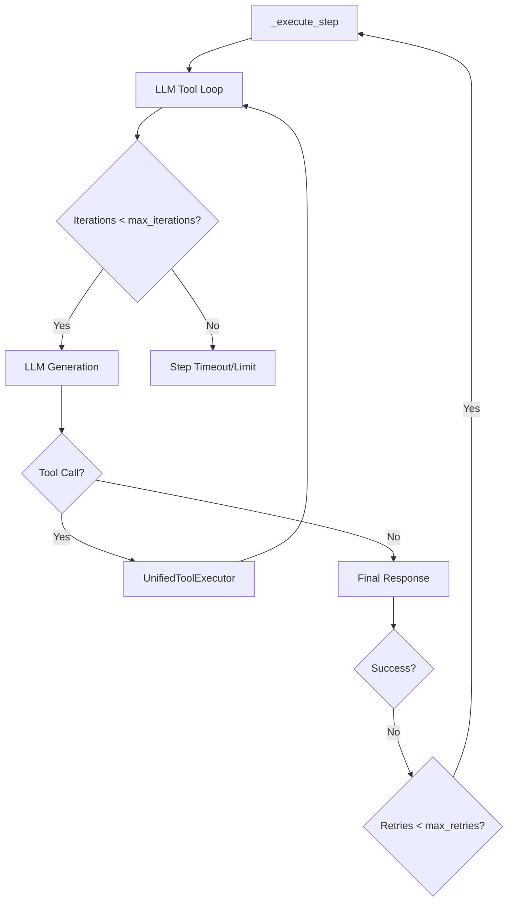
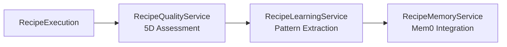
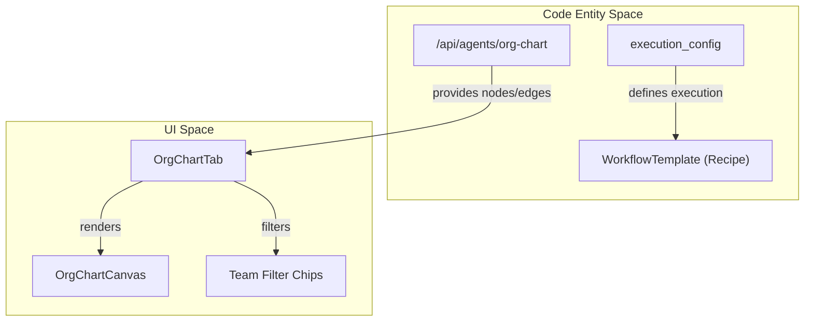

# Execution Configuration

Relevant source files

The following files were used as context for generating this wiki page:

- [frontend/components/agents/org-chart-tab.tsx](frontend/components/agents/org-chart-tab.tsx)
- [orchestrator/api/marketplace.py](orchestrator/api/marketplace.py)
- [orchestrator/api/workflow_recipes.py](orchestrator/api/workflow_recipes.py)
- [orchestrator/core/seeds/platform-management-skill.md](orchestrator/core/seeds/platform-management-skill.md)

This page documents the execution configuration system for workflow recipes, which controls how recipe steps are executed, retried, timed out, and isolated. Execution configuration determines the runtime behavior of multi-step workflows, including concurrency strategy, error handling, and memory management.

For information about creating recipes and defining steps, see [Creating Recipes](6.1). For the execution engine that processes these configurations, see [Recipe Execution Engine](6.2). For scheduling recipes to run automatically, see [Scheduling & Triggers](6.4).

---

## Configuration Structure

Execution configuration is stored as a JSONB field in the `workflow_templates` table's `execution_config` column [orchestrator/api/marketplace.py:75](). In the codebase, this model is defined as `WorkflowTemplate` (often aliased as `WorkflowRecipe`) [orchestrator/api/workflow_recipes.py:25](). The configuration controls all runtime behavior for recipe execution.

### Configuration Fields

| Field | Type | Description | Default | Range/Options |
|-------|------|-------------|---------|---------------|
| `mode` | string | Execution strategy | `"sequential"` | `"sequential"`, `"parallel"` |
| `max_retries` | integer | Retry attempts per step | `3` | `0-5` |
| `timeout_per_step` | integer | Step timeout (seconds) | `120` | `10-600` |
| `total_timeout` | integer | Total execution timeout (seconds) | `600` | `10-3600` |
| `auto_learning` | boolean | Enable pattern extraction | `true` | `true`, `false` |
| `parallel_limit` | integer | Max concurrent steps (parallel mode) | `3` | `1-20` |
| `memory_isolation` | string | Context sharing strategy | `"shared"` | `"shared"`, `"isolated"` |

**Sources:** [orchestrator/api/workflow_recipes.py:25-27](), [orchestrator/api/marketplace.py:70-76]()

---

## Execution Modes

### Sequential Mode

Steps execute one after another in order. Each step waits for the previous step to complete before starting. Output from step $N$ is passed to step $N+1$ via the `RecipeScratchpad` which provides structured key-value storage for inter-step data sharing.

**Recipe Execution Data Flow (Sequential)**

**Characteristics:**
- **Predictable Order**: Guaranteed execution sequence based on the `steps` array order [orchestrator/api/workflow_recipes.py:140-174]().
- **Contextual Awareness**: Steps can access `agent` details enriched by the API, including `model`, `provider`, and `tool_count` [orchestrator/api/workflow_recipes.py:162-169]().
- **Resource Efficiency**: Execution is often managed via workspace-scoped semaphores to bound total concurrent recipes.

**Sources:** [orchestrator/api/workflow_recipes.py:140-174](), [orchestrator/api/workflow_recipes.py:162-169]()

### Parallel Mode

Steps execute simultaneously up to the `parallel_limit`. The `execution_config` allows specifying this limit to prevent resource exhaustion.

**Parallel Execution Logic**

**Characteristics:**
- **Concurrency Control**: Respects `parallel_limit` defined in `MarketplaceItemOut.execution_config` [orchestrator/api/marketplace.py:75]().
- **Independence**: Best used when steps do not depend on each other's outputs.
- **Org Chart Integration**: Agents in parallel workflows can be visualized via the `OrgChartTab` to understand team distribution [frontend/components/agents/org-chart-tab.tsx:16-54]().

**Sources:** [orchestrator/api/marketplace.py:75](), [frontend/components/agents/org-chart-tab.tsx:16-54]()

---

## Retry and Timeout Configuration

### Maximum Retries & Iterations

The system distinguishes between **Execution Retries** (re-running a failed step) and **Tool Iterations** (LLM turns within a single step). 

1.  **Step Iterations**: Managed per-agent or per-step. Higher values allow agents to perform complex work like multi-turn debugging.
2.  **Retries**: Controls how many times a failed step is retried before the `RecipeExecution` status is set to `failed`.

**Retry/Iteration Logic Flow**

**Sources:** [orchestrator/api/marketplace.py:75-76](), [orchestrator/api/workflow_recipes.py:155-172]()

### Timeout Configuration

The system enforces timeouts to prevent runaway resource consumption.
- **Per-Step Timeout**: Maximum time allowed for a single agent execution (default 120s).
- **Total Timeout**: Maximum time for the entire workflow sequence (default 600s).

---

## Memory Isolation & Learning

### Memory Isolation
Memory isolation controls whether steps share execution context or run independently.
- **Shared Memory (Default)**: Steps share a common scratchpad. Agents are provided with the `platform_store_memory` and `platform_search_memory` tools to manage workspace long-term memory [orchestrator/core/seeds/platform-management-skill.md:114-117]().
- **Isolated Memory**: Each step runs in a clean context with no access to previous step outputs.

### Auto-Learning
When `auto_learning` is enabled, the system assesses execution quality and extracts patterns for future optimization.

**Learning Pipeline**

The system tracks:
- **Agent Performance**: `install_count` and `use_count` are tracked to identify high-performing agents and recipes [orchestrator/api/marketplace.py:62](), [orchestrator/api/workflow_recipes.py:185]().
- **Learning Data**: Captured via platform-management tools like `platform_harness_status` and `platform_harness_trigger` [orchestrator/core/seeds/platform-management-skill.md:118-121]().

**Sources:** [orchestrator/api/marketplace.py:62](), [orchestrator/api/workflow_recipes.py:185](), [orchestrator/core/seeds/platform-management-skill.md:114-121]()

---

## Visualizing Execution Structures

The `OrgChartTab` and `OrgChartCanvas` provide a way to visualize the relationship between agents that may be involved in a complex execution configuration [frontend/components/agents/org-chart-tab.tsx:7-14]().

**Code Entity Space to UI Mapping**

**Key UI Elements:**
- **Team Filtering**: Allows isolating agents by team to see execution flow within a specific department [frontend/components/agents/org-chart-tab.tsx:73-99]().
- **Mission Zero**: A special execution mode that designs the AI company structure and populates the org chart data [frontend/components/agents/org-chart-tab.tsx:103-121]().

**Sources:** [frontend/components/agents/org-chart-tab.tsx:7-14](), [frontend/components/agents/org-chart-tab.tsx:73-121]()

---