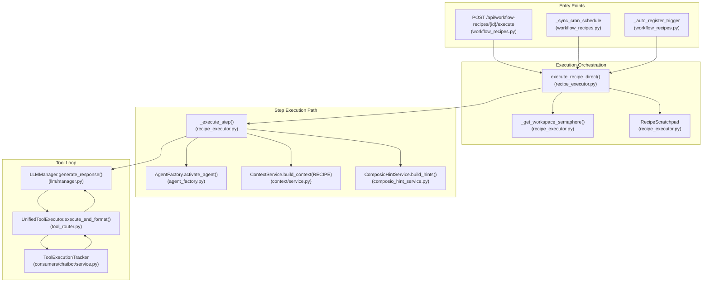
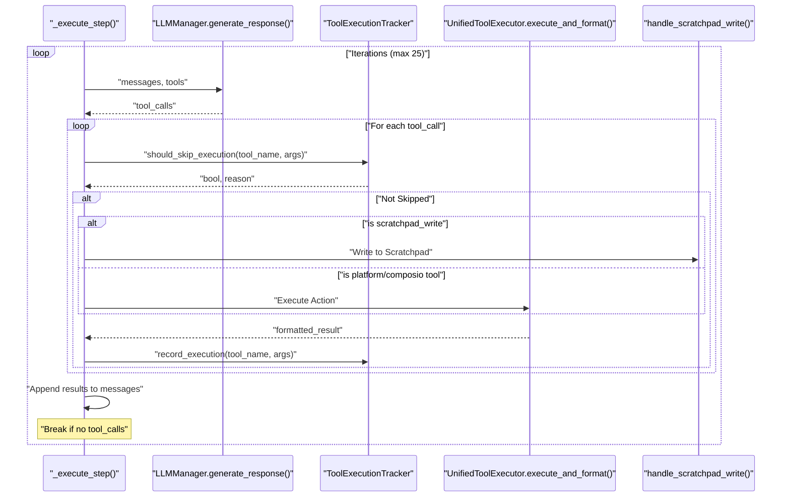

# Recipe Execution Engine

Relevant source files

The following files were used as context for generating this wiki page:

- [frontend/app/api/chat/route.ts](frontend/app/api/chat/route.ts)
- [frontend/components/chatbot/chat.tsx](frontend/components/chatbot/chat.tsx)
- [frontend/components/chatbot/mission-suggestion-card.tsx](frontend/components/chatbot/mission-suggestion-card.tsx)
- [frontend/lib/chat/hooks.ts](frontend/lib/chat/hooks.ts)
- [frontend/stores/mission-store.ts](frontend/stores/mission-store.ts)
- [orchestrator/api/chat.py](orchestrator/api/chat.py)
- [orchestrator/api/recipe_executor.py](orchestrator/api/recipe_executor.py)
- [orchestrator/consumers/chatbot/service.py](orchestrator/consumers/chatbot/service.py)
- [orchestrator/modules/agents/factory/agent_factory.py](orchestrator/modules/agents/factory/agent_factory.py)

## Purpose and Scope

The Recipe Execution Engine implements step-by-step workflow automation for the Starter Plan. It executes recipe steps sequentially, activating the assigned agent for each step and providing tool access via Composio and Platform integrations. This engine is designed to bypass the complex 9-stage pipeline used for advanced missions, instead using the same component path as the chatbot (PRD-50 alignment) to ensure consistency, token efficiency, and predictable behavior.

**Sources:** [orchestrator/api/recipe_executor.py:1-19](), [orchestrator/api/recipe_executor.py:5-7]()

---

## Architecture Overview

The Recipe Execution Engine reuses core services like `ContextService`, `AgentFactory`, and `UnifiedToolExecutor`. It manages the lifecycle of a `RecipeExecution` from initialization through sequential step processing to final reporting.

### System Component Map
The following diagram maps the high-level execution flow to specific code entities and functions, bridging the gap between natural language workflow concepts and the "Code Entity Space".

**Sources:** [orchestrator/api/recipe_executor.py:110-150](), [orchestrator/api/recipe_executor.py:162-164](), [orchestrator/api/recipe_executor.py:572-610](), [orchestrator/modules/agents/factory/agent_factory.py:1-11]()

---

## Workspace Semaphores

To prevent resource exhaustion and ensure system stability, the engine implements per-workspace execution limits using `asyncio.Semaphore`.

*   **Concurrency Guard:** A global `_workspace_semaphores` dictionary stores semaphores keyed by `workspace_id`. [orchestrator/api/recipe_executor.py:91-91]()
*   **Limit Enforcement:** The `_get_workspace_semaphore` function manages access, defaulting to a limit of 3 concurrent recipe executions per workspace. [orchestrator/api/recipe_executor.py:94-103]()
*   **Process Safety:** The implementation is safe within the single-threaded `asyncio` event loop of the orchestrator. [orchestrator/api/recipe_executor.py:85-90]()

---

## Main Execution Loop: `execute_recipe_direct`

The `execute_recipe_direct` function is the primary entry point. It handles the lifecycle of a `RecipeExecution` record and provides unified notifications.

### Execution Sequence
1.  **Initialization:** Fetches the `WorkflowRecipe` and `RecipeExecution` from the database and updates status to `running`. [orchestrator/api/recipe_executor.py:572-610]()
2.  **Semaphore Acquisition:** Waits for a slot in the workspace's concurrency limit. [orchestrator/api/recipe_executor.py:612-622]()
3.  **Scratchpad Setup:** Initializes a `RecipeScratchpad` to manage data flow between steps, saving significant token costs compared to passing full histories. [orchestrator/api/recipe_executor.py:14-16](), [orchestrator/api/recipe_executor.py:644-648]()
4.  **Memory Retrieval:** Uses `RecipeMemoryService` to pull relevant Mem0 memories before the first step. [orchestrator/api/recipe_executor.py:18-19](), [orchestrator/api/recipe_executor.py:650-665]()
5.  **Step Iteration:** Loops through recipe steps sorted by their `order` attribute. [orchestrator/api/recipe_executor.py:687-695]()
6.  **Step Execution:** Calls `_execute_step` for each agent-based task. [orchestrator/api/recipe_executor.py:110-123](), [orchestrator/api/recipe_executor.py:832-848]()
7.  **Unified Notifications:** Dispatches events via `NotificationDispatcher` to the bell UI and external channels (Slack/Telegram) upon completion or failure. [orchestrator/api/recipe_executor.py:45-55](), [orchestrator/api/recipe_executor.py:950-970]()
8.  **Logging & Cleanup:** Full logs are persisted to S3, while compact summaries and metrics are stored in the database via `_auto_create_playbook_report`. [orchestrator/api/recipe_executor.py:17-18](), [orchestrator/api/recipe_executor.py:88-105]()

**Sources:** [orchestrator/api/recipe_executor.py:572-1009](), [orchestrator/api/recipe_executor.py:14-19](), [orchestrator/api/recipe_executor.py:45-82]()

---

## Step Execution Logic: `_execute_step`

Each step is executed using a flow that mimics the standard chatbot path but adds recipe-specific context and scratchpad tools.

### Agent Activation
The engine uses `AgentFactory.activate_agent(agent_id)` to retrieve the agent's runtime, including its `LLMManager` and assigned tools. [orchestrator/api/recipe_executor.py:162-164]()

### Context Assembly
`ContextService` is called with `ContextMode.RECIPE`. It builds a system prompt including:
*   **Identity & Persona:** The agent's core definition. [orchestrator/modules/agents/factory/agent_factory.py:105-112]()
*   **Recipe Step Section:** Includes the current step number, total steps, instructions, and formatted context from the scratchpad. [orchestrator/api/recipe_executor.py:174-185]()
*   **Scope Guard:** An explicit system instruction is appended to keep the agent focused on the specific task and prevent "hallucinating" the completion of future steps. [orchestrator/api/recipe_executor.py:187-200]()

### Tool Discovery and Hints
The engine employs a tiered strategy for tool resolution:
1.  **Hinting:** `ComposioHintService.build_hints` generates text-based hints to help the agent identify which tools to use for the specific task. [orchestrator/api/recipe_executor.py:231-250]()
2.  **Scratchpad Tools:** The `scratchpad_write` and `scratchpad_read` tools are injected to allow agents to explicitly export and import data. [orchestrator/api/recipe_executor.py:152-160](), [orchestrator/api/recipe_executor.py:253-263]()

**Sources:** [orchestrator/api/recipe_executor.py:110-123](), [orchestrator/api/recipe_executor.py:174-200](), [orchestrator/api/recipe_executor.py:205-263](), [orchestrator/modules/agents/factory/agent_factory.py:159-176]()

---

## Tool Execution Loop

The engine runs a loop (up to `max_iterations`, default 25) where the LLM can call tools. This loop uses the `ToolExecutionTracker` to prevent infinite loops and redundant executions.

### Tool Execution Details
*   **Deduplication:** The `ToolExecutionTracker` implements exact and semantic deduplication (for search tools) and per-tool retry limits. [orchestrator/consumers/chatbot/service.py:83-96](), [orchestrator/consumers/chatbot/service.py:150-176]()
*   **Result Formatting:** Tool outputs are formatted into strings for the LLM's next turn turn via `tool_router.execute_and_format()`. [orchestrator/api/recipe_executor.py:355-365]()
*   **Iteration Limits:** The loop respects limits defined in `TOOL_RETRY_LIMITS`, with defaults for platform and workspace actions. [orchestrator/consumers/chatbot/service.py:98-111]()

**Sources:** [orchestrator/api/recipe_executor.py:274-415](), [orchestrator/consumers/chatbot/service.py:83-176]()

---

## Data Flow: Recipe Scratchpad

The `RecipeScratchpad` is the primary mechanism for inter-step data sharing, replacing the legacy pattern of passing the entire message history between agents.

| Function | Role |
| :--- | :--- |
| `write_inputs` | Stores initial trigger data (e.g., webhook payload or manual input). [orchestrator/api/recipe_executor.py:644-648]() |
| `write_step_results` | Captures the final output and tool calls of a completed step for use in future steps. [orchestrator/api/recipe_executor.py:860-870]() |
| `format_context_for_step` | Produces a Markdown summary of relevant previous outputs for the current agent's context. [orchestrator/api/recipe_executor.py:174-177]() |
| `handle_scratchpad_write` | Internal tool handler for agents to save specific key-value pairs to the scratchpad. [orchestrator/api/recipe_executor.py:157-157]() |

**Sources:** [orchestrator/api/recipe_executor.py:152-160](), [orchestrator/api/recipe_executor.py:174-177](), [orchestrator/api/recipe_executor.py:644-648]()

---

## Chat Integration and Workflow Bridge

While `execute_recipe_direct` handles predefined recipes, the system also supports a "Workflow Bridge" for complex tasks identified during chat.

*   **Complexity Assessment:** `AutoBrain` assesses user messages; if complexity is `ORGAN` or `ORGANISM`, it can trigger a workflow. [orchestrator/api/chat.py:45-55]()
*   **Transient Workflows:** The `_stream_workflow_bridge` creates a transient workflow from a chat message and executes it through the full pipeline, streaming progress back to the chat UI. [orchestrator/api/chat.py:68-87]()
*   **Mission Suggestions:** For complex tasks, the UI can suggest launching a full Multi-Agent Mission via `MissionSuggestionCard`. [frontend/components/chatbot/mission-suggestion-card.tsx:19-25](), [frontend/components/chatbot/mission-suggestion-card.tsx:40-67]()

**Sources:** [orchestrator/api/chat.py:37-108](), [frontend/components/chatbot/chat.tsx:140-145](), [frontend/components/chatbot/mission-suggestion-card.tsx:1-123]()

---