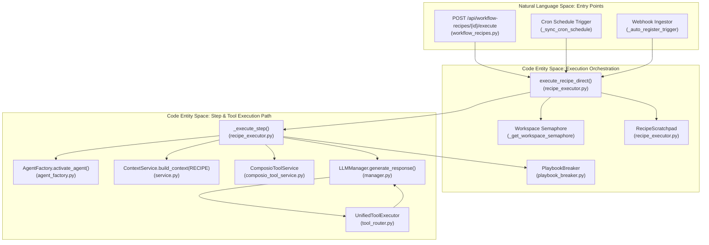
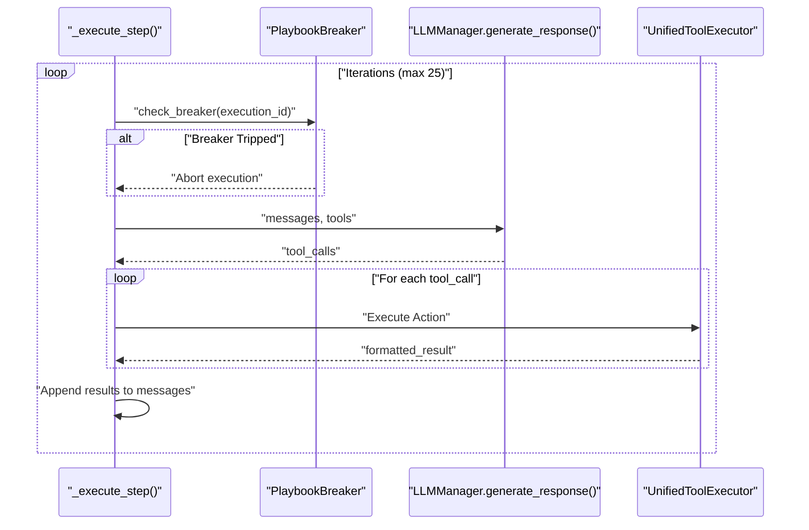

# Recipe Execution Engine

Relevant source files

The following files were used as context for generating this wiki page:

- [frontend/components/workflows/execution-kitchen.tsx](frontend/components/workflows/execution-kitchen.tsx)
- [orchestrator/api/composio.py](orchestrator/api/composio.py)
- [orchestrator/api/recipe_executor.py](orchestrator/api/recipe_executor.py)
- [orchestrator/api/skills.py](orchestrator/api/skills.py)
- [orchestrator/api/tools.py](orchestrator/api/tools.py)
- [orchestrator/api/webhooks.py](orchestrator/api/webhooks.py)
- [orchestrator/api/workflow_recipes.py](orchestrator/api/workflow_recipes.py)
- [orchestrator/core/composio/client.py](orchestrator/core/composio/client.py)
- [orchestrator/core/composio/linkedin_image_workaround.py](orchestrator/core/composio/linkedin_image_workaround.py)
- [orchestrator/core/composio/tool_executor.py](orchestrator/core/composio/tool_executor.py)
- [orchestrator/core/credentials/tester.py](orchestrator/core/credentials/tester.py)
- [orchestrator/core/credentials/types.py](orchestrator/core/credentials/types.py)
- [orchestrator/core/database/credential_types_seed.json](orchestrator/core/database/credential_types_seed.json)
- [orchestrator/core/routing/ingestors/webhook.py](orchestrator/core/routing/ingestors/webhook.py)
- [orchestrator/services/board_task_bridge.py](orchestrator/services/board_task_bridge.py)
- [orchestrator/services/metadata_sync_service.py](orchestrator/services/metadata_sync_service.py)
- [orchestrator/services/playbook_breaker.py](orchestrator/services/playbook_breaker.py)
- [orchestrator/services/webhook_dedup.py](orchestrator/services/webhook_dedup.py)
- [orchestrator/tests/api/test_deliverables_api.py](orchestrator/tests/api/test_deliverables_api.py)
- [orchestrator/tests/modules/tools/execution/test_exec_workspace_deliverable.py](orchestrator/tests/modules/tools/execution/test_exec_workspace_deliverable.py)
- [orchestrator/tests/test_eval_graph_mode.py](orchestrator/tests/test_eval_graph_mode.py)
- [orchestrator/tests/test_p2w0_playbook_failure_visibility.py](orchestrator/tests/test_p2w0_playbook_failure_visibility.py)
- [orchestrator/tests/test_p2w0_s8_vector_probe.py](orchestrator/tests/test_p2w0_s8_vector_probe.py)
- [orchestrator/tests/test_p2w0_service_imports_resolve.py](orchestrator/tests/test_p2w0_service_imports_resolve.py)
- [orchestrator/tests/test_p2w2_webhook_dedup.py](orchestrator/tests/test_p2w2_webhook_dedup.py)
- [orchestrator/tests/test_p2w2_webhook_signature_reject.py](orchestrator/tests/test_p2w2_webhook_signature_reject.py)
- [orchestrator/tests/test_playbook_scheduler.py](orchestrator/tests/test_playbook_scheduler.py)

## Purpose and Scope

The Recipe Execution Engine implements step-by-step workflow automation for the Starter Plan. It executes recipe steps sequentially, activating the assigned agent for each step and providing tool access via Composio integration. This page documents the internal architecture of `execute_recipe_direct`, the workspace semaphore system, the step loop, tool execution logic, playbook breaker policies, and failure visibility mechanisms.

The engine bypasses the complex 9-stage pipeline used for advanced missions, instead using the same component path as the chatbot to ensure consistency and token efficiency.

Sources: `[orchestrator/api/recipe_executor.py:1-19]()`, `[orchestrator/api/recipe_executor.py:5-7]()`

---

## Architecture Overview

The Recipe Execution Engine follows a component-based architecture that reuses core services like `ContextService`, `AgentFactory`, and `ComposioToolService`.

### System Component Map
The following diagram maps the high-level execution flow to specific code entities and functions, bridging natural language concepts to exact codebase symbols.

Sources: `[orchestrator/api/recipe_executor.py:572-610]()`, `[orchestrator/api/workflow_recipes.py:36-50]()`, `[orchestrator/api/workflow_recipes.py:52-128]()`

---

## Workspace Semaphores

To prevent resource exhaustion, the engine implements per-workspace execution limits using `asyncio.Semaphore`.

*   **Concurrency Guard:** The global `_workspace_semaphores` dictionary stores semaphores keyed by `workspace_id`.
*   **Limit Enforcement:** By default, a workspace is limited to 3 concurrent recipe (playbook) executions. This is managed via `_get_workspace_semaphore(workspace_id, max_concurrent=3)`.
*   **Process Safety:** While the dictionary is process-global, it is safe within the single-threaded `asyncio` event loop.

Sources: `[orchestrator/api/recipe_executor.py:85-103]()`

---

## Main Execution Loop: `execute_recipe_direct`

The `execute_recipe_direct` function is the primary entry point for running a recipe. It handles the lifecycle of a `RecipeExecution` record and provides unified notifications.

### Execution Sequence
1.  **Initialization:** Fetches the `WorkflowRecipe` and `RecipeExecution` from the database.
2.  **Semaphore Acquisition:** Waits for a slot in the workspace's concurrency limit to ensure stability.
3.  **Step Overrides:** Merges `execution_metadata.step_overrides` into the step list, allowing per-execution prompt tweaks (PRD-204 S7).
4.  **Scratchpad Setup:** Initializes a `RecipeScratchpad` to manage data flow between steps, replacing verbose text dumps and saving 80-90% in tokens.
5.  **Memory Retrieval:** Uses `RecipeMemoryService` to pull relevant Mem0 memories before the first step.
6.  **Step Iteration:** Loops through recipe steps sorted by `order`.
7.  **Unified Notifications:** Dispatches events via `NotificationDispatcher` to the bell UI and external channels upon completion or failure (PRD-128).
8.  **Auto-Reporting & Terminal Watch:** Persists an `agent_reports` row summarizing execution metrics and reports terminal states to the watch registry.

Sources: `[orchestrator/api/recipe_executor.py:14-19]()`, `[orchestrator/api/recipe_executor.py:45-82]()`, `[orchestrator/api/recipe_executor.py:129-157]()`, `[orchestrator/api/recipe_executor.py:572-1009]()`

---

## Step Execution Logic: `_execute_step`

Each step is executed using a flow that mimics the standard chatbot path but adds recipe-specific context and scratchpad tools.

### Agent Activation
The engine uses `AgentFactory.activate_agent(agent_id)` to retrieve the agent's runtime, including its `LLMManager`.

### Context Assembly
`ContextService` is called with `ContextMode.RECIPE`. It builds a system prompt including:
*   **Identity & Persona:** The agent's core definition.
*   **Recipe Step Section:** Includes current step number, total steps, instructions, and formatted context from the scratchpad.
*   **Scope Guard:** An explicit system instruction to keep the agent focused on the specific step task.

### Tool Discovery and Hints
The engine employs a tiered strategy for tool resolution:
1.  **SDK Search:** `ComposioToolService.get_tools_for_step` performs a semantic search for specific actions relevant to the task.
2.  **Hint Fallback:** `ComposioHintService.build_hints` generates text-based hints to help the agent use generic execution tools.
3.  **Scratchpad Tools:** The `scratchpad_write` tool is injected for explicit agent exports.

Sources: `[orchestrator/api/recipe_executor.py:110-123]()`, `[orchestrator/api/recipe_executor.py:152-200]`, `[orchestrator/api/recipe_executor.py:205-263]()`

---

## Tool Execution Loop & Playbook Breaker

The engine runs a loop (up to `max_iterations`, default 25) where the LLM can call tools. It also integrates `PlaybookBreaker` to trip execution if repeated errors or safety thresholds are breached.

### Advanced Tool Handling & Circuit Breaking
*   **File Upload Resolution:** Parameters pass through `resolve_file_uploads` to convert URLs or workspace paths into Composio `FileUploadable` objects.
*   **LinkedIn Workaround:** Intercepts `LINKEDIN_CREATE_LINKED_IN_POST` calls with image parameters and routes them to a direct API implementation.
*   **Playbook Breaker:** Monitored via `services/playbook_breaker.py` to detect runaway loops, escalating errors, or token exhaustion, safely terminating the recipe before incurring unbounded costs.

Sources: `[orchestrator/api/recipe_executor.py:274-415]()`, `[orchestrator/services/playbook_breaker.py:1-40]()`, `[orchestrator/core/composio/tool_executor.py:124-133]()`

---

## Failure Visibility & Kanban Integration

To prevent silent failures (such as those hidden in legacy implementations where failed runs reported green), the execution engine ensures rigorous status propagation across database records, board tasks, and terminal watch hooks.

*   **Board Task Bridge (`board_task_bridge.py`):** When a recipe executes, a linked `BoardTask` is created or updated (`create_recipe_board_task`, `update_recipe_board_task_progress`). Upon termination, `complete_recipe_board_task` explicitly honors the `success` flag: successful runs move the board task to `done`, while failed runs mark the task as `failed` with captured error messages.
*   **Terminal Watch Hooks:** `_ingest_playbook_terminal_watch` reports terminal states (success, failure, or aborted) back to the watch registry (`services/watch_hooks.py`), maintaining operational transparency across the command center and activity feed.

Sources: `[orchestrator/services/board_task_bridge.py:22-129]()`, `[orchestrator/api/recipe_executor.py:89-123]()`

---

## Data Flow: Recipe Scratchpad

The `RecipeScratchpad` is the primary mechanism for inter-step data sharing.

| Function | Role |
| :--- | :--- |
| `write_inputs` | Stores initial trigger data (e.g., webhook payload). |
| `write_step_results` | Captures the final output and tool calls of a completed step. |
| `format_context_for_step` | Produces a Markdown summary of relevant previous outputs for the current agent's context. |
| `handle_scratchpad_write` | Internal tool handler for agents to save specific key-value pairs. |

Sources: `[orchestrator/api/recipe_executor.py:152-160]()`, `[orchestrator/api/recipe_executor.py:174-177]`, `[orchestrator/api/recipe_executor.py:644-648]()`

---

## UI and Progress Visualization

The frontend provides real-time visibility into recipe executions via the `ExecutionKitchen` component.

*   **Theater Components:** Uses `TheaterStepExecution` and `PlaybookStepProgress` to render step-by-step results and logs.
*   **Live Logs:** The `StreamingLog` component displays events such as `agent_spawn`, `task_progress`, and `memory_write` with specific color coding for easy monitoring.
*   **Log Filtering:** Supports filtering logs by stage and provides "Expand All" / "Collapse All" functionality for deep inspection.

Sources: `[frontend/components/workflows/execution-kitchen.tsx:34-46]()`, `[frontend/components/workflows/execution-kitchen.tsx:119-157]()`

---