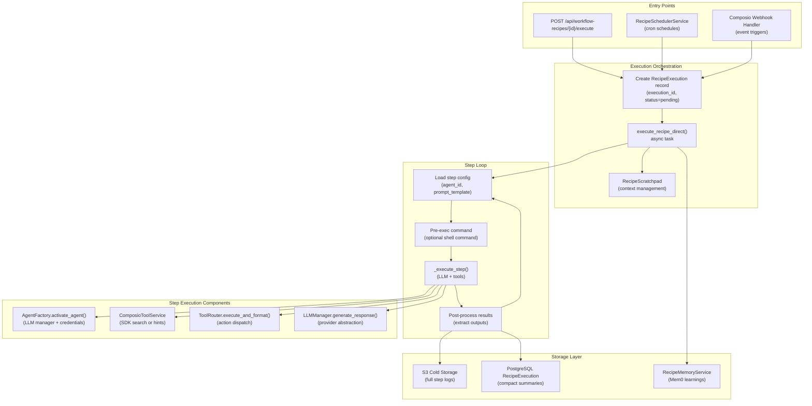
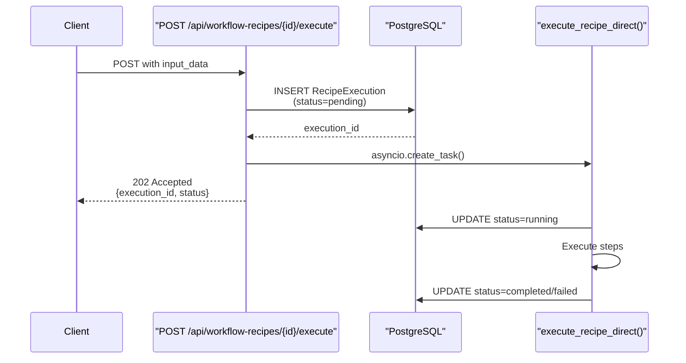
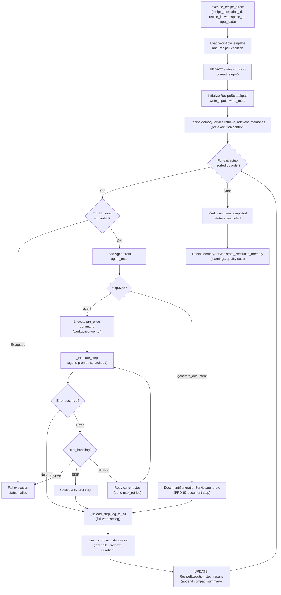
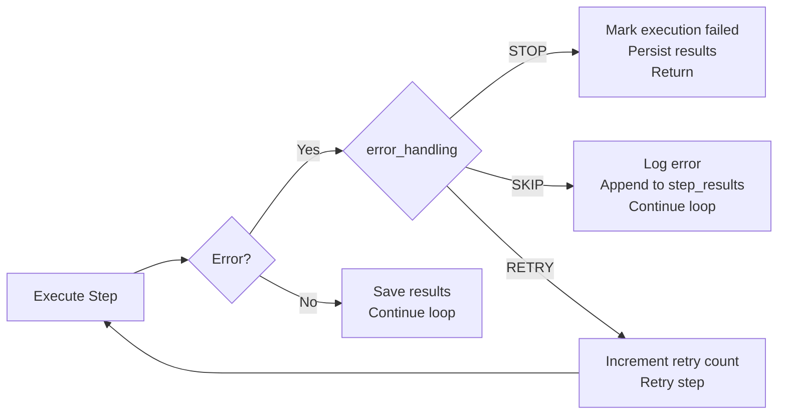
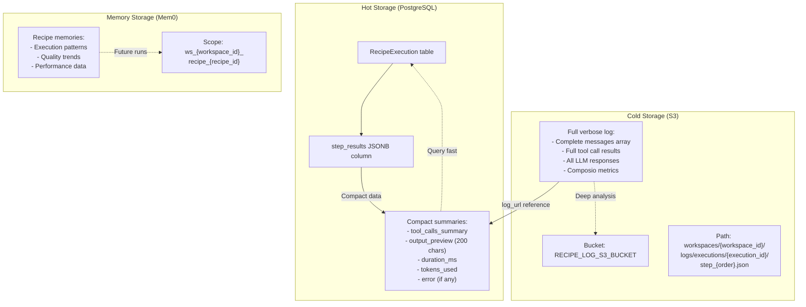
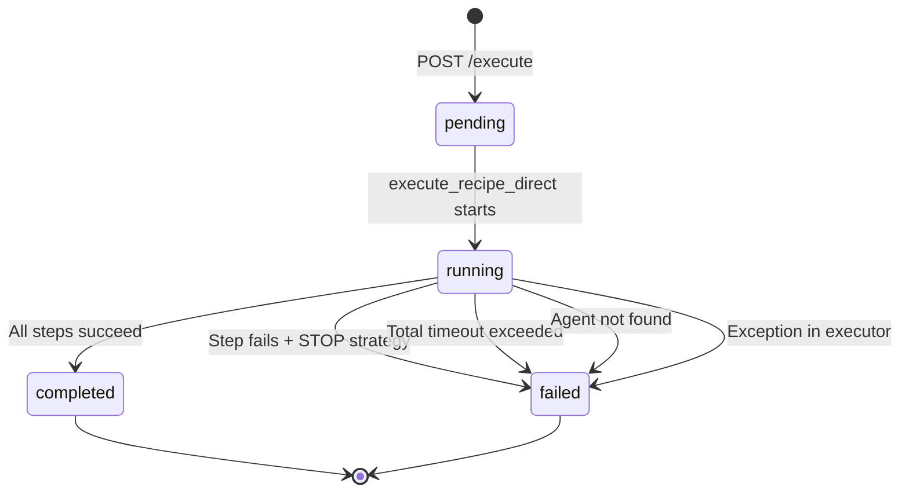

# Recipe Execution Engine

<details>
<summary>Relevant source files</summary>

The following files were used as context for generating this wiki page:

- [frontend/components/workflows/create-recipe-modal.tsx](frontend/components/workflows/create-recipe-modal.tsx)
- [frontend/components/workflows/execution-kitchen.tsx](frontend/components/workflows/execution-kitchen.tsx)
- [frontend/components/workflows/recipe-execution-config.tsx](frontend/components/workflows/recipe-execution-config.tsx)
- [frontend/components/workflows/recipe-preview-panel.tsx](frontend/components/workflows/recipe-preview-panel.tsx)
- [frontend/components/workflows/recipe-step-builder.tsx](frontend/components/workflows/recipe-step-builder.tsx)
- [frontend/components/workflows/recipes-tab.tsx](frontend/components/workflows/recipes-tab.tsx)
- [frontend/components/workflows/view-recipe-modal.tsx](frontend/components/workflows/view-recipe-modal.tsx)
- [frontend/hooks/use-recipe-form.ts](frontend/hooks/use-recipe-form.ts)
- [orchestrator/alembic/versions/20260202_add_workspace_id_to_skills_patterns_models.py](orchestrator/alembic/versions/20260202_add_workspace_id_to_skills_patterns_models.py)
- [orchestrator/api/recipe_executor.py](orchestrator/api/recipe_executor.py)
- [orchestrator/api/workflow_recipes.py](orchestrator/api/workflow_recipes.py)
- [orchestrator/core/models/core.py](orchestrator/core/models/core.py)
- [orchestrator/core/services/recipe_memory_service.py](orchestrator/core/services/recipe_memory_service.py)
- [orchestrator/core/services/workspace_manager.py](orchestrator/core/services/workspace_manager.py)

</details>


## Purpose and Scope

The Recipe Execution Engine implements step-by-step workflow automation for the Starter Plan. It executes recipe steps sequentially, activating the assigned agent for each step and providing tool access via Composio integration. This page documents the internal architecture of `execute_recipe_direct` and the step execution loop.

For information about creating and configuring recipes, see [Creating Recipes](#4.1). For memory integration and learning capabilities, see [Recipe Memory & Learning](#4.5) and [Recipe Scratchpad](#4.6). For scheduling and trigger configuration, see [Scheduling & Triggers](#4.4).

**Sources:** [orchestrator/api/recipe_executor.py:1-20]()

---

## Architecture Overview

The Recipe Execution Engine follows a component-based architecture that reuses the same code paths as the chatbot system (PRD-50 alignment). Each recipe execution is an asynchronous task that progresses through steps, activating agents and executing tools based on the recipe definition.



**Sources:** [orchestrator/api/recipe_executor.py:572-1009](), [orchestrator/api/workflow_recipes.py:812-900]()

---

## Execution Entry Points

Recipe executions can be triggered through three mechanisms:

### Manual Execution (API)

The primary entry point is `POST /api/workflow-recipes/{recipe_id}/execute`, which creates a `RecipeExecution` record with status `pending`, generates a unique `execution_id` (e.g., `exec-abc123def456`), and launches `execute_recipe_direct()` as an async background task.



**Sources:** [orchestrator/api/workflow_recipes.py:812-900]()

### Scheduled Execution (Cron)

Recipes with `schedule_config.type = "cron"` are registered with the `RecipeSchedulerService`, which uses APScheduler to execute recipes at specified intervals. The scheduler calls the same execution endpoint internally.

**Sources:** [orchestrator/api/workflow_recipes.py:34-48](), [orchestrator/api/workflow_recipes.py:495]()

### Event-Driven Execution (Composio Webhooks)

Recipes with `schedule_config.type = "trigger"` register webhook subscriptions via Composio API. When the external event occurs (e.g., new JIRA issue, GitHub PR), Composio POSTs to `/api/composio/webhook`, which looks up the associated recipe and triggers execution with event data as `input_data`.

**Sources:** [orchestrator/api/workflow_recipes.py:50-127]()

---

## Main Execution Loop

The `execute_recipe_direct()` function implements the core execution logic. It operates entirely within an async context and uses a fresh database session for thread safety.

### Execution Flow



**Sources:** [orchestrator/api/recipe_executor.py:572-1009]()

### Key Implementation Details

**Database Session Management:** Each execution creates its own `SessionLocal()` instance to avoid shared state issues in async contexts. If a `db_url` is provided, a fresh engine is created for complete isolation.

**Timeout Enforcement:** Both per-step and total execution timeouts are enforced. Per-step timeout is checked in the LLM generate loop (via the agent's LLM manager), while total timeout is checked at the start of each step iteration.

**Agent Validation:** Before execution starts, all `agent_id` references in steps are validated against the workspace's agent table. Missing agents cause immediate failure with a clear error message.

**Scratchpad Initialization:** The `RecipeScratchpad` is initialized with the recipe's `input_data` and metadata (recipe_id, total steps), providing 80-90% token savings over the previous verbose text-dump approach.

**Sources:** [orchestrator/api/recipe_executor.py:572-649](), [orchestrator/api/recipe_executor.py:667-685]()

---

## Step Execution

The `_execute_step()` function executes a single recipe step using the chatbot's exact component path (PRD-50 alignment). This ensures consistent behavior between chat interactions and recipe executions.

### Step Execution Sequence

```mermaid
sequenceDiagram
    participant Loop as "execute_recipe_direct loop"
    participant Step as "_execute_step()"
    participant Factory as "AgentFactory"
    participant ToolSvc as "ComposioToolService"
    participant LLM as "LLMManager"
    participant Router as "ToolRouter"
    participant Scratchpad as "RecipeScratchpad"
    
    Loop->>Step: execute(agent, prompt, scratchpad)
    
    Step->>Factory: activate_agent(agent_id)
    Factory-->>Step: agent_runtime (LLM manager)
    
    Step->>Step: _build_system_prompt(agent)<br/>(persona, plugins/skills)
    Step->>Step: Build messages array
    
    Step->>ToolSvc: get_tools_for_step<br/>(agent_id, task_prompt)
    ToolSvc->>ToolSvc: SDK semantic search
    alt SDK returns tools
        ToolSvc-->>Step: {tools, action_set, strategy="sdk"}
        Step->>Step: Inject composio_scope_message
    else SDK returns empty
        ToolSvc-->>Step: {tools=[], strategy="hint_fallback"}
        Step->>ToolSvc: build_hints(recipe_mode=True)
        ToolSvc-->>Step: {hint_lines, matched_actions}
        Step->>Step: Append hints to messages
    end
    
    Step->>Scratchpad: format_context_for_step(order)
    Scratchpad-->>Step: Previous step outputs
    Step->>Step: Append scratchpad context to messages
    
    loop Tool calling loop (max 10 iterations)
        Step->>LLM: generate_response(messages, tools)
        LLM-->>Step: {content, tool_calls}
        
        alt Has tool_calls
            Step->>Step: Append assistant message
            loop For each tool_call
                alt Composio direct action
                    Step->>ToolSvc: execute_action(action_name, params)
                    ToolSvc-->>Step: execution result
                else Platform/workspace tool
                    Step->>Router: execute_and_format(tool_name, args)
                    Router-->>Step: formatted result
                end
                Step->>Step: Append tool result to messages
            end
        else No tool_calls
            Step->>Step: Break loop (LLM done)
        end
    end
    
    Step->>Scratchpad: write_step_results(tool_calls, output)
    Step-->>Loop: {status, result, execution_metadata}
```

**Sources:** [orchestrator/api/recipe_executor.py:45-376]()

### System Prompt Construction

Each step builds a system prompt from multiple sources:

1. **Agent Identity:** Name, ID, type, description
2. **Persona:** Custom persona or global persona (PRD-42)
3. **Plugins:** Tier 1 summary + Tier 2 content (if assigned)
4. **Skills:** Core skill content (if no plugins assigned)
5. **Recipe Step Scope:** Explicit instruction to focus only on the current step's task

This scope instruction prevents agents from performing tasks that belong to other steps (e.g., an analysis agent creating PRs or sending notifications).

**Sources:** [orchestrator/api/recipe_executor.py:395-472](), [orchestrator/api/recipe_executor.py:99-108]()

---

## Tool Resolution Strategies

The Recipe Execution Engine implements a two-tier tool resolution strategy to balance semantic accuracy with fallback reliability.

### Tier 1: SDK Semantic Search

The primary strategy uses `ComposioToolService.get_tools_for_step()`, which calls Composio's SDK semantic search to find relevant actions based on the task prompt. If successful, each action is returned as an individual OpenAI function-calling tool definition.

```python
# Example: SDK search returns per-action tools
{
    "tools": [
        {
            "type": "function",
            "function": {
                "name": "JIRA_CREATE_ISSUE",
                "description": "Create a new JIRA issue...",
                "parameters": {...}
            }
        },
        {
            "type": "function",
            "function": {
                "name": "JIRA_ADD_COMMENT",
                "description": "Add a comment to a JIRA issue...",
                "parameters": {...}
            }
        }
    ],
    "strategy": "sdk",
    "action_set": ["JIRA_CREATE_ISSUE", "JIRA_ADD_COMMENT"],
    "app_names": ["jira"],
    "search_ms": 145
}
```

When SDK search succeeds, the generic `composio_execute` fallback tool is **stripped** from the tool list, forcing the LLM to use the specific per-action tools. Platform tools (workspace, knowledge, etc.) are retained for context gathering.

**Sources:** [orchestrator/api/recipe_executor.py:110-151](), [orchestrator/api/recipe_executor.py:193-212]()

### Tier 2: Hint-Based Fallback

If SDK search returns empty (e.g., Composio API timeout, no matching actions), the system falls back to the hint service, which provides action suggestions as text hints appended to the system prompt. The LLM then uses the generic `composio_execute` tool with action names from the hints.

```python
# Example: Hint fallback
hint_lines = [
    "# Available Composio Actions for JIRA",
    "",
    "## JIRA_CREATE_ISSUE",
    "Create a new JIRA issue",
    "Required params: project, summary, issuetype",
    "",
    "## JIRA_ADD_COMMENT",
    "Add a comment to a JIRA issue",
    "Required params: issue_id, comment",
    ...
]
```

The hint service filters actions based on agent app assignments and uses token-based truncation to stay within context limits.

**Sources:** [orchestrator/api/recipe_executor.py:132-150]()

### Direct Action Execution

When the LLM calls a tool, the execution path depends on whether it's a Composio action or a platform tool:

| Tool Type | Detection | Executor |
|-----------|-----------|----------|
| **Composio Direct** | `tool_name in action_set` or `tool_name.startswith(f"{app}_")` | `ComposioToolService.execute_action()` |
| **Platform/Workspace** | `workspace_*`, `platform_*`, `rag_*` | `ToolRouter.execute_and_format()` |
| **Scratchpad** | `scratchpad_write` | Inline handler (no router) |

Composio direct execution bypasses the tool router entirely, calling the Composio SDK's `execute_action()` method with the entity ID from the initial tool search.

**Deduplication:** The execution loop maintains a cache `{action_name}|{args_hash} → result` to prevent redundant API calls when the LLM repeatedly calls the same action with the same arguments.

**Sources:** [orchestrator/api/recipe_executor.py:269-325]()

---

## Error Handling Strategies

Each recipe step can configure its error handling strategy via the `error_handling` field in the step definition. The strategy determines what happens when a step fails (non-zero exit code, exception, or LLM error).

### Strategy Comparison

| Strategy | Behavior | Use Case |
|----------|----------|----------|
| **STOP** | Abort execution immediately, mark as `failed` | Critical steps where failure invalidates the entire workflow |
| **SKIP** | Log error, continue to next step | Optional steps (e.g., posting to Slack) |
| **RETRY** | Re-execute step up to `max_retries` times | Transient failures (API rate limits, network errors) |



**Sources:** [orchestrator/api/recipe_executor.py:860-891]()

### Retry Logic

The retry mechanism tracks the number of attempts in `step_result["retries"]` and compares against `step.get("max_retries", 1)`. If retries are exhausted, the step fails and the error handling strategy determines whether to stop or skip.

Pre-exec command failures are also subject to error handling. If a pre-exec command exits with a non-zero code and `error_handling == "stop"`, execution terminates immediately.

**Sources:** [orchestrator/api/recipe_executor.py:860-891]()

---

## Pre-Execution Commands

Recipe steps can optionally define a `pre_exec` command that runs **before** the LLM loop. This deterministic shell command executes in the workspace-worker's sandboxed environment and appends its output to the step prompt.

### Use Cases

| Use Case | Example Command | Purpose |
|----------|----------------|---------|
| **Test Execution** | `pytest tests/ -v` | Run tests, append results to prompt for LLM analysis |
| **Build Verification** | `npm run build` | Verify build succeeds before deployment step |
| **Data Collection** | `git log --oneline -n 20` | Gather context for changelog generation |
| **Environment Setup** | `npm install && npm run compile` | Prepare workspace before code analysis |

### Execution Flow

```mermaid
sequenceDiagram
    participant Loop as "Step Loop"
    participant WSClient as "WorkspaceClient"
    participant Worker as "workspace-worker"
    participant LLM as "_execute_step()"
    
    Loop->>Loop: Check if pre_exec configured
    alt pre_exec exists
        Loop->>WSClient: exec_command(pre_exec, cwd, timeout)
        WSClient->>Worker: POST /execute with command
        Worker->>Worker: Validate command (whitelist)
        Worker->>Worker: Execute in sandbox
        Worker-->>WSClient: {stdout, stderr, exit_code, duration_ms}
        WSClient-->>Loop: execution result
        
        Loop->>Loop: Append to step_result.tool_calls<br/>(pre_exec metadata)
        Loop->>Loop: Format pre-exec block:<br/>command, exit_code, stdout/stderr
        Loop->>Loop: Append block to clean_step_prompt
        
        alt exit_code != 0 AND error_handling == stop
            Loop->>Loop: Fail execution
        else
            Loop->>LLM: Execute step with augmented prompt
        end
    else no pre_exec
        Loop->>LLM: Execute step normally
    end
```

**Output Truncation:** The stdout is truncated intelligently to preserve both the head (setup context) and tail (final results) when output exceeds 10,000 characters. This is critical for test output where results appear at the end.

```python
# Example: pytest output truncation
head = pre_stdout[:3000]
tail = pre_stdout[-6000:]
stdout_text = head + "\n\n... (truncated middle) ...\n\n" + tail
```

**Sources:** [orchestrator/api/recipe_executor.py:810-891]()

---

## Storage Architecture

The Recipe Execution Engine uses a two-tier storage strategy to balance cost and query performance.

### Storage Tiers



**Sources:** [orchestrator/api/recipe_executor.py:479-565]()

### Compact Summary Format

Each step's compact summary includes only essential metadata:

```json
{
    "step_id": "step-1",
    "order": 1,
    "agent_id": 42,
    "agent_name": "Code Analyzer",
    "status": "completed",
    "duration_ms": 3456,
    "tokens_used": 1234,
    "tool_calls_summary": [
        "JIRA_GET_ISSUE (success)",
        "workspace_read_file (success)",
        "JIRA_ADD_COMMENT (success)"
    ],
    "output_preview": "Analysis complete. Found 3 issues in auth.py...",
    "log_url": "s3://automatos-recipe-logs/workspaces/.../step_1.json",
    "started_at": "2024-01-15T10:30:45Z",
    "completed_at": "2024-01-15T10:30:49Z"
}
```

This compact format enables fast dashboard queries (recipe stats, recent executions) without loading full logs.

**Sources:** [orchestrator/api/recipe_executor.py:524-565]()

### S3 Upload Process

The `_upload_step_log_to_s3()` function uploads the full verbose log after each step completes:

```python
s3_key = f"workspaces/{workspace_id}/logs/executions/{execution_id}/step_{step_order}.json"

log_data = {
    "step_id": step_result["step_id"],
    "order": step_result["order"],
    "status": step_result["status"],
    "started_at": step_result["started_at"],
    "completed_at": step_result["completed_at"],
    "messages": execution["messages"],  # Full LLM conversation
    "tool_calls": execution["tool_calls"],  # Complete tool results
    "composio_metrics": execution.get("composio_metrics", {}),
    "tokens_used": execution["tokens_used"]
}
```

The S3 URL is stored in the compact summary's `log_url` field for on-demand retrieval.

**Sources:** [orchestrator/api/recipe_executor.py:479-521]()

---

## Integration Points

The Recipe Execution Engine integrates with multiple services to provide complete workflow automation.

### Component Integration Map

```mermaid
graph TB
    RecipeExec["execute_recipe_direct"]
    
    subgraph "Agent System"
        AgentFactory["AgentFactory<br/>activate_agent()"]
        LLMManager["LLMManager<br/>6-level credential fallback"]
        PluginSvc["PluginContextService<br/>Tier 1+2 context"]
        SkillLoader["SkillLoader<br/>load_skill_core()"]
    end
    
    subgraph "Tool System"
        ComposioSvc["ComposioToolService<br/>get_tools_for_step()<br/>execute_action()"]
        ToolRouter["ToolRouter<br/>execute_and_format()"]
        HintSvc["ComposioHintService<br/>build_hints()"]
    end
    
    subgraph "Context Management"
        Scratchpad["RecipeScratchpad<br/>format_context_for_step()<br/>write_step_results()"]
        MemSvc["RecipeMemoryService<br/>retrieve_relevant_memories()<br/>store_execution_memory()"]
    end
    
    subgraph "Workspace"
        WSClient["WorkspaceClient<br/>exec_command()"]
        WSWorker["workspace-worker<br/>(sandboxed execution)"]
    end
    
    subgraph "Document Generation"
        DocGen["DocumentGenerationService<br/>generate() (PRD-63)"]
        Gotenberg["Gotenberg API<br/>(PDF/DOCX rendering)"]
    end
    
    RecipeExec -->|Per step| AgentFactory
    RecipeExec -->|Pre-execution| MemSvc
    RecipeExec -->|Per step| Scratchpad
    RecipeExec -->|Pre-exec commands| WSClient
    RecipeExec -->|Document steps| DocGen
    
    AgentFactory --> LLMManager
    AgentFactory --> PluginSvc
    AgentFactory --> SkillLoader
    
    RecipeExec -->|Tool resolution| ComposioSvc
    RecipeExec -->|Tool resolution fallback| HintSvc
    RecipeExec -->|Platform tools| ToolRouter
    
    ComposioSvc --> HintSvc
    
    WSClient --> WSWorker
    DocGen --> Gotenberg
```



**Sources:** [orchestrator/api/recipe_executor.py:45-376](), [orchestrator/api/recipe_executor.py:572-1009]()

### RecipeScratchpad

The scratchpad provides token-efficient context management. At the start of each step, `format_context_for_step(step_order)` returns a compact markdown summary of previous step outputs. After execution, `write_step_results()` stores the new step's outputs and agent exports.

**Token Savings:** 80-90% reduction compared to the previous approach of dumping raw text outputs.

**Sources:** [orchestrator/api/recipe_executor.py:179-183](), [orchestrator/api/recipe_executor.py:644-648]()

### RecipeMemoryService

The memory service integrates at two points:

1. **Pre-execution:** `retrieve_relevant_memories()` loads past execution experiences from Mem0, which are injected into the first step's context.
2. **Post-execution:** `store_execution_memory()` saves learnings, quality trends, and performance data scoped to the recipe and individual agents.

Memory scopes follow the pattern: `ws_{workspace_id}_recipe_{recipe_id}` for recipe-level memories, and `ws_{workspace_id}_recipe_{recipe_id}_agent_{agent_id}` for per-agent memories.

**Sources:** [orchestrator/api/recipe_executor.py:650-665](), [orchestrator/core/services/recipe_memory_service.py:34-146]()

### AgentFactory

Each step calls `AgentFactory.activate_agent(agent_id)` to instantiate the agent's LLM manager with the correct model configuration and credentials. The factory returns an `agent_runtime` object with:
- `llm_manager`: LLM provider interface
- `tracking_ctx`: Execution context for token/cost tracking

The factory handles plugin loading, skill loading, and persona injection, all of which feed into the system prompt construction.

**Sources:** [orchestrator/api/recipe_executor.py:85-93](), [orchestrator/api/recipe_executor.py:395-472]()

### WorkspaceClient

Pre-exec commands are executed via `WorkspaceClient.exec_command()`, which sends an HTTP POST to the workspace-worker service. The worker validates the command against a whitelist, executes it in a sandboxed environment, and returns stdout/stderr with the exit code.

**Security:** Commands are validated against `ALLOWED_COMMANDS` and `BLOCKED_PATTERNS` to prevent arbitrary code execution.

**Sources:** [orchestrator/api/recipe_executor.py:819-825]()

---

## Performance Characteristics

### Execution Metrics

| Metric | Typical Value | Notes |
|--------|---------------|-------|
| **Step Activation** | 50-150ms | AgentFactory + tool resolution |
| **LLM Generation** | 2-8s per iteration | Depends on model, context size |
| **Tool Execution** | 100ms-10s | Composio API latency, workspace commands |
| **S3 Upload** | 50-200ms per step | Gzipped JSON upload |
| **DB Update** | 10-50ms | Compact summary persistence |

### Concurrency Model

Recipe executions are **fully asynchronous** and independent:
- Multiple recipes can execute concurrently within the same workspace
- Each execution has its own database session and scratchpad instance
- No shared state between executions (except database records)

**Parallelization:** The `execution_config.mode = "parallel"` option is not yet implemented in `execute_recipe_direct`. All steps currently execute sequentially.

**Sources:** [orchestrator/api/recipe_executor.py:572-597]()

---

## Error States and Recovery

### Execution States



### Recovery Mechanisms

| Error Type | Recovery Action |
|------------|-----------------|
| **Agent not found** | Pre-validation catches this before execution starts |
| **LLM API failure** | Provider fallback via LLMManager (primary → secondary model) |
| **Tool execution error** | SKIP/RETRY strategy configurable per step |
| **Timeout exceeded** | Execution terminates with partial results saved |
| **Database error** | Transaction rollback, execution marked failed |

The `step_results` array in the `RecipeExecution` record preserves all completed steps even when execution fails, enabling partial progress inspection and manual recovery.

**Sources:** [orchestrator/api/recipe_executor.py:630-685](), [orchestrator/api/recipe_executor.py:860-891]()

---