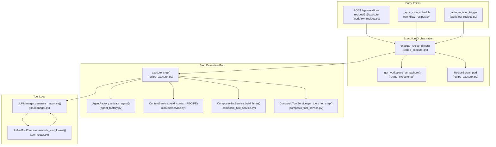
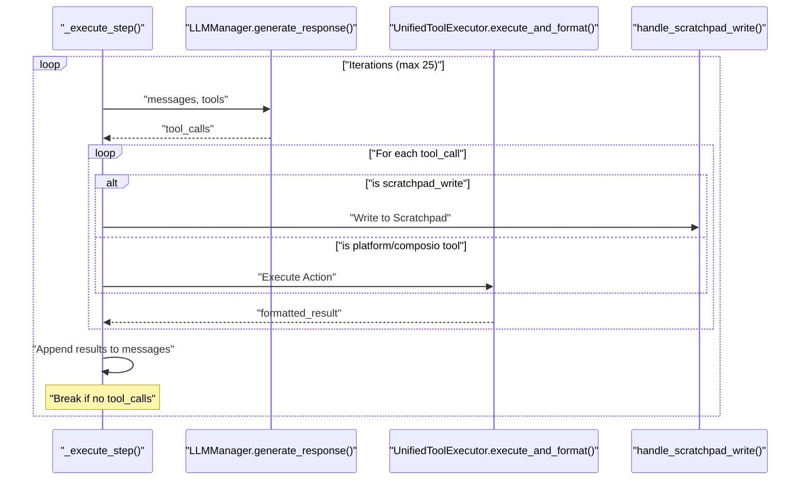

# Recipe Execution Engine

Relevant source files

The following files were used as context for generating this wiki page:

- [frontend/components/marketplace/marketplace-agents-tab.tsx](frontend/components/marketplace/marketplace-agents-tab.tsx)
- [frontend/components/marketplace/marketplace-homepage.tsx](frontend/components/marketplace/marketplace-homepage.tsx)
- [frontend/components/marketplace/marketplace-tools-tab.tsx](frontend/components/marketplace/marketplace-tools-tab.tsx)
- [frontend/components/shared/stats-bar.tsx](frontend/components/shared/stats-bar.tsx)
- [frontend/components/tools/tools-dashboard.tsx](frontend/components/tools/tools-dashboard.tsx)
- [frontend/components/workflows/active-workflows-panel.tsx](frontend/components/workflows/active-workflows-panel.tsx)
- [frontend/components/workflows/execution-kitchen.tsx](frontend/components/workflows/execution-kitchen.tsx)
- [frontend/components/workflows/workflow-management.tsx](frontend/components/workflows/workflow-management.tsx)
- [frontend/lib/tooltips.json](frontend/lib/tooltips.json)
- [orchestrator/api/recipe_executor.py](orchestrator/api/recipe_executor.py)
- [orchestrator/api/workflow_recipes.py](orchestrator/api/workflow_recipes.py)
- [orchestrator/modules/learning/tests/conftest.py](orchestrator/modules/learning/tests/conftest.py)
- [orchestrator/modules/learning/tests/test_learning_system.py](orchestrator/modules/learning/tests/test_learning_system.py)

## Purpose and Scope

The Recipe Execution Engine implements step-by-step workflow automation for the Starter Plan. It executes recipe steps sequentially, activating the assigned agent for each step and providing tool access via Composio integration. This page documents the internal architecture of `execute_recipe_direct`, the workspace semaphore system, the step loop, and tool execution logic.

The engine is designed to bypass the complex 9-stage pipeline used for advanced missions, instead using the same component path as the chatbot (PRD-50 alignment) to ensure consistency and token efficiency.

**Sources:** [orchestrator/api/recipe_executor.py:1-19](), [orchestrator/api/recipe_executor.py:5-7]()

---

## Architecture Overview

The Recipe Execution Engine follows a component-based architecture that reuses core services like `ContextService`, `AgentFactory`, and `ComposioToolService`.

### System Component Map
The following diagram maps the high-level execution flow to specific code entities and functions.

**Sources:** [orchestrator/api/recipe_executor.py:63-79](), [orchestrator/api/recipe_executor.py:118-149](), [orchestrator/api/workflow_recipes.py:34-48](), [orchestrator/api/workflow_recipes.py:50-79]()

---

## Workspace Semaphores

To prevent resource exhaustion, the engine implements per-workspace execution limits using `asyncio.Semaphore`.

*   **Concurrency Guard:** The global `_workspace_semaphores` dictionary stores semaphores keyed by `workspace_id`. [orchestrator/api/recipe_executor.py:47-48]()
*   **Limit Enforcement:** By default, a workspace is limited to 3 concurrent recipe executions. This is managed via `_get_workspace_semaphore(workspace_id)`. [orchestrator/api/recipe_executor.py:50-59]()
*   **Process Safety:** While the dictionary is process-global, it is safe within the single-threaded `asyncio` event loop. [orchestrator/api/recipe_executor.py:41-46]()

---

## Main Execution Loop: `execute_recipe_direct`

The `execute_recipe_direct` function is the primary entry point for running a recipe. It handles the lifecycle of a `RecipeExecution` record.

### Execution Sequence
1.  **Initialization:** Fetches the `WorkflowRecipe` and `RecipeExecution` from the database. [orchestrator/api/recipe_executor.py:572-610]()
2.  **Semaphore Acquisition:** Waits for a slot in the workspace's concurrency limit. [orchestrator/api/recipe_executor.py:612-622]()
3.  **Scratchpad Setup:** Initializes a `RecipeScratchpad` to manage data flow between steps, replacing verbose text dumps and saving 80-90% in tokens. [orchestrator/api/recipe_executor.py:14-16](), [orchestrator/api/recipe_executor.py:644-648]()
4.  **Memory Retrieval:** Uses `RecipeMemoryService` to pull relevant Mem0 memories before the first step. [orchestrator/api/recipe_executor.py:650-665]()
5.  **Step Iteration:** Loops through recipe steps sorted by `order`. [orchestrator/api/recipe_executor.py:687-695]()
6.  **Step Execution:** Calls `_execute_step` for each agent-based task. [orchestrator/api/recipe_executor.py:832-848]()
7.  **Logging & Cleanup:** Full logs are uploaded to S3, while compact summaries are stored in the database. [orchestrator/api/recipe_executor.py:17-18](), [orchestrator/api/recipe_executor.py:905-925]()

**Sources:** [orchestrator/api/recipe_executor.py:572-1009](), [orchestrator/api/recipe_executor.py:14-19]()

---

## Step Execution Logic: `_execute_step`

Each step is executed using a flow that mimics the standard chatbot path but adds recipe-specific context.

### Agent Activation
The engine uses `AgentFactory.activate_agent(agent_id)` to retrieve the agent's runtime, including its `LLMManager`. [orchestrator/api/recipe_executor.py:118-125]()

### Context Assembly
`ContextService` is called with `ContextMode.RECIPE`. It builds a system prompt including:
*   **Identity & Persona:** The agent's core definition.
*   **Recipe Step Section:** Includes the current step number, total steps, instructions, and formatted context from the scratchpad (previous outputs). [orchestrator/api/recipe_executor.py:127-149]()
*   **Scope Guard:** An explicit system instruction is appended to keep the agent focused on the specific step task and prevent it from "wandering" into other steps. [orchestrator/api/recipe_executor.py:153-162]()

### Tool Discovery and Hints
The engine employs a tiered strategy for tool resolution:
1.  **SDK Search:** `ComposioToolService.get_tools_for_step` performs a semantic search for specific actions relevant to the task. [orchestrator/api/recipe_executor.py:166-173]()
2.  **Hint Fallback:** If no specific tools are found, `ComposioHintService.build_hints` generates text-based hints to help the agent use the generic `composio_execute` tool. [orchestrator/api/recipe_executor.py:193-212]()
3.  **Scratchpad Tools:** The `scratchpad_write` and `scratchpad_read` tools are injected to allow agents to explicitly export data to subsequent steps. [orchestrator/api/recipe_executor.py:108-115](), [orchestrator/api/recipe_executor.py:215-225]()

**Sources:** [orchestrator/api/recipe_executor.py:66-101](), [orchestrator/api/recipe_executor.py:127-162](), [orchestrator/api/recipe_executor.py:166-225]()

---

## Tool Execution Loop

The engine runs a loop (up to `max_iterations`, default 25) where the LLM can call tools.

### Tool Execution Details
*   **Deduplication:** The engine maintains an `executed_tools` set to prevent redundant calls within a single step. [orchestrator/api/recipe_executor.py:273-285]()
*   **Result Formatting:** Tool outputs are formatted into strings for the LLM's next turn. [orchestrator/api/recipe_executor.py:317-325]()
*   **Iteration Limits:** Configurable via `step.max_iterations` or `agent.configuration.max_iterations`, defaulting to 25. [orchestrator/api/recipe_executor.py:94-97]()

**Sources:** [orchestrator/api/recipe_executor.py:236-376](), [orchestrator/api/recipe_executor.py:94-97]()

---

## Data Flow: Recipe Scratchpad

The `RecipeScratchpad` is the primary mechanism for inter-step data sharing.

| Function | Role |
| :--- | :--- |
| `write_inputs` | Stores initial trigger data (e.g., webhook payload). |
| `write_step_results` | Captures the final output and tool calls of a completed step. |
| `format_context_for_step` | Produces a Markdown summary of relevant previous outputs for the current agent's context. |
| `handle_scratchpad_write` | Internal tool handler for agents to save specific key-value pairs. |

**Sources:** [orchestrator/api/recipe_executor.py:108-115](), [orchestrator/api/recipe_executor.py:130-134](), [orchestrator/api/recipe_executor.py:644-648]()

---

## Quality and Learning Integration

After execution, the engine triggers evaluation and storage services:
*   **RecipeQualityService:** Performs a 5-dimensional assessment (completeness, accuracy, efficiency, reliability, cost). [orchestrator/api/recipe_executor.py:18-19]()
*   **RecipeLearningService:** Analyzes the execution to extract patterns and updates the recipe's `quality_score` with a rolling average. [orchestrator/api/recipe_executor.py:18-19]()
*   **WorkflowStageTracker:** Although primarily for complex missions, the tracker provides SSE events for real-time progress visualization in the `ExecutionKitchen` UI. [orchestrator/api/workflow_recipes.py:34-48](), [frontend/components/workflows/execution-kitchen.tsx:35-46]()

**Sources:** [orchestrator/api/recipe_executor.py:18-19](), [orchestrator/api/workflow_recipes.py:34-48](), [frontend/components/workflows/execution-kitchen.tsx:35-46]()

---