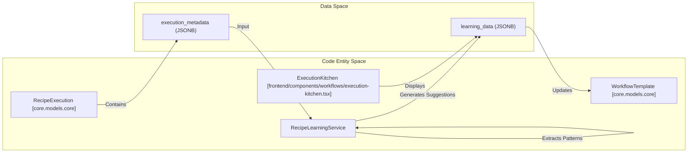

# Recipe Memory & Learning

<details>
<summary>Relevant source files</summary>

The following files were used as context for generating this wiki page:

- [docs/PRDS/55-AUTONOMOUS-ASSISTANT-PLATFORM.md](docs/PRDS/55-AUTONOMOUS-ASSISTANT-PLATFORM.md)
- [frontend/components/auth/sign-up-form.tsx](frontend/components/auth/sign-up-form.tsx)
- [frontend/components/marketplace/marketplace-agents-tab.tsx](frontend/components/marketplace/marketplace-agents-tab.tsx)
- [frontend/components/marketplace/marketplace-homepage.tsx](frontend/components/marketplace/marketplace-homepage.tsx)
- [frontend/components/marketplace/marketplace-tools-tab.tsx](frontend/components/marketplace/marketplace-tools-tab.tsx)
- [frontend/components/shared/stats-bar.tsx](frontend/components/shared/stats-bar.tsx)
- [frontend/components/tools/tools-dashboard.tsx](frontend/components/tools/tools-dashboard.tsx)
- [frontend/components/workflows/active-workflows-panel.tsx](frontend/components/workflows/active-workflows-panel.tsx)
- [frontend/components/workflows/execution-kitchen.tsx](frontend/components/workflows/execution-kitchen.tsx)
- [frontend/components/workflows/workflow-management.tsx](frontend/components/workflows/workflow-management.tsx)
- [frontend/lib/tooltips.json](frontend/lib/tooltips.json)
- [orchestrator/alembic/versions/20260215_add_heartbeat_and_channels.py](orchestrator/alembic/versions/20260215_add_heartbeat_and_channels.py)
- [orchestrator/api/channels.py](orchestrator/api/channels.py)
- [orchestrator/api/heartbeat.py](orchestrator/api/heartbeat.py)
- [orchestrator/api/recipe_executor.py](orchestrator/api/recipe_executor.py)
- [orchestrator/api/workflow_recipes.py](orchestrator/api/workflow_recipes.py)
- [orchestrator/channels/base.py](orchestrator/channels/base.py)
- [orchestrator/channels/discord_adapter.py](orchestrator/channels/discord_adapter.py)
- [orchestrator/channels/google_chat_adapter.py](orchestrator/channels/google_chat_adapter.py)
- [orchestrator/channels/line_adapter.py](orchestrator/channels/line_adapter.py)
- [orchestrator/channels/manager.py](orchestrator/channels/manager.py)
- [orchestrator/channels/slack_adapter.py](orchestrator/channels/slack_adapter.py)
- [orchestrator/consumers/chatbot/smart_memory.py](orchestrator/consumers/chatbot/smart_memory.py)
- [orchestrator/core/models/channels.py](orchestrator/core/models/channels.py)
- [orchestrator/core/services/plugin_security_scanner.py](orchestrator/core/services/plugin_security_scanner.py)
- [orchestrator/modules/agents/__init__.py](orchestrator/modules/agents/__init__.py)
- [orchestrator/modules/agents/factory/__init__.py](orchestrator/modules/agents/factory/__init__.py)
- [orchestrator/modules/learning/tests/conftest.py](orchestrator/modules/learning/tests/conftest.py)
- [orchestrator/modules/learning/tests/test_learning_system.py](orchestrator/modules/learning/tests/test_learning_system.py)
- [orchestrator/modules/memory/integrations/mem0_client.py](orchestrator/modules/memory/integrations/mem0_client.py)

</details>


This page documents the technical implementation of the recipe memory and learning systems. It covers how recipes leverage **Mem0** for long-term task continuity, how **RecipeQualityService** performs 5D assessments of execution performance, and how **RecipeLearningService** extracts patterns to generate improvement suggestions.

---

## Recipe Memory System (Mem0 Integration)

Recipes use a specialized memory path to ensure that multi-step workflows maintain context across steps and across different executions of the same recipe.

### Memory Lifecycle
The `RecipeMemoryService` (integrated within the execution flow) manages the interaction with the **Mem0** backend. Unlike standard chat memory, recipe memory is often scoped to the specific `recipe_id` to prevent "cross-talk" between different automated workflows.

1.  **Pre-Execution Retrieval**: Before a recipe starts, `execute_recipe_direct` retrieves relevant memories to inform the initial state [orchestrator/api/recipe_executor.py:18-19]().
2.  **Context Injection**: These memories are injected into the step's system prompt via the `ContextService` in `RECIPE` mode [orchestrator/api/recipe_executor.py:143-149](). The `ContextService` uses a priority system to ensure memory is included within the token budget [orchestrator/api/recipe_executor.py:9-10]().
3.  **Post-Execution Storage**: After the final step completes, the summary of the execution is stored back into Mem0 to inform future runs [orchestrator/api/recipe_executor.py:18-19]().

### Mem0 Client Implementation
The `Mem0Client` provides a robust wrapper around the Mem0 API with built-in resilience patterns.

-   **Circuit Breaker**: Prevents system degradation if the Mem0 service is slow or down. It opens after 5 consecutive failures (`_CB_FAILURE_THRESHOLD`) and cools down for 60 seconds (`_CB_COOLDOWN_SECONDS`) [orchestrator/modules/memory/integrations/mem0_client.py:21-22]().
-   **Scoping**: Memories are stored with a `user_id` that typically maps to the workspace or agent context to ensure strict multi-tenant isolation [orchestrator/modules/memory/integrations/mem0_client.py:143-154]().
-   **Request Handling**: The client handles exponential backoff for timeouts and connection errors [orchestrator/modules/memory/integrations/mem0_client.py:119-132]().

**Recipe Memory Data Flow**
```mermaid
graph TD
    subgraph "Execution Engine"
        [orchestrator/api/recipe_executor.py] --> Executor["execute_recipe_direct"]
        Executor --> Step["_execute_step"]
    end

    subgraph "Memory Services"
        RMS["RecipeMemoryService"]
        M0C["Mem0Client [orchestrator/modules/memory/integrations/mem0_client.py]"]
    end

    subgraph "External Storage"
        Mem0["Mem0 API / OpenMemory"]
    end

    Executor -->|1. Get Memories| RMS
    RMS -->|2. Search| M0C
    M0C -->|3. _request(POST)| Mem0
    Mem0 -->|4. Response JSON| M0C
    M0C -->|5. List[Dict]| RMS
    RMS -->|6. recipe_memories| Step
    Step -->|7. Final Summary| RMS
    RMS -->|8. add(messages)| M0C
```
Sources: [orchestrator/api/recipe_executor.py:18-19](), [orchestrator/modules/memory/integrations/mem0_client.py:66-100](), [orchestrator/modules/memory/integrations/mem0_client.py:143-154]()

---

## Recipe Quality Service (5D Assessment)

The `RecipeQualityService` evaluates completed executions across five distinct dimensions to provide a quantitative measure of performance.

### The 5D Assessment Model
Each execution is scored from 0.0 to 1.0 based on:

1.  **Completeness**: Percentage of steps that reached `status='completed'`.
2.  **Accuracy**: LLM-based evaluation of the `output_data` against the original `recipe.instructions`.
3.  **Efficiency**: Actual duration vs. historical duration for those steps.
4.  **Reliability**: Number of retries and tool-loop iterations required to finish.
5.  **Cost**: Token usage relative to the workspace budget.

### Quality Grade Mapping
The service maps the aggregate score to a letter grade displayed in the UI:
- **A**: Score $\ge$ 0.9
- **B**: Score $\ge$ 0.8
- **C**: Score $\ge$ 0.7
- **D**: Score $\ge$ 0.6
- **F**: Score $<$ 0.6

Sources: [orchestrator/api/workflow_recipes.py:27-28](), [frontend/components/workflows/execution-kitchen.tsx:37-43]()

---

## Recipe Learning Service

The `RecipeLearningService` performs post-hoc analysis on `RecipeExecution` records to identify optimization opportunities and extract successful interaction patterns.

### Pattern Extraction
The service analyzes the execution logs, including the `step_results` and `execution_metadata`. It identifies:
- **Success Patterns**: Combinations of tools and prompts that consistently lead to successful steps.
- **Failure Patterns**: Common error messages or "infinite loops" in tool execution.
- **Performance Bottlenecks**: Steps that consume disproportionate time or tokens.

### Learning Data Storage
Results are persisted in the `workflow_recipes.learning_data` column [orchestrator/api/workflow_recipes.py:25-28]().

| Key | Description |
| :--- | :--- |
| `latest_suggestions` | Actionable prompt or config changes (e.g., "Increase max_iterations"). |
| `latest_patterns` | Observed behaviors across multiple runs. |
| `analysis_count` | Total number of executions analyzed for this recipe. |

**Learning Analysis Logic**

Sources: [orchestrator/api/workflow_recipes.py:25-28](), [frontend/components/workflows/execution-kitchen.tsx:39-43]()

---

## Workflow Execution Stages

Recipe execution is tracked through a structured lifecycle. The `ExecutionKitchen` component visualizes these transitions in real-time [frontend/components/workflows/execution-kitchen.tsx:74-84]().

### Stage Transitions
1. **PLAN**: Task decomposition and agent selection.
2. **PREPARE**: Context engineering and prompt optimization.
3. **EXECUTE**: Agent execution and tool coordination [orchestrator/api/recipe_executor.py:66-79]().
4. **EVALUATE**: Result aggregation and quality assessment.
5. **LEARN**: Learning update and memory storage.

**UI to Code Association**
| UI Component | Code Entity | Purpose |
| :--- | :--- | :--- |
| **TheaterStageProgress** | `STAGE_NAMES` | Displays current phase (Decompose to Response) [frontend/components/workflows/execution-kitchen.tsx:74-84](). |
| **TheaterSelfLearningPanel**| `QualityData` | Visualizes the result of the `EVALUATE` phase [frontend/components/workflows/execution-kitchen.tsx:41](). |
| **Learning Insights** | `learning_data` | Surfaced suggestions from the `LEARN` phase [orchestrator/api/workflow_recipes.py:25-28](). |

Sources: [frontend/components/workflows/execution-kitchen.tsx:36-46](), [orchestrator/api/recipe_executor.py:127-149]()

---

## API Reference: Learning & Quality

### Trigger Assessment
`POST /api/workflow-recipes/{recipe_id}/assess-quality`
Triggers the quality assessment for a specific execution.

### Trigger Learning
`POST /api/workflow-recipes/{recipe_id}/learn`
Triggers the learning service to analyze recent executions and update suggestions.

### Get Suggestions
`GET /api/workflow-recipes/{recipe_id}/suggestions`
Returns the aggregated insights from the `learning_data` field.

Sources: [orchestrator/api/workflow_recipes.py:22-28]()

---