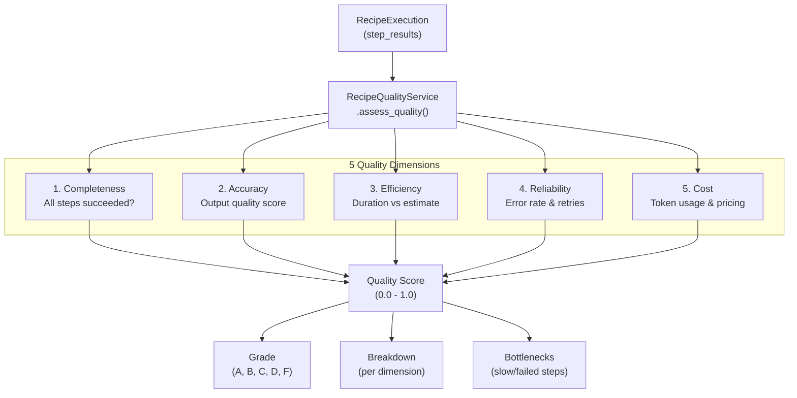
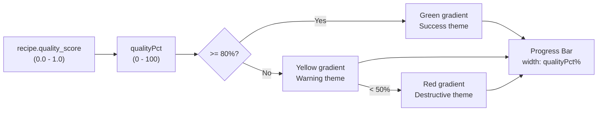
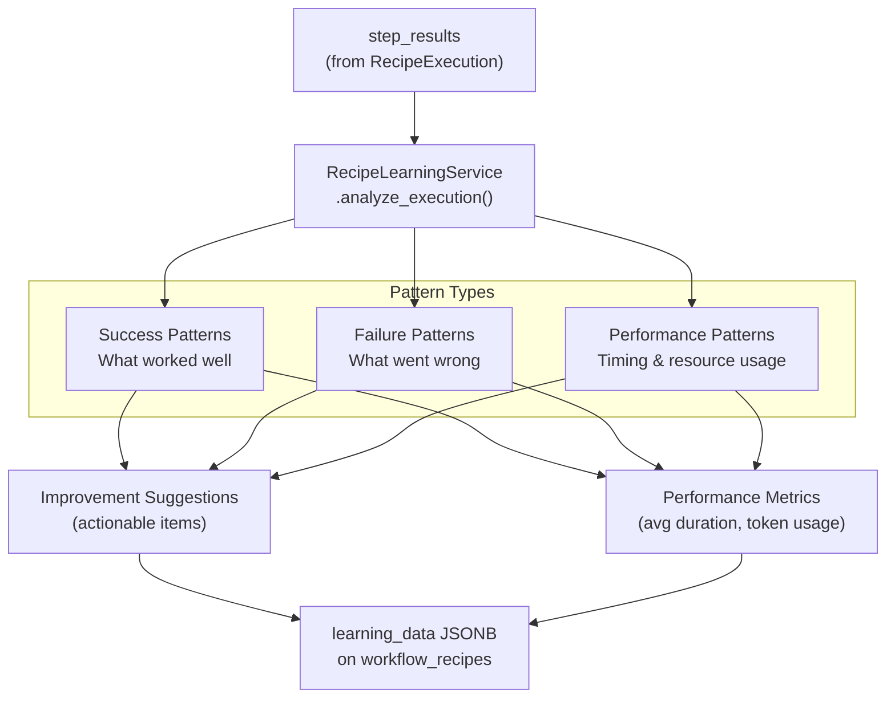
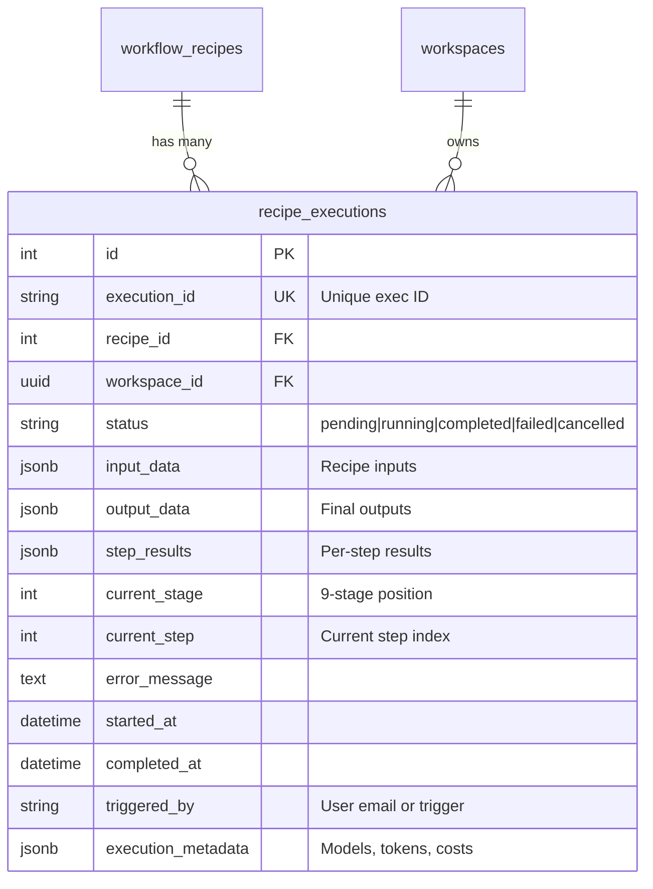
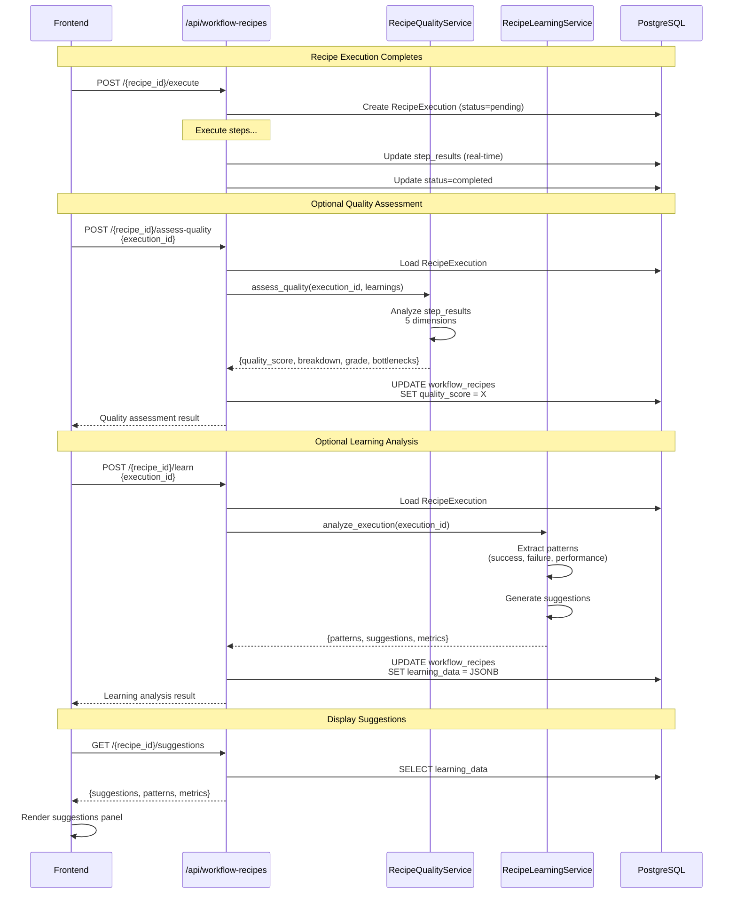

# Quality Assessment & Learning

<details>
<summary>Relevant source files</summary>

The following files were used as context for generating this wiki page:

- [frontend/components/workflows/create-recipe-modal.tsx](frontend/components/workflows/create-recipe-modal.tsx)
- [frontend/components/workflows/execution-kitchen.tsx](frontend/components/workflows/execution-kitchen.tsx)
- [frontend/components/workflows/recipe-execution-config.tsx](frontend/components/workflows/recipe-execution-config.tsx)
- [frontend/components/workflows/recipe-preview-panel.tsx](frontend/components/workflows/recipe-preview-panel.tsx)
- [frontend/components/workflows/recipe-step-builder.tsx](frontend/components/workflows/recipe-step-builder.tsx)
- [frontend/components/workflows/recipes-tab.tsx](frontend/components/workflows/recipes-tab.tsx)
- [frontend/components/workflows/view-recipe-modal.tsx](frontend/components/workflows/view-recipe-modal.tsx)
- [frontend/hooks/use-recipe-form.ts](frontend/hooks/use-recipe-form.ts)
- [orchestrator/alembic/versions/20260202_add_workspace_id_to_skills_patterns_models.py](orchestrator/alembic/versions/20260202_add_workspace_id_to_skills_patterns_models.py)
- [orchestrator/api/recipe_executor.py](orchestrator/api/recipe_executor.py)
- [orchestrator/api/workflow_recipes.py](orchestrator/api/workflow_recipes.py)
- [orchestrator/core/models/core.py](orchestrator/core/models/core.py)
- [orchestrator/core/services/recipe_memory_service.py](orchestrator/core/services/recipe_memory_service.py)
- [orchestrator/core/services/workspace_manager.py](orchestrator/core/services/workspace_manager.py)

</details>


This page documents the quality assessment and learning system for workflow recipes. After a recipe execution completes, two optional analysis stages can be triggered: **quality assessment** (Stage 7) evaluates execution performance across 5 dimensions, and **learning analysis** (Stage 6) extracts patterns and generates improvement suggestions. Results are stored in the recipe's `learning_data` field and used to continuously improve recipe performance.

For information about recipe execution itself, see [Recipe Execution](#4.2). For creating and configuring recipes, see [Creating Recipes](#4.1).

---

## System Overview

The quality assessment and learning system operates as post-execution analysis stages that provide feedback for recipe improvement. The system consists of:

- **RecipeQualityService**: Evaluates execution quality across 5 dimensions
- **RecipeLearningService**: Extracts patterns and generates improvement suggestions
- **Learning Data Storage**: JSONB field on `workflow_recipes` table storing historical analysis
- **Suggestions API**: Retrieves accumulated learning insights for display

Both services analyze the `step_results` field from a completed `RecipeExecution` record to derive metrics and insights.

Sources: [orchestrator/api/workflow_recipes.py:709-828]()

---

## Quality Assessment System

### Assessment Trigger

Quality assessment is triggered via API after a recipe execution completes:

```
POST /api/workflow-recipes/{recipe_id}/assess-quality
Body: {
  "execution_id": "exec-abc123",
  "learnings": { ... }  // Optional: from /learn endpoint for reliability scoring
}
```

The endpoint validates:
1. Recipe exists in workspace
2. Execution belongs to this recipe
3. Execution has completed (status = 'completed' or 'failed')

Sources: [orchestrator/api/workflow_recipes.py:770-828]()

### Five-Dimensional Quality Model



Sources: [orchestrator/api/workflow_recipes.py:770-828]()

### Quality Score Calculation

The `RecipeQualityService.assess_quality()` method computes:

| Metric | Type | Description |
|--------|------|-------------|
| `quality_score` | float (0.0-1.0) | Weighted average of 5 dimensions |
| `breakdown` | dict | Per-dimension scores and explanations |
| `grade` | string | Letter grade (A: 0.9+, B: 0.8+, C: 0.7+, D: 0.6+, F: <0.6) |
| `bottlenecks` | list | Steps with poor performance or errors |

The score is stored on the recipe record:

```sql
UPDATE workflow_recipes
SET quality_score = <computed_score>
WHERE id = <recipe_id>
```

Sources: [orchestrator/api/workflow_recipes.py:814-820]()

### Frontend Quality Display

Quality scores are displayed in the recipe cards with color-coded progress bars:



Sources: [frontend/components/workflows/recipes-tab.tsx:298-371]()

The quality bar is rendered inline on each recipe card:

```typescript
{qualityPct != null && (
  <div className="h-1.5 rounded-full bg-secondary/80 overflow-hidden">
    <div
      className={`h-full rounded-full transition-all duration-500 ${
        qualityPct >= 80 ? 'bg-gradient-to-r from-[hsl(var(--success))] to-[hsl(var(--success))]/80' :
        qualityPct >= 50 ? 'bg-gradient-to-r from-primary to-[hsl(var(--warning))]/80' :
        'bg-gradient-to-r from-[hsl(var(--destructive))] to-[hsl(var(--destructive))]/80'
      }`}
      style={{ width: `${qualityPct}%` }}
    />
  </div>
)}
```

Sources: [frontend/components/workflows/recipes-tab.tsx:353-371]()

---

## Learning System

### Learning Analysis Trigger

Learning analysis is triggered via API after execution completes:

```
POST /api/workflow-recipes/{recipe_id}/learn
Body: {
  "execution_id": "exec-abc123"
}
```

The endpoint validates ownership and calls `RecipeLearningService.analyze_execution()`.

Sources: [orchestrator/api/workflow_recipes.py:713-768]()

### Pattern Extraction

The learning service extracts three types of patterns from execution results:



Sources: [orchestrator/api/workflow_recipes.py:755-760]()

### Learning Data Schema

The `learning_data` JSONB field stores:

| Field | Type | Description |
|-------|------|-------------|
| `latest_suggestions` | list | Most recent improvement suggestions |
| `latest_patterns` | list | Most recent pattern observations |
| `latest_performance` | dict | Most recent performance metrics |
| `last_analyzed_at` | string | ISO timestamp of last analysis |
| `analyses` | list | Historical analysis results (append-only) |

Example structure:

```json
{
  "latest_suggestions": [
    "Reduce token usage in Step 2 by optimizing prompt length",
    "Consider parallel execution for Steps 3-5 (no dependencies)",
    "Add retry logic to Step 4 (failed 2/3 executions)"
  ],
  "latest_patterns": [
    "Step 1 consistently completes in <5s (efficient)",
    "Step 4 timeout rate: 40% (needs investigation)",
    "Token usage spike in final synthesis step"
  ],
  "latest_performance": {
    "avg_duration_ms": 45000,
    "total_tokens": 8500,
    "success_rate": 0.85,
    "retry_count": 3
  },
  "last_analyzed_at": "2026-02-01T10:30:00Z",
  "analyses": [
    { "execution_id": "exec-123", "timestamp": "...", "patterns": [...] }
  ]
}
```

Sources: [orchestrator/api/workflow_recipes.py:853-863]()

### Suggestions Retrieval

The suggestions endpoint exposes accumulated learning insights:

```
GET /api/workflow-recipes/{recipe_id}/suggestions
```

Response:

```json
{
  "recipe_id": "my-recipe",
  "quality_score": 0.82,
  "suggestions": [...],
  "patterns": [...],
  "performance_metrics": {...},
  "last_analyzed_at": "2026-02-01T10:30:00Z",
  "analysis_count": 5
}
```

Sources: [orchestrator/api/workflow_recipes.py:830-869]()

### Suggestions UI Integration

The recipe card displays a suggestions badge when learning data exists:

```typescript
{recipe.learning_data?.latest_suggestions?.length > 0 && (
  <Badge
    variant="outline"
    className="text-[10px] h-5 bg-primary/10 text-primary border-primary/20 cursor-pointer hover:bg-primary/20"
    onClick={(e) => { e.stopPropagation(); handleViewClick(recipe) }}
  >
    <Lightbulb className="w-2.5 h-2.5 mr-0.5" />
    {recipe.learning_data.latest_suggestions.length}
  </Badge>
)}
```

Clicking the badge opens the recipe detail modal which displays the full suggestions panel.

Sources: [frontend/components/workflows/recipes-tab.tsx:338-347]()

---

## Execution Tracking

### RecipeExecution Model

The `recipe_executions` table tracks execution state for quality/learning analysis:



Sources: [orchestrator/alembic/versions/20260201_add_recipe_executions.py:23-43]()

### Step Results Format

The `step_results` JSONB array stores per-step execution data:

```json
[
  {
    "step_id": "step-1",
    "order": 1,
    "agent_id": 42,
    "agent_name": "Research Agent",
    "status": "success",
    "output": "Research findings...",
    "tool_calls": [
      {
        "action": "search_knowledge",
        "params": {...},
        "result": {...},
        "duration_ms": 1500
      }
    ],
    "duration_ms": 8000,
    "tokens_used": 1200,
    "started_at": "2026-02-01T10:20:00Z",
    "completed_at": "2026-02-01T10:20:08Z",
    "retries": 0
  }
]
```

This data is the primary input to both quality assessment and learning analysis.

Sources: [orchestrator/alembic/versions/20260201_add_recipe_executions.py:34](), [frontend/components/workflows/recipe-step-progress.tsx:18-37]()

---

## API Endpoints

### Assessment & Learning Endpoints

| Method | Endpoint | Purpose |
|--------|----------|---------|
| `POST` | `/api/workflow-recipes/{recipe_id}/assess-quality` | Trigger quality assessment |
| `POST` | `/api/workflow-recipes/{recipe_id}/learn` | Trigger learning analysis |
| `GET` | `/api/workflow-recipes/{recipe_id}/suggestions` | Get improvement suggestions |
| `GET` | `/api/workflow-recipes/{recipe_id}/executions` | List executions with quality scores |
| `GET` | `/api/workflow-recipes/{recipe_id}/executions/{execution_id}` | Get execution detail |

Sources: [orchestrator/api/workflow_recipes.py:709-928]()

### Execution Listing with Quality Scores

The executions endpoint supports filtering by status and returns quality scores:

```
GET /api/workflow-recipes/{recipe_id}/executions?status=completed&limit=20
```

Response:

```json
{
  "items": [
    {
      "execution_id": "exec-abc123",
      "status": "completed",
      "started_at": "...",
      "completed_at": "...",
      "output_data": { ... },
      "quality_score": 0.85  // If assessed
    }
  ],
  "total": 45,
  "skip": 0,
  "limit": 20,
  "recipe_id": "my-recipe",
  "recipe_quality_score": 0.82  // Recipe's overall score
}
```

Sources: [orchestrator/api/workflow_recipes.py:872-928]()

---

## Complete Quality & Learning Flow



Sources: [orchestrator/api/workflow_recipes.py:542-828]()

---

## Frontend Integration

### Recipe Card Quality Display

Quality scores are displayed directly in the recipe grid:

1. **Quality Score Bar**: Progress bar with color coding (green/yellow/red)
2. **Suggestions Badge**: Lightbulb icon with count of suggestions
3. **Execution Count**: Number of runs for statistical confidence

Sources: [frontend/components/workflows/recipes-tab.tsx:294-479]()

### React Query Hooks

Frontend uses dedicated hooks for quality/learning data:

```typescript
// Fetch suggestions for a recipe
const { data: suggestions } = useRecipeSuggestions(recipeId)

// Fetch execution history with quality scores
const { data: executions } = useRecipeExecutions(recipeId, {
  status: 'completed',
  limit: 20
})
```

Sources: [frontend/hooks/use-recipe-api.ts:162-196]()

### Recipe Detail Modal Integration

The view recipe modal displays:
- Quality score with grade badge
- Latest suggestions in expandable panel
- Recent executions with per-execution quality scores
- Performance trends across executions

When a user clicks a recipe card's suggestions badge, it opens the modal and scrolls to the suggestions section.

Sources: [frontend/components/workflows/recipes-tab.tsx:117-126](), [frontend/components/workflows/recipes-tab.tsx:494-517]()

---

## Auto-Learning Configuration

Recipes can enable automatic learning analysis via `execution_config.auto_learn`:

```json
{
  "execution_config": {
    "mode": "sequential",
    "max_retries": 3,
    "quality_threshold": 0.7,
    "auto_learn": true  // Trigger learning after completion
  }
}
```

When enabled, the system automatically triggers learning analysis after each completed execution without requiring manual API calls.

Sources: [orchestrator/api/workflow_recipes.py:219-227]()

---

## Quality Threshold Enforcement

The `quality_threshold` in `execution_config` can be used to fail executions that don't meet quality standards:

```json
{
  "execution_config": {
    "quality_threshold": 0.7  // Require 70% quality score
  }
}
```

If quality assessment is enabled and the execution scores below this threshold, it can be marked as failed or trigger automatic retries.

Sources: [orchestrator/api/workflow_recipes.py:219-227]()

---

## Best Practices

### When to Assess Quality

- **Always**: For production recipes with SLAs
- **Periodically**: For development recipes (e.g., every 5th execution)
- **Never**: For simple single-step recipes (minimal benefit)

### When to Trigger Learning

- **After failures**: To identify root causes
- **After quality degradation**: When scores drop below baseline
- **Periodically**: Every 10-20 executions to update patterns
- **Before optimization**: To establish baseline metrics

### Interpreting Suggestions

Learning suggestions are categorized by type:

| Suggestion Type | Action | Priority |
|-----------------|--------|----------|
| Token reduction | Optimize prompts | Medium |
| Parallelization | Restructure dependencies | High (performance) |
| Retry logic | Add error handling | High (reliability) |
| Timeout increase | Adjust per-step limits | Low |
| Agent substitution | Use different agent | Medium |

Suggestions should be evaluated based on the recipe's quality score trend and execution frequency.

Sources: [orchestrator/api/workflow_recipes.py:713-869]()

---