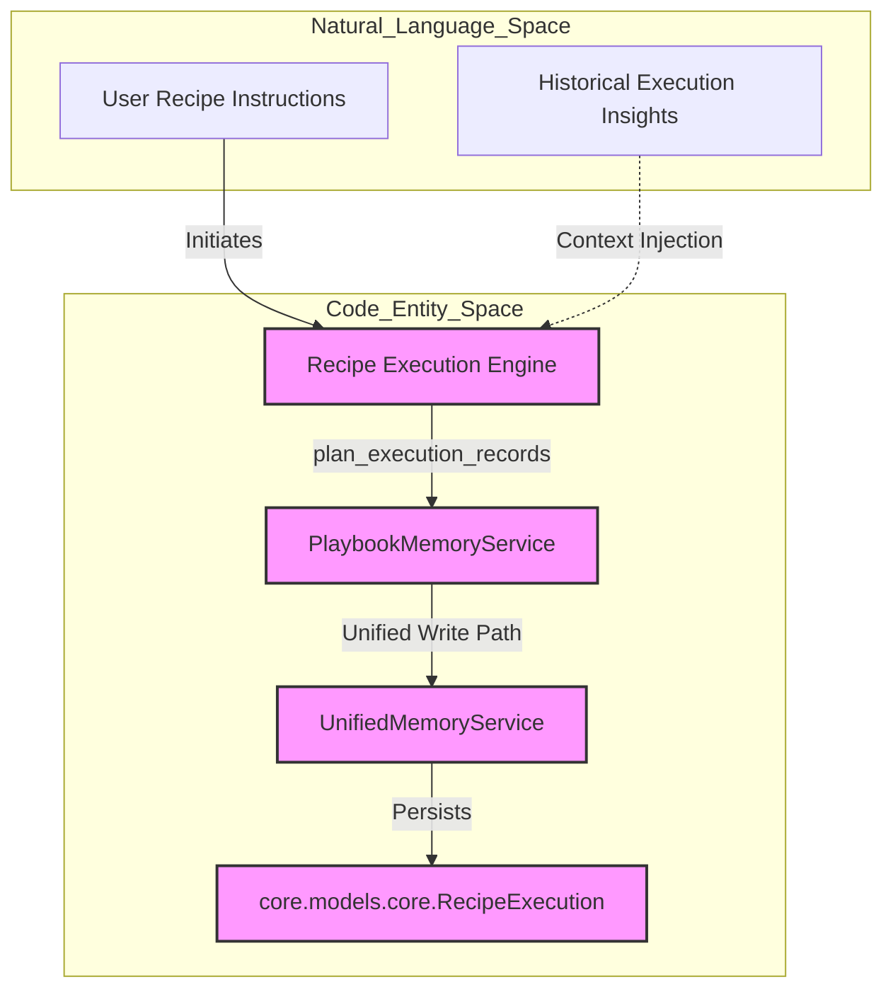
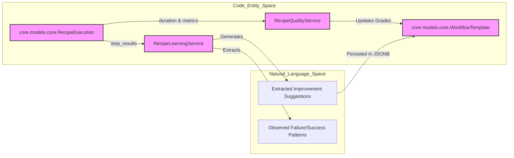

# Recipe Memory & Learning

Relevant source files

The following files were used as context for generating this wiki page:

- [docs/PRDS/PRD-227-BOARD-LIGHT-UP.md](docs/PRDS/PRD-227-BOARD-LIGHT-UP.md)
- [docs/PRDS/PRD-WAVE-AUTO-MANAGER.md](docs/PRDS/PRD-WAVE-AUTO-MANAGER.md)
- [frontend/components/command-center/__tests__/watchlist-tab.test.tsx](frontend/components/command-center/__tests__/watchlist-tab.test.tsx)
- [frontend/components/command-center/watchlist-tab.tsx](frontend/components/command-center/watchlist-tab.tsx)
- [frontend/hooks/use-watches-api.ts](frontend/hooks/use-watches-api.ts)
- [orchestrator/api/watches.py](orchestrator/api/watches.py)
- [orchestrator/core/services/playbook_memory_service.py](orchestrator/core/services/playbook_memory_service.py)
- [orchestrator/modules/tools/discovery/actions_missions.py](orchestrator/modules/tools/discovery/actions_missions.py)
- [orchestrator/modules/tools/discovery/actions_watches.py](orchestrator/modules/tools/discovery/actions_watches.py)
- [orchestrator/modules/tools/discovery/handlers_missions.py](orchestrator/modules/tools/discovery/handlers_missions.py)
- [orchestrator/modules/tools/discovery/handlers_playbooks.py](orchestrator/modules/tools/discovery/handlers_playbooks.py)
- [orchestrator/modules/tools/discovery/handlers_watches.py](orchestrator/modules/tools/discovery/handlers_watches.py)
- [orchestrator/services/audit_retention.py](orchestrator/services/audit_retention.py)
- [orchestrator/services/board_events.py](orchestrator/services/board_events.py)
- [orchestrator/services/chat_messenger.py](orchestrator/services/chat_messenger.py)
- [orchestrator/tests/conftest.py](orchestrator/tests/conftest.py)
- [orchestrator/tests/test_board_dispatch.py](orchestrator/tests/test_board_dispatch.py)
- [orchestrator/tests/test_board_sse_listen_notify.py](orchestrator/tests/test_board_sse_listen_notify.py)
- [orchestrator/tests/test_p2w1_playbook_write_dedup.py](orchestrator/tests/test_p2w1_playbook_write_dedup.py)
- [orchestrator/tests/test_p2w2_audit_retention.py](orchestrator/tests/test_p2w2_audit_retention.py)
- [orchestrator/tests/test_p2w2_governance_audit.py](orchestrator/tests/test_p2w2_governance_audit.py)
- [orchestrator/tests/test_p2w2_governance_policy_budget.py](orchestrator/tests/test_p2w2_governance_policy_budget.py)
- [orchestrator/tests/test_prd164_flywheel.py](orchestrator/tests/test_prd164_flywheel.py)
- [orchestrator/tests/test_prd204_run_verdict.py](orchestrator/tests/test_prd204_run_verdict.py)

This page documents the technical implementation of the recipe memory and learning systems. It covers how recipes leverage `PlaybookMemoryService` and `UnifiedMemoryService` for long-term task continuity, how error recurrence and deduplication are handled via signature hashing, how `RecipeQualityService` performs 5D assessments, and how the learning flywheel extracts patterns within the execution pipeline.

---

## Recipe Memory System & UnifiedMemoryService Integration

Recipes use a specialized memory path to ensure that multi-step workflows maintain context across steps and across different executions of the same recipe. All durable-store interactions delegate to the centralized `UnifiedMemoryService` using proper namespacing (`MemoryNamespace`) to avoid string concatenation errors [orchestrator/core/services/playbook_memory_service.py:5-9]().

### Memory Lifecycle & Record Planning
The `PlaybookMemoryService` plans and structures what gets stored in durable memory through a pure planning function (`plan_execution_records`) before committing records via `UnifiedMemoryService` [orchestrator/core/services/playbook_memory_service.py:10-20]().

1.  **Pre-Execution Retrieval**: Before a recipe starts, execution runners retrieve relevant historical memories to inform the initial execution state.
2.  **Context Injection**: Retrieved memories are injected into step prompts via `ContextService` in `RECIPE` mode.
3.  **Step-to-Step Memory**: The `RecipeScratchpad` provides token-efficient inter-step data sharing via explicit tool calls [orchestrator/api/recipe_executor.py:15-16]().
4.  **Post-Execution Storage**: Execution summaries and failure signatures are planned and committed back to durable storage.

**Recipe Memory Data Flow (Natural Language to Code Space)**

Sources: [orchestrator/core/services/playbook_memory_service.py:1-37](), [orchestrator/api/recipe_executor.py:14-19]()

---

## Deduplication & Recurrence Suppression

To prevent database bloat and memory pollution from repetitive failures, `PlaybookMemoryService` employs a bounded in-process recurrence registry and signature hashing [orchestrator/core/services/playbook_memory_service.py:40-67]().

### Signature Hashing & Recurrence Counting
- **Error Classification**: Errors are classified using `_classify_error` from the tool outcome module [orchestrator/core/services/playbook_memory_service.py:32-35]().
- **Signature Generation**: `_signature_hash` creates a SHA-256 hash combining workspace ID, playbook ID, and the outcome signature [orchestrator/core/services/playbook_memory_service.py:49-51]().
- **Recurrence Tracking**: `record_recurrence` increments a bounded `_RECURRENCE` OrderedDict (capped at `_RECURRENCE_MAX = 512`) [orchestrator/core/services/playbook_memory_service.py:45-66](). The first occurrence triggers a durable memory write, while subsequent recurrences suppress new writes and increment a count metric.

Sources: [orchestrator/core/services/playbook_memory_service.py:40-67]()

---

## Recipe Quality Service (5D Assessment)

The `RecipeQualityService` evaluates completed executions across five distinct dimensions to provide a quantitative measure of performance. This assessment is visualized in the **Execution Kitchen** via the `TheaterSelfLearningPanel` [frontend/components/workflows/execution-kitchen.tsx:39-43]().

### The 5D Assessment Model
Each execution is scored from 0.0 to 1.0 based on:
1.  **Completeness**: Percentage of steps that reached `status='completed'`.
2.  **Accuracy**: LLM-based evaluation of the `output_data` against original instructions.
3.  **Efficiency**: Actual duration vs. predicted/historical duration [orchestrator/api/recipe_executor.py:104-107]().
4.  **Reliability**: Number of retries and tool-loop iterations required.
5.  **Cost**: Token usage relative to the workspace budget [orchestrator/api/recipe_executor.py:104-105]().

### Quality Grade Mapping
- **A**: Score $\ge$ 0.9
- **B**: Score $\ge$ 0.8
- **C**: Score $\ge$ 0.7
- **D**: Score $\ge$ 0.6
- **F**: Score $<$ 0.6

Sources: [frontend/components/workflows/execution-kitchen.tsx:39-43](), [orchestrator/api/recipe_executor.py:103-122]()

---

## Recipe Learning Service & The Learning Flywheel

The `RecipeLearningService` performs post-hoc analysis on `RecipeExecution` records to identify optimization opportunities and extract successful interaction patterns.

### Pattern Extraction & Persistence
The service analyzes execution logs, step results, and metadata to identify success patterns, failure trends, and performance bottlenecks. Results are stored in the `WorkflowTemplate` model (`workflow_recipes` table) and exposed via API endpoints.

**Learning & Quality Architecture**

Sources: [orchestrator/api/workflow_recipes.py:25-27](), [frontend/components/workflows/execution-kitchen.tsx:39-45](), [orchestrator/api/recipe_executor.py:163-175]()

---

## Workflow Execution Stages (PRD-59)

Recipe execution tracks progress across dynamic phases within the `ExecutionKitchen` [frontend/components/workflows/execution-kitchen.tsx:47-55]().

1. **PLAN**: Task decomposition and Agent Selection [frontend/components/workflows/execution-kitchen.tsx:74-75]().
2. **PREPARE**: Context engineering [frontend/components/workflows/execution-kitchen.tsx:76]().
3. **EXECUTE**: Agent execution and tool usage [frontend/components/workflows/execution-kitchen.tsx:77]().
4. **EVALUATE**: Result aggregation and Quality Assessment [frontend/components/workflows/execution-kitchen.tsx:78-80]().
5. **LEARN**: Learning Update and Memory Storage [frontend/components/workflows/execution-kitchen.tsx:79-81]().

Sources: [frontend/components/workflows/execution-kitchen.tsx:35-46](), [orchestrator/api/recipe_executor.py:5-19]()

---

## API Reference: Learning & Quality

- **Trigger Assessment**: `POST /api/workflow-recipes/{recipe_id}/assess-quality` — Triggers quality assessment for an execution record.
- **Trigger Learning**: `POST /api/workflow-recipes/{recipe_id}/learn` — Analyzes recent executions and updates the `learning_data` JSONB field in `WorkflowTemplate` [orchestrator/api/workflow_recipes.py:22-28]().
- **Get Suggestions**: `GET /api/workflow-recipes/{recipe_id}/suggestions` — Returns aggregated insights from the learning data [frontend/components/workflows/execution-kitchen.tsx:43]().

Sources: [orchestrator/api/workflow_recipes.py:22-28](), [frontend/components/workflows/execution-kitchen.tsx:43-45]()

---