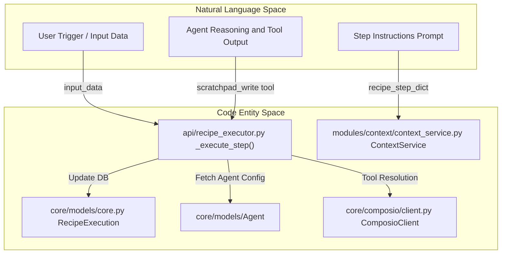
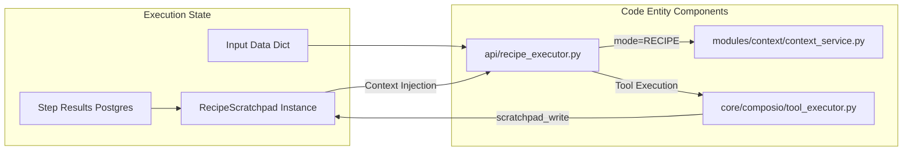

# Recipe Scratchpad

Relevant source files

The following files were used as context for generating this wiki page:

- [frontend/components/workflows/execution-kitchen.tsx](frontend/components/workflows/execution-kitchen.tsx)
- [orchestrator/api/composio.py](orchestrator/api/composio.py)
- [orchestrator/api/recipe_executor.py](orchestrator/api/recipe_executor.py)
- [orchestrator/api/skills.py](orchestrator/api/skills.py)
- [orchestrator/api/tools.py](orchestrator/api/tools.py)
- [orchestrator/api/webhooks.py](orchestrator/api/webhooks.py)
- [orchestrator/api/workflow_recipes.py](orchestrator/api/workflow_recipes.py)
- [orchestrator/core/composio/client.py](orchestrator/core/composio/client.py)
- [orchestrator/core/composio/linkedin_image_workaround.py](orchestrator/core/composio/linkedin_image_workaround.py)
- [orchestrator/core/composio/tool_executor.py](orchestrator/core/composio/tool_executor.py)
- [orchestrator/core/credentials/tester.py](orchestrator/core/credentials/tester.py)
- [orchestrator/core/credentials/types.py](orchestrator/core/credentials/types.py)
- [orchestrator/core/database/credential_types_seed.json](orchestrator/core/database/credential_types_seed.json)
- [orchestrator/core/routing/ingestors/webhook.py](orchestrator/core/routing/ingestors/webhook.py)
- [orchestrator/services/metadata_sync_service.py](orchestrator/services/metadata_sync_service.py)
- [orchestrator/services/webhook_dedup.py](orchestrator/services/webhook_dedup.py)
- [orchestrator/tests/test_p2w0_service_imports_resolve.py](orchestrator/tests/test_p2w0_service_imports_resolve.py)
- [orchestrator/tests/test_p2w2_webhook_dedup.py](orchestrator/tests/test_p2w2_webhook_dedup.py)
- [orchestrator/tests/test_p2w2_webhook_signature_reject.py](orchestrator/tests/test_p2w2_webhook_signature_reject.py)

## Purpose and Scope

The Recipe Scratchpad is a structured, inter-step data sharing system designed for multi-step recipe executions. It replaces verbose full-text output dumps between steps with auto-extracted key-value summaries and explicit agent exports, achieving 80-90% token savings while preserving essential context [orchestrator/api/recipe_executor.py:14-19](). The scratchpad is integrated into the sequential execution loop to facilitate data flow between steps of a `WorkflowTemplate` (aliased as `WorkflowRecipe`) [orchestrator/api/recipe_executor.py:5-12](), [orchestrator/api/workflow_recipes.py:25-27]().

This system ensures that agents executing downstream steps have access to critical data produced by upstream agents without exceeding context window limits, utilizing the same component path as the standard chatbot for architectural alignment (`ContextService`, `Composio`, and `ToolRouter`) [orchestrator/api/recipe_executor.py:5-12]().

---

## Architecture and Data Flow

The scratchpad is managed during the execution loop of a recipe. The executor initializes and interacts with the scratchpad to maintain state across the workflow lifecycle, specifically merging `execution_metadata.step_overrides` when applicable to allow for per-execution tweaks without mutating the base recipe definition [orchestrator/api/recipe_executor.py:129-139]().

### Natural Language to Code Entity Mapping

The following diagram bridges the conceptual "Natural Language Space" of recipe steps to the specific "Code Entity Space" of the scratchpad system.

**Title: Recipe Context Pipeline**

Sources: [orchestrator/api/recipe_executor.py:5-19](), [orchestrator/api/recipe_executor.py:129-157](), [orchestrator/api/workflow_recipes.py:25-27](), [orchestrator/core/composio/client.py:54-82]()

---

## Data Layout and Storage Strategy

The system utilizes a tiered storage approach to manage recipe data based on its lifecycle and size [orchestrator/api/recipe_executor.py:14-19]().

| Tier | Storage Target | Entity / Model | Purpose |
| :--- | :--- | :--- | :--- |
| **Tier 1: Ephemeral** | Redis / Memory | `RecipeScratchpad` | High-speed context sharing between steps during execution [orchestrator/api/recipe_executor.py:15](). |
| **Tier 2: Compact** | PostgreSQL | `RecipeExecution.output_data` | Permanent summary for UI display and history, including token costs and duration [orchestrator/api/recipe_executor.py:103-107](). |
| **Tier 3: Cold** | S3 / Blob | `step_logs` | Full verbose logs (messages, raw tool results) for debugging [orchestrator/api/recipe_executor.py:17-18](). |

Sources: [orchestrator/api/recipe_executor.py:14-19](), [orchestrator/api/recipe_executor.py:103-107]()

### Context Assembly and Tool Integration

The scratchpad context is injected into the `ContextService` using `RECIPE` mode [orchestrator/api/recipe_executor.py:9](). This ensures that the agent performing the current step has access to the outputs of previous agents. Additionally, agents can explicitly export structured data using the `scratchpad_write` tool [orchestrator/api/recipe_executor.py:16]().

**Title: Scratchpad Context Resolution**

Sources: [orchestrator/api/recipe_executor.py:5-19](), [orchestrator/core/composio/tool_executor.py:124-133]()

---

## Tool Integration: `scratchpad_write`

Agents explicitly export structured data using the `scratchpad_write` tool. This is particularly useful for passing specific IDs, URLs, or structured objects that downstream steps must consume [orchestrator/api/recipe_executor.py:15-16]().

### Implementation Details
1. **Tool Injection**: The `scratchpad_write` tool is injected for explicit agent exports [orchestrator/api/recipe_executor.py:16]().
2. **Tool Routing**: Tool execution is handled via `tool_router.execute_and_format()` to ensure consistency with the chatbot tool loop [orchestrator/api/recipe_executor.py:12]().
3. **File Resolution**: For actions involving file uploads (e.g., `TWITTER_UPLOAD_MEDIA`), the `resolve_file_uploads` helper in the Composio executor ensures that workspace file paths or URLs are converted to S3-backed `FileUploadable` objects before execution [orchestrator/core/composio/tool_executor.py:39-49](), [orchestrator/core/composio/tool_executor.py:124-133]().

Sources: [orchestrator/api/recipe_executor.py:5-19](), [orchestrator/core/composio/tool_executor.py:124-133]()

---

## External Triggers and Scheduling

Recipes can be initiated through various mechanisms which populate the initial state of the scratchpad:

1. **Composio Triggers**: The `_auto_register_trigger` function subscribes to external events (e.g., GitHub, Slack) via the Composio API [orchestrator/api/workflow_recipes.py:52-60]().
2. **Cron Scheduling**: Playbooks can be scheduled via `PlaybookSchedulerService` for periodic execution [orchestrator/api/workflow_recipes.py:36-47]().
3. **Webhooks**: Dedicated endpoints at `/api/webhooks/recipe/{webhook_id}` allow external systems to trigger executions with custom payloads [orchestrator/api/webhooks.py:12-14]().

Upon completion, the system automatically generates a summary report via `_auto_create_playbook_report`, which rolls up metrics across every LLM call in the execution [orchestrator/api/recipe_executor.py:163-180]().

Sources: [orchestrator/api/recipe_executor.py:163-180](), [orchestrator/api/workflow_recipes.py:36-60](), [orchestrator/api/webhooks.py:1-14]()

---