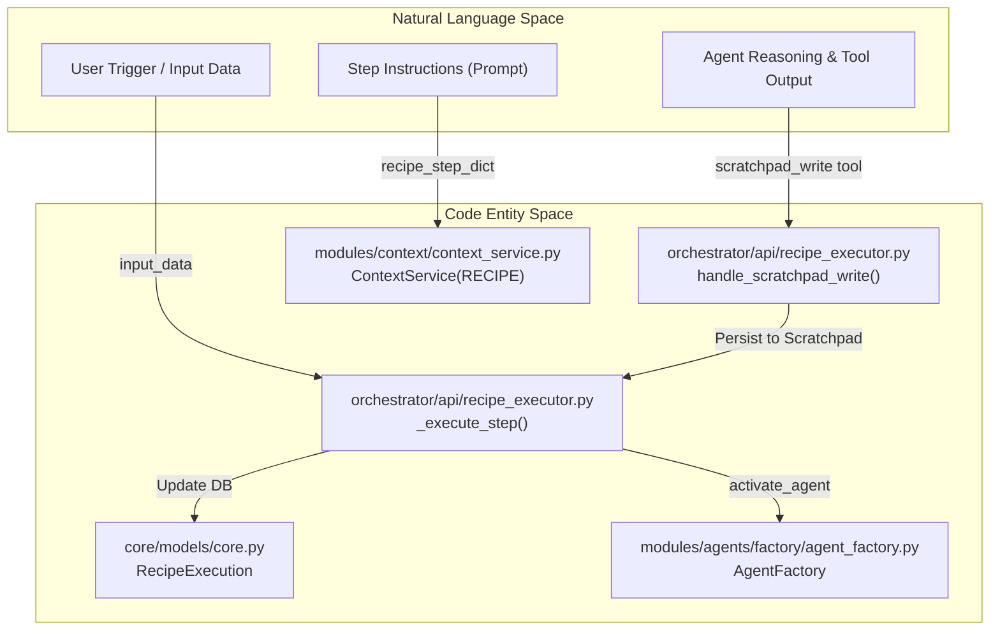
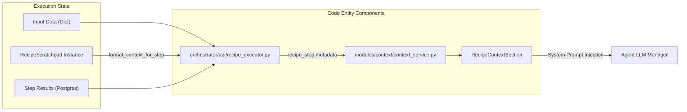

# Recipe Scratchpad

Relevant source files

The following files were used as context for generating this wiki page:

- [frontend/components/marketplace/marketplace-agents-tab.tsx](frontend/components/marketplace/marketplace-agents-tab.tsx)
- [frontend/components/marketplace/marketplace-homepage.tsx](frontend/components/marketplace/marketplace-homepage.tsx)
- [frontend/components/marketplace/marketplace-tools-tab.tsx](frontend/components/marketplace/marketplace-tools-tab.tsx)
- [frontend/components/shared/stats-bar.tsx](frontend/components/shared/stats-bar.tsx)
- [frontend/components/tools/tools-dashboard.tsx](frontend/components/tools/tools-dashboard.tsx)
- [frontend/components/workflows/active-workflows-panel.tsx](frontend/components/workflows/active-workflows-panel.tsx)
- [frontend/components/workflows/execution-kitchen.tsx](frontend/components/workflows/execution-kitchen.tsx)
- [frontend/components/workflows/workflow-management.tsx](frontend/components/workflows/workflow-management.tsx)
- [frontend/lib/tooltips.json](frontend/lib/tooltips.json)
- [orchestrator/api/recipe_executor.py](orchestrator/api/recipe_executor.py)
- [orchestrator/api/workflow_recipes.py](orchestrator/api/workflow_recipes.py)
- [orchestrator/modules/learning/tests/conftest.py](orchestrator/modules/learning/tests/conftest.py)
- [orchestrator/modules/learning/tests/test_learning_system.py](orchestrator/modules/learning/tests/test_learning_system.py)

## Purpose and Scope

The Recipe Scratchpad is a structured, inter-step data sharing system designed for multi-step recipe executions. It replaces verbose full-text output dumps between steps with auto-extracted key-value summaries and explicit agent exports, achieving 80-90% token savings while preserving essential context [orchestrator/api/recipe_executor.py:14-19](). The scratchpad is integrated into the `_execute_step` function to facilitate data flow between sequential steps of a `WorkflowTemplate` (aliased as `WorkflowRecipe`) [orchestrator/api/workflow_recipes.py:25-27]().

This system allows agents in later steps to access specific outputs (like IDs, URLs, or status strings) from previous steps without re-processing the entire conversation history of those steps.

---

## Architecture and Data Flow

The scratchpad is managed during the execution loop of a recipe. The `_execute_step` function in the recipe executor initializes and interacts with the scratchpad to maintain state across the workflow lifecycle [orchestrator/api/recipe_executor.py:66-79]().

### Natural Language to Code Entity Mapping

The following diagram bridges the conceptual "Natural Language Space" of recipe steps to the specific "Code Entity Space" of the scratchpad system.

**Title: Recipe Context Pipeline**

**Sources:** [orchestrator/api/recipe_executor.py:66-79](), [orchestrator/api/recipe_executor.py:118-119](), [orchestrator/api/recipe_executor.py:143-149](), [orchestrator/api/workflow_recipes.py:25-27]()

---

## Data Layout and Storage Strategy

The system utilizes a tiered storage approach to manage recipe data based on its lifecycle and size [orchestrator/api/recipe_executor.py:14-19]().

| Tier | Storage Target | Entity / Model | Purpose |
| :--- | :--- | :--- | :--- |
| **Tier 1: Ephemeral** | In-Memory Object | `scratchpad` instance | High-speed context sharing between steps during a single run [orchestrator/api/recipe_executor.py:71](). |
| **Tier 2: Compact** | PostgreSQL | `RecipeExecution.step_results` | Permanent summary for UI display and history [orchestrator/api/workflow_recipes.py:27-28](). |
| **Tier 3: Cold** | S3 / Blob Storage | `step_{N}.json` | Full verbose logs (messages, raw tool results) for debugging [orchestrator/api/recipe_executor.py:17-18](). |

### Context Assembly

The scratchpad context is injected into the `ContextService` using `ContextMode.RECIPE` [orchestrator/api/recipe_executor.py:143-148](). This ensures that the agent performing the current step has access to:
*   **Previous Outputs**: Formatted summaries from all preceding steps retrieved via `scratchpad.format_context_for_step(step_order)` [orchestrator/api/recipe_executor.py:130-134]().
*   **Step Metadata**: Current step number and total steps for situational awareness [orchestrator/api/recipe_executor.py:135-141]().

**Title: Scratchpad Context Resolution**

**Sources:** [orchestrator/api/recipe_executor.py:130-149](), [orchestrator/api/workflow_recipes.py:140-172]()

---

## Tool Integration: `scratchpad_write`

Agents can explicitly export structured data using the `scratchpad_write` tool. This is particularly useful for passing specific IDs, URLs, or structured objects that downstream steps must consume [orchestrator/api/recipe_executor.py:108-115]().

### Implementation Details
1.  **Tool Definition**: The tools are defined as `SCRATCHPAD_WRITE_TOOL_DEF` and `SCRATCHPAD_READ_TOOL_DEF` [orchestrator/api/recipe_executor.py:108-111]().
2.  **Execution**: When an agent calls the tool, the `handle_scratchpad_write` or `handle_scratchpad_read` function is invoked [orchestrator/api/recipe_executor.py:113-114]().
3.  **Namespace**: The tool is identified as `SCRATCHPAD_TOOL_NAME` in the tool registry [orchestrator/api/recipe_executor.py:111]().

**Sources:** [orchestrator/api/recipe_executor.py:102-116]()

---

## Step Scope and Isolation

To prevent agents from "hallucinating" or wandering into tasks belonging to other steps, the `RecipeExecutor` injects a strict `scope_instruction` into the message history [orchestrator/api/recipe_executor.py:154-162]().

*   **Focus**: Forces the agent to focus ONLY on the task described in the current step [orchestrator/api/recipe_executor.py:156-157]().
*   **Action Restriction**: Explicitly forbids performing actions (like sending notifications or creating PRs) unless required by the specific current step [orchestrator/api/recipe_executor.py:158-160]().
*   **Tool Filtering**: Encourages the use of external app actions only if relevant to the current task [orchestrator/api/recipe_executor.py:160-161]().

**Sources:** [orchestrator/api/recipe_executor.py:153-162]()

---

## Context Injection Flow

Before executing a step, the `RecipeExecutor` performs the following assembly [orchestrator/api/recipe_executor.py:117-150]():

1.  **Agent Activation**: The `AgentFactory` activates the specific agent assigned to the recipe step [orchestrator/api/recipe_executor.py:118-119]().
2.  **Scratchpad Retrieval**: If it is not the first step (`step_order > 1`), previous step outputs are formatted as context [orchestrator/api/recipe_executor.py:130-134]().
3.  **Context Building**: `ContextService.build_context` is called with `mode=ContextMode.RECIPE`, passing the `recipe_step_dict` which contains instructions and previous outputs [orchestrator/api/recipe_executor.py:143-148]().
4.  **System Message**: The resulting `system_prompt` is placed at the top of the message stack as a `system` role message [orchestrator/api/recipe_executor.py:150]().

**Sources:** [orchestrator/api/recipe_executor.py:117-150](), [orchestrator/api/workflow_recipes.py:140-172]()

---