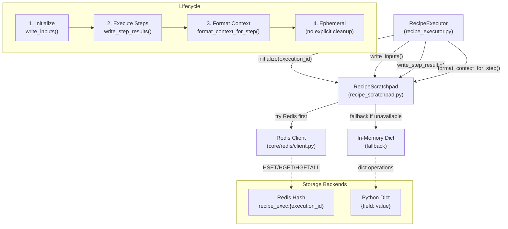
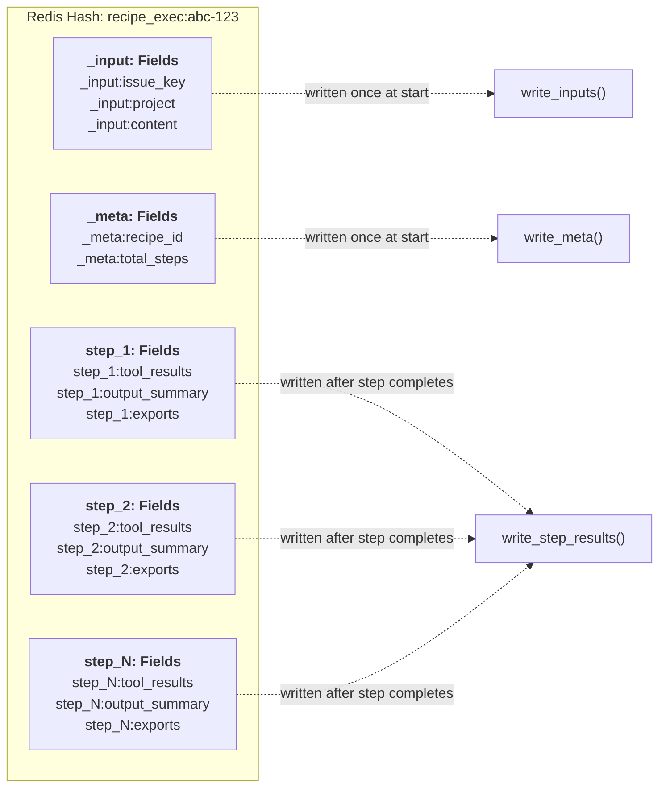
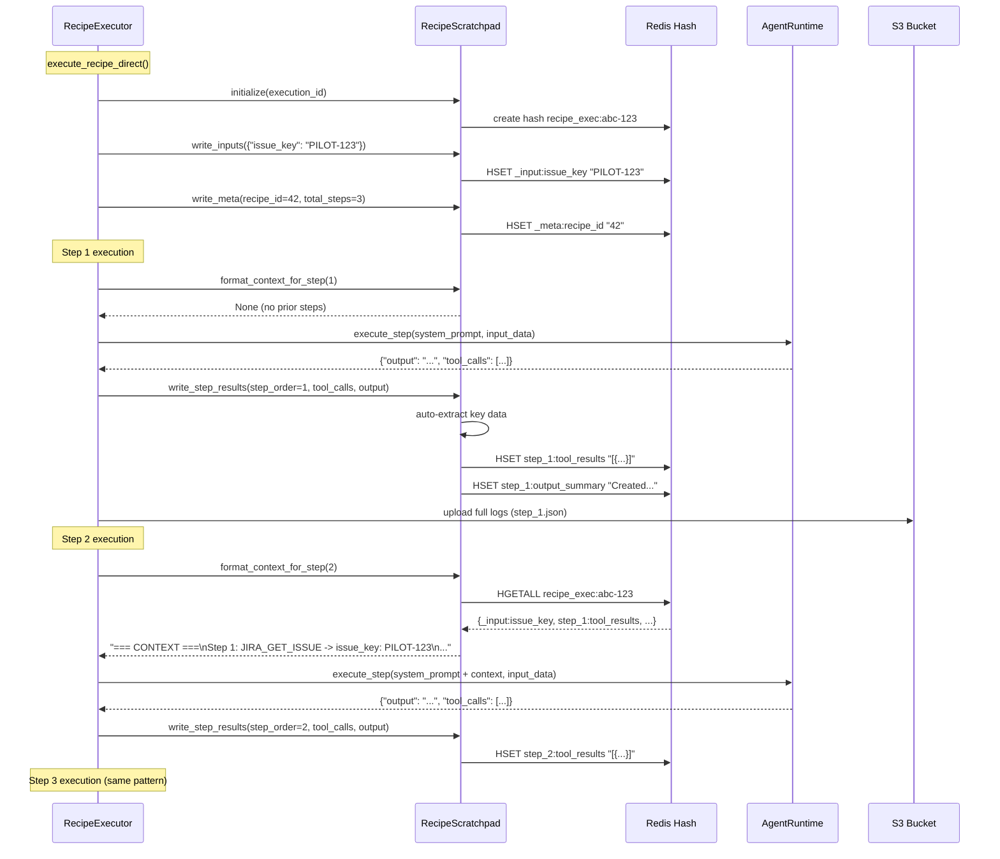
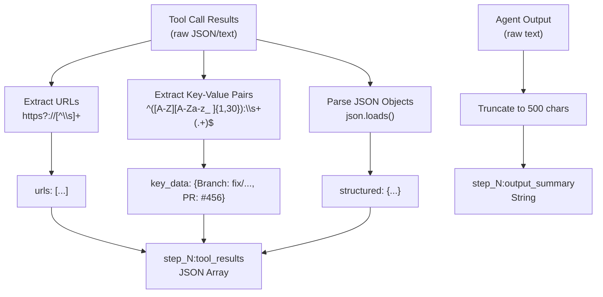
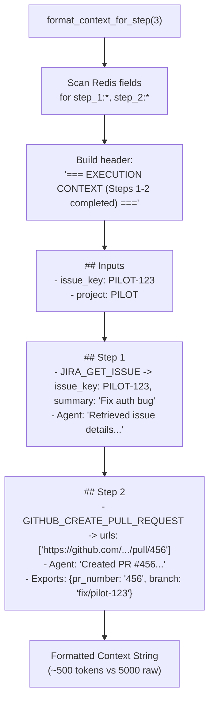
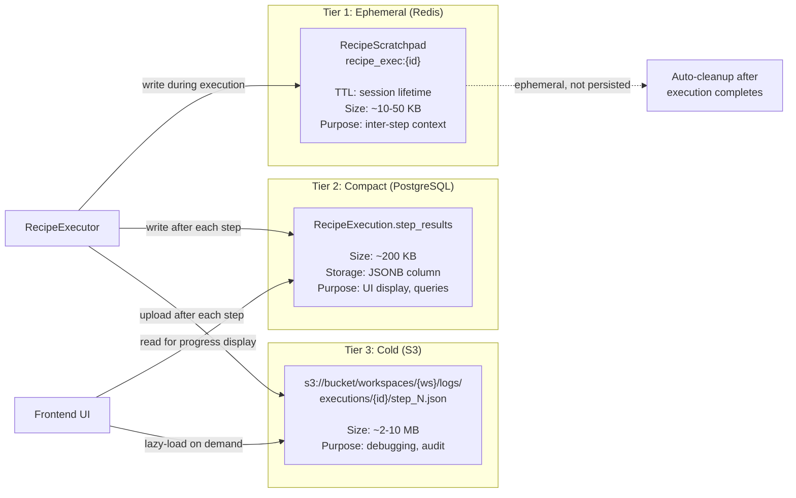
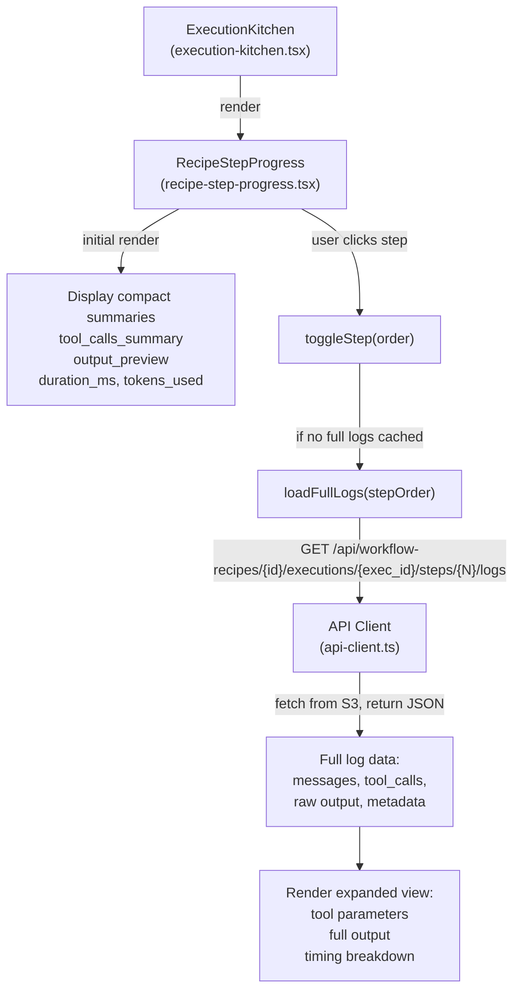
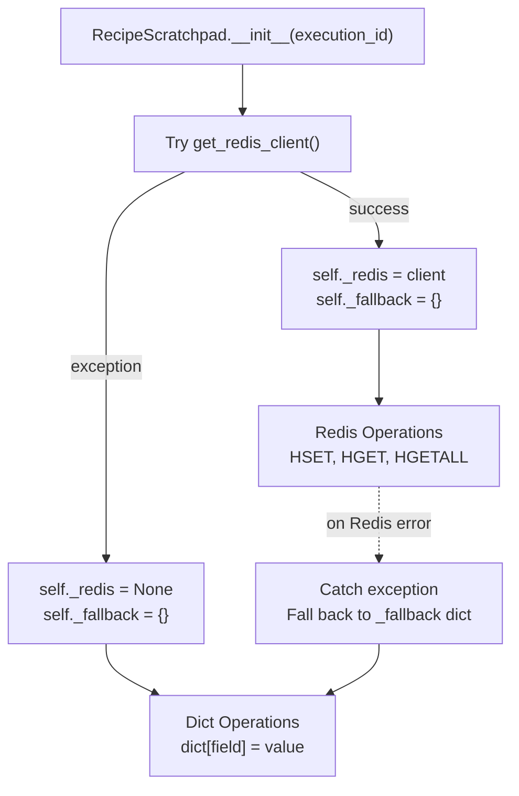
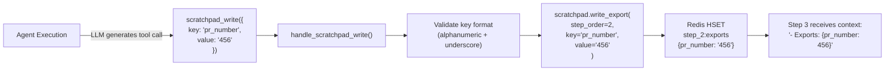

# Recipe Scratchpad

<details>
<summary>Relevant source files</summary>

The following files were used as context for generating this wiki page:

- [frontend/components/workflows/create-recipe-modal.tsx](frontend/components/workflows/create-recipe-modal.tsx)
- [frontend/components/workflows/execution-kitchen.tsx](frontend/components/workflows/execution-kitchen.tsx)
- [frontend/components/workflows/recipe-execution-config.tsx](frontend/components/workflows/recipe-execution-config.tsx)
- [frontend/components/workflows/recipe-preview-panel.tsx](frontend/components/workflows/recipe-preview-panel.tsx)
- [frontend/components/workflows/recipe-step-builder.tsx](frontend/components/workflows/recipe-step-builder.tsx)
- [frontend/components/workflows/recipes-tab.tsx](frontend/components/workflows/recipes-tab.tsx)
- [frontend/components/workflows/view-recipe-modal.tsx](frontend/components/workflows/view-recipe-modal.tsx)
- [frontend/hooks/use-recipe-form.ts](frontend/hooks/use-recipe-form.ts)
- [orchestrator/alembic/versions/20260202_add_workspace_id_to_skills_patterns_models.py](orchestrator/alembic/versions/20260202_add_workspace_id_to_skills_patterns_models.py)
- [orchestrator/api/recipe_executor.py](orchestrator/api/recipe_executor.py)
- [orchestrator/api/workflow_recipes.py](orchestrator/api/workflow_recipes.py)
- [orchestrator/core/models/core.py](orchestrator/core/models/core.py)
- [orchestrator/core/services/recipe_memory_service.py](orchestrator/core/services/recipe_memory_service.py)
- [orchestrator/core/services/workspace_manager.py](orchestrator/core/services/workspace_manager.py)

</details>


## Purpose and Scope

The Recipe Scratchpad is an ephemeral, structured context-sharing system for multi-step recipe executions. It replaces verbose full-text output dumps between steps with auto-extracted key-value summaries, achieving 80-90% token savings while preserving essential context. The scratchpad is backed by Redis for performance and falls back to in-memory storage when Redis is unavailable.

This document covers the scratchpad's architecture, key layout, auto-extraction strategies, and integration with recipe execution. For information about recipe execution flow, see [Recipe Execution](#4.2). For details on S3 log storage, see [Execution Configuration](#4.3).

**Sources:** [orchestrator/core/services/recipe_scratchpad.py:1-20]()

---

## Problem Statement

Before the scratchpad system, recipe steps received context from previous steps as verbose text dumps—full agent responses, complete tool call results, and raw output strings. This approach had critical problems:

| Problem | Impact | Example |
|---------|--------|---------|
| **Token Bloat** | Steps 5+ consumed 10K+ tokens for context alone | 5-step recipe: ~50K context tokens |
| **LLM Confusion** | Agents overwhelmed by irrelevant details | "Read all 47 PRs, then create 1 new PR" → agent reads PRs again |
| **Cost Escalation** | Linear token growth per step: O(n²) | 10-step recipe: $2-5 in context tokens alone |
| **Context Window Limits** | Long recipes hit 128K limits | Execution failures at step 8-10 |

The scratchpad addresses these by extracting only the essential structured data from each step—URLs, key-value pairs, tool call summaries—and injecting it into subsequent steps as compact, queryable context.

**Sources:** [orchestrator/core/services/recipe_scratchpad.py:1-16]()

---

## Architecture Overview



The `RecipeScratchpad` class provides a key-value abstraction over Redis hashes, with automatic fallback to in-memory dictionaries. It's initialized once per recipe execution and accessed by all steps in sequence.

**Sources:** [orchestrator/core/services/recipe_scratchpad.py:33-63](), [orchestrator/api/recipe_executor.py:632-636]()

---

## Redis Key Layout

The scratchpad stores all execution context in a single Redis hash with structured field names:



### Field Types

| Field Pattern | Type | Purpose | Example Value |
|---------------|------|---------|---------------|
| `_input:{key}` | String | Original trigger/input data | `_input:issue_key` → `"PILOT-123"` |
| `_meta:recipe_id` | String | Recipe PK | `"42"` |
| `_meta:total_steps` | String | Step count | `"5"` |
| `step_{N}:tool_results` | JSON Array | Auto-extracted tool summaries | `[{"action": "JIRA_GET_ISSUE", "key_data": {"issue_key": "PILOT-123"}}]` |
| `step_{N}:output_summary` | String | First 500 chars of agent output | `"Created PR #456 successfully..."` |
| `step_{N}:exports` | JSON Object | Explicit agent-written data | `{"pr_number": "456", "branch": "fix/pilot-123"}` |

**Sources:** [orchestrator/core/services/recipe_scratchpad.py:8-16](), [orchestrator/core/services/recipe_scratchpad.py:99-143]()

---

## Data Flow Through Recipe Execution



### Key Integration Points

1. **Initialization** ([recipe_executor.py:632-636]()): Create scratchpad, write inputs and metadata
2. **Context Injection** ([recipe_executor.py:179-182]()): Format compact context before each step
3. **Auto-Extraction** ([recipe_executor.py:753-759]()): Extract and store results after each step
4. **S3 Upload** ([recipe_executor.py:466-509]()): Store full verbose logs separately

**Sources:** [orchestrator/api/recipe_executor.py:559-777](), [orchestrator/core/services/recipe_scratchpad.py:174-252]()

---

## Auto-Extraction Strategy

The scratchpad uses zero-LLM regex-based extraction to identify key data from tool calls and agent output. This ensures consistent, fast summarization without additional API costs.

### Extraction Targets



### Extraction Examples

| Input | Extraction | Output Field |
|-------|------------|--------------|
| Tool result: `{"data": {"html_url": "https://github.com/org/repo/pull/456"}}` | `urls: ["https://github.com/org/repo/pull/456"]` | `step_1:tool_results` → `[{"action": "GITHUB_CREATE_PULL_REQUEST", "key_data": {"urls": [...]}}]` |
| Tool result: `"Branch: fix/PILOT-123\nPR: #456"` | `key_data: {Branch: "fix/PILOT-123", PR: "#456"}` | `step_1:tool_results` → `[{"action": "...", "key_data": {...}}]` |
| Agent output: 2000 chars | Truncate to 500 chars + "..." | `step_1:output_summary` → `"Created PR #456 successfully. The branch fix/PILOT-123 has been..."` |

### Implementation

The extraction logic is in `_extract_tool_summaries()` and `_extract_key_data()`:

```python
# Auto-extract from tool call result
def _extract_key_data(result_obj: Any) -> Dict[str, Any]:
    extracted = {}
    
    # 1. Extract URLs
    urls = _extract_urls(str(result_obj))
    if urls:
        extracted["urls"] = urls
    
    # 2. Extract key-value pairs (e.g. "Branch: fix/issue")
    kv_pairs = _extract_kv_pairs(str(result_obj))
    if kv_pairs:
        extracted.update(kv_pairs)
    
    # 3. Parse as JSON if possible
    if isinstance(result_obj, dict):
        extracted["structured"] = result_obj
    
    return extracted
```

**Sources:** [orchestrator/core/services/recipe_scratchpad.py:254-362]()

---

## Context Formatting

When a step requests context via `format_context_for_step(N)`, the scratchpad builds a compact, structured summary of all prior steps:



### Example Formatted Context

```
========================================
EXECUTION CONTEXT (Steps 1-2 completed)
========================================

## Inputs
- issue_key: PILOT-123
- project: PILOT
- content: Fix authentication timeout bug

## Step 1
- JIRA_GET_ISSUE -> issue_key: PILOT-123, summary: Fix auth timeout bug
- Agent: "Retrieved issue PILOT-123. Summary: Fix authentication timeout bug. Priority: High. Status: In Progress."

## Step 2
- GITHUB_CREATE_PULL_REQUEST -> urls: https://github.com/org/repo/pull/456
- Agent: "Created PR #456 successfully. Branch: fix/pilot-123. Title: Fix auth timeout bug (PILOT-123)."
- Exports: {pr_number: 456, branch: fix/pilot-123}
```

This formatted context replaces a 5000-token raw dump with ~500 tokens of essential information.

**Sources:** [orchestrator/core/services/recipe_scratchpad.py:174-252]()

---

## Storage Tiers

The recipe execution system uses a three-tier storage strategy to balance performance, cost, and queryability:



### Tier Comparison

| Tier | Storage | Retention | Size | Access Pattern | Use Case |
|------|---------|-----------|------|----------------|----------|
| **Redis** | `RecipeScratchpad` hash | Session lifetime | 10-50 KB | Read/write during execution | Inter-step context passing |
| **PostgreSQL** | `RecipeExecution.step_results` JSONB | Permanent | 200 KB | Read for UI rendering | Progress display, quick queries |
| **S3** | `step_N.json` files | Permanent | 2-10 MB | Lazy-load on demand | Full debugging, audit trail |

### Compact Summary Format

The compact summary stored in PostgreSQL omits full output and tool results, replacing them with previews:

```json
{
  "step_id": "step-1",
  "order": 1,
  "agent_id": 42,
  "agent_name": "JIRA Agent",
  "status": "success",
  "duration_ms": 3200,
  "tokens_used": 450,
  "tool_calls_summary": ["JIRA_GET_ISSUE (success)", "JIRA_ADD_COMMENT (success)"],
  "output_preview": "Retrieved issue PILOT-123 successfully. Priority: High, Status: In Progress...",
  "log_url": "s3://bucket/workspaces/abc/logs/executions/xyz/step_1.json"
}
```

**Sources:** [orchestrator/api/recipe_executor.py:466-553](), [orchestrator/core/services/recipe_scratchpad.py:1-16]()

---

## Frontend Integration

The frontend displays recipe progress using compact summaries from PostgreSQL and lazy-loads full logs from S3 when users expand step details.



### API Endpoint for Full Logs

The frontend lazy-loads full logs via:

```
GET /api/workflow-recipes/{recipe_id}/executions/{execution_id}/steps/{step_order}/logs
```

This endpoint:
1. Looks up the `log_url` from `RecipeExecution.step_results[N]`
2. Downloads the S3 object (e.g. `step_3.json`)
3. Returns the full log JSON to the frontend

**Sources:** [frontend/components/workflows/recipe-step-progress.tsx:77-92](), [frontend/components/workflows/execution-kitchen.tsx:1-20]()

---

## Fallback Behavior

The scratchpad gracefully degrades to in-memory storage when Redis is unavailable:



### Fallback Guarantees

| Operation | Redis Available | Redis Unavailable | Behavior Change |
|-----------|-----------------|-------------------|-----------------|
| `write_inputs()` | `HSET` to Redis | Write to `_fallback` dict | None (transparent) |
| `write_step_results()` | `HSET` to Redis | Write to `_fallback` dict | None (transparent) |
| `format_context_for_step()` | `HGETALL` from Redis | Read from `_fallback` dict | None (transparent) |
| **Persistence** | Ephemeral (session) | **Ephemeral (process)** | ⚠️ Lost if process crashes |
| **Concurrency** | Safe (Redis atomicity) | **Not safe** | ⚠️ Single-process only |

The fallback ensures recipe execution never fails due to Redis unavailability, but loses durability guarantees. In production, Redis should always be available.

**Sources:** [orchestrator/core/services/recipe_scratchpad.py:40-94]()

---

## Performance Impact

The scratchpad's token savings compound across recipe steps:

### Token Savings Example (5-Step Recipe)

| Approach | Step 1 | Step 2 | Step 3 | Step 4 | Step 5 | Total |
|----------|--------|--------|--------|--------|--------|-------|
| **Verbose (old)** | 2K | 5K (1×2K context) | 10K (2×2K context) | 17K (3×2K context) | 26K (4×2K context) | **60K tokens** |
| **Scratchpad (new)** | 2K | 2.5K (500 context) | 3K (1K context) | 3.5K (1.5K context) | 4K (2K context) | **15K tokens** |
| **Savings** | 0% | 50% | 70% | 79% | 85% | **75% total** |

### Cost Impact

With GPT-4 Turbo pricing ($0.01/1K input tokens):
- **Old approach**: 60K tokens × $0.01/1K = **$0.60 per execution**
- **New approach**: 15K tokens × $0.01/1K = **$0.15 per execution**
- **Savings**: $0.45 per execution (75% cost reduction)

For workspaces running 1000 recipes/month: **$450/month savings**.

**Sources:** [orchestrator/core/services/recipe_scratchpad.py:1-20]()

---

## Agent Export Tool

Agents can explicitly write key data to the scratchpad using the `scratchpad_write` tool, which is injected into every recipe step:



### Tool Schema

```json
{
  "type": "function",
  "function": {
    "name": "scratchpad_write",
    "description": "Write a key-value pair to the recipe scratchpad for downstream steps to access. Use this to explicitly export important data (IDs, URLs, status codes) that later steps need.",
    "parameters": {
      "type": "object",
      "properties": {
        "key": {
          "type": "string",
          "description": "Key name (alphanumeric + underscore only). Example: pr_number, issue_id, branch_name"
        },
        "value": {
          "type": "string",
          "description": "Value to store. Keep concise—this will be injected into downstream step contexts."
        }
      },
      "required": ["key", "value"]
    }
  }
}
```

This allows agents to bypass auto-extraction for critical data they know downstream steps need.

**Sources:** [orchestrator/modules/tools/builtin/scratchpad_tool.py:1-60](), [orchestrator/api/recipe_executor.py:236-254]()

---

## Code Integration Points

### Initialization in Recipe Executor

[orchestrator/api/recipe_executor.py:632-636]()
```python
from core.services.recipe_scratchpad import RecipeScratchpad
scratchpad = RecipeScratchpad(recipe_execution_id)
scratchpad.write_inputs(input_data)
scratchpad.write_meta(recipe_id, total_steps)
```

### Context Injection Before Step Execution

[orchestrator/api/recipe_executor.py:179-182]()
```python
if scratchpad:
    ctx = scratchpad.format_context_for_step(step_order)
    if ctx:
        messages.append({"role": "system", "content": ctx})
```

### Auto-Extraction After Step Completion

[orchestrator/api/recipe_executor.py:753-759]()
```python
if scratchpad:
    scratchpad.write_step_results(
        step_order=step_order,
        tool_calls=all_tool_calls,
        agent_output=content,
        agent_exports={},
    )
```

### Manual Export During Execution

[orchestrator/api/recipe_executor.py:236-254]()
```python
if tool_name == SCRATCHPAD_TOOL_NAME and scratchpad:
    result_text = handle_scratchpad_write(
        key=tool_args.get("key", "unknown"),
        value=tool_args.get("value", ""),
        scratchpad=scratchpad,
        step_order=step_order,
    )
```

**Sources:** [orchestrator/api/recipe_executor.py:559-777](), [orchestrator/core/services/recipe_scratchpad.py:1-362]()

---